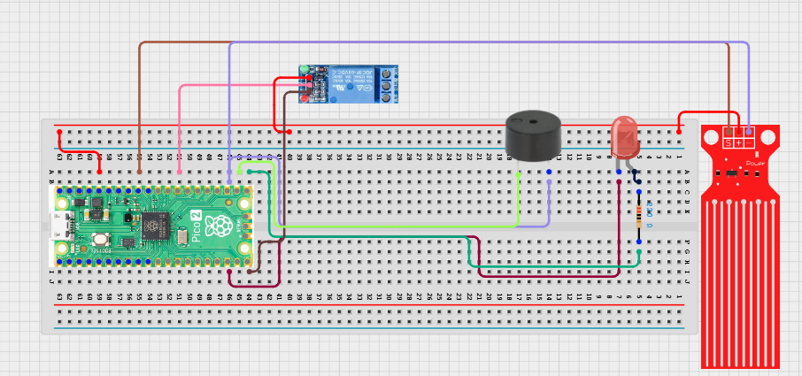

# Project 3.5.4: Flood Response System

**Advanced Embedded Systems Project Using Raspberry Pi Pico 2 W and MicroPython**

---
## Overview

The Pico activates a relay-driven response device such as a pump or warning beacon when water crosses the critical threshold.

A warning alone may not be enough when flood water rises into a space that needs immediate action.

A Pico 2 W prototype with a water-level sensor, relay output, LED, and buzzer.

Threshold response, safe relay control, and staged flood outputs.


## Required Components

|  |  |  |  |
| --- | --- | --- | --- |
| <br>Raspberry Pi Pico 2 W | <br>Water level sensor | <br>Breadboard | <br>Jumper wires |
| <br>LED | <br>Resistor | <br>Relay | <br>Buzzer |


## Circuit Connections

| Component terminal | Connect to | Pico physical pin | Notes |
|---|---|---|---|
| Water sensor AO | GPIO 27 ADC1 | GPIO 27 / physical pin 32 | Analog water-level input |
| Relay IN | GPIO 15 | GPIO 15 / physical pin 20 | Response load control |
| LED anode | 220 ohm resistor to GPIO 16 | GPIO 16 / physical pin 21 | Warning LED |
| Buzzer positive | GPIO 17 | GPIO 17 / physical pin 22 | Critical buzzer |

---

## Wiring Diagram



```
  Water sensor AO       -> GPIO 27
  Relay IN              -> GPIO 15
  GPIO 16               -> 220 ohm resistor -> LED anode
  GPIO 17               -> buzzer positive
  Common GND            -> sensor, relay, LED, and buzzer
```

---

## Step-by-Step Assembly

1. Connect the analog water sensor output to GPIO 27 and place only the probe area near water.
2. Connect the relay control input to GPIO 15 and keep the load disconnected at first.
3. Wire the LED to GPIO 16 and the buzzer to GPIO 17.
4. Keep the Pico board elevated and dry throughout testing.

---

## Testing Individual Components

Before running the full project, test each subsystem separately. This makes it easier to find wiring, library, or logic problems before full integration.

1. **Hardware setup**: Assemble the Pico, sensor, indicator, and load wiring exactly as shown in the connection table before applying power.
2. **Test the input sensor**: Measure dry, damp, and wet analog readings so the thresholds are based on real values.
3. **Test the output device**: Test the LED, buzzer, and relay outputs individually before connecting them to the full logic.
4. **Test the decision logic**: Increase the water reading slowly and confirm the warning state appears before the relay activates.
5. **Run the full system**: Run the full response system and verify the relay and buzzer only engage at the critical level.
6. **Validate the prototype**: Test whether the reset threshold prevents rapid on-off relay chatter.
7. **Save the project**: Save the validated program on the Pico as main.py and keep a copy on the computer for future edits.

---

## Full Project Code

After completing and checking the circuit connections, open Thonny IDE, copy and paste this code into a new file or upload the project file to the Raspberry Pi Pico 2 W, then run it from Thonny.

```python
from machine import ADC, Pin
import time

SENSOR_PIN = 27
RELAY_PIN = 15
LED_PIN = 16
BUZZER_PIN = 17
WARNING_LEVEL = 28000
CRITICAL_LEVEL = 42000
RESET_LEVEL = 24000

sensor = ADC(SENSOR_PIN)
relay = Pin(RELAY_PIN, Pin.OUT, value=1)
led = Pin(LED_PIN, Pin.OUT)
buzzer = Pin(BUZZER_PIN, Pin.OUT)
response_active = False

print('Flood response system ready')

while True:
    reading = sensor.read_u16()

    if response_active:
        if reading <= RESET_LEVEL:
            response_active = False
    elif reading >= CRITICAL_LEVEL:
        response_active = True

    if reading >= CRITICAL_LEVEL:
        status = 'CRITICAL'
    elif reading >= WARNING_LEVEL:
        status = 'WARNING'
    else:
        status = 'NORMAL'

    relay.value(0 if response_active else 1)
    led.value(1 if status in ('WARNING', 'CRITICAL') else 0)
    buzzer.value(1 if status == 'CRITICAL' else 0)
    print('Reading:{} Status:{} Relay:{}'.format(reading, status, 'ON' if response_active else 'OFF'))
    time.sleep(1)
```

---

## How the Code Works

| Code Section | What It Does | Why It Matters | What to Modify During Testing |
|--------------|--------------|----------------|------------------------------|
| Water thresholds | Maps the analog water reading to warning and critical states | Thresholds explain when the system changes from monitoring to response | Validate dry and wet values before finalizing them |
| Relay hysteresis | Uses a reset threshold so the relay does not chatter | Response devices should not switch rapidly near the threshold | Test rising and falling water conditions separately |
| Staged outputs | Uses the LED for warning and adds relay plus buzzer during critical response | Different outputs help learners explain escalating system behavior | If outputs do not agree, test each pin separately |

---

## Expected Result

The serial monitor reports the current reading or state clearly.

The hardware output responds when the decision logic changes state.

Subsystem behavior matches the thresholds, timing, or rules described in the document.

### Validation Checks

- **Normal condition test**: confirm the system stays in its safe or idle state under baseline conditions
- **Warning condition test**: move the input close to the chosen threshold and confirm the transition is sensible
- **Critical condition test**: trigger the strongest alert or control state and confirm the output response is correct
- **Calibration test**: compare the sensor or timing against a known reference or repeated trial
- **Limitation test**: deliberately create an awkward or noisy condition and note how the prototype behaves

### Deployment and Limitations

- This prototype could be used in school, farm, or sanitation demonstrations with safe low-voltage loads
- Before deployment, the load wiring, enclosure, and power design need careful review
- Actuator systems need maintenance planning because relay wear and sensor drift affect reliability

---

## Troubleshooting

| Problem | Possible Cause | Solution |
|---------|----------------|----------|
| The relay never turns on | The critical threshold is too high or the relay logic is inverted | Lower the threshold after measuring real values and confirm the relay module behavior safely |
| The buzzer sounds too early | The warning and critical logic are mixed up | Compare the printed status with the buzzer pin behavior in the code |
| The analog reading is unstable | The sensor is moving in water or the wiring is loose | Hold the probe steady and secure the analog wire |
| The relay chatters | The reset threshold is too close to the critical threshold | Increase the gap between critical and reset levels |

---
