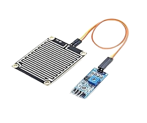
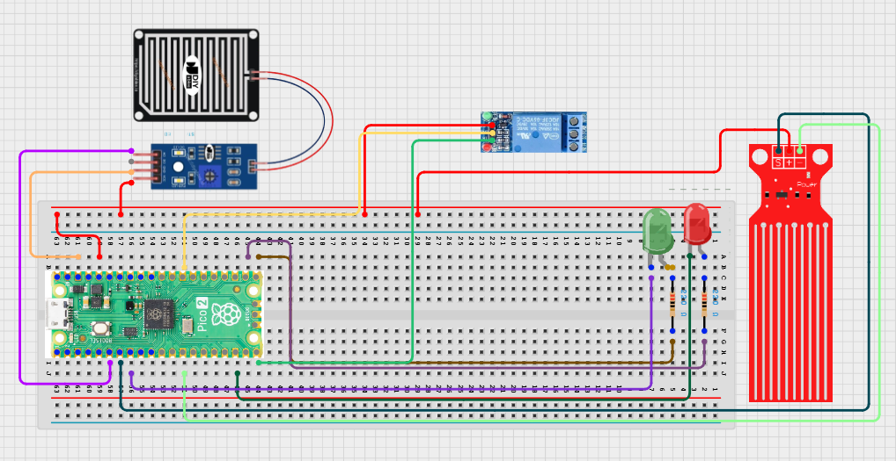

# Project 3.7.1: Rain Based Sanitation

**Advanced Embedded Systems Project Using Raspberry Pi Pico 2 W and MicroPython**

---
## Overview

The Pico checks whether rain is available and whether storage space remains, then drives a relay-controlled collection output.

Sanitation systems and storage tanks are harder to manage when rainwater collection is not monitored carefully.

A Pico 2 W prototype with a rain sensor, tank-level switch, relay output, and status LEDs.

Multi-input water logic, safe relay testing, and clear collection-state indicators.


## Required Components

|  |  |  |  |
| --- | --- | --- | --- |
| <br>Raspberry Pi Pico 2 W | <br>Motion sensor | <br>Breadboard | <br>Jumper wires |
| <br>LED | <br>Resistor | <br>Water level sensor |
| <br>Relay module |   |   |   |


## Circuit Connections

| Component terminal | Connect to | Pico physical pin | Notes |
|---|---|---|---|
| Rain sensor OUT | GPIO 4 | GPIO 4 / physical pin 6 | Digital rain detection input |
| Tank level switch | GPIO 5 | GPIO 5 / physical pin 7 | Digital tank-full input |
| Relay IN | GPIO 15 | GPIO 15 / physical pin 20 | Collection load control |
| Green LED anode | 220 ohm resistor to GPIO 16 | GPIO 16 / physical pin 21 | Collection active |
| Red LED anode | 220 ohm resistor to GPIO 17 | GPIO 17 / physical pin 22 | Stop or full state |

---

## Wiring Diagram



```
  Rain sensor OUT              -> GPIO 4
  Tank level switch            -> GPIO 5
  Relay IN                     -> GPIO 15
  GPIO 16 -> 220 ohm resistor  -> green LED anode
  GPIO 17 -> 220 ohm resistor  -> red LED anode
  Common GND                   -> sensors, relay, and LEDs
```

---

## Step-by-Step Assembly

1. Connect the rain sensor power and output line to GPIO 4.
2. Connect the tank-level switch to GPIO 5 so it changes state when the tank is full.
3. Connect the relay input to GPIO 15 and leave the real pump or valve disconnected at first.
4. Wire the green LED to GPIO 16 and the red LED to GPIO 17 through 220 ohm resistors.
5. Keep the sensors near the wet environment but keep the Pico dry and elevated.

---

## Testing Individual Components

Before running the full project, test each subsystem separately. This makes it easier to find wiring, library, or logic problems before full integration.

1. **Hardware setup**: Assemble the Pico, sensor, indicator, and load wiring exactly as shown in the connection table before applying power.
2. **Test the input sensor**: Test the rain sensor and tank-level switch independently by forcing each state manually.
3. **Test the output device**: Test the relay and LEDs without any water load attached.
4. **Test the decision logic**: Create all four logic combinations and confirm only one condition enables collection.
5. **Run the full system**: Run the full controller and compare the printed logic with the LEDs and relay output.
6. **Validate the prototype**: Discuss what false readings could occur outdoors and how you would protect the sensors.
7. **Save the project**: Save the validated program on the Pico as main.py and keep a copy on the computer for future edits.

---

## Full Project Code

After completing and checking the circuit connections, open Thonny IDE, copy and paste this code into a new file or upload the project file to the Raspberry Pi Pico 2 W, then run it from Thonny.

```python
from machine import Pin
import time

RAIN_PIN = 4
TANK_PIN = 5
RELAY_PIN = 15
GREEN_LED_PIN = 16
RED_LED_PIN = 17
WET_STATE = 0
FULL_STATE = 0

rain_sensor = Pin(RAIN_PIN, Pin.IN, Pin.PULL_UP)
tank_sensor = Pin(TANK_PIN, Pin.IN, Pin.PULL_UP)
relay = Pin(RELAY_PIN, Pin.OUT, value=1)
green_led = Pin(GREEN_LED_PIN, Pin.OUT)
red_led = Pin(RED_LED_PIN, Pin.OUT)

print('Rainwater system ready')

while True:
    raining = rain_sensor.value() == WET_STATE
    tank_full = tank_sensor.value() == FULL_STATE
    collecting = raining and not tank_full

    relay.value(0 if collecting else 1)
    green_led.value(1 if collecting else 0)
    red_led.value(0 if collecting else 1)

    if collecting:
        state = 'COLLECTING'
    elif tank_full:
        state = 'FULL'
    else:
        state = 'WAITING'

    print('Raining:{} TankFull:{} State:{}'.format(raining, tank_full, state))
    time.sleep(1)
```

---

## How the Code Works

| Code Section | What It Does | Why It Matters | What to Modify During Testing |
|--------------|--------------|----------------|------------------------------|
| Two-input logic | Checks both rainfall and tank-full status before enabling collection | Real control systems usually need more than one condition before acting | Test each input separately before testing the combined logic |
| Relay control | Turns the collection output on only when the logic allows it | This is the core automation action in the prototype | Confirm the relay output is safe before connecting a load |
| State reporting | Prints COLLECTING, FULL, or WAITING and mirrors the state with LEDs | Visible states make validation easier during troubleshooting | Use the printed state to confirm the sensor logic is not inverted |

---

## Expected Result

The serial monitor reports the current reading or state clearly.

The hardware output responds when the decision logic changes state.

Subsystem behavior matches the thresholds, timing, or rules described in the document.

### Validation Checks

- **Normal condition test**: confirm the system stays in its safe or idle state under baseline conditions
- **Warning condition test**: move the input close to the chosen threshold and confirm the transition is sensible
- **Critical condition test**: trigger the strongest alert or control state and confirm the output response is correct
- **Calibration test**: compare the sensor or timing against a known reference or repeated trial
- **Limitation test**: deliberately create an awkward or noisy condition and note how the prototype behaves

### Deployment and Limitations

- This prototype could be used in school, farm, or sanitation demonstrations with safe low-voltage loads
- Before deployment, the load wiring, enclosure, and power design need careful review
- Actuator systems need maintenance planning because relay wear and sensor drift affect reliability

---

## Troubleshooting

| Problem | Possible Cause | Solution |
|---------|----------------|----------|
| Collection never starts | The rain or tank logic is inverted | Test each sensor input alone and adjust the active-state constants if needed |
| The relay turns on at the wrong time | The relay module uses opposite active logic | Verify the relay behavior with no load attached and invert the output if necessary |
| The red LED is always on | The system is correctly waiting or the LED wiring is wrong | Check the printed state first, then test the LED pin separately |
| Sensors behave inconsistently | Water, corrosion, or loose wires are affecting the modules | Dry the modules, re-seat the wires, and retest under controlled conditions |

---
