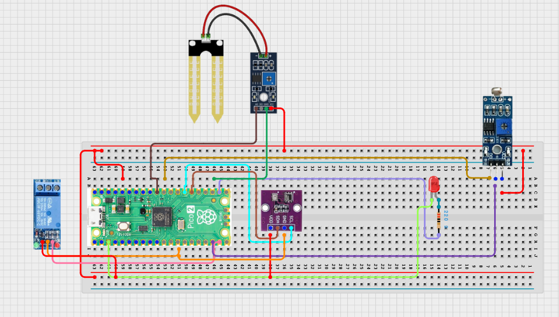

# Project 3.9.1: Smart Agriculture Automation Suite

**Advanced Embedded Systems Project Using Raspberry Pi Pico 2 W and MicroPython**


## Overview

The Pico controls irrigation and supplemental lighting from soil moisture, light level, and temperature conditions.

Agriculture automation becomes more realistic when more than one environmental factor can drive more than one output at the same time.

A Pico 2 W prototype with a soil moisture sensor, LDR, DHT22, two relay outputs, and two status LEDs.

Multi-input, multi-output automation, hysteresis, and safe staged validation of a capstone farm-control system.


---

## Required Components


|  |  |  |  |
| --- | --- | --- | --- |
| <br>Raspberry Pi Pico 2 W | <br>Soil sensor | <br>Breadboard | <br>Jumper wires |
| <br>LED | <br>Resistor | <br>LDR | <br>BME280 |
| <br>Relay | <br>Water pump |  |  |
---

## Circuit Connections


| Component terminal | Connect to | Pico physical pin | Notes |
|---|---|---|---|
| Soil sensor AO | GPIO 26 ADC0 | GPIO 26 / physical pin 31 | Soil input |
| LDR divider midpoint | GPIO 27 ADC1 | GPIO 27 / physical pin 32 | Light input |
| DHT22 DATA | GPIO 15 | GPIO 15 / physical pin 20 | Climate input |
| Relay channel 1 IN | GPIO 14 | GPIO 14 / physical pin 19 | Pump relay control |
| Relay channel 2 IN | GPIO 13 | GPIO 13 / physical pin 17 | Light relay control |
| Pump LED anode | 220 ohm resistor to GPIO 16 | GPIO 16 / physical pin 21 | Pump status LED |
| Light LED anode | 220 ohm resistor to GPIO 17 | GPIO 17 / physical pin 22 | Light status LED |
---

## Wiring Diagram



```
  Soil sensor AO -> GPIO 26
  LDR divider midpoint -> GPIO 27
  DHT22 DATA -> GPIO 15
  GPIO 14 -> relay channel 1 IN (pump)
  GPIO 13 -> relay channel 2 IN (light)
  GPIO 16 -> pump LED via 220 ohm
  GPIO 17 -> light LED via 220 ohm
```

---

## Step-by-Step Assembly

1. Connect the soil sensor analog output to GPIO 26.
2. Build the LDR divider and connect the midpoint to GPIO 27.
3. Connect the DHT22 to Pico 3.3V, GND, and GPIO 15.
4. Connect relay channel 1 to GPIO 14 for the pump and relay channel 2 to GPIO 13 for the light output.
5. Connect the two status LEDs to GPIO 16 and GPIO 17 through 220 ohm resistors.
6. Attach safe low-voltage test loads through the relays before connecting any real pump or grow light.

---

## Testing Individual Components

Before running the full project, test each subsystem separately. This makes it easier to find wiring, library, or logic problems before full integration.

1. **Hardware setup**: Assemble the Pico, sensor, indicator, and load wiring exactly as shown in the connection table before applying power.
2. **Test the input sensor**: Test the soil, light, and DHT22 inputs separately so the control rules are based on believable data.
3. **Test the output device**: Test each relay and LED separately before attaching real loads.
4. **Test the decision logic**: Confirm that dry soil controls the pump channel while low light controls the lighting channel independently.
5. **Run the full system**: Run the full suite and compare both actuator states with the printed input values.
6. **Validate the prototype**: Hold the sensors near their thresholds and confirm the system behaves steadily instead of chattering.
7. **Save the project**: Save the validated program on the Pico as main.py and keep a copy on the computer for future edits.

---

## Full Project Code

After completing and checking the circuit connections, open Thonny IDE, copy and paste this code into a new file or upload the project file to the Raspberry Pi Pico 2 W, then run it from Thonny.

```python
from machine import ADC, Pin
import dht
import time

SOIL_PIN = 26
LIGHT_PIN = 27
DHT_PIN = 15
PUMP_RELAY_PIN = 14
LIGHT_RELAY_PIN = 13
PUMP_LED_PIN = 16
LIGHT_LED_PIN = 17
SOIL_DRY_RAW = 48000
SOIL_WET_RAW = 18000
LIGHT_DARK_RAW = 4000
LIGHT_BRIGHT_RAW = 52000
PUMP_ON_DRY = 75
PUMP_OFF_DRY = 45
LIGHT_ON_PCT = 25
LIGHT_OFF_PCT = 45
MAX_LIGHT_TEMP = 34

soil = ADC(SOIL_PIN)
light = ADC(LIGHT_PIN)
climate = dht.DHT22(Pin(DHT_PIN))
pump_relay = Pin(PUMP_RELAY_PIN, Pin.OUT)
light_relay = Pin(LIGHT_RELAY_PIN, Pin.OUT)
pump_led = Pin(PUMP_LED_PIN, Pin.OUT)
light_led = Pin(LIGHT_LED_PIN, Pin.OUT)
pump_relay.off()
light_relay.off()
pump_on = False
light_on = False


def clamp(value, low, high):
    return max(low, min(high, value))


def percent_from_range(raw, low_raw, high_raw):
    span = high_raw - low_raw
    if span == 0:
        return 0
    pct = int((raw - low_raw) * 100 / span)
    return clamp(pct, 0, 100)


print('Agriculture automation suite ready')

while True:
    dry_pct = percent_from_range(soil.read_u16(), SOIL_WET_RAW, SOIL_DRY_RAW)
    light_pct = percent_from_range(light.read_u16(), LIGHT_DARK_RAW, LIGHT_BRIGHT_RAW)
    try:
        climate.measure()
        temperature = climate.temperature()
    except OSError:
        temperature = 0

    if not pump_on and dry_pct >= PUMP_ON_DRY:
        pump_on = True
    elif pump_on and dry_pct <= PUMP_OFF_DRY:
        pump_on = False

    if not light_on and light_pct <= LIGHT_ON_PCT and temperature <= MAX_LIGHT_TEMP:
        light_on = True
    elif light_on and (light_pct >= LIGHT_OFF_PCT or temperature > MAX_LIGHT_TEMP):
        light_on = False

    pump_relay.value(1 if pump_on else 0)
    light_relay.value(1 if light_on else 0)
    pump_led.value(1 if pump_on else 0)
    light_led.value(1 if light_on else 0)

    print('Dry:{}% Light:{}% Temp:{}C Pump:{} LightOut:{}'.format(
        dry_pct,
        light_pct,
        temperature,
        'ON' if pump_on else 'OFF',
        'ON' if light_on else 'OFF',
    ))
    time.sleep(2)
```

---

## How the Code Works

| Code Section | What It Does | Why It Matters | What to Modify During Testing |
|--------------|--------------|----------------|------------------------------|
| Multi-input mapping | Converts soil and light readings into normalized percentages and reads climate context | A capstone automation system needs understandable sensor inputs before it can control several outputs | Recalibrate the raw endpoints before tuning the control thresholds |
| Pump control | Uses separate on and off dryness thresholds to avoid relay chatter | Irrigation should respond to real dryness rather than flip rapidly near one threshold | Test the pump relay channel without the real pump first |
| Light control | Turns supplemental lighting on in low-light conditions unless temperature is already too high | This keeps the light output from worsening heat stress | Tune the light thresholds after testing bright and dim conditions |
| Independent outputs | Allows the pump and light channels to operate independently from the same sensing suite | This is what makes the build feel like an automation suite rather than one simple actuator project | Validate each channel separately before trusting both together |

---

## Expected Result

The serial monitor reports the current reading or state clearly.

The hardware output responds when the decision logic changes state.

Subsystem behavior matches the thresholds, timing, or rules described in the document.

### Validation Checks

- **Normal condition test**: keep the soil moderately moist and the room well lit so both relays stay off
- **Pump validation**: dry the soil sensor gradually and confirm the pump channel turns on before turning off again after recovery
- **Light validation**: reduce the light level and confirm the light channel turns on only when the temperature is not already too high
- **Combined condition test**: create dry and dim conditions and confirm both channels can operate at the same time if appropriate
- **Relay validation**: test each relay first without the real load, then with safe low-voltage test loads
- **False trigger test**: hold the sensors near the thresholds and confirm the hysteresis prevents unstable switching

### Deployment and Limitations

- This prototype could be used in school, farm, or sanitation demonstrations with safe low-voltage loads
- Before deployment, the load wiring, enclosure, and power design need careful review
- Actuator systems need maintenance planning because relay wear and sensor drift affect reliability

---

## Troubleshooting

| Problem | Possible Cause | Solution |
|---------|----------------|----------|
| The pump never turns on | The dryness threshold is too high or the relay channel is wrong | Print the dry percentage and test the relay output separately |
| The light output never turns on | The light threshold is too low or the room is not dim enough | Reduce the ambient light further or raise LIGHT_ON_PCT slightly |
| The light turns off unexpectedly | The temperature is above the maximum light temperature | Print the temperature and confirm the protection rule is working as designed |
| Both relays chatter | The thresholds are too narrow or the sensor wiring is unstable | Increase the hysteresis gaps and inspect the wiring stability |

---
