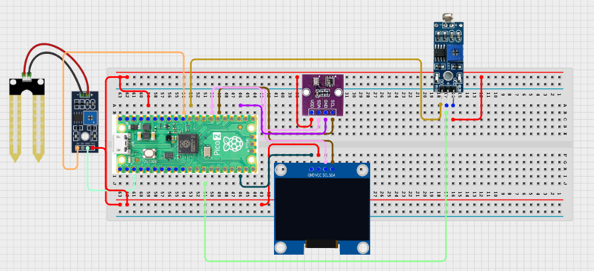

# Project 3.9.12: Smart Agriculture Optimization System

---

## Wiring Diagram

## Required Components

|  |  |  |  |
| --- | --- | --- | --- |
|  Raspberry Pi Pico 2 W |  Breadboard |  Jumper wires |  |

## Circuit Connections

| Component terminal | Connect to | Pico physical pin | Notes |
|---|---|---|---|
| Project wiring | Project-specific hardware | Not specified | Add verified GPIO assignments before wiring. |
