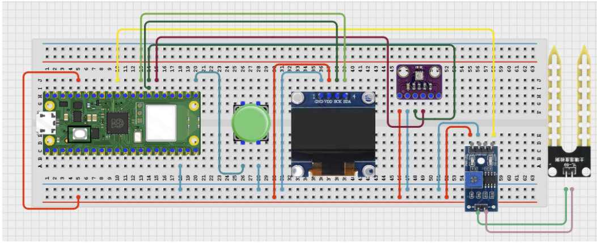

# Project 3.9.13: Smart Agriculture Policy Simulator

**Advanced Embedded Systems Project Using Raspberry Pi Pico 2 W and MicroPython**


## Overview

The Pico lets the user compare how different agriculture policy modes respond to the same soil and climate conditions.

Farming policy trade-offs remain abstract when students cannot test how different rules would change the same irrigation decision.

A Pico 2 W prototype with a soil moisture sensor, BME280, mode button, and OLED policy-simulator dashboard.

Policy-mode comparison, explicit rule differences, and clear local decision simulation.


## Required Components


|  |  |  |  |
| --- | --- | --- | --- |
| <br>Raspberry Pi Pico 2 W | <br>Soil sensor | <br>Breadboard | <br>Jumper wires |
| <br>LDR | <br>BME280 | <br>Push button | <br>OLED |
---

## Circuit Connections


| Component terminal | Connect to | Pico physical pin | Notes |
|---|---|---|---|
| Soil sensor AO | GPIO 26 ADC0 | GPIO 26 / physical pin 31 | Soil input |
| BME280 VCC | 3.3V output | Physical pin 36 | Sensor power |
| BME280 GND | GND | Physical pin 38 | Common ground |
| BME280 SDA | GPIO 20 | GPIO 20 / physical pin 26 | I2C0 SDA shared with OLED if present |
| BME280 SCL | GPIO 21 | GPIO 21 / physical pin 27 | I2C0 SCL shared with OLED if present |
| Button leg 1 | GPIO 16 | GPIO 16 / physical pin 21 | Mode button input |
| Button leg 2 | 3.3V output | Physical pin 36 | High when pressed |
| OLED SDA | GPIO 20 | GPIO 20 / physical pin 26 | I2C0 SDA |
| OLED SCL | GPIO 21 | GPIO 21 / physical pin 27 | I2C0 SCL |
---

## Wiring Diagram



```
Soil sensor AO -> GPIO 26
BME280 SDA -> GPIO 20
BME280 SCL -> GPIO 21
Button -> GPIO 16 and 3.3V
GPIO 20 -> OLED SDA
GPIO 21 -> OLED SCL
Common GND -> soil sensor, BME280, and OLED
BME280 VCC -> 3.3V
BME280 GND -> GND
```

Diagram Placeholder
[Insert wiring diagram or breadboard image here]

---

## Step-by-Step Assembly

1. Connect the soil sensor analog output to GPIO 26.
2. Connect the BME280 to Pico 3.3V, GND, GPIO 20 (SDA), and GPIO 21 (SCL).
3. Wire the mode button between GPIO 16 and 3.3V so the input goes high when pressed.
4. Connect the OLED to Pico 3.3V, GND, GPIO 20, and GPIO 21.
5. Upload ssd1306.py and confirm it appears on the Pico before running the simulator.

---

## Testing Individual Components

Before running the full project, test each subsystem separately. This makes it easier to find wiring, library, or logic problems before full integration.

1. **Hardware setup**: Assemble the Pico, sensor, indicator, and load wiring exactly as shown in the connection table before applying power.
2. **Test the input sensor**: Test the soil sensor, BME280, and mode button separately before policy comparison.
3. **Test the output device**: Run an OLED hello-world test before adding the policy logic.
4. **Test the decision logic**: Keep the same physical condition while switching policies and confirm the recommendation changes for the documented reason.
5. **Run the full system**: Run the full simulator and compare how each policy responds to the same soil and temperature values.
6. **Validate the prototype**: Discuss which policy would make the most sense under drought, balanced supply, or crop-protection goals.
7. **Save the project**: Save the validated program on the Pico as main.py and keep a copy on the computer for future edits.

---

## Full Project Code

After completing and checking the circuit connections, open Thonny IDE, copy and paste this code into a new file or upload the project file to the Raspberry Pi Pico 2 W, then run it from Thonny.

Upload and run this code after the individual tests work correctly.

```python
from machine import ADC, I2C, Pin
import bme280
import time

try:
    from ssd1306 import SSD1306_I2C
    HAS_OLED = True
except ImportError:
    HAS_OLED = False

SOIL_PIN = 26
BME_SDA_PIN = 20
BME_SCL_PIN = 21
BUTTON_PIN = 16
I2C_SDA_PIN = 20
I2C_SCL_PIN = 21
SOIL_DRY_RAW = 48000
SOIL_WET_RAW = 18000
POLICIES = ['CONSERVE', 'BALANCED', 'YIELD']

soil = ADC(SOIL_PIN)
i2c = I2C(0, sda=Pin(BME_SDA_PIN), scl=Pin(BME_SCL_PIN), freq=400000)
climate = bme280.BME280(i2c=i2c)
button = Pin(BUTTON_PIN, Pin.IN, Pin.PULL_DOWN)
if HAS_OLED:
    oled = SSD1306_I2C(128, 64, i2c)

policy_index = 0
last_button = 0


def clamp(value, low, high):
    return max(low, min(high, value))


def dryness_percent(raw):
    span = SOIL_DRY_RAW - SOIL_WET_RAW
    if span <= 0:
        return 0
    pct = int((raw - SOIL_WET_RAW) * 100 / span)
    return clamp(pct, 0, 100)


print('Smart agriculture policy simulator ready')

while True:
    button_now = button.value()
    if button_now == 1 and last_button == 0:
        policy_index = (policy_index + 1) % len(POLICIES)
    last_button = button_now

    dry_pct = dryness_percent(soil.read_u16())
    try:
        values = climate.values
        temperature = float(values[0].replace('C', ''))
        pressure = float(values[1].replace('hPa', ''))
        humidity = float(values[2].replace('%', ''))
    except OSError:
        temperature = 0

    policy = POLICIES[policy_index]
    if policy == 'CONSERVE':
        command = 'IRRIGATE' if dry_pct >= 75 else 'WAIT'
    elif policy == 'BALANCED':
        command = 'IRRIGATE' if dry_pct >= 60 else 'WAIT'
    else:
        command = 'IRRIGATE' if dry_pct >= 50 or temperature >= 32 else 'WAIT'

    print('Policy:{} Dry:{}% Temp:{}C Command:{}'.format(policy, dry_pct, temperature, command))

    if HAS_OLED:
        oled.fill(0)
        oled.text('Agri Policy', 0, 0)
        oled.text(policy[:16], 0, 18)
        oled.text('D:{} T:{}'.format(dry_pct, temperature), 0, 34)
        oled.text(command[:16], 0, 50)
        oled.show()

    time.sleep(2)
```

---

## How the Code Works

| Code Section | What It Does | Why It Matters | What to Modify During Testing |
|--------------|--------------|----------------|------------------------------|
| Policy switching | Cycles through named policy modes with one button. | The comparison only works if the user can reliably change modes. | Use deliberate button presses and keep edge detection in place. |
| Policy thresholds | Applies a different irrigation rule set for each mode. | This makes the policy trade-offs visible and testable. | Adjust one policy at a time so the differences remain clear. |
| OLED policy view | Shows the active policy and resulting action on one screen. | The user can compare physical conditions with the current policy outcome. | Verify ssd1306.py and the I2C wiring if the display is blank. |

---

## Expected Result

The serial monitor reports the current reading or state clearly.

The hardware output responds when the decision logic changes state.

Subsystem behavior matches the thresholds, timing, or rules described in the document.

### Validation Checks

- **Normal condition test**: confirm the system stays in its safe or idle state under baseline conditions.
- **Warning condition test**: move the input close to the chosen threshold and confirm the transition is sensible.
- **Critical condition test**: trigger the strongest alert or control state and confirm the output response is correct.
- **Calibration test**: compare the sensor or timing against a known reference or repeated trial.
- **Limitation test**: deliberately create an awkward or noisy condition and note how the prototype behaves.

### Deployment and Limitations

- This prototype works well for classroom demonstrations and local monitoring pilots.
- Before deployment, it needs calibration records, protective mounting, and regular validation checks.
- Display-only systems still depend on correct sensor placement and trained users.

---

## Troubleshooting

| Problem | Possible Cause | Solution |
|---------|----------------|----------|
| The policy changes too fast | The button is bouncing or being held too long | Use single deliberate presses and verify the edge-based button logic. |
| The command never changes | The soil calibration is wrong or the thresholds are too strict | Print the raw soil value and re-measure the wet and dry references. |
| Temperature stays at zero | The BME280 read failed | Test the BME280 separately and shorten the I2C wires if needed. |
| OLED is blank | The display library or I2C wiring is wrong | Confirm ssd1306.py is present and verify GPIO 20 and GPIO 21. |

---
