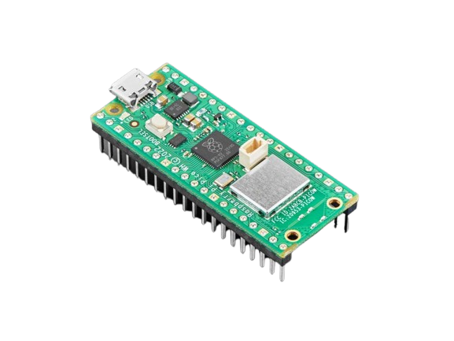
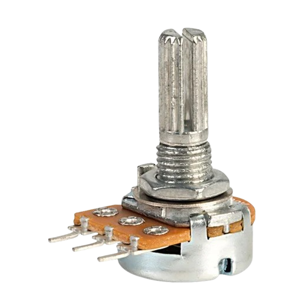
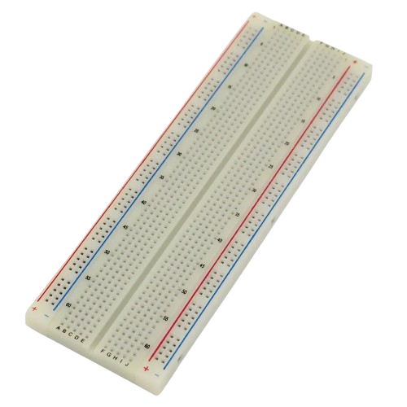
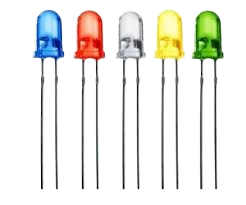
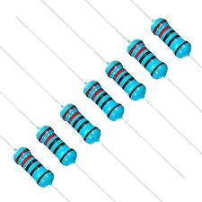
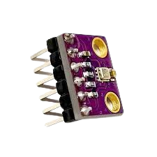
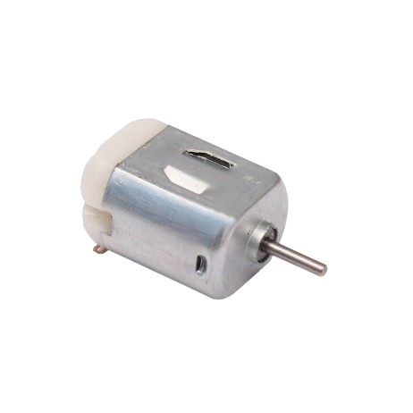
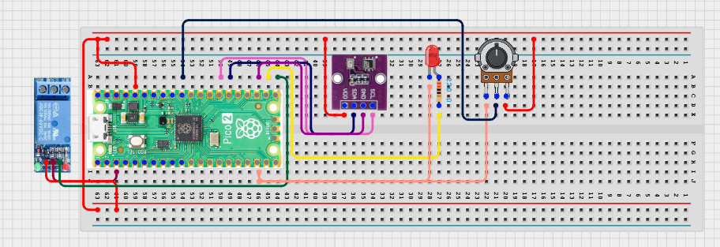

# Project 3.9.16: Smart Environment Control System

**Advanced Embedded Systems Project Using Raspberry Pi Pico 2 W and MicroPython**


## Overview

The Pico uses live climate readings and an adjustable setpoint knob to decide when ventilation should run.

Environmental control wastes energy when systems use one fixed threshold that does not match the current comfort or operating target.

A Pico 2 W prototype with a BME280 climate sensor, potentiometer setpoint knob, relay-driven fan, and status LED.

Closed-loop threshold control, adjustable setpoints, and actuator hysteresis for classroom climate management.


## Required Components


|  |  |  |  |
| --- | --- | --- | --- |
| <br>Raspberry Pi Pico 2 W | <br>Potentiometer | <br>Breadboard | <br>Jumper wires |
| <br>LED | <br>Resistor | <br>BME280 |
| <br>Relay | <br>DC fan |  |  |
---

## Circuit Connections


| Component terminal | Connect to | Pico physical pin | Notes |
|---|---|---|---|
| BME280 VCC | 3.3V output | Physical pin 36 | Sensor power |
| BME280 GND | GND | Physical pin 38 | Common ground |
| BME280 SDA | GPIO 20 | GPIO 20 / physical pin 26 | I2C0 SDA |
| BME280 SCL | GPIO 21 | GPIO 21 / physical pin 27 | I2C0 SCL |
| Potentiometer wiper | GPIO 26 ADC0 | GPIO 26 / physical pin 31 | Target setpoint input |
| Relay IN | GPIO 16 | GPIO 16 / physical pin 21 | Fan control output |
| LED anode | 220 ohm resistor to GPIO 17 | GPIO 17 / physical pin 22 | Control-state LED |
---

## Wiring Diagram



```
BME280 SDA -> GPIO 20
BME280 SCL -> GPIO 21
Potentiometer wiper -> GPIO 26
GPIO 16 -> relay IN
GPIO 17 -> 220 ohm resistor -> LED anode
External supply -> relay-switched fan
BME280 VCC -> 3.3V
BME280 GND -> GND
```

Diagram Placeholder
[Insert wiring diagram or breadboard image here]

---

## Step-by-Step Assembly

1. Connect the BME280 to Pico 3.3V, GND, GPIO 20 (SDA), and GPIO 21 (SCL).
2. Wire one end of the potentiometer to 3.3V, the other end to GND, and the wiper to GPIO 26.
3. Connect the relay input to GPIO 16 and power the relay module correctly.
4. Wire the LED to GPIO 17 through a 220 ohm resistor and connect the LED cathode to ground.
5. Test the relay with no fan load first so the control logic can be tuned safely.

---

## Testing Individual Components

Before running the full project, test each subsystem separately. This makes it easier to find wiring, library, or logic problems before full integration.

1. **Hardware setup**: Assemble the Pico, sensor, indicator, and load wiring exactly as shown in the connection table before applying power.
2. **Test the input sensor**: Test the BME280 and the potentiometer separately so you know the humidity reading and the target range both behave correctly.
3. **Test the output device**: Toggle the relay and LED from a short script before connecting the full control loop.
4. **Test the decision logic**: Move the setpoint knob and change humidity conditions to confirm the fan responds at the expected target.
5. **Run the full system**: Run the full control system and compare the printed target with the actual fan state.
6. **Validate the prototype**: Observe whether the selected hysteresis band is wide enough to prevent unstable switching.
7. **Save the project**: Save the validated program on the Pico as main.py and keep a copy on the computer for future edits.

---

## Full Project Code

After completing and checking the circuit connections, open Thonny IDE, copy and paste this code into a new file or upload the project file to the Raspberry Pi Pico 2 W, then run it from Thonny.

Upload and run this code after the individual tests work correctly.

```python
from machine import ADC, I2C, Pin
import bme280
import time

BME_SDA_PIN = 20
BME_SCL_PIN = 21
SETPOINT_PIN = 26
RELAY_PIN = 16
LED_PIN = 17
TEMP_FORCE_ON = 32
TEMP_FORCE_OFF = 28
HUMIDITY_BAND = 4

i2c = I2C(0, sda=Pin(BME_SDA_PIN), scl=Pin(BME_SCL_PIN), freq=400000)
climate = bme280.BME280(i2c=i2c)
setpoint = ADC(SETPOINT_PIN)
relay = Pin(RELAY_PIN, Pin.OUT)
led = Pin(LED_PIN, Pin.OUT)
fan_on = False


def map_target(raw):
    return 45 + int(raw * 30 / 65535)


def set_fan(state):
    relay.value(1 if state else 0)
    led.value(1 if state else 0)


set_fan(False)
print('Smart environment control system ready')

while True:
    target_humidity = map_target(setpoint.read_u16())
    try:
        values = climate.values
        temperature = float(values[0].replace('C', ''))
        pressure = float(values[1].replace('hPa', ''))
        humidity = float(values[2].replace('%', ''))
    except Exception:
        temperature = 0
        pressure = 0
        humidity = 0

    if fan_on:
        if humidity <= target_humidity - HUMIDITY_BAND and temperature <= TEMP_FORCE_OFF:
            fan_on = False
    else:
        if humidity >= target_humidity or temperature >= TEMP_FORCE_ON:
            fan_on = True

    set_fan(fan_on)
    state = 'CONTROL ON' if fan_on else 'IDLE'
    print('Target:{}% Hum:{}% Temp:{}C State:{}'.format(target_humidity, humidity, temperature, state))
    time.sleep(2)
```

---

## How the Code Works

| Code Section | What It Does | Why It Matters | What to Modify During Testing |
|--------------|--------------|----------------|------------------------------|
| map_target | Converts the potentiometer raw ADC value into a target humidity range. | An adjustable target makes the project behave like a real control panel instead of a fixed demo. | Change the mapped range if your environment needs different operating targets. |
| Hysteresis control | Uses separate on and off conditions for humidity and temperature. | Hysteresis prevents rapid relay switching and better reflects real control engineering. | Adjust HUMIDITY_BAND if the fan still chatters near the threshold. |
| Output control | Keeps the relay and LED in the same control state. | Visible output feedback makes subsystem testing faster and safer. | Invert the relay logic if your module is active low. |

---

## Expected Result

Rotating the potentiometer changes the printed target humidity.

The relay and LED turn on when measured humidity rises above the target or temperature becomes too high.

The fan stays on until conditions recover below the chosen hysteresis band.

### Validation Checks

- **Normal condition test**: set a high target and confirm the fan stays off under comfortable conditions.
- **Control test**: lower the target or raise room humidity and confirm the relay and LED turn on.
- **Hysteresis test**: let conditions recover slowly and confirm the relay does not chatter rapidly around the threshold.
- **Setpoint validation test**: rotate the knob across its range and confirm the printed target changes smoothly.
- **Output response validation**: test the relay without the fan first, then reconnect the fan after safe switching is confirmed.

### Deployment and Limitations

- This prototype could be used in school, farm, or sanitation demonstrations with safe low-voltage loads.
- Before deployment, the load wiring, enclosure, and power design need careful review.
- Actuator systems need maintenance planning because relay wear and sensor drift affect reliability.

---

## Troubleshooting

| Problem | Possible Cause | Solution |
|---------|----------------|----------|
| The target value never changes | The potentiometer wiring is wrong | Verify that the wiper goes to GPIO 26 and the end terminals go to 3.3V and GND. |
| The fan never turns on | The relay wiring is wrong or the target is set too high | Test the relay separately and lower the target temporarily during debugging. |
| The fan chatters | The hysteresis band is too small | Increase HUMIDITY_BAND or test in a more stable environment. |
| Humidity reads zero | The BME280 read failed | Test the BME280 separately and shorten the I2C wires if needed. |

---
