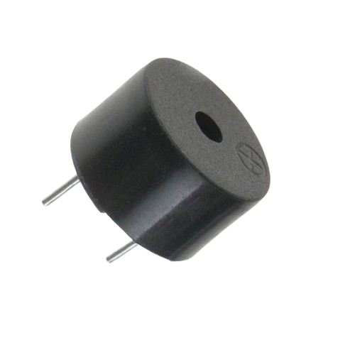
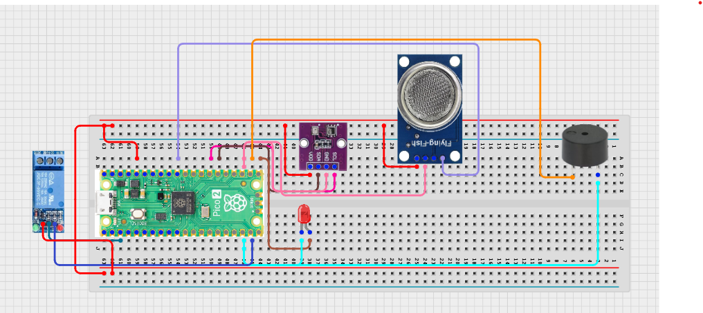

# Project 3.9.17: Smart Environment Decision Engine

**Advanced Embedded Systems Project Using Raspberry Pi Pico 2 W and MicroPython**


## Overview

The Pico decides when to ventilate and when to raise an alert based on gas and temperature conditions.

Environmental action systems need clear rules so ventilation and warnings happen at the right severity level.

A Pico 2 W prototype with an MQ-5 Liquefied Petroleum/Methane Gas Sensor, BME280, relay-driven fan output, LED, and buzzer.

Action-oriented rule design, graded response, and safer actuator behavior.


## Required Components


|  |  |  |  |
| --- | --- | --- | --- |
| <br>Raspberry Pi Pico 2 W | <br>Gas sensor | <br>Breadboard | <br>Jumper wires |
| <br>LED | <br>Resistor | <br>Buzzer | <br>BME280 |
| <br>Relay |  |  |
---

## Circuit Connections


| Component terminal | Connect to | Pico physical pin | Notes |
|---|---|---|---|
| MQ-5 AO | GPIO 26 ADC0 | GPIO 26 / physical pin 31 | LPG/methane gas proxy input |
| BME280 VCC | 3.3V output | Physical pin 36 | Sensor power |
| BME280 GND | GND | Physical pin 38 | Common ground |
| BME280 SDA | GPIO 20 | GPIO 20 / physical pin 26 | I2C0 SDA |
| BME280 SCL | GPIO 21 | GPIO 21 / physical pin 27 | I2C0 SCL |
| Relay IN | GPIO 14 | GPIO 14 / physical pin 19 | Fan relay control |
| LED anode | 220 ohm resistor to GPIO 16 | GPIO 16 / physical pin 21 | Ventilation LED |
| Buzzer positive | GPIO 17 | GPIO 17 / physical pin 22 | Critical alert buzzer |
---

## Wiring Diagram



```
  MQ-5 AO -> GPIO 26
  BME280 SDA -> GPIO 20
  BME280 SCL -> GPIO 21
  GPIO 14 -> relay IN
  GPIO 16 -> LED via 220 ohm
  GPIO 17 -> buzzer
  BME280 VCC -> 3.3V
  BME280 GND -> GND
```

---

## Step-by-Step Assembly

1. Connect the MQ-5 analog output to GPIO 26 through a safe ADC path.
2. Connect the BME280 to Pico 3.3V, GND, GPIO 20 (SDA), and GPIO 21 (SCL).
3. Connect the relay control input to GPIO 14.
4. Connect the LED to GPIO 16 through a 220 ohm resistor and the buzzer to GPIO 17.
5. Attach the safe low-voltage fan load only after relay-only testing passes.

---

## Testing Individual Components

Before running the full project, test each subsystem separately. This makes it easier to find wiring, library, or logic problems before full integration.

1. **Hardware setup**: Assemble the Pico, sensor, indicator, and load wiring exactly as shown in the connection table before applying power.
2. **Test the input sensor**: Test the gas and temperature readings separately before any output logic is enabled.
3. **Test the output device**: Test the relay, LED, and buzzer separately before combining them with the decision rules.
4. **Test the decision logic**: Confirm that moderate conditions produce ventilation only while stronger combined conditions add the alert output.
5. **Run the full system**: Run the full engine and compare the printed action with the active hardware outputs.
6. **Validate the prototype**: Check borderline conditions to see whether the thresholds feel too strict or too relaxed.
7. **Save the project**: Save the validated program on the Pico as main.py and keep a copy on the computer for future edits.

---

## Full Project Code

After completing and checking the circuit connections, open Thonny IDE, copy and paste this code into a new file or upload the project file to the Raspberry Pi Pico 2 W, then run it from Thonny.

```python
from machine import ADC, I2C, Pin
import bme280
import time

GAS_PIN = 26
BME_SDA_PIN = 20
BME_SCL_PIN = 21
RELAY_PIN = 14
LED_PIN = 16
BUZZER_PIN = 17
GAS_VENT = 18000
GAS_ALERT = 30000
TEMP_VENT = 30
TEMP_ALERT = 35

mq5 = ADC(GAS_PIN)
i2c = I2C(0, sda=Pin(BME_SDA_PIN), scl=Pin(BME_SCL_PIN), freq=400000)
climate = bme280.BME280(i2c=i2c)
relay = Pin(RELAY_PIN, Pin.OUT)
led = Pin(LED_PIN, Pin.OUT)
buzzer = Pin(BUZZER_PIN, Pin.OUT)
relay.off()
led.off()
buzzer.off()

print('Environment decision engine ready')

while True:
    gas_value = mq5.read_u16()
    try:
        values = climate.values
        temperature = float(values[0].replace('C', ''))
        pressure = float(values[1].replace('hPa', ''))
        humidity = float(values[2].replace('%', ''))
    except OSError:
        temperature = 0

    if gas_value >= GAS_ALERT and temperature >= TEMP_ALERT:
        action = 'VENTILATE + ALERT'
    elif gas_value >= GAS_VENT or temperature >= TEMP_VENT:
        action = 'VENTILATE'
    else:
        action = 'NORMAL'

    relay.value(1 if action != 'NORMAL' else 0)
    led.value(1 if action != 'NORMAL' else 0)
    buzzer.value(1 if action == 'VENTILATE + ALERT' else 0)

    print('Gas:{} Temp:{}C Action:{}'.format(gas_value, temperature, action))
    time.sleep(2)
```

---

## How the Code Works

| Code Section | What It Does | Why It Matters | What to Modify During Testing |
|--------------|--------------|----------------|------------------------------|
| Threshold actions | Maps gas and temperature combinations into action levels | Action levels make the project more meaningful than a simple sensor display | Tune the thresholds after baseline measurement and warm-up |
| Relay ventilation control | Turns on the fan path whenever the engine selects ventilation | Ventilation is the practical response layer of the system | Test the relay without the real load first |
| Critical alert output | Adds buzzer output only in the strongest condition | A graded response helps users distinguish between moderate and critical cases | If the buzzer feels too intrusive, shorten the active test duration |
| Main loop | Prints the chosen action and current readings each cycle | The action should always be explainable from the actual measurements | Inspect the raw values before assuming the decision logic is wrong |

---

## Expected Result

The serial monitor reports the current reading or state clearly.

The hardware output responds when the decision logic changes state.

Subsystem behavior matches the thresholds, timing, or rules described in the document.

### Validation Checks

- **Normal condition test**: confirm the system stays in its safe or idle state under baseline conditions
- **Warning condition test**: move the input close to the chosen threshold and confirm the transition is sensible
- **Critical condition test**: trigger the strongest alert or control state and confirm the output response is correct
- **Calibration test**: compare the sensor or timing against a known reference or repeated trial
- **Limitation test**: deliberately create an awkward or noisy condition and note how the prototype behaves

### Deployment and Limitations

- This prototype could be used in school, farm, or sanitation demonstrations with safe low-voltage loads
- Before deployment, the load wiring, enclosure, and power design need careful review
- Actuator systems need maintenance planning because relay wear and sensor drift affect reliability

---

## Troubleshooting

| Problem | Possible Cause | Solution |
|---------|----------------|----------|
| The fan never turns on | The thresholds are too high or the relay path is wrong | Lower the threshold temporarily and test the relay separately |
| The buzzer never sounds | The gas and temperature never both reach the alert condition | Raise the test severity or temporarily lower the alert thresholds during validation |
| Gas values seem random | The MQ-5 is not warmed up | Allow more warm-up time and compare several repeated readings |
| Temperature reads zero | The BME280 read failed | Test the BME280 by itself and shorten the I2C wires if needed |

---
