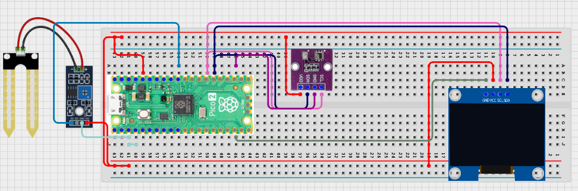

# Project 3.9.2: Smart Agriculture Command Dashboard

**Advanced Embedded Systems Project Using Raspberry Pi Pico 2 W and MicroPython**


## Overview

The Pico turns soil and climate readings into a local command dashboard that recommends whether to irrigate, monitor, or wait.

Agriculture decisions become inconsistent when people collect sensor data but never convert it into a clear recommended action.

A Pico 2 W prototype with a soil moisture sensor, BME280, and OLED dashboard for irrigation decisions.

Action-focused dashboard design, threshold interpretation, and calibration-aware irrigation recommendations.


## Required Components


|  |  |  |  |
| --- | --- | --- | --- |
| <br>Raspberry Pi Pico 2 W | <br>Soil sensor | <br>Breadboard | <br>Jumper wires |
| <br>OLED | <br>BME280 |  |  |
---

## Circuit Connections


| Component terminal | Connect to | Pico physical pin | Notes |
|---|---|---|---|
| Soil sensor AO | GPIO 26 ADC0 | GPIO 26 / physical pin 31 | Soil input |
| BME280 VCC | 3.3V output | Physical pin 36 | Sensor power |
| BME280 GND | GND | Physical pin 38 | Common ground |
| BME280 SDA | GPIO 20 | GPIO 20 / physical pin 26 | I2C0 SDA shared with OLED if present |
| BME280 SCL | GPIO 21 | GPIO 21 / physical pin 27 | I2C0 SCL shared with OLED if present |
| OLED SDA | GPIO 20 | GPIO 20 / physical pin 26 | I2C0 SDA |
| OLED SCL | GPIO 21 | GPIO 21 / physical pin 27 | I2C0 SCL |
---

## Wiring Diagram



```
Soil sensor AO -> GPIO 26
BME280 SDA -> GPIO 20
BME280 SCL -> GPIO 21
GPIO 20 -> OLED SDA
GPIO 21 -> OLED SCL
Common GND -> soil sensor, BME280, and OLED
BME280 VCC -> 3.3V
BME280 GND -> GND
```

Diagram Placeholder
[Insert wiring diagram or breadboard image here]

---

## Step-by-Step Assembly

1. Connect the soil sensor analog output to GPIO 26.
2. Connect the BME280 to Pico 3.3V, GND, GPIO 20 (SDA), and GPIO 21 (SCL).
3. Connect the OLED to Pico 3.3V, GND, GPIO 20, and GPIO 21.
4. Upload ssd1306.py and verify the file appears on the Pico before running the dashboard.
5. Measure wet and dry soil references before trusting the dashboard recommendation.

---

## Testing Individual Components

Before running the full project, test each subsystem separately. This makes it easier to find wiring, library, or logic problems before full integration.

1. **Hardware setup**: Assemble the Pico, sensor, indicator, and load wiring exactly as shown in the connection table before applying power.
2. **Test the input sensor**: Test the soil and BME280 readings separately so the dashboard starts with believable values.
3. **Test the output device**: Run an OLED hello-world test before adding the command logic.
4. **Test the decision logic**: Change soil and temperature conditions one factor at a time and confirm the recommendation updates logically.
5. **Run the full system**: Run the full command dashboard and compare the recommendation with the printed measurements.
6. **Validate the prototype**: Discuss where the recommendation could still be wrong without crop-specific calibration or field observation.
7. **Save the project**: Save the validated program on the Pico as main.py and keep a copy on the computer for future edits.

---

## Full Project Code

After completing and checking the circuit connections, open Thonny IDE, copy and paste this code into a new file or upload the project file to the Raspberry Pi Pico 2 W, then run it from Thonny.

Upload and run this code after the individual tests work correctly.

```python
from machine import ADC, I2C, Pin
import bme280
import time

try:
    from ssd1306 import SSD1306_I2C
    HAS_OLED = True
except ImportError:
    HAS_OLED = False

SOIL_PIN = 26
BME_SDA_PIN = 20
BME_SCL_PIN = 21
I2C_SDA_PIN = 20
I2C_SCL_PIN = 21
SOIL_DRY_RAW = 48000
SOIL_WET_RAW = 18000
HOT_TEMP = 32

soil = ADC(SOIL_PIN)
i2c = I2C(0, sda=Pin(BME_SDA_PIN), scl=Pin(BME_SCL_PIN), freq=400000)
climate = bme280.BME280(i2c=i2c)
if HAS_OLED:
    oled = SSD1306_I2C(128, 64, i2c)


def clamp(value, low, high):
    return max(low, min(high, value))


def dryness_percent(raw):
    span = SOIL_DRY_RAW - SOIL_WET_RAW
    if span <= 0:
        return 0
    pct = int((raw - SOIL_WET_RAW) * 100 / span)
    return clamp(pct, 0, 100)


print('Smart agriculture command dashboard ready')

while True:
    dry_pct = dryness_percent(soil.read_u16())
    try:
        values = climate.values
        temperature = float(values[0].replace('C', ''))
        pressure = float(values[1].replace('hPa', ''))
        humidity = float(values[2].replace('%', ''))
    except Exception:
        temperature = 0
        pressure = 0
        humidity = 0

    if dry_pct >= 70 or (dry_pct >= 55 and temperature >= HOT_TEMP):
        command = 'IRRIGATE NOW'
    elif dry_pct >= 40:
        command = 'MONITOR'
    else:
        command = 'WAIT'

    print('Dry:{}% Temp:{}C Hum:{}% Command:{}'.format(dry_pct, temperature, humidity, command))

    if HAS_OLED:
        oled.fill(0)
        oled.text('Agri Command', 0, 0)
        oled.text('Dry:{}%'.format(dry_pct), 0, 18)
        oled.text('T:{} H:{}'.format(temperature, humidity), 0, 34)
        oled.text(command[:16], 0, 50)
        oled.show()

    time.sleep(3)
```

---

## How the Code Works

| Code Section | What It Does | Why It Matters | What to Modify During Testing |
|--------------|--------------|----------------|------------------------------|
| dryness_percent | Maps the soil sensor reading into a dryness percentage. | A dashboard recommendation is easier to discuss when the soil value is normalized. | Update the dry and wet references after measuring your own sensor. |
| Command rules | Combines dryness and temperature into WAIT, MONITOR, or IRRIGATE NOW. | This turns measurement into a practical farm decision instead of leaving the user with raw data only. | Tune the threshold values after repeated tests in different soil conditions. |
| OLED dashboard | Shows the key farm readings and the current recommendation. | The dashboard makes the decision visible and easy to compare with the raw values. | Verify ssd1306.py and I2C wiring first if the display is blank. |

---

## Expected Result

The dashboard shows soil dryness, temperature, humidity, and a clear irrigation recommendation.

Dryer soil and hotter climate conditions push the recommendation from WAIT to MONITOR or IRRIGATE NOW.

The recommendation remains explainable because the thresholds are visible in the code and documentation.

### Validation Checks

- **Normal condition test**: use moist soil and confirm the dashboard recommends WAIT.
- **Warning condition test**: allow the soil to dry moderately and confirm the dashboard recommends MONITOR.
- **Critical condition test**: use very dry soil or combine dry soil with high temperature and confirm IRRIGATE NOW appears.
- **Calibration test**: record wet and dry soil reference values before trusting the dryness percentage.
- **Interpretation test**: compare the dashboard recommendation with a direct observation of the soil condition.

### Deployment and Limitations

- This prototype works well for classroom demonstrations and local monitoring pilots.
- Before deployment, it needs calibration records, protective mounting, and regular validation checks.
- Display-only systems still depend on correct sensor placement and trained users.

---

## Troubleshooting

| Problem | Possible Cause | Solution |
|---------|----------------|----------|
| The command never changes | The soil sensor calibration is wrong or the thresholds are too strict | Print the raw soil reading and update the calibration constants for your sensor. |
| Dryness is always extreme | The wet and dry references do not match your hardware | Re-measure the soil sensor in clearly wet and dry conditions. |
| Climate readings stay at zero | The BME280 read failed | Test the BME280 separately and shorten the I2C wires if needed. |
| OLED is blank | The library or I2C wiring is wrong | Confirm ssd1306.py is on the Pico and verify GPIO 20 and GPIO 21. |

---


---
