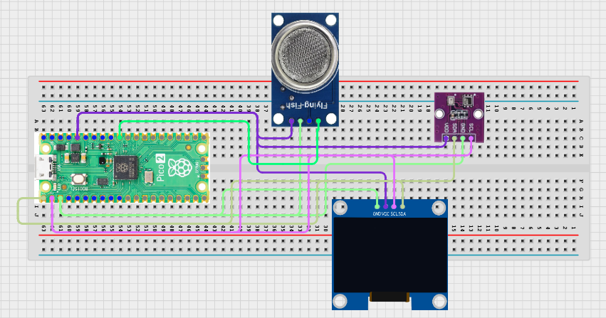

# Project 3.9.20: Smart Environment Impact Analyzer
**Advanced Embedded Systems Project Using Raspberry Pi Pico 2 W and MicroPython**

## Overview

The Pico estimates an environmental impact score from gas, temperature, and humidity conditions.

Environmental impact is difficult to discuss when readings are not translated into a visible score and category.

A Pico 2 W prototype with an MQ-5 Liquefied Petroleum/Methane Gas Sensor, BME280, and OLED impact-analysis dashboard.

Impact scoring, category labeling, and practical interpretation of low-cost environmental data.


## Required Components


|  |  |  |  |
| --- | --- | --- | --- |
| <br>Raspberry Pi Pico 2 W | <br>Soil sensor | <br>Breadboard | <br>Jumper wires |
| <br>OLED | <br>BME280 |  |  |
---

## Circuit Connections


| Component terminal | Connect to | Pico physical pin | Notes |
|---|---|---|---|
| MQ-5 AO | GPIO 26 ADC0 | GPIO 26 / physical pin 31 | LPG/methane gas proxy input |
| BME280 VCC | 3.3V output | Physical pin 36 | Sensor power |
| BME280 GND | GND | Physical pin 38 | Common ground |
| BME280 SDA | GPIO 20 | GPIO 20 / physical pin 26 | I2C0 SDA shared with OLED |
| BME280 SCL | GPIO 21 | GPIO 21 / physical pin 27 | I2C0 SCL shared with OLED |
| OLED SDA | GPIO 20 | GPIO 20 / physical pin 26 | I2C0 SDA |
| OLED SCL | GPIO 21 | GPIO 21 / physical pin 27 | I2C0 SCL |
---

## Wiring Diagram



```
  MQ-5 AO -> GPIO 26
  BME280 SDA -> GPIO 20
  BME280 SCL -> GPIO 21
  GPIO 20 -> OLED SDA
  GPIO 21 -> OLED SCL
  BME280 VCC -> 3.3V
  BME280 GND -> GND
```

---

## Step-by-Step Assembly

1. Connect the MQ-5 analog output to GPIO 26 through a safe ADC path.
2. Connect the BME280 to Pico 3.3V, GND, GPIO 20 (SDA), and GPIO 21 (SCL).
3. Connect the OLED to Pico 3.3V, GND, GPIO 20, and GPIO 21.
4. Upload ssd1306.py and confirm it appears on the Pico before running the analyzer.
5. Warm up the gas sensor fully before choosing thresholds.

---

## Testing Individual Components

Before running the full project, test each subsystem separately. This makes it easier to find wiring, library, or logic problems before full integration.

1. **Hardware setup**: Assemble the Pico, sensor, indicator, and load wiring exactly as shown in the connection table before applying power.
2. **Test the input sensor**: Read the MQ-5 and BME280 separately so the baseline values are known.
3. **Test the output device**: Run an OLED hello-world test before adding the analysis logic.
4. **Test the decision logic**: Change one factor at a time and confirm the score changes in an explainable way.
5. **Run the full system**: Run the full analyzer and compare the raw inputs with the score and category.
6. **Validate the prototype**: Discuss whether the score feels too sensitive or not sensitive enough for the test environment.
7. **Save the project**: Save the validated program on the Pico as main.py and keep a copy on the computer for future edits.

---

## Full Project Code

After completing and checking the circuit connections, open Thonny IDE, copy and paste this code into a new file or upload the project file to the Raspberry Pi Pico 2 W, then run it from Thonny.

```python
from machine import ADC, I2C, Pin
import bme280
import time

try:
    from ssd1306 import SSD1306_I2C
    HAS_OLED = True
except ImportError:
    HAS_OLED = False

GAS_PIN = 26
BME_SDA_PIN = 20
BME_SCL_PIN = 21
I2C_SDA_PIN = 20
I2C_SCL_PIN = 21
GAS_WARN = 18000
GAS_HIGH = 30000
TEMP_WARN = 30
HUM_WARN = 75

mq5 = ADC(GAS_PIN)
i2c = I2C(0, sda=Pin(BME_SDA_PIN), scl=Pin(BME_SCL_PIN), freq=400000)
climate = bme280.BME280(i2c=i2c)
if HAS_OLED:
    oled = SSD1306_I2C(128, 64, i2c)

print('Environment impact analyzer ready')

while True:
    gas_value = mq5.read_u16()
    try:
        values = climate.values
        temperature = float(values[0].replace('C', ''))
        pressure = float(values[1].replace('hPa', ''))
        humidity = float(values[2].replace('%', ''))
    except Exception:
        temperature = 0
        pressure = 0
        humidity = 0

    score = 0
    if gas_value >= GAS_WARN:
        score += 2
    if gas_value >= GAS_HIGH:
        score += 2
    if temperature >= TEMP_WARN:
        score += 1
    if humidity >= HUM_WARN:
        score += 1

    if score >= 5:
        category = 'HIGH'
    elif score >= 2:
        category = 'MODERATE'
    else:
        category = 'LOW'

    print('Gas:{} Temp:{}C Hum:{}% Score:{} Category:{}'.format(gas_value, temperature, humidity, score, category))

    if HAS_OLED:
        oled.fill(0)
        oled.text('Impact Score', 0, 0)
        oled.text('G:{} T:{}'.format(gas_value, temperature), 0, 18)
        oled.text('H:{} S:{}'.format(humidity, score), 0, 34)
        oled.text(category, 0, 50)
        oled.show()

    time.sleep(2)
```

---

## How the Code Works

| Code Section | What It Does | Why It Matters | What to Modify During Testing |
|--------------|--------------|----------------|------------------------------|
| Impact scoring | Assigns points to gas, temperature, and humidity stressors | Scoring helps students interpret overall effect instead of reading numbers in isolation | Tune the score thresholds after observing the warmed-up baseline |
| Category mapping | Turns the score into LOW, MODERATE, or HIGH impact | A simple category makes the dashboard easier to use during testing | Adjust category boundaries only after repeated trials |
| OLED analyzer view | Shows readings, score, and category on one local screen | This gives the user one local impact-analysis dashboard without overclaiming remote features | Verify ssd1306.py and the I2C wiring first if the display is blank |

---

## Expected Result

The serial monitor reports the current reading or state clearly.

The hardware output responds when the decision logic changes state.

Subsystem behavior matches the thresholds, timing, or rules described in the document.

### Validation Checks

- **Normal condition test**: confirm the system stays in its safe or idle state under baseline conditions
- **Warning condition test**: move the input close to the chosen threshold and confirm the transition is sensible
- **Critical condition test**: trigger the strongest alert or control state and confirm the output response is correct
- **Calibration test**: compare the sensor or timing against a known reference or repeated trial
- **Limitation test**: deliberately create an awkward or noisy condition and note how the prototype behaves

### Deployment and Limitations

- This prototype works well for classroom demonstrations and local monitoring pilots
- Before deployment, it needs calibration records, protective mounting, and regular validation checks
- Display-only systems still depend on correct sensor placement and trained users

---

## Troubleshooting

| Problem | Possible Cause | Solution |
|---------|----------------|----------|
| The score is always high | One threshold is too low or the gas sensor is not warmed up | Allow warm-up and raise the threshold that dominates the score |
| Humidity stays at zero | The BME280 read failed | Test the BME280 separately and shorten the wiring if needed |
| OLED is blank | The display library or I2C wiring is wrong | Confirm ssd1306.py is present and recheck GPIO 20 and GPIO 21 |
| Gas barely changes | The test condition is too stable | Compare the reading in a different room or after additional warm-up |

---
