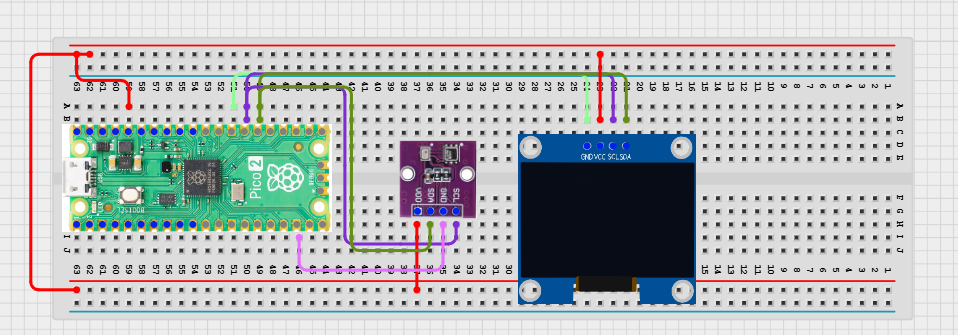

# Project 3.9.23: Smart Environment Trend Predictor

**Advanced Embedded Systems Project Using Raspberry Pi Pico 2 W and MicroPython**


## Overview

The Pico tracks temperature and humidity history, then predicts whether the local environment is becoming hotter, wetter, or staying stable.

Single readings do not reveal whether an environment is changing toward a risky condition or recovering toward normal.

A Pico 2 W prototype with a BME280 environmental sensor and OLED used as a local environment trend dashboard.

History-based interpretation, trend labels, and honest prediction wording for a local prototype.


## Required Components


|  |  |  |  |
| --- | --- | --- | --- |
| <br>Raspberry Pi Pico 2 W | <br>Breadboard | <br>Jumper wires | <br>BME280 |
| <br>OLED |  |  |  |
---

## Circuit Connections


| Component terminal | Connect to | Pico physical pin | Notes |
|---|---|---|---|
| BME280 VCC | 3.3V output | Physical pin 36 | Sensor power |
| BME280 GND | GND | Physical pin 38 | Common ground |
| BME280 SDA | GPIO 20 | GPIO 20 / physical pin 26 | I2C0 SDA |
| BME280 SCL | GPIO 21 | GPIO 21 / physical pin 27 | I2C0 SCL |
| OLED SDA | GPIO 20 | GPIO 20 / physical pin 26 | I2C0 SDA |
| OLED SCL | GPIO 21 | GPIO 21 / physical pin 27 | I2C0 SCL |
---

## Wiring Diagram



```
  BME280 SDA -> GPIO 20
  BME280 SCL -> GPIO 21
  GPIO 20 -> OLED SDA
  GPIO 21 -> OLED SCL
  Common GND -> BME280 and OLED
  BME280 VCC -> 3.3V, GND -> GND
```

---

## Step-by-Step Assembly

1. Connect the BME280 to Pico 3.3V, GND, GPIO 20 (SDA), and GPIO 21 (SCL).
2. Connect the OLED to Pico 3.3V, GND, GPIO 20, and GPIO 21.
3. Upload ssd1306.py and confirm it appears in the Pico file list before running the dashboard.
4. Place the BME280 in a location where temperature and humidity can change gradually during testing.

---

## Testing Individual Components

Before running the full project, test each subsystem separately. This makes it easier to find wiring, library, or logic problems before full integration.

1. **Hardware setup**: Assemble the Pico, sensor, indicator, and load wiring exactly as shown in the connection table before applying power.
2. **Test the input sensor**: Read the BME280 alone first so the baseline temperature and humidity are believable.
3. **Test the output device**: Run an OLED hello-world test before combining it with the trend logic.
4. **Test the decision logic**: Increase temperature or humidity gradually and confirm the trend label changes only after the history window fills.
5. **Run the full system**: Run the full predictor and compare the serial output with the OLED trend label.
6. **Validate the prototype**: Change the sample interval and observe how that affects the predictor stability.
7. **Save the project**: Save the validated program on the Pico as main.py and keep a copy on the computer for future edits.

---

## Full Project Code

After completing and checking the circuit connections, open Thonny IDE, copy and paste this code into a new file or upload the project file to the Raspberry Pi Pico 2 W, then run it from Thonny.

```python
from machine import I2C, Pin
import bme280
import time

try:
    from ssd1306 import SSD1306_I2C
    HAS_OLED = True
except ImportError:
    HAS_OLED = False

BME_SDA_PIN = 20
BME_SCL_PIN = 21
HISTORY_LENGTH = 6

i2c = I2C(0, sda=Pin(BME_SDA_PIN), scl=Pin(BME_SCL_PIN), freq=400000)
climate = bme280.BME280(i2c=i2c)
if HAS_OLED:
    oled = SSD1306_I2C(128, 64, i2c)

history = []


def trend_label(samples):
    if len(samples) < 2:
        return 'STABLE'
    temp_delta = samples[-1][0] - samples[0][0]
    hum_delta = samples[-1][1] - samples[0][1]
    if temp_delta >= 2 and hum_delta >= 6:
        return 'RISK RISING'
    if temp_delta >= 2:
        return 'HEATING'
    if hum_delta >= 6:
        return 'HUMIDIFYING'
    return 'STABLE'


print('Environment trend predictor ready')

while True:
    try:
        values = climate.values
        temperature = float(values[0].replace('C', ''))
        pressure = float(values[1].replace('hPa', ''))
        humidity = float(values[2].replace('%', ''))
    except Exception:
        temperature = 0
        pressure = 0
        humidity = 0

    history.append((temperature, humidity))
    history = history[-HISTORY_LENGTH:]
    label = trend_label(history)
    print('Temp:{}C Hum:{}% Trend:{}'.format(temperature, humidity, label))

    if HAS_OLED:
        oled.fill(0)
        oled.text('Trend Predictor', 0, 0)
        oled.text('T:{}C'.format(temperature), 0, 18)
        oled.text('H:{}%'.format(humidity), 0, 34)
        oled.text(label[:16], 0, 50)
        oled.show()

    time.sleep(5)
```

---

## How the Code Works

| Code Section | What It Does | Why It Matters | What to Modify During Testing |
|--------------|--------------|----------------|------------------------------|
| History window | Stores recent temperature and humidity samples | Trend prediction needs short-term memory instead of one isolated reading | Adjust HISTORY_LENGTH after testing the stability you want |
| trend_label | Compares the oldest and newest values in the history window | This makes the prediction logic transparent and easy to validate | Tune the temperature and humidity deltas after observing real test conditions |
| Main loop | Measures the climate, updates the history, and prints the current trend | Students can compare the raw readings with the trend label directly | If the trend seems wrong, inspect the history values before changing the label logic |
| OLED dashboard | Shows the latest climate reading and trend state locally | A local dashboard keeps the predictor readable during repeated tests | Verify ssd1306.py and the I2C wiring first if the screen is blank |

---

## Expected Result

The serial monitor reports the current reading or state clearly.

The hardware output responds when the decision logic changes state.

Subsystem behavior matches the thresholds, timing, or rules described in the document.

### Validation Checks

- **Normal condition test**: keep the room stable and confirm the trend settles at STABLE
- **Temperature trend test**: warm the BME280 environment gradually and confirm the label changes to HEATING
- **Humidity trend test**: raise humidity gradually and confirm the label changes to HUMIDIFYING
- **Combined trend test**: raise both temperature and humidity and confirm the label changes to RISK RISING
- **Sensor reading validation**: compare the BME280 reading with a known thermometer and a known humid environment if available
- **Limitation test**: explain why a short trend window is not the same as a true environmental forecast

### Deployment and Limitations

- This prototype works well for classroom demonstrations and local monitoring pilots
- Before deployment, it needs calibration records, protective mounting, and regular validation checks
- Display-only systems still depend on correct sensor placement and trained users

---

## Troubleshooting

| Problem | Possible Cause | Solution |
|---------|----------------|----------|
| Trend never changes | The environment is too stable or the trend deltas are too strict | Change the test condition more clearly or lower the trend thresholds slightly |
| Trend jumps too quickly | The history window is too short | Increase HISTORY_LENGTH or the sample interval |
| OLED is blank | The display library or I2C wiring is wrong | Confirm ssd1306.py is on the Pico and recheck GPIO 20 and GPIO 21 |
| BME280 reads zero often | The BME280 data path is unstable | Shorten the wire and retest the sensor separately |

---
