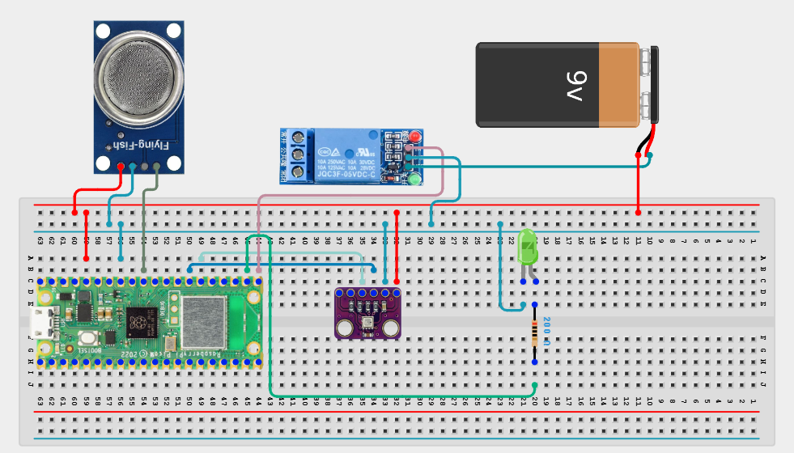

# Project 3.9.25: Smart Environmental Automation System

**Advanced Embedded Systems Project Using Raspberry Pi Pico 2 W and MicroPython**


## Overview

The Pico automates both ventilation and a warning light from environmental sensor readings using multi-state logic.

Automation is weak when it only switches one output and cannot escalate the response as conditions become more severe.

A Pico 2 W prototype with an MQ-5 Liquefied Petroleum/Methane Gas Sensor, BME280, one relay-controlled fan, warning LED, and multi-state response logic.

Environmental automation, escalation logic, and safe single-relay control.


## Required Components


|  |  |  |  |
| --- | --- | --- | --- |
| <br>Raspberry Pi Pico 2 W | <br>Gas sensor | <br>Breadboard | <br>Jumper wires |
| <br>Warning LED | <br>220 ohm resistor | <br>BME280 | <br>Single-channel relay |
| <br>DC Fan |  |  |  |
---

## Circuit Connections


| Component terminal | Connect to | Pico physical pin | Notes |
|---|---|---|---|
| MQ-5 AO | GPIO 26 ADC0 | GPIO 26 / physical pin 31 | LPG/methane gas proxy input |
| BME280 VCC | 3.3V output | Physical pin 36 | Sensor power |
| BME280 GND | GND | Physical pin 38 | Common ground |
| BME280 SDA | GPIO 20 | GPIO 20 / physical pin 26 | I2C0 SDA |
| BME280 SCL | GPIO 21 | GPIO 21 / physical pin 27 | I2C0 SCL |
| Relay IN | GPIO 16 | GPIO 16 / physical pin 21 | Fan output |
| Warning LED anode | 220 ohm resistor to GPIO 17 | GPIO 17 / physical pin 22 | ESCALATE indicator |
---

## Wiring Diagram



```
MQ-5 AO -> GPIO 26
BME280 SDA -> GPIO 20
BME280 SCL -> GPIO 21
GPIO 16 -> relay IN
GPIO 17 -> 220 ohm resistor -> warning LED anode
External supply -> relay-switched fan
BME280 VCC -> 3.3V
BME280 GND -> GND
```

Diagram Placeholder
[Insert wiring diagram or breadboard image here]

---

## Step-by-Step Assembly

1. Connect the MQ-5 analog output to GPIO 26 through a safe ADC path.
2. Connect the BME280 to Pico 3.3V, GND, GPIO 20 (SDA), and GPIO 21 (SCL).
3. Connect the relay input to GPIO 16 and the warning LED to GPIO 17 through a 220 ohm resistor.
4. Attach the fan only after the relay has been tested with a safe dummy load or no load.
5. Warm up the MQ-5 fully before choosing the environmental thresholds.

---

## Testing Individual Components

Before running the full project, test each subsystem separately. This makes it easier to find wiring, library, or logic problems before full integration.

1. **Hardware setup**: Assemble the Pico, sensor, indicator, and load wiring exactly as shown in the connection table before applying power.
2. **Test the input sensor**: Test the gas and climate sensors separately so the automation starts from believable readings.
3. **Test the output device**: Toggle the relay and warning LED from a short test script before using the automation rules.
4. **Test the decision logic**: Create moderate and stronger environmental conditions and confirm the system moves from NORMAL to VENTILATE to ESCALATE at the right times.
5. **Run the full system**: Run the full automation system and compare the sensor readings with the relay and warning LED outputs.
6. **Validate the prototype**: Observe whether the recovery thresholds are strong enough to prevent unstable relay switching.
7. **Save the project**: Save the validated program on the Pico as main.py and keep a copy on the computer for future edits.

---

## Full Project Code

After completing and checking the circuit connections, open Thonny IDE, copy and paste this code into a new file or upload the project file to the Raspberry Pi Pico 2 W, then run it from Thonny.

Upload and run this code after the individual tests work correctly.

```python
from machine import ADC, I2C, Pin
import bme280
import time

GAS_PIN = 26
BME_SDA_PIN = 20
BME_SCL_PIN = 21
FAN_RELAY_PIN = 16
WARNING_LED_PIN = 17
GAS_VENT = 22000
GAS_ESCALATE = 32000
GAS_CLEAR = 17000
TEMP_VENT = 31
TEMP_ESCALATE = 35
TEMP_CLEAR = 28
HUM_ESCALATE = 80

mq5 = ADC(GAS_PIN)
i2c = I2C(0, sda=Pin(BME_SDA_PIN), scl=Pin(BME_SCL_PIN), freq=400000)
climate = bme280.BME280(i2c=i2c)
fan_relay = Pin(FAN_RELAY_PIN, Pin.OUT)
warning_led = Pin(WARNING_LED_PIN, Pin.OUT)
state = 'NORMAL'


def apply_outputs(current_state):
    fan_relay.value(1 if current_state in ('VENTILATE', 'ESCALATE') else 0)
    warning_led.value(1 if current_state == 'ESCALATE' else 0)


apply_outputs(state)
print('Smart environmental automation system ready')

while True:
    gas_value = mq5.read_u16()
    try:
        values = climate.values
        temperature = float(values[0].replace('C', ''))
        pressure = float(values[1].replace('hPa', ''))
        humidity = float(values[2].replace('%', ''))
    except Exception:
        temperature = 0
        pressure = 0
        humidity = 0

    if state == 'ESCALATE':
        if gas_value <= GAS_CLEAR and temperature <= TEMP_CLEAR:
            state = 'NORMAL'
    elif state == 'VENTILATE':
        if gas_value >= GAS_ESCALATE or temperature >= TEMP_ESCALATE or humidity >= HUM_ESCALATE:
            state = 'ESCALATE'
        elif gas_value <= GAS_CLEAR and temperature <= TEMP_CLEAR:
            state = 'NORMAL'
    else:
        if gas_value >= GAS_ESCALATE or temperature >= TEMP_ESCALATE or humidity >= HUM_ESCALATE:
            state = 'ESCALATE'
        elif gas_value >= GAS_VENT or temperature >= TEMP_VENT:
            state = 'VENTILATE'

    apply_outputs(state)
    print('Gas:{} Temp:{}C Hum:{}% State:{}'.format(gas_value, temperature, humidity, state))
    time.sleep(2)
```

---

## How the Code Works

| Code Section | What It Does | Why It Matters | What to Modify During Testing |
|--------------|--------------|----------------|------------------------------|
| State machine | Tracks whether the system is in NORMAL, VENTILATE, or ESCALATE state. | A clear state machine is easier to validate than scattered if statements. | Print the state transitions during testing if behavior seems unexpected. |
| apply_outputs | Maps the current state to the fan relay and warning LED. | This keeps hardware behavior consistent and easy to audit. | Invert relay logic here if your module is active low. |
| Escalation thresholds | Uses stronger thresholds for severe conditions than for moderate ventilation. | Escalation makes the automation more realistic than a single on or off rule. | Tune the thresholds only after warm-up and repeated environmental trials. |

---

## Expected Result

The fan relay turns on under moderate environmental stress and the warning LED stays off.

Under more severe conditions, the fan relay and warning LED turn on as the system enters ESCALATE.

The outputs recover to normal only after the readings return below the clear thresholds.

### Validation Checks

- **Normal condition test**: confirm the relay and warning LED stay off under baseline conditions.
- **Moderate condition test**: raise gas or temperature moderately and confirm only the ventilation output turns on.
- **Severe condition test**: create a higher gas reading or hotter and more humid condition and confirm the ESCALATE state activates the relay and warning LED.
- **Recovery test**: allow the environment to cool and clear and confirm both outputs turn off cleanly.
- **Output response validation**: test the relay without the fan attached and test the warning LED before full operation.

### Deployment and Limitations

- This prototype could be used in school, farm, or sanitation demonstrations with safe low-voltage loads.
- Before deployment, the load wiring, enclosure, and power design need careful review.
- Actuator systems need maintenance planning because relay wear and sensor drift affect reliability.

---

## Troubleshooting

| Problem | Possible Cause | Solution |
|---------|----------------|----------|
| The warning output turns on too early | The escalation thresholds are too low | Collect baseline values and raise GAS_ESCALATE, TEMP_ESCALATE, or HUM_ESCALATE carefully. |
| The system never recovers to normal | The clear thresholds are too strict or the environment remains stressed | Print the live readings and adjust the clear thresholds only after observing stable recovery values. |
| Relay or warning LED never changes | The wiring or pin mapping is wrong | Test the relay and LED outputs separately and confirm their control pins. |
| Climate values stay at zero | The BME280 read failed | Test the BME280 separately and shorten the I2C wires if needed. |

---
