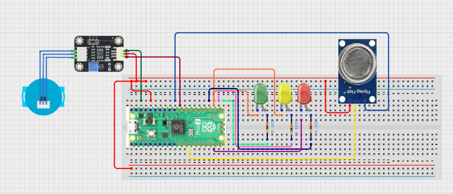

# Project 3.9.26: Smart Environmental Compliance Engine

**Advanced Embedded Systems Project Using Raspberry Pi Pico 2 W and MicroPython**


## Overview

The Pico screens gas and water-condition readings and labels the site as COMPLIANT, REVIEW, or FAIL.

Environmental screening is unreliable when people look at one reading in isolation and do not document how the final decision was made.

A Pico 2 W prototype with an MQ-135 gas sensor, turbidity-style water sensor, and three status LEDs.

Rule-based compliance screening, threshold documentation, and honest discussion of prototype measurement limits.


---

## Required Components


|  |  |  |  |
| --- | --- | --- | --- |
| <br>Raspberry Pi Pico 2 W | <br>Soil sensor | <br>Breadboard | <br>Jumper wires |
| <br>LED | <br>Resistor | <br>Turbidity Sensor |  |
---

## Circuit Connections


| Component terminal | Connect to | Pico physical pin | Notes |
|---|---|---|---|
| MQ-135 AO | GPIO 26 ADC0 | GPIO 26 / physical pin 31 | Air-quality proxy input |
| Water-quality sensor AO | GPIO 27 ADC1 | GPIO 27 / physical pin 32 | Water-condition input |
| Green LED anode | 220 ohm resistor to GPIO 16 | GPIO 16 / physical pin 21 | COMPLIANT |
| Yellow LED anode | 220 ohm resistor to GPIO 17 | GPIO 17 / physical pin 22 | REVIEW |
| Red LED anode | 220 ohm resistor to GPIO 18 | GPIO 18 / physical pin 24 | FAIL |
---

## Wiring Diagram



```
  MQ-135 AO -> GPIO 26
  Water-quality sensor AO -> GPIO 27
  GPIO 16 -> green LED (COMPLIANT)
  GPIO 17 -> yellow LED (REVIEW)
  GPIO 18 -> red LED (FAIL)
  Common GND -> sensors and LEDs
```

---

## Step-by-Step Assembly

1. Connect the MQ-135 analog output to GPIO 26 through a safe 3.3V ADC path.
2. Connect the water-condition sensor analog output to GPIO 27 and keep the Pico away from the wet test area.
3. Connect the green, yellow, and red LEDs to GPIO 16, GPIO 17, and GPIO 18 through 220 ohm resistors.
4. Warm up the gas sensor fully before trusting any screening result.

---

## Testing Individual Components

Before running the full project, test each subsystem separately. This makes it easier to find wiring, library, or logic problems before full integration.

1. **Hardware setup**: Assemble the Pico, sensor, indicator, and load wiring exactly as shown in the connection table before applying power.
2. **Test the input sensor**: Read the gas sensor and the water-condition sensor separately so you know the baseline for each subsystem.
3. **Test the output device**: Test the three LEDs so the status panel is confirmed before the screening logic runs.
4. **Test the decision logic**: Change one test condition at a time and confirm the system moves from COMPLIANT to REVIEW or FAIL logically.
5. **Run the full system**: Run the full screening tool and compare the printed values with the LED output.
6. **Validate the prototype**: Document how sensitive the result is to threshold changes and sensor drift.
7. **Save the project**: Save the validated program on the Pico as main.py and keep a copy on the computer for future edits.

---

## Full Project Code

After completing and checking the circuit connections, open Thonny IDE, copy and paste this code into a new file or upload the project file to the Raspberry Pi Pico 2 W, then run it from Thonny.

```python
from machine import ADC, Pin
import time

GAS_PIN = 26
WATER_PIN = 27
GREEN_PIN = 16
YELLOW_PIN = 17
RED_PIN = 18
GAS_REVIEW = 18000
GAS_FAIL = 30000
WATER_REVIEW = 22000
WATER_FAIL = 36000

mq135 = ADC(GAS_PIN)
water = ADC(WATER_PIN)
green = Pin(GREEN_PIN, Pin.OUT)
yellow = Pin(YELLOW_PIN, Pin.OUT)
red = Pin(RED_PIN, Pin.OUT)

print('Environmental compliance engine ready')

while True:
    gas_value = mq135.read_u16()
    water_value = water.read_u16()

    review_score = 0
    fail = False

    if gas_value >= GAS_FAIL or water_value >= WATER_FAIL:
        fail = True
    else:
        if gas_value >= GAS_REVIEW:
            review_score += 1
        if water_value >= WATER_REVIEW:
            review_score += 1

    if fail or review_score >= 2:
        status = 'FAIL'
    elif review_score == 1:
        status = 'REVIEW'
    else:
        status = 'COMPLIANT'

    green.value(1 if status == 'COMPLIANT' else 0)
    yellow.value(1 if status == 'REVIEW' else 0)
    red.value(1 if status == 'FAIL' else 0)

    print('Gas:{} Water:{} Status:{}'.format(gas_value, water_value, status))
    time.sleep(2)
```

---

## How the Code Works

| Code Section | What It Does | Why It Matters | What to Modify During Testing |
|--------------|--------------|----------------|------------------------------|
| Threshold constants | Defines moderate and critical screening thresholds for both sensors | The whole screening result depends on these documented limits | Collect baseline values before setting the review and fail thresholds |
| Review scoring | Counts moderate violations while allowing one critical condition to force FAIL directly | This keeps the decision logic explainable to students and inspectors | Adjust the score rules only after physical tests show how strict they should be |
| Status outputs | Drives the green, yellow, and red LEDs from the selected status | A visible status panel makes validation faster than serial output alone | Keep the color meaning consistent if the system is extended later |
| Main loop | Prints the raw readings and the current screening result | The final status should always be traceable back to the actual sensor values | If the status looks wrong, inspect the raw values before editing the code |

---

## Expected Result

The green LED stays on when both readings remain within the normal classroom screening range.

The yellow LED turns on when one condition requires review.

The red LED turns on when a critical threshold is crossed or both moderate thresholds are exceeded together.

### Validation Checks

- **Normal condition test**: allow the MQ-135 to warm up in a stable area and confirm the system reports COMPLIANT
- **Warning condition test**: create one moderate test condition and confirm the system changes to REVIEW
- **Critical condition test**: create a stronger single-threshold violation and confirm the system changes to FAIL
- **Sensor reading validation**: print the raw gas and water values repeatedly and check that they change in the expected direction
- **Calibration test**: record baseline gas and water values before setting the thresholds
- **Limitation test**: explain why this result is a screening prototype and not a certified compliance instrument

### Deployment and Limitations

- This prototype is useful for classroom environmental screening exercises and engineering discussions
- Before deployment, the sensor quality, calibration process, and documentation would need major improvement
- Real compliance systems also require certified sensors, traceable records, and trained personnel

---

## Troubleshooting

| Problem | Possible Cause | Solution |
|---------|----------------|----------|
| Status is always fail | The thresholds are too low or one sensor is saturated | Print both raw values and raise the threshold that is dominating the status |
| Green LED never turns on | One review threshold is below the room baseline | Collect a stable baseline and reset the threshold values |
| Water reading never changes | The analog signal path or wet test setup is wrong | Check the AO wiring and retest with a known change in water condition |
| Gas values drift for a long time | The MQ-135 is still warming up | Allow more warm-up time and compare the readings only after they stabilize |

---
