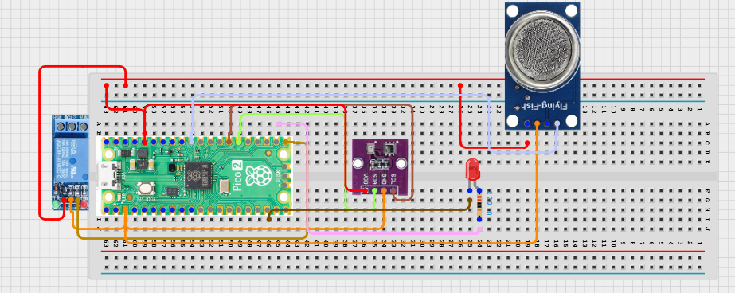

# Project 3.9.31: Smart Environmental Response System

**Advanced Embedded Systems Project Using Raspberry Pi Pico 2 W and MicroPython**


## Overview

The Pico monitors LPG/methane gas proxy and temperature, then drives a ventilation relay only when the environment crosses a defined response threshold.

Environmental problems escalate when systems only measure conditions but never trigger a response to reduce risk or discomfort.

A Pico 2 W prototype with an MQ-5 Liquefied Petroleum/Methane Gas Sensor, BME280, relay-driven fan, and status LED.

Sensor fusion, response thresholds with hysteresis, and safe actuator testing for environmental control.


## Required Components


|  |  |  |  |
| --- | --- | --- | --- |
| <br>Raspberry Pi Pico 2 W | <br>Gas sensor | <br>Breadboard | <br>Jumper wires |
| <br>LED | <br>Resistor | <br>BME280 | <br>Relay |
| <br>DC Fan |  |  |  |
---

## Circuit Connections


| Component terminal | Connect to | Pico physical pin | Notes |
|---|---|---|---|
| MQ-5 AO | GPIO 26 ADC0 | GPIO 26 / physical pin 31 | LPG/methane gas proxy input |
| BME280 VCC | 3.3V output | Physical pin 36 | Sensor power |
| BME280 GND | GND | Physical pin 38 | Common ground |
| BME280 SDA | GPIO 20 | GPIO 20 / physical pin 26 | I2C0 SDA |
| BME280 SCL | GPIO 21 | GPIO 21 / physical pin 27 | I2C0 SCL |
| Relay IN | GPIO 16 | GPIO 16 / physical pin 21 | Fan control output |
| LED anode | 220 ohm resistor to GPIO 17 | GPIO 17 / physical pin 22 | Fan status LED |
---

## Wiring Diagram



```
MQ-5 AO -> GPIO 26
BME280 SDA -> GPIO 20
BME280 SCL -> GPIO 21
GPIO 16 -> relay IN
GPIO 17 -> 220 ohm resistor -> LED anode
External supply -> relay-switched fan
BME280 VCC -> 3.3V
BME280 GND -> GND
```

Diagram Placeholder
[Insert wiring diagram or breadboard image here]

---

## Step-by-Step Assembly

1. Connect the MQ-5 analog output to GPIO 26 through a safe ADC path.
2. Connect the BME280 to Pico 3.3V, GND, GPIO 20 (SDA), and GPIO 21 (SCL).
3. Connect the relay control input to GPIO 16 and power the relay module correctly.
4. Wire the LED to GPIO 17 through a 220 ohm resistor and connect the LED cathode to ground.
5. Attach the fan only after the relay switching behavior is confirmed with no load or a safe test load.

---

## Testing Individual Components

Before running the full project, test each subsystem separately. This makes it easier to find wiring, library, or logic problems before full integration.

1. **Hardware setup**: Assemble the Pico, sensor, indicator, and load wiring exactly as shown in the connection table before applying power.
2. **Test the input sensor**: Test the gas and BME280 readings separately so the environmental baseline is believable before fan control starts.
3. **Test the output device**: Toggle the relay and LED from a short script before connecting the full response logic.
4. **Test the decision logic**: Raise gas or temperature one factor at a time and confirm the response turns on and off according to the hysteresis rules.
5. **Run the full system**: Run the full response system and compare the live readings with the reported response state.
6. **Validate the prototype**: Check whether the chosen thresholds make the fan too active or not active enough for the classroom conditions.
7. **Save the project**: Save the validated program on the Pico as main.py and keep a copy on the computer for future edits.

---

## Full Project Code

After completing and checking the circuit connections, open Thonny IDE, copy and paste this code into a new file or upload the project file to the Raspberry Pi Pico 2 W, then run it from Thonny.

Upload and run this code after the individual tests work correctly.

```python
from machine import ADC, I2C, Pin
import bme280
import time

GAS_PIN = 26
BME_SDA_PIN = 20
BME_SCL_PIN = 21
RELAY_PIN = 16
LED_PIN = 17
GAS_WARN = 22000
GAS_CLEAR = 17000
GAS_PURGE = 32000
TEMP_WARN = 31
TEMP_CLEAR = 28

mq5 = ADC(GAS_PIN)
i2c = I2C(0, sda=Pin(BME_SDA_PIN), scl=Pin(BME_SCL_PIN), freq=400000)
climate = bme280.BME280(i2c=i2c)
relay = Pin(RELAY_PIN, Pin.OUT)
led = Pin(LED_PIN, Pin.OUT)
fan_on = False


def set_fan(state):
    relay.value(1 if state else 0)
    led.value(1 if state else 0)


set_fan(False)
print('Smart environmental response system ready')

while True:
    gas_value = mq5.read_u16()
    try:
        values = climate.values
        temperature = float(values[0].replace('C', ''))
        pressure = float(values[1].replace('hPa', ''))
        humidity = float(values[2].replace('%', ''))
    except Exception:
        temperature = 0
        pressure = 0
        humidity = 0

    if fan_on:
        if gas_value <= GAS_CLEAR and temperature <= TEMP_CLEAR:
            fan_on = False
    else:
        if gas_value >= GAS_WARN or temperature >= TEMP_WARN:
            fan_on = True

    set_fan(fan_on)

    if gas_value >= GAS_PURGE:
        status = 'PURGE'
    elif fan_on:
        status = 'VENTILATE'
    else:
        status = 'NORMAL'

    print('Gas:{} Temp:{}C Hum:{}% Status:{}'.format(gas_value, temperature, humidity, status))
    time.sleep(2)
```

---

## How the Code Works

| Code Section | What It Does | Why It Matters | What to Modify During Testing |
|--------------|--------------|----------------|------------------------------|
| Environmental thresholds | Defines warning, clear, and purge thresholds for gas and temperature. | Separate on and off thresholds reduce unstable switching. | Collect warmed-up baseline values before changing the threshold constants. |
| set_fan | Keeps the relay and LED in the same response state. | Mirrored outputs make validation simpler and reduce accidental mismatch. | If the relay module is active low, invert the relay logic here. |
| Hysteresis logic | Turns ventilation on at one threshold and off only after recovery. | Hysteresis is a key engineering trade-off in real control systems. | Adjust the clear thresholds if the fan stays on too long or cycles too often. |

---

## Expected Result

The fan and LED stay off under normal environmental conditions.

When gas or temperature rises above the response threshold, the relay and LED turn on together.

The system reports PURGE when the gas reading becomes much higher than the normal ventilation threshold.

### Validation Checks

- **Normal condition test**: confirm the fan stays off when gas and temperature remain below the warn thresholds.
- **Warning condition test**: raise gas or temperature and confirm the status changes to VENTILATE.
- **Critical condition test**: create a higher gas reading after warm-up and confirm the status changes to PURGE.
- **Output response validation**: test the relay first without the fan, then reconnect the fan after safe switching is confirmed.
- **False trigger test**: watch whether minor temperature or gas drift causes unwanted relay chatter.

### Deployment and Limitations

- This prototype could be used in school, farm, or sanitation demonstrations with safe low-voltage loads.
- Before deployment, the load wiring, enclosure, and power design need careful review.
- Actuator systems need maintenance planning because relay wear and sensor drift affect reliability.

---

## Troubleshooting

| Problem | Possible Cause | Solution |
|---------|----------------|----------|
| The fan never turns on | The relay wiring is wrong or the thresholds are too high | Test the relay separately and temporarily lower the response thresholds during debugging. |
| The fan never turns off | The clear thresholds are too low or the room has not recovered | Print the live readings and raise the clear thresholds carefully. |
| Temperature stays at zero | The BME280 read failed | Test the BME280 in a short script and shorten the wiring if needed. |
| Gas readings look unstable | The MQ-5 is still warming up or the analog path is noisy | Allow more warm-up time and verify the analog wiring and grounding. |

---
