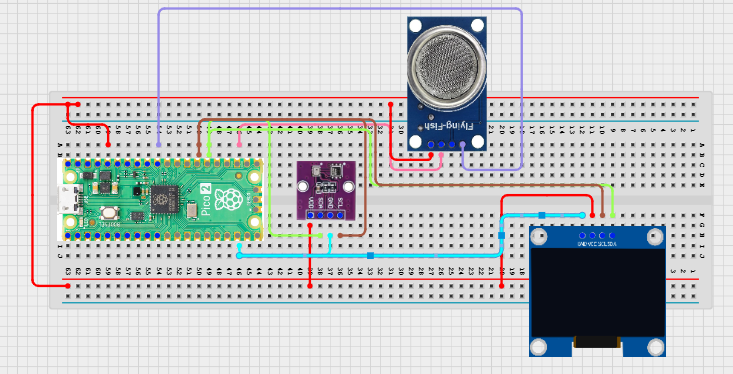

# Project 3.9.32: Smart Environmental Risk Platform

**Advanced Embedded Systems Project Using Raspberry Pi Pico 2 W and MicroPython**


## Overview

The Pico calculates an environmental risk score from gas, temperature, and humidity, then shows the result on a local OLED platform dashboard.

Environmental risk is hard to communicate if raw sensor numbers are not translated into a clear severity score and status label.

A Pico 2 W prototype with an MQ-5 gas sensor, BME280, and OLED used as a local environmental risk platform prototype.

Risk scoring, status categories, and honest correction of platform overclaims.


## Required Components


|  |  |  |  |
| --- | --- | --- | --- |
| <br>Raspberry Pi Pico 2 W | <br>Gas sensor | <br>Breadboard | <br>Jumper wires |
| <br>OLED | <br>BME280 |  |  |
---

## Circuit Connections


| Component terminal | Connect to | Pico physical pin | Notes |
|---|---|---|---|
| MQ-5 AO | GPIO 26 ADC0 | GPIO 26 / physical pin 31 | LPG/methane gas proxy input |
| BME280 VCC | 3.3V output | Physical pin 36 | Sensor power |
| BME280 GND | GND | Physical pin 38 | Common ground |
| BME280 SDA | GPIO 20 | GPIO 20 / physical pin 26 | I2C0 SDA |
| BME280 SCL | GPIO 21 | GPIO 21 / physical pin 27 | I2C0 SCL |
| OLED SDA | GPIO 20 | GPIO 20 / physical pin 26 | I2C0 SDA |
| OLED SCL | GPIO 21 | GPIO 21 / physical pin 27 | I2C0 SCL |
---

## Wiring Diagram



```
  MQ-5 AO -> GPIO 26
  BME280 SDA -> GPIO 20
  BME280 SCL -> GPIO 21
  GPIO 20 -> OLED SDA
  GPIO 21 -> OLED SCL
  Common GND -> MQ-5, BME280, and OLED
  BME280 VCC -> 3.3V, GND -> GND
```

---

## Step-by-Step Assembly

1. Connect the MQ-5 analog output to GPIO 26 through a 3.3V-safe signal path.
2. Connect the BME280 to Pico 3.3V, GND, GPIO 20 (SDA), and GPIO 21 (SCL).
3. Connect the OLED to Pico 3.3V, GND, GPIO 20, and GPIO 21.
4. Upload ssd1306.py and confirm the library is present before running the risk dashboard.
5. Warm up the gas sensor fully before choosing the gas thresholds.

---

## Testing Individual Components

Before running the full project, test each subsystem separately. This makes it easier to find wiring, library, or logic problems before full integration.

1. **Hardware setup**: Assemble the Pico, sensor, indicator, and load wiring exactly as shown in the connection table before applying power.
2. **Test the input sensor**: Test the MQ-5 and BME280 separately so the baseline of each subsystem is known.
3. **Test the output device**: Run an OLED hello-world test so the display path is verified.
4. **Test the decision logic**: Raise one factor at a time and confirm the risk score changes in an explainable way.
5. **Run the full system**: Run the full dashboard and compare the raw inputs with the numeric score and category.
6. **Validate the prototype**: Record whether the score feels too sensitive or too insensitive in repeated tests.
7. **Save the project**: Save the validated program on the Pico as main.py and keep a copy on the computer for future edits.

---

## Full Project Code

After completing and checking the circuit connections, open Thonny IDE, copy and paste this code into a new file or upload the project file to the Raspberry Pi Pico 2 W, then run it from Thonny.

```python
from machine import ADC, I2C, Pin
import bme280
import time

try:
    from ssd1306 import SSD1306_I2C
    HAS_OLED = True
except ImportError:
    HAS_OLED = False

GAS_PIN = 26
BME_SDA_PIN = 20
BME_SCL_PIN = 21
GAS_WARN = 18000
GAS_HIGH = 30000
TEMP_WARN = 30
TEMP_HIGH = 35
HUM_WARN = 75
HUM_HIGH = 85

mq5 = ADC(GAS_PIN)
i2c = I2C(0, sda=Pin(BME_SDA_PIN), scl=Pin(BME_SCL_PIN), freq=400000)
climate = bme280.BME280(i2c=i2c)
if HAS_OLED:
    oled = SSD1306_I2C(128, 64, i2c)


def risk_category(score):
    if score >= 5:
        return 'HIGH'
    if score >= 2:
        return 'ELEVATED'
    return 'LOW'


print('Environmental risk platform ready')

while True:
    gas_value = mq5.read_u16()
    try:
        values = climate.values
        temperature = float(values[0].replace('C', ''))
        pressure = float(values[1].replace('hPa', ''))
        humidity = float(values[2].replace('%', ''))
    except Exception:
        temperature = 0
        pressure = 0
        humidity = 0

    score = 0
    if gas_value >= GAS_WARN:
        score += 1
    if gas_value >= GAS_HIGH:
        score += 2
    if temperature >= TEMP_WARN:
        score += 1
    if temperature >= TEMP_HIGH:
        score += 1
    if humidity >= HUM_WARN:
        score += 1
    if humidity >= HUM_HIGH:
        score += 1

    category = risk_category(score)
    print('Gas:{} Temp:{}C Hum:{}% Score:{} Category:{}'.format(
        gas_value, temperature, humidity, score, category))

    if HAS_OLED:
        oled.fill(0)
        oled.text('Risk Platform', 0, 0)
        oled.text('Gas:{}'.format(gas_value), 0, 14)
        oled.text('T:{} H:{}%'.format(temperature, humidity), 0, 28)
        oled.text('S:{} {}'.format(score, category), 0, 46)
        oled.show()

    time.sleep(2)
```

---

## How the Code Works

| Code Section | What It Does | Why It Matters | What to Modify During Testing |
|--------------|--------------|----------------|------------------------------|
| Threshold constants | Defines the warning and high thresholds for gas, temperature, and humidity | The score only makes sense if the thresholds are documented and tested | Measure real baseline values before finalizing the thresholds |
| Score building | Adds points as conditions become more severe | A visible score is easier to explain than a mysterious category jump | Tune the score weights only after repeated physical tests |
| risk_category | Maps the numeric score into a readable risk label | Users need a simple category as well as the numeric score | Adjust the category boundaries if your site needs different alert bands |
| OLED platform view | Displays the local platform-style summary on the screen | This demonstrates platform thinking without overclaiming remote infrastructure | If the OLED is blank, verify the I2C wiring and ssd1306.py before changing the score logic |

---

## Expected Result

The OLED and serial monitor show gas, temperature, humidity, a risk score, and a risk category.

A moderate environmental change increases the score and can move the category to ELEVATED.

Stronger combined gas, heat, or humidity conditions can move the category to HIGH.

### Validation Checks

- **Normal condition test**: allow the MQ-5 to warm up in a stable room and confirm the category settles near LOW
- **Warning condition test**: raise one factor modestly and confirm the score increases without jumping straight to HIGH
- **Critical condition test**: create stronger combined stress and confirm the score reaches the HIGH category
- **Sensor reading validation**: compare the BME280 with a known thermometer and observe the MQ-5 baseline after warm-up
- **Calibration test**: record gas, temperature, and humidity baseline values before changing the thresholds
- **Limitation test**: explain why this local score is not a complete environmental risk platform or certified alarm

### Deployment and Limitations

- This prototype is useful for classroom risk-scoring demonstrations and local environmental studies
- Before deployment, the score thresholds, enclosure, and calibration routine need improvement
- A real platform would also need networking, data retention, user roles, and stronger sensor validation

---

## Troubleshooting

| Problem | Possible Cause | Solution |
|---------|----------------|----------|
| Score is always high | One threshold is below the room baseline or the gas sensor is not warmed up | Print the raw values after warm-up and raise the threshold that dominates the score |
| OLED shows nothing | The display library or I2C wiring is wrong | Confirm ssd1306.py is on the Pico and recheck GPIO 20 and GPIO 21 |
| Humidity stays at zero | The BME280 is failing to read | Shorten the wire and test the BME280 separately before changing the score logic |
| Gas value barely changes | The MQ-5 baseline has not settled or airflow is too stable | Allow more warm-up time and compare readings in slightly different conditions |

---

#
