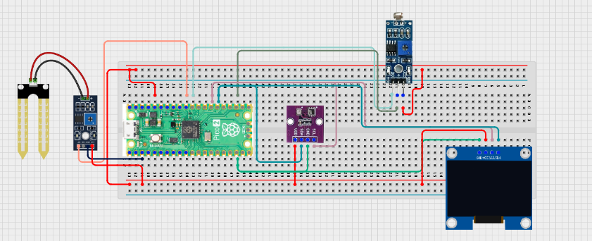

# Project 3.9.33: Smart Farm Ai Assistant

**Advanced Embedded Systems Project Using Raspberry Pi Pico 2 W and MicroPython**


## Overview

The Pico reads soil moisture, temperature, humidity, and light, then suggests a farm action on a local assistant display.

Farm decisions become inconsistent when moisture, heat, and light are checked separately and not translated into a clear recommendation.

A Pico 2 W prototype with a soil moisture sensor, DHT22, LDR, and OLED acting as a local farm assistant.

Rule-based AI-style recommendations, multi-sensor interpretation, and clear explanation of why the assistant chose its action.


## Required Components


|  |  |  |  |
| --- | --- | --- | --- |
| <br>Raspberry Pi Pico 2 W | <br>Soil sensor | <br>Breadboard | <br>Jumper wires |
| <br>LDR | <br>BME280 | <br>OLED |  |
---

## Circuit Connections


| Component terminal | Connect to | Pico physical pin | Notes |
|---|---|---|---|
| Soil sensor AO | GPIO 26 ADC0 | GPIO 26 / physical pin 31 | Analog soil input |
| LDR divider midpoint | GPIO 27 ADC1 | GPIO 27 / physical pin 32 | Ambient light input |
| DHT22 DATA | GPIO 15 | GPIO 15 / physical pin 20 | Climate input |
| OLED SDA | GPIO 20 | GPIO 20 / physical pin 26 | I2C0 SDA |
| OLED SCL | GPIO 21 | GPIO 21 / physical pin 27 | I2C0 SCL |
---

## Wiring Diagram



```
  Soil sensor AO -> GPIO 26
  LDR divider midpoint -> GPIO 27
  DHT22 DATA -> GPIO 15
  GPIO 20 -> OLED SDA
  GPIO 21 -> OLED SCL
  Common GND -> all sensors and OLED
```

---

## Step-by-Step Assembly

1. Connect the capacitive soil sensor analog output to GPIO 26.
2. Build the LDR divider and connect its midpoint to GPIO 27.
3. Connect the DHT22 to Pico 3.3V, GND, and GPIO 15.
4. Connect the OLED to Pico 3.3V, GND, GPIO 20, and GPIO 21.
5. Upload ssd1306.py and confirm it appears in the Pico file list before running the assistant.

---

## Testing Individual Components

Before running the full project, test each subsystem separately. This makes it easier to find wiring, library, or logic problems before full integration.

1. **Hardware setup**: Assemble the Pico, sensor, indicator, and load wiring exactly as shown in the connection table before applying power.
2. **Test the input sensor**: Read the soil sensor, LDR, and DHT22 separately so each input has a believable baseline.
3. **Test the output device**: Run an OLED hello-world test so the display path is confirmed.
4. **Test the decision logic**: Change one condition at a time and confirm the assistant recommendation changes logically.
5. **Run the full system**: Run the full assistant and compare the recommendation with the live readings.
6. **Validate the prototype**: Record any cases where the recommendation feels reasonable or unreasonable and explain why.
7. **Save the project**: Save the validated program on the Pico as main.py and keep a copy on the computer for future edits.

---

## Full Project Code

After completing and checking the circuit connections, open Thonny IDE, copy and paste this code into a new file or upload the project file to the Raspberry Pi Pico 2 W, then run it from Thonny.

```python
from machine import ADC, I2C, Pin
import dht
import time

try:
    from ssd1306 import SSD1306_I2C
    HAS_OLED = True
except ImportError:
    HAS_OLED = False

SOIL_PIN = 26
LIGHT_PIN = 27
DHT_PIN = 15
I2C_SDA_PIN = 20
I2C_SCL_PIN = 21
SOIL_DRY_RAW = 48000
SOIL_WET_RAW = 18000
LIGHT_DARK_RAW = 4000
LIGHT_BRIGHT_RAW = 52000

soil = ADC(SOIL_PIN)
light = ADC(LIGHT_PIN)
climate = dht.DHT22(Pin(DHT_PIN))
i2c = I2C(0, sda=Pin(I2C_SDA_PIN), scl=Pin(I2C_SCL_PIN), freq=400000)
if HAS_OLED:
    oled = SSD1306_I2C(128, 64, i2c)


def clamp(value, low, high):
    return max(low, min(high, value))


def percent_from_range(raw, low_raw, high_raw):
    span = high_raw - low_raw
    if span == 0:
        return 0
    pct = int((raw - low_raw) * 100 / span)
    return clamp(pct, 0, 100)


print('Farm AI assistant ready')

while True:
    soil_raw = soil.read_u16()
    light_raw = light.read_u16()
    try:
        climate.measure()
        temperature = climate.temperature()
        humidity = climate.humidity()
    except OSError:
        temperature = 0
        humidity = 0

    dry_pct = percent_from_range(soil_raw, SOIL_WET_RAW, SOIL_DRY_RAW)
    light_pct = percent_from_range(light_raw, LIGHT_DARK_RAW, LIGHT_BRIGHT_RAW)

    if dry_pct >= 75:
        action = 'IRRIGATE'
    elif temperature >= 34 and light_pct >= 70:
        action = 'SHADE/VENT'
    elif humidity >= 85:
        action = 'VENTILATE'
    else:
        action = 'MONITOR'

    print('Dry:{}% Light:{}% Temp:{}C Hum:{}% Action:{}'.format(
        dry_pct,
        light_pct,
        temperature,
        humidity,
        action,
    ))

    if HAS_OLED:
        oled.fill(0)
        oled.text('Farm Assistant', 0, 0)
        oled.text('Dry:{}%'.format(dry_pct), 0, 14)
        oled.text('L:{}% T:{}'.format(light_pct, temperature), 0, 28)
        oled.text('H:{}%'.format(humidity), 0, 42)
        oled.text(action[:16], 0, 56)
        oled.show()

    time.sleep(2)
```

---

## How the Code Works

| Code Section | What It Does | Why It Matters | What to Modify During Testing |
|--------------|--------------|----------------|------------------------------|
| Calibration mapping | Converts raw soil and light readings into percentages | The assistant needs understandable values before it can offer a recommendation | Measure your own dry, wet, dark, and bright references before changing the constants |
| Rule-based AI-style logic | Chooses an action from simple thresholds and combinations | This is the honest assistant logic behind the project | Adjust the rules only after repeated field-style tests |
| Climate input | Uses temperature and humidity to refine the recommendation | A farm assistant should react to more than soil alone | If the DHT22 fails, fix the sensor path before changing the recommendation rules |
| OLED assistant display | Shows measurements and the final recommendation locally | Students can see both the reason and the advice in one place | If the OLED is blank, verify ssd1306.py and the I2C wiring first |

---

## Expected Result

The OLED and serial monitor show soil dryness, light, climate, and a local farm recommendation.

Very dry soil changes the recommendation to IRRIGATE.

Hot bright conditions change the recommendation to SHADE OR VENTILATE, while mild conditions keep the recommendation at MONITOR.

### Validation Checks

- **Normal condition test**: keep the soil moderately moist and the room stable so the assistant reports MONITOR
- **Warning condition test**: dry the soil gradually and confirm the dryness percentage rises before the assistant recommends IRRIGATE
- **Climate test**: increase temperature or strong light exposure and confirm the assistant recommends SHADE OR VENTILATE when appropriate
- **Sensor reading validation**: compare soil and light percentages against clearly dry, wet, dark, and bright test conditions
- **Calibration test**: record dry and wet soil values plus dark and bright light values before final threshold tuning
- **Limitation test**: explain why this rule-based assistant cannot replace a trained agronomy model or field expert

### Deployment and Limitations

- This prototype is useful for classroom farm studies and local decision-support demonstrations
- Before deployment, the sensor calibration, enclosure, and recommendation rules need wider field testing
- A stronger field assistant would also need more sensors, historical records, and user feedback on whether its advice was correct

---

## Troubleshooting

| Problem | Possible Cause | Solution |
|---------|----------------|----------|
| The assistant always says irrigate | The dryness threshold is too low or the soil sensor calibration is wrong | Print the raw soil value and re-measure the dry and wet references |
| Light percentage never changes | The LDR divider is wired incorrectly | Check the midpoint voltage and confirm the resistor divider is built properly |
| Humidity stays at zero | The DHT22 read failed | Shorten the DHT22 wiring and retest the sensor separately |
| OLED is blank | The display library or I2C wiring is wrong | Confirm ssd1306.py is on the Pico and recheck GPIO 20 and GPIO 21 |

---
