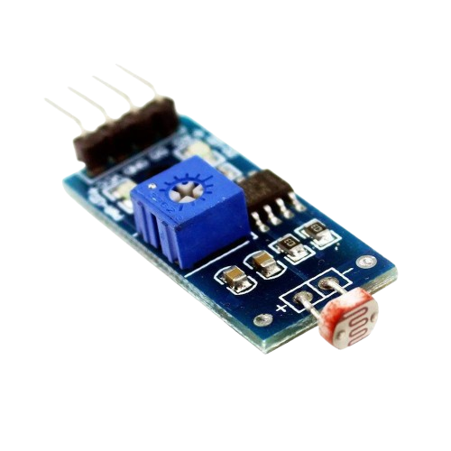
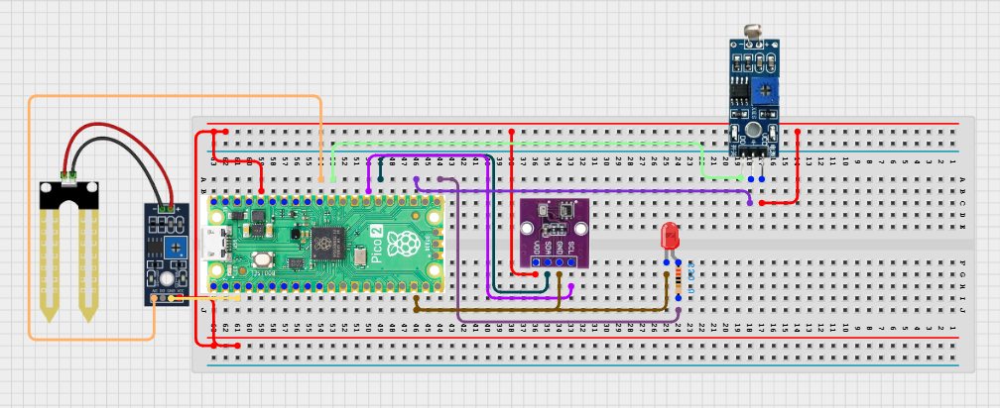

# Project 3.9.34: Smart Farm Iot Ecosystem

**Advanced Embedded Systems Project Using Raspberry Pi Pico 2 W and MicroPython**


## Overview

The Pico collects soil, light, and climate data, stores each record locally, and can optionally upload the same record to a local farm server.

IoT systems are hard to trust when they depend entirely on the network and do not preserve local data for validation.

A Pico 2 W node with a soil moisture sensor, LDR or analog light sensor, DHT22, status LED, and optional Wi-Fi upload.

Multi-sensor logging, local-first IoT design, and honest platform-ready communication.


## Required Components


|  |  |  |  |
| --- | --- | --- | --- |
| <br>Raspberry Pi Pico 2 W | <br>Soil sensor | <br>Breadboard | <br>Jumper wires |
| <br>LED | <br>Resistor | <br>LDR | <br>BME280 |
---

## Circuit Connections


| Component terminal | Connect to | Pico physical pin | Notes |
|---|---|---|---|
| Soil sensor AO | GPIO 26 ADC0 | GPIO 26 / physical pin 31 | Soil input |
| Light sensor output | GPIO 27 ADC1 | GPIO 27 / physical pin 32 | Light input |
| DHT22 DATA | GPIO 15 | GPIO 15 / physical pin 20 | Climate input |
| LED anode | 220 ohm resistor to GPIO 16 | GPIO 16 / physical pin 21 | Activity LED |
---

## Wiring Diagram



```
Soil sensor AO -> GPIO 26
Light sensor output -> GPIO 27
DHT22 DATA -> GPIO 15
GPIO 16 -> 220 ohm resistor -> LED anode
Common GND -> all sensors and LED
```

Diagram Placeholder
[Insert wiring diagram or breadboard image here]

---

## Step-by-Step Assembly

1. Connect the soil sensor analog output to GPIO 26 and record dry and wet reference readings later.
2. Build the light sensor analog path and connect it to GPIO 27.
3. Connect the DHT22 to Pico 3.3V, GND, and GPIO 15.
4. Wire the LED to GPIO 16 through a 220 ohm resistor and connect the LED cathode to ground.
5. Enter Wi-Fi credentials and local server details in the code only after the local record loop works correctly.

---

## Testing Individual Components

Before running the full project, test each subsystem separately. This makes it easier to find wiring, library, or logic problems before full integration.

1. **Hardware setup**: Assemble the Pico, sensor, indicator, and load wiring exactly as shown in the connection table before applying power.
2. **Test the input sensor**: Test the soil sensor, light sensor, and DHT22 separately so each field in the final record has a believable baseline.
3. **Test the output device**: Blink the LED and test local file writing before enabling the upload function.
4. **Test the decision logic**: Confirm that one loop creates one record and that the irrigation-priority label changes when soil dries or temperature rises.
5. **Run the full system**: Run the full node and compare local-only behavior with optional upload behavior to a local server.
6. **Validate the prototype**: Disable Wi-Fi and confirm the node still logs locally so the ecosystem design remains useful without the network.
7. **Save the project**: Save the validated program on the Pico as main.py and keep a copy on the computer for future edits.

---

## Full Project Code

After completing and checking the circuit connections, open Thonny IDE, copy and paste this code into a new file or upload the project file to the Raspberry Pi Pico 2 W, then run it from Thonny.

Upload and run this code after the individual tests work correctly.

```python
import dht
import network
import socket
import time
import ujson as json
from machine import ADC, Pin

SOIL_PIN = 26
LIGHT_PIN = 27
DHT_PIN = 15
LED_PIN = 16
LOG_FILE = 'farm_317.jsonl'
UPLOAD_ENABLED = False
WIFI_SSID = 'YOUR_WIFI'
WIFI_PASSWORD = 'YOUR_PASSWORD'
SERVER_HOST = '192.168.1.50'
SERVER_PORT = 8000
SERVER_PATH = '/farm'
INTERVAL_S = 60
SOIL_DRY_THRESHOLD = 65
HOT_THRESHOLD = 32

soil = ADC(SOIL_PIN)
light = ADC(LIGHT_PIN)
climate = dht.DHT22(Pin(DHT_PIN))
led = Pin(LED_PIN, Pin.OUT)


def clamp(value, low, high):
    return max(low, min(high, value))


def connect_wifi(timeout_s=15):
    wlan = network.WLAN(network.STA_IF)
    if wlan.isconnected():
        return wlan
    wlan.active(True)
    wlan.connect(WIFI_SSID, WIFI_PASSWORD)
    for _ in range(timeout_s):
        if wlan.isconnected():
            return wlan
        time.sleep(1)
    return None


def append_record(record):
    try:
        with open(LOG_FILE, 'a') as handle:
            handle.write(json.dumps(record) + '\n')
    except OSError:
        print('Could not write local record')


def upload_record(record):
    if not UPLOAD_ENABLED:
        return False
    wlan = connect_wifi()
    if wlan is None:
        return False
    address = socket.getaddrinfo(SERVER_HOST, SERVER_PORT)[0][-1]
    body = json.dumps(record)
    request = 'POST {} HTTP/1.1\r\nHost: {}\r\nContent-Type: application/json\r\nContent-Length: {}\r\nConnection: close\r\n\r\n{}'.format(
        SERVER_PATH,
        SERVER_HOST,
        len(body),
        body,
    )
    sock = socket.socket()
    try:
        sock.connect(address)
        sock.send(request.encode())
        sock.recv(128)
        return True
    finally:
        sock.close()


def irrigation_priority(soil_raw, temperature):
    dryness = clamp(int((soil_raw - 18000) * 100 / (48000 - 18000)), 0, 100)
    if dryness >= SOIL_DRY_THRESHOLD or temperature >= HOT_THRESHOLD:
        label = 'HIGH'
    elif dryness >= 45:
        label = 'MEDIUM'
    else:
        label = 'LOW'
    return dryness, label


print('Smart farm IoT ecosystem node ready')

while True:
    try:
        climate.measure()
        temperature = climate.temperature()
        humidity = climate.humidity()
    except OSError:
        temperature = 0
        humidity = 0

    soil_raw = soil.read_u16()
    dryness_pct, priority = irrigation_priority(soil_raw, temperature)
    record = {
        'schema_version': 1,
        'device_id': 'farm_317',
        'uptime_s': time.ticks_ms() // 1000,
        'soil_raw': soil_raw,
        'dryness_pct': dryness_pct,
        'light_raw': light.read_u16(),
        'temperature_c': temperature,
        'humidity_pct': humidity,
        'irrigation_priority': priority,
    }

    append_record(record)
    uploaded = upload_record(record)
    led.value(1)
    time.sleep_ms(150)
    led.value(0)
    print(record, 'uploaded' if uploaded else 'local_only')
    time.sleep(INTERVAL_S)
```

---

## How the Code Works

| Code Section | What It Does | Why It Matters | What to Modify During Testing |
|--------------|--------------|----------------|------------------------------|
| Structured record creation | Combines raw sensor values and an irrigation-priority label into one record. | Consistent records make later analysis and upload validation possible. | Add fields only if you also update the testing plan and documentation. |
| append_record | Writes every record locally in JSON-lines format. | Local storage protects the project from silent data loss during network failure. | Check the file contents before blaming the network when data seems missing. |
| upload_record | Optionally posts the same record to a local server. | This demonstrates ecosystem-ready communication without overclaiming a finished platform. | Enable upload only after local logging is stable and verified. |
| irrigation_priority | Turns raw soil and temperature data into a simple action label. | Students can compare raw values with a practical decision field in the same record. | Recalibrate the dryness mapping for your own soil sensor before trusting the label. |

---

## Expected Result

The serial monitor prints one farm record per interval with soil, light, temperature, humidity, and irrigation priority fields.

A local JSON-lines file keeps the records even when Wi-Fi is disabled.

When upload is enabled and working, the same record can be compared with the server copy for validation.

### Validation Checks

- **Normal condition test**: confirm that one record is stored locally each interval with stable field names.
- **Sensor validation test**: vary soil moisture and light conditions and confirm the raw values respond in the printed record.
- **Decision logic test**: dry the soil or increase temperature and confirm the irrigation-priority label rises from LOW to MEDIUM or HIGH.
- **Communication validation test**: enable upload to a local server and compare the uploaded payload with the local file record.
- **Fallback test**: disable Wi-Fi and confirm the node still logs locally without crashing.

### Deployment and Limitations

- This prototype is suitable for local pilots where sensor data must be logged or transmitted over short periods.
- Before deployment, network reliability, power backup, and endpoint security need attention.
- The system should keep useful local behavior even when communication fails.

---

## Troubleshooting

| Problem | Possible Cause | Solution |
|---------|----------------|----------|
| The log file stays empty | Local file writing failed | Test a short text write and confirm the Pico file system is writable. |
| Uploads always fail | Wi-Fi is disabled or the endpoint settings are wrong | Check UPLOAD_ENABLED, the credentials, and the server host, port, and path. |
| Dryness looks unrealistic | The soil calibration assumptions do not match your sensor | Record wet and dry values from your own sensor and update the mapping. |
| The DHT22 fields stay at zero | The climate sensor read failed | Test the DHT22 separately and shorten the data wire if needed. |

---
