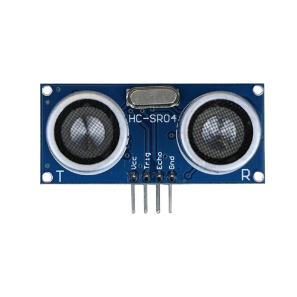
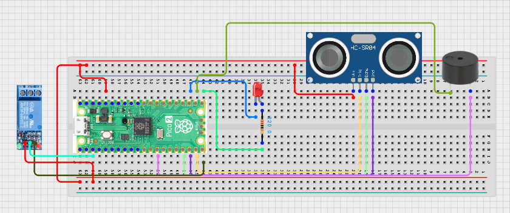

# Project 3.9.35: Smart Flood Management System

**Advanced Embedded Systems Project Using Raspberry Pi Pico 2 W and MicroPython**


## Overview

The Pico measures rising water distance, raises warning alerts, and switches a pump relay when flood conditions become critical.

Flood response should warn users early and should not run a pump unsafely or chatter around the threshold.

A Pico 2 W prototype with an ultrasonic water-level sensor, LED, buzzer, relay, and pump output.

Distance calibration, warning and critical thresholds, safe pump control, and actuator validation.


## Required Components


|  |  |  |  |
| --- | --- | --- | --- |
| <br>Raspberry Pi Pico 2 W | <br>Ultrasonic sensor | <br>Breadboard | <br>Jumper wires |
| <br>LED | <br>Resistor | <br>Buzzer | <br>Relay |
| <br>Water pump |  |  |  |
---

## Circuit Connections


| Component terminal | Connect to | Pico physical pin | Notes |
|---|---|---|---|
| HC-SR04 TRIG | GPIO 14 | GPIO 14 / physical pin 19 | Trigger output |
| HC-SR04 ECHO | GPIO 13 through voltage divider | GPIO 13 / physical pin 17 | 3.3V-safe Echo input |
| Relay IN | GPIO 15 | GPIO 15 / physical pin 20 | Pump relay control |
| LED anode | 220 ohm resistor to GPIO 16 | GPIO 16 / physical pin 21 | Warning LED |
| Buzzer positive | GPIO 17 | GPIO 17 / physical pin 22 | Critical buzzer |
---

## Wiring Diagram



```
  GPIO 14 -> HC-SR04 TRIG
  HC-SR04 ECHO -> voltage divider -> GPIO 13
  GPIO 15 -> relay IN
  GPIO 16 -> warning LED via 220 ohm
  GPIO 17 -> buzzer
  Relay load path -> external pump supply and pump
```

---

## Step-by-Step Assembly

1. Connect the ultrasonic TRIG pin to GPIO 14.
2. Connect the ultrasonic ECHO pin to GPIO 13 through a resistor divider or use a 3.3V-safe ultrasonic module.
3. Connect the relay control input to GPIO 15 and test its logic level before attaching the pump.
4. Connect the warning LED to GPIO 16 through a 220 ohm resistor and connect the buzzer to GPIO 17.
5. Mount the ultrasonic sensor above the water surface and keep the Pico and relay board away from splashes.

---

## Testing Individual Components

Before running the full project, test each subsystem separately. This makes it easier to find wiring, library, or logic problems before full integration.

1. **Hardware setup**: Assemble the Pico, sensor, indicator, and load wiring exactly as shown in the connection table before applying power.
2. **Test the input sensor**: Measure known distances with the ultrasonic sensor first so the water-level conversion is believable.
3. **Test the output device**: Test the LED, buzzer, and relay separately before connecting the real pump.
4. **Test the decision logic**: Confirm that warning activates at the higher distance threshold and the pump activates only at the critical threshold.
5. **Run the full system**: Run the full system while changing the water level and compare the pump behavior with the printed distance.
6. **Validate the prototype**: Test for false echoes, splashes, or odd sensor angles and record how they affect the decision.
7. **Save the project**: Save the validated program on the Pico as main.py and keep a copy on the computer for future edits.

---

## Full Project Code

After completing and checking the circuit connections, open Thonny IDE, copy and paste this code into a new file or upload the project file to the Raspberry Pi Pico 2 W, then run it from Thonny.

```python
from machine import Pin
import time

TRIG_PIN = 14
ECHO_PIN = 13
RELAY_PIN = 15
LED_PIN = 16
BUZZER_PIN = 17
WARNING_DISTANCE_CM = 50
PUMP_ON_DISTANCE_CM = 30
PUMP_OFF_DISTANCE_CM = 45
MIN_PUMP_RUN_MS = 5000

trig = Pin(TRIG_PIN, Pin.OUT)
echo = Pin(ECHO_PIN, Pin.IN)
relay = Pin(RELAY_PIN, Pin.OUT)
led = Pin(LED_PIN, Pin.OUT)
buzzer = Pin(BUZZER_PIN, Pin.OUT)
relay.off()
led.off()
buzzer.off()
pump_on = False
pump_started_ms = 0


def measure_distance_cm():
    trig.low()
    time.sleep_us(2)
    trig.high()
    time.sleep_us(10)
    trig.low()

    timeout_start = time.ticks_us()
    while echo.value() == 0:
        if time.ticks_diff(time.ticks_us(), timeout_start) > 30000:
            return None

    pulse_start = time.ticks_us()
    while echo.value() == 1:
        if time.ticks_diff(time.ticks_us(), pulse_start) > 30000:
            return None

    pulse_width = time.ticks_diff(time.ticks_us(), pulse_start)
    return (pulse_width * 0.0343) / 2


print('Smart flood management system ready')

while True:
    distance = measure_distance_cm()
    if distance is None:
        print('Ultrasonic timeout')
        relay.off()
        led.off()
        buzzer.off()
        time.sleep(1)
        continue

    now = time.ticks_ms()
    warning = distance <= WARNING_DISTANCE_CM
    critical = distance <= PUMP_ON_DISTANCE_CM

    if not pump_on and critical:
        pump_on = True
        pump_started_ms = now
    elif pump_on:
        runtime = time.ticks_diff(now, pump_started_ms)
        if distance >= PUMP_OFF_DISTANCE_CM and runtime >= MIN_PUMP_RUN_MS:
            pump_on = False

    relay.value(1 if pump_on else 0)
    led.value(1 if warning else 0)
    buzzer.value(1 if critical else 0)

    status = 'CRITICAL' if critical else ('WARNING' if warning else 'NORMAL')
    print('Distance:{:.1f}cm Status:{} Pump:{}'.format(
        distance,
        status,
        'ON' if pump_on else 'OFF',
    ))
    time.sleep(1)
```

---

## How the Code Works

| Code Section | What It Does | Why It Matters | What to Modify During Testing |
|--------------|--------------|----------------|------------------------------|
| measure_distance_cm | Triggers the ultrasonic sensor and returns the measured distance with timeout handling | Timeout protection prevents the whole program from freezing on a bad echo | Verify known distances before adjusting the flood thresholds |
| Threshold constants | Defines warning, pump-on, and pump-off distances plus minimum run time | These values control both safety and usefulness of the response | Measure your real installation height before changing the distance values |
| Pump control logic | Uses a critical threshold and minimum run time before switching the pump off | This reduces rapid pump cycling when the water level sits near the threshold | Always validate the relay path without the pump first |
| Alert outputs | Turns on the LED for warning and the buzzer for critical flood conditions | Graded alerts help users respond before the pump stage if possible | Keep the warning and critical meanings consistent if you extend the design |

---

## Expected Result

The LED turns on when the measured distance falls below the warning threshold.

The buzzer and pump relay turn on when the water rises into the critical range.

The pump stays on until the water recedes above the off threshold and the minimum run time is complete.

### Validation Checks

- **Normal condition test**: place the target surface far enough away and confirm the system reports NORMAL
- **Warning condition test**: test at about 50 cm and confirm the warning LED turns on while the pump stays off
- **Critical condition test**: test at about 30 cm and confirm the buzzer and relay activate
- **Ultrasonic validation**: test at 5 cm, 10 cm, 20 cm, and 30 cm and confirm the measured values are reasonably close
- **Relay validation**: test the relay first without the pump load, then connect the safe low-voltage pump only after the logic is correct
- **False trigger test**: change the target angle or add splashes and note how bad echoes affect the reading

### Deployment and Limitations

- This prototype is useful for classroom flood-response demonstrations and supervised local sump experiments
- Before deployment, the enclosure, power design, sensor mounting, and redundant safety checks need major improvement
- Outdoor use would also need weather protection, pump maintenance planning, and a clear manual override procedure

---

## Troubleshooting

| Problem | Possible Cause | Solution |
|---------|----------------|----------|
| Distance never changes | TRIG or ECHO wiring is wrong | Check the trigger line, the voltage divider on Echo, and the sensor mounting angle |
| The Pico resets when the pump starts | The pump is sharing unstable power with the Pico | Move the pump to a separate external supply and keep a common ground only where appropriate |
| Pump chatters on and off | The off threshold is too close to the on threshold or the minimum run time is too short | Increase the hysteresis gap or the minimum run time |
| No critical alarm appears | The measured distance never reaches the pump-on threshold | Lower the target distance during testing and confirm the serial readings first |

---
