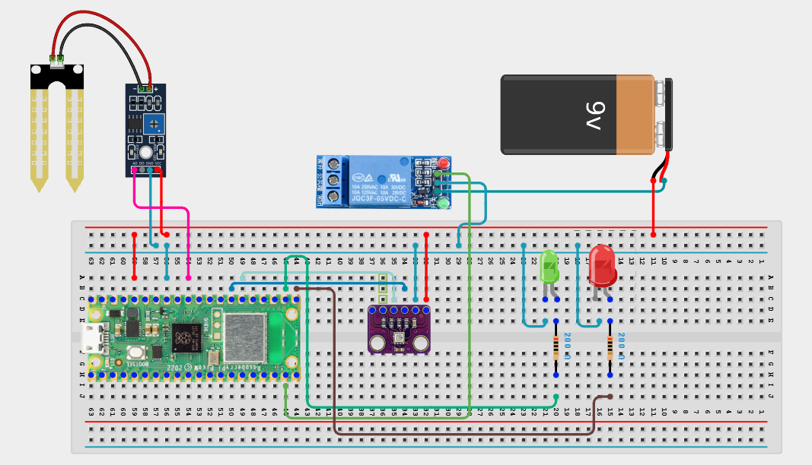

# Project 3.9.39: Smart Greenhouse Autonomous Controller

**Advanced Embedded Systems Project Using Raspberry Pi Pico 2 W and MicroPython**


## Overview

The Pico controls irrigation from soil moisture and indicates when ventilation is needed from temperature and humidity measurements.

Greenhouse crops can suffer when watering and ventilation needs are not coordinated with actual plant and climate conditions.

A Pico 2 W prototype with a soil moisture sensor, BME280, one relay-controlled pump, and pump and ventilation indicators.

Irrigation control, ventilation indication, hysteresis, safe relay testing, and autonomous greenhouse decision logic.


---

## Required Components


|  |  |  |  |
| --- | --- | --- | --- |
| <br>Raspberry Pi Pico 2 W | <br>Soil sensor | <br>Breadboard | <br>Jumper wires |
| <br>2 LEDs | <br>2 × 220 ohm resistors | <br>BME280 | <br>Single-channel relay |
| <br>Water pump |  |  |  |
---

## Circuit Connections


| Component terminal | Connect to | Pico physical pin | Notes |
|---|---|---|---|
| Soil sensor AO | GPIO 26 ADC0 | GPIO 26 / physical pin 31 | Analog soil reading |
| BME280 VCC | 3.3V output | Physical pin 36 | Sensor power |
| BME280 GND | GND | Physical pin 38 | Common ground |
| BME280 SDA | GPIO 20 | GPIO 20 / physical pin 26 | I2C0 SDA |
| BME280 SCL | GPIO 21 | GPIO 21 / physical pin 27 | I2C0 SCL |
| Relay IN | GPIO 14 | GPIO 14 / physical pin 19 | Pump relay control |
| Pump LED anode | 220 ohm resistor to GPIO 16 | GPIO 16 / physical pin 21 | Pump status LED |
| Ventilation LED anode | 220 ohm resistor to GPIO 17 | GPIO 17 / physical pin 22 | Ventilation-request indicator |
---

## Wiring Diagram



```
  Soil sensor AO -> GPIO 26
  BME280 SDA -> GPIO 20
  BME280 SCL -> GPIO 21
  GPIO 14 -> relay IN (pump)
  GPIO 16 -> pump LED via 220 ohm
  GPIO 17 -> ventilation LED via 220 ohm
  Relay load path -> external pump supply
  BME280 VCC -> 3.3V, GND -> GND
```

---

## Step-by-Step Assembly

1. Connect the soil moisture sensor analog output to GPIO 26.
2. Connect the BME280 to Pico 3.3V, GND, GPIO 20 (SDA), and GPIO 21 (SCL).
3. Connect the single relay control to GPIO 14 for the pump.
4. Connect the pump and ventilation LEDs to GPIO 16 and GPIO 17 through 220 ohm resistors.
5. Attach the pump to its external supply through the relay contacts only after relay-only testing passes. The ventilation LED is an indicator, not a fan control output.

---

## Testing Individual Components

Before running the full project, test each subsystem separately. This makes it easier to find wiring, library, or logic problems before full integration.

1. **Hardware setup**: Assemble the Pico, sensor, indicator, and load wiring exactly as shown in the connection table before applying power.
2. **Test the input sensor**: Read the soil sensor and BME280 separately and collect dry, damp, cool, and hot baseline values.
3. **Test the output device**: Toggle the relay and each LED separately with a short script before connecting the actual pump.
4. **Test the decision logic**: Confirm that dry soil starts the pump and hot or humid air lights the ventilation indicator.
5. **Run the full system**: Run the full controller and compare the printed actuator states with the live environmental conditions.
6. **Validate the prototype**: Test borderline conditions and check whether the hysteresis prevents relay chatter.
7. **Save the project**: Save the validated program on the Pico as main.py and keep a copy on the computer for future edits.

---

## Full Project Code

After completing and checking the circuit connections, open Thonny IDE, copy and paste this code into a new file or upload the project file to the Raspberry Pi Pico 2 W, then run it from Thonny.

```python
from machine import ADC, I2C, Pin
import bme280
import time

SOIL_PIN = 26
BME_SDA_PIN = 20
BME_SCL_PIN = 21
PUMP_RELAY_PIN = 14
PUMP_LED_PIN = 16
FAN_LED_PIN = 17
SOIL_DRY_RAW = 48000
SOIL_WET_RAW = 18000
PUMP_ON_DRY = 75
PUMP_OFF_DRY = 45
FAN_ON_TEMP = 31
FAN_OFF_TEMP = 28
FAN_ON_HUM = 85
FAN_OFF_HUM = 75
MAX_PUMP_RUN_MS = 8000

soil = ADC(SOIL_PIN)
i2c = I2C(0, sda=Pin(BME_SDA_PIN), scl=Pin(BME_SCL_PIN), freq=400000)
climate = bme280.BME280(i2c=i2c)
pump_relay = Pin(PUMP_RELAY_PIN, Pin.OUT)
pump_led = Pin(PUMP_LED_PIN, Pin.OUT)
fan_led = Pin(FAN_LED_PIN, Pin.OUT)
pump_relay.off()
pump_on = False
fan_on = False
pump_start_ms = 0


def clamp(value, low, high):
    return max(low, min(high, value))


def dry_percent(raw):
    span = SOIL_DRY_RAW - SOIL_WET_RAW
    if span <= 0:
        return 0
    pct = int((raw - SOIL_WET_RAW) * 100 / span)
    return clamp(pct, 0, 100)


print('Greenhouse autonomous controller ready')

while True:
    soil_raw = soil.read_u16()
    dry_pct = dry_percent(soil_raw)
    try:
        values = climate.values
        temperature = float(values[0].replace('C', ''))
        pressure = float(values[1].replace('hPa', ''))
        humidity = float(values[2].replace('%', ''))
    except Exception:
        temperature = 0
        pressure = 0
        humidity = 0

    now = time.ticks_ms()
    if not pump_on and dry_pct >= PUMP_ON_DRY:
        pump_on = True
        pump_start_ms = now
    elif pump_on:
        runtime = time.ticks_diff(now, pump_start_ms)
        if dry_pct <= PUMP_OFF_DRY or runtime >= MAX_PUMP_RUN_MS:
            pump_on = False

    if not fan_on and (temperature >= FAN_ON_TEMP or humidity >= FAN_ON_HUM):
        fan_on = True
    elif fan_on and temperature <= FAN_OFF_TEMP and humidity <= FAN_OFF_HUM:
        fan_on = False

    pump_relay.value(1 if pump_on else 0)
    pump_led.value(1 if pump_on else 0)
    fan_led.value(1 if fan_on else 0)

    print('Dry:{}% Temp:{}C Hum:{}% Pump:{} Fan:{}'.format(
        dry_pct,
        temperature,
        humidity,
        'ON' if pump_on else 'OFF',
        'ON' if fan_on else 'OFF',
    ))
    time.sleep(2)
```

---

## How the Code Works

| Code Section | What It Does | Why It Matters | What to Modify During Testing |
|--------------|--------------|----------------|------------------------------|
| Shared sensing layer | Reads soil, temperature, and humidity for irrigation and ventilation decisions | The controller depends on one reliable sensing base | Validate the sensors before assuming the relay or indicators are the real issue |
| Pump hysteresis | Uses separate on and off dryness thresholds and a maximum run time | Water control should not chatter or run forever | Collect dry and wet calibration values before tuning the pump thresholds |
| Ventilation hysteresis | Uses separate on and off climate thresholds for a ventilation request | The indicator responds to heat and humidity without oscillating rapidly | Adjust temperature and humidity limits after measuring your greenhouse test space |
| Output mapping | Drives one pump relay and two status LEDs | Visible feedback makes relay debugging safer and faster | Test the relay without the real load attached first |

---

## Expected Result

Dry soil causes the pump relay and pump LED to turn on, then turn off after recovery or maximum run time.

Hot or humid air causes the ventilation LED to turn on, then turn off only after both values fall below the off thresholds. Connect a fan manually or add separate approved fan-control hardware if automatic ventilation is required.

The pump relay and ventilation indicator operate independently from the same shared sensor set.

### Validation Checks

- **Normal condition test**: use moderately moist soil and mild room air to confirm the relay and both LEDs remain off
- **Pump validation**: dry the soil sensor gradually and confirm the pump relay and pump LED activate
- **Ventilation validation**: warm or humidify the BME280 environment carefully and confirm the ventilation LED activates without forcing irrigation
- **Relay validation**: test the single relay first with no load attached, then with a safe low-voltage pump
- **Calibration test**: record dry and wet soil values plus cool and hot greenhouse climate values before final threshold tuning
- **False trigger test**: hold the conditions near the thresholds and confirm the hysteresis prevents rapid relay chatter

### Deployment and Limitations

- This prototype is useful for greenhouse demonstrations and small supervised plant-control pilots
- Before deployment, the relay enclosure, actuator wiring, tubing management, and sensor maintenance plan need improvement
- Long-term greenhouse use would also need better power design, weather resistance, and fail-safe behavior

---

## Troubleshooting

| Problem | Possible Cause | Solution |
|---------|----------------|----------|
| Pump runs but the ventilation LED never turns on | The ventilation thresholds are too high or the LED path is wrong | Test the LED output separately and lower the threshold only after confirming the wiring |
| Pump relay chatters | The soil value is sitting on the threshold and hysteresis is too small | Increase the gap between the pump on and off thresholds |
| Dry percentage looks unrealistic | The soil calibration values are wrong | Re-measure dry and wet raw values with the actual sensor |
| BME280 readings fail | The I2C bus is unstable | Shorten the wire and retest the sensor by itself |

---
