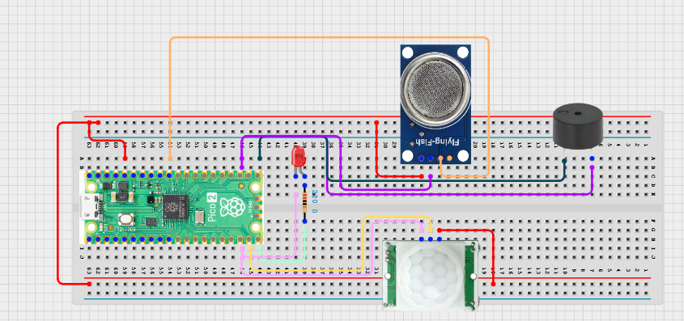

# Project 3.9.41: Smart Sanitation Alert Network

**Advanced Embedded Systems Project Using Raspberry Pi Pico 2 W and MicroPython**


## Overview

The Pico detects sanitation alert events locally and sends them to a local network endpoint while keeping visible fallback behavior on the device.

Alert systems are unreliable if they depend entirely on the network and give no local warning when the communication path fails.

A Pico 2 W prototype with a PIR sensor, MQ-135 gas sensor, LED, buzzer, and Wi-Fi alert upload to a local server.

Event-based alert logic, local fail-safe behavior, and honest network-prototype design.


## Required Components


|  |  |  |  |
| --- | --- | --- | --- |
| <br>Raspberry Pi Pico 2 W | <br>Gas sensor | <br>Breadboard | <br>Jumper wires |
| <br>LED | <br>Resistor | <br>Motion sensor | <br>Buzzer |
---

## Circuit Connections


| Component terminal | Connect to | Pico physical pin | Notes |
|---|---|---|---|
| PIR OUT | GPIO 14 | GPIO 14 / physical pin 19 | Occupancy input |
| MQ-135 AO | GPIO 26 ADC0 | GPIO 26 / physical pin 31 | Odor proxy input |
| LED anode | 220 ohm resistor to GPIO 15 | GPIO 15 / physical pin 20 | Alert LED |
| Buzzer positive | GPIO 16 | GPIO 16 / physical pin 21 | Alert buzzer |
---

## Wiring Diagram



```
  PIR OUT -> GPIO 14
  MQ-135 AO -> GPIO 26
  GPIO 15 -> LED via 220 ohm
  GPIO 16 -> buzzer
  Wi-Fi uses the Pico 2 W radio and needs no extra wiring
```

---

## Step-by-Step Assembly

1. Connect the PIR output to GPIO 14 and allow the PIR to warm up.
2. Connect the MQ-135 analog output to GPIO 26 through a safe ADC path.
3. Connect the LED to GPIO 15 through a 220 ohm resistor.
4. Connect the buzzer to GPIO 16 and confirm it is a low-current module.
5. Enter the Wi-Fi credentials and local server details only after the local alert behavior works.

---

## Testing Individual Components

Before running the full project, test each subsystem separately. This makes it easier to find wiring, library, or logic problems before full integration.

1. **Hardware setup**: Assemble the Pico, sensor, indicator, and load wiring exactly as shown in the connection table before applying power.
2. **Test the input sensor**: Test the PIR edge events and gas threshold separately so the alert conditions are understandable.
3. **Test the output device**: Test the LED and buzzer separately before adding network upload.
4. **Test the decision logic**: Confirm that one real alert condition creates one alert event rather than repeated rapid uploads.
5. **Run the full system**: Run the full node with a local server and compare local alert feedback with the uploaded event.
6. **Validate the prototype**: Disable Wi-Fi and confirm the node still provides a local warning instead of failing silently.
7. **Save the project**: Save the validated program on the Pico as main.py and keep a copy on the computer for future edits.

---

## Full Project Code

After completing and checking the circuit connections, open Thonny IDE, copy and paste this code into a new file or upload the project file to the Raspberry Pi Pico 2 W, then run it from Thonny.

```python
import network
import socket
import time
import ujson as json
from machine import ADC, Pin

PIR_PIN = 14
GAS_PIN = 26
LED_PIN = 15
BUZZER_PIN = 16
GAS_ALERT = 22000
GAS_CRITICAL = 32000
COOLDOWN_MS = 15000
WIFI_SSID = 'YOUR_WIFI'
WIFI_PASSWORD = 'YOUR_PASSWORD'
SERVER_HOST = '192.168.1.50'
SERVER_PORT = 8000
SERVER_PATH = '/alerts'

pir = Pin(PIR_PIN, Pin.IN, Pin.PULL_DOWN)
gas = ADC(GAS_PIN)
led = Pin(LED_PIN, Pin.OUT)
buzzer = Pin(BUZZER_PIN, Pin.OUT)
last_pir = 0
last_alert_ms = -COOLDOWN_MS


def connect_wifi(timeout_s=15):
    wlan = network.WLAN(network.STA_IF)
    if wlan.isconnected():
        return wlan
    wlan.active(True)
    wlan.connect(WIFI_SSID, WIFI_PASSWORD)
    for _ in range(timeout_s):
        if wlan.isconnected():
            return wlan
        time.sleep(1)
    return None


def send_alert(payload):
    wlan = connect_wifi()
    if wlan is None:
        return False
    address = socket.getaddrinfo(SERVER_HOST, SERVER_PORT)[0][-1]
    body = json.dumps(payload)
    request = (
        'POST {} HTTP/1.1\r\n'
        'Host: {}\r\n'
        'Content-Type: application/json\r\n'
        'Content-Length: {}\r\n'
        'Connection: close\r\n\r\n'
        '{}'
    ).format(SERVER_PATH, SERVER_HOST, len(body), body)
    sock = socket.socket()
    try:
        sock.connect(address)
        sock.send(request.encode())
        sock.recv(128)
        return True
    finally:
        sock.close()


def local_alert():
    led.on()
    buzzer.on()
    time.sleep_ms(300)
    led.off()
    buzzer.off()


print('Sanitation alert network prototype ready')

while True:
    now = time.ticks_ms()
    pir_value = pir.value()
    new_motion = pir_value == 1 and last_pir == 0
    gas_value = gas.read_u16()
    alert = (new_motion and gas_value >= GAS_ALERT) or gas_value >= GAS_CRITICAL

    if alert and time.ticks_diff(now, last_alert_ms) >= COOLDOWN_MS:
        payload = {
            'device': 'sanitation_298',
            'uptime_s': time.ticks_ms() // 1000,
            'gas_raw': gas_value,
            'motion': pir_value,
        }
        success = send_alert(payload)
        local_alert()
        print(payload, 'sent' if success else 'local_only')
        last_alert_ms = now

    last_pir = pir_value
    time.sleep_ms(100)
```

---

## How the Code Works

| Code Section | What It Does | Why It Matters | What to Modify During Testing |
|--------------|--------------|----------------|------------------------------|
| Alert conditions | Combines motion and odor thresholds to decide when an alert is real | This keeps the network from posting constantly on every loop | Tune the odor and critical thresholds after warm-up and baseline testing |
| Cooldown timing | Limits how often the same alert condition can be posted | Cooldown logic reduces alert flooding and makes event counts more meaningful | Adjust COOLDOWN_MS after observing how long real conditions last |
| send_alert | Posts the alert payload to a local server over Wi-Fi | This turns the build into a network prototype instead of a serial-only demo | Change the server host, port, and path to match your local test endpoint |
| local_alert | Keeps the warning visible on the device even when networking fails | A safety-minded prototype should not depend entirely on connectivity | If the buzzer is too loud for the classroom, shorten the alert duration |

---

## Expected Result

The serial monitor reports the current reading or state clearly.

The hardware output responds when the decision logic changes state.

Subsystem behavior matches the thresholds, timing, or rules described in the document.

### Validation Checks

- **Normal condition test**: confirm no alert is created when the PIR is inactive and the gas level is low
- **Warning condition test**: create occupancy with elevated odor and confirm one alert event is generated
- **Critical condition test**: force a critical odor threshold and confirm an alert appears even without new motion
- **Communication validation**: connect to a local test server and confirm the same alert payload appears on the server
- **Fallback test**: disable Wi-Fi and confirm the local LED and buzzer still activate
- **False trigger test**: remain in the PIR zone and confirm cooldown timing prevents rapid repeat alerts

### Deployment and Limitations

- This prototype is suitable for local pilots where sensor data must be logged or transmitted over short periods
- Before deployment, network reliability, power backup, and endpoint security need attention
- The system should keep useful local behavior even when communication fails

---

## Troubleshooting

| Problem | Possible Cause | Solution |
|---------|----------------|----------|
| Alerts never send | The Wi-Fi or server settings are wrong | Verify the credentials and test the endpoint with a simpler network example first |
| The buzzer never sounds | The buzzer wiring or pin assignment is wrong | Test the buzzer separately with a short output script |
| Too many alerts occur | The gas threshold is too low or the cooldown is too short | Raise the threshold and increase COOLDOWN_MS |
| Motion is never detected | The PIR has not warmed up or the signal line is wrong | Wait for warm-up and print the PIR state during a simple test |

---
