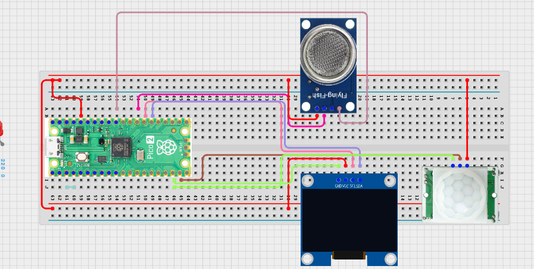

# Project 3.9.46: Smart Sanitation Data Intelligence

**Advanced Embedded Systems Project Using Raspberry Pi Pico 2 W and MicroPython**


## Overview

The Pico counts room-usage events, tracks odor trend, and summarizes sanitation attention level on an OLED.

Maintenance planning stays weak when teams only inspect a room once and do not collect simple usage and condition trends over time.

A Pico 2 W prototype with a PIR sensor, MQ-135 gas sensor, and OLED data-intelligence dashboard.

Event counting, rolling averages, and honest local data-intelligence wording.


## Required Components


|  |  |  |  |
| --- | --- | --- | --- |
| <br>Raspberry Pi Pico 2 W | <br>Gas sensor | <br>Breadboard | <br>Jumper wires |
| <br>LDR | <br>OLED |  |  |
---

## Circuit Connections


| Component terminal | Connect to | Pico physical pin | Notes |
|---|---|---|---|
| PIR OUT | GPIO 14 | GPIO 14 / physical pin 19 | Usage event input |
| MQ-135 AO | GPIO 26 ADC0 | GPIO 26 / physical pin 31 | Odor proxy input |
| OLED SDA | GPIO 20 | GPIO 20 / physical pin 26 | I2C0 SDA |
| OLED SCL | GPIO 21 | GPIO 21 / physical pin 27 | I2C0 SCL |
---

## Wiring Diagram



```
PIR OUT -> GPIO 14
MQ-135 AO -> GPIO 26
GPIO 20 -> OLED SDA
GPIO 21 -> OLED SCL
Common GND -> PIR, MQ-135, and OLED
```

Diagram Placeholder
[Insert wiring diagram or breadboard image here]

---

## Step-by-Step Assembly

1. Connect the PIR output to GPIO 14 and allow warm-up before validating event counts.
2. Connect the MQ-135 analog output to GPIO 26 through a safe ADC path.
3. Connect the OLED to Pico 3.3V, GND, GPIO 20, and GPIO 21.
4. Upload ssd1306.py and confirm it appears on the Pico before running the dashboard.
5. Warm up the MQ-135 and establish an odor baseline before trusting the average.

---

## Testing Individual Components

Before running the full project, test each subsystem separately. This makes it easier to find wiring, library, or logic problems before full integration.

1. **Hardware setup**: Assemble the Pico, sensor, indicator, and load wiring exactly as shown in the connection table before applying power.
2. **Test the input sensor**: Test event counting and odor reading separately so the final summary is built from trusted subsystems.
3. **Test the output device**: Run an OLED hello-world test before adding the intelligence dashboard.
4. **Test the decision logic**: Create clear PIR events and odor changes and confirm the count and average update independently.
5. **Run the full system**: Run the full dashboard and compare the attention label with the printed count and odor average.
6. **Validate the prototype**: Compare the event count with manual observations to see whether the sensor placement is accurate enough.
7. **Save the project**: Save the validated program on the Pico as main.py and keep a copy on the computer for future edits.

---

## Full Project Code

After completing and checking the circuit connections, open Thonny IDE, copy and paste this code into a new file or upload the project file to the Raspberry Pi Pico 2 W, then run it from Thonny.

Upload and run this code after the individual tests work correctly.

```python
from machine import ADC, I2C, Pin
import time

try:
    from ssd1306 import SSD1306_I2C
    HAS_OLED = True
except ImportError:
    HAS_OLED = False

PIR_PIN = 14
GAS_PIN = 26
I2C_SDA_PIN = 20
I2C_SCL_PIN = 21
HISTORY_LENGTH = 8

pir = Pin(PIR_PIN, Pin.IN, Pin.PULL_DOWN)
gas = ADC(GAS_PIN)
i2c = I2C(0, sda=Pin(I2C_SDA_PIN), scl=Pin(I2C_SCL_PIN), freq=400000)
if HAS_OLED:
    oled = SSD1306_I2C(128, 64, i2c)

last_pir = 0
visit_count = 0
odor_history = []


def average(values):
    return int(sum(values) / len(values)) if values else 0


print('Smart sanitation data intelligence ready')

while True:
    occupancy = pir.value()
    if occupancy == 1 and last_pir == 0:
        visit_count += 1
    last_pir = occupancy

    odor = gas.read_u16()
    odor_history.append(odor)
    odor_history = odor_history[-HISTORY_LENGTH:]
    avg_odor = average(odor_history)

    if visit_count >= 8 and avg_odor >= 24000:
        label = 'HIGH ATTN'
    elif visit_count >= 3 or avg_odor >= 18000:
        label = 'MONITOR'
    else:
        label = 'LOW ATTN'

    print('Visits:{} Odor:{} Avg:{} Label:{}'.format(visit_count, odor, avg_odor, label))

    if HAS_OLED:
        oled.fill(0)
        oled.text('San Data', 0, 0)
        oled.text('Visits:{}'.format(visit_count), 0, 16)
        oled.text('AvgOdor:{}'.format(avg_odor), 0, 32)
        oled.text(label[:16], 0, 50)
        oled.show()

    time.sleep(2)
```

---

## How the Code Works

| Code Section | What It Does | Why It Matters | What to Modify During Testing |
|--------------|--------------|----------------|------------------------------|
| Event counting | Increases the visit count only on a rising PIR edge. | Edge counting avoids inflated counts while a person stays inside the detection zone. | Compare the count with manual observation before trusting the placement. |
| Rolling odor average | Summarizes recent odor readings into one trend value. | The average is more useful for planning than one noisy reading. | Change HISTORY_LENGTH if you want a shorter or longer trend view. |
| Attention label | Combines usage and average odor into LOW ATTN, MONITOR, or HIGH ATTN. | This is the local intelligence layer that makes the dashboard actionable. | Tune the thresholds after repeated tests and direct observation. |

---

## Expected Result

The dashboard shows a running visit count, average odor level, and a maintenance attention label.

New movement events increase the visit count only when the PIR transitions from no motion to motion.

High usage combined with high average odor raises the attention label more strongly than either factor alone.

### Validation Checks

- **Normal condition test**: leave the room quiet and confirm the visit count stays stable and the label remains low after warm-up.
- **Event-count test**: walk through the PIR zone several times and compare the count with the actual number of passes.
- **Trend test**: create moderate and then stronger odor conditions and watch how the average changes.
- **Combined-condition test**: combine higher visit count and higher average odor and confirm the label rises to HIGH ATTN.
- **Placement test**: move the PIR slightly and compare how the count accuracy changes.

### Deployment and Limitations

- This prototype works well for classroom demonstrations and local monitoring pilots.
- Before deployment, it needs calibration records, protective mounting, and regular validation checks.
- Display-only systems still depend on correct sensor placement and trained users.

---

## Troubleshooting

| Problem | Possible Cause | Solution |
|---------|----------------|----------|
| The count increases too fast | The PIR zone is too wide or the event logic is retriggering often | Reposition the PIR and compare the count with direct observation. |
| Average odor barely changes | The MQ-135 is not warmed up or the room condition is too stable | Allow more warm-up time and create clearer test conditions. |
| The label never becomes high | The thresholds are too strict for your test environment | Observe real values during testing and reduce the thresholds carefully. |
| OLED is blank | The library or I2C wiring is wrong | Confirm ssd1306.py is present and verify GPIO 20 and GPIO 21. |

---
