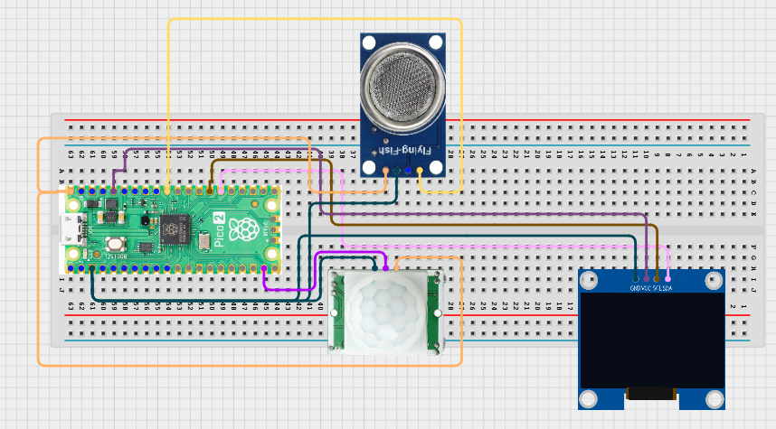

# Project 3.9.47: Smart Sanitation Digital Monitoring
**Advanced Embedded Systems Project Using Raspberry Pi Pico 2 W and MicroPython**


## Overview

The Pico monitors occupancy and odor-proxy readings, then shows a live sanitation status dashboard on an OLED.

Sanitation spaces are harder to maintain when occupancy and odor conditions are checked informally instead of being monitored consistently.

A Pico 2 W prototype with a PIR sensor, MQ-135 gas sensor, and OLED digital monitoring dashboard.

Local digital monitoring, status categories, and practical interpretation of sanitation conditions.


## Required Components


|  |  |  |  |
| --- | --- | --- | --- |
| <br>Raspberry Pi Pico 2 W | <br>Gas sensor | <br>Breadboard | <br>Jumper wires |
| <br>LDR | <br>OLED |  |  |
---

## Circuit Connections


| Component terminal | Connect to | Pico physical pin | Notes |
|---|---|---|---|
| PIR OUT | GPIO 14 | GPIO 14 / physical pin 19 | Occupancy input |
| MQ-135 AO | GPIO 26 ADC0 | GPIO 26 / physical pin 31 | Odor proxy input |
| OLED SDA | GPIO 20 | GPIO 20 / physical pin 26 | I2C0 SDA |
| OLED SCL | GPIO 21 | GPIO 21 / physical pin 27 | I2C0 SCL |
---

## Wiring Diagram



```
  PIR OUT -> GPIO 14
  MQ-135 AO -> GPIO 26
  GPIO 20 -> OLED SDA
  GPIO 21 -> OLED SCL
  Common GND -> PIR, MQ-135, and OLED
```

---

## Step-by-Step Assembly

1. Connect the PIR output to GPIO 14 and allow the PIR to warm up before validation.
2. Connect the MQ-135 analog output to GPIO 26 through a safe ADC path.
3. Connect the OLED to Pico 3.3V, GND, GPIO 20, and GPIO 21.
4. Upload ssd1306.py and confirm the library appears on the Pico before running the dashboard.
5. Warm up the MQ-135 fully before choosing odor thresholds.

---

## Testing Individual Components

Before running the full project, test each subsystem separately. This makes it easier to find wiring, library, or logic problems before full integration.

1. **Hardware setup**: Assemble the Pico, sensor, indicator, and load wiring exactly as shown in the connection table before applying power.
2. **Test the input sensor**: Test the PIR and MQ-135 separately so the occupancy and odor baselines are believable.
3. **Test the output device**: Run an OLED hello-world test before adding the status logic.
4. **Test the decision logic**: Change occupancy and odor conditions one at a time and confirm the status changes logically.
5. **Run the full system**: Run the full monitor and compare the OLED view with the serial readings.
6. **Validate the prototype**: Discuss how false motion or sensor drift could mislead a sanitation dashboard.
7. **Save the project**: Save the validated program on the Pico as main.py and keep a copy on the computer for future edits.

---

## Full Project Code

After completing and checking the circuit connections, open Thonny IDE, copy and paste this code into a new file or upload the project file to the Raspberry Pi Pico 2 W, then run it from Thonny.

```python
from machine import ADC, I2C, Pin
import time

try:
    from ssd1306 import SSD1306_I2C
    HAS_OLED = True
except ImportError:
    HAS_OLED = False

PIR_PIN = 14
GAS_PIN = 26
I2C_SDA_PIN = 20
I2C_SCL_PIN = 21
ODOR_WATCH = 18000
ODOR_SERVICE = 28000

pir = Pin(PIR_PIN, Pin.IN, Pin.PULL_DOWN)
gas = ADC(GAS_PIN)
i2c = I2C(0, sda=Pin(I2C_SDA_PIN), scl=Pin(I2C_SCL_PIN), freq=400000)
if HAS_OLED:
    oled = SSD1306_I2C(128, 64, i2c)

print('Sanitation digital monitoring ready')

while True:
    occupancy = pir.value()
    odor = gas.read_u16()

    if odor >= ODOR_SERVICE:
        status = 'SERVICE'
    elif occupancy == 1 or odor >= ODOR_WATCH:
        status = 'WATCH'
    else:
        status = 'NORMAL'

    print('Occupancy:{} Odor:{} Status:{}'.format(occupancy, odor, status))

    if HAS_OLED:
        oled.fill(0)
        oled.text('Sanitation', 0, 0)
        oled.text('Occ:{}'.format(occupancy), 0, 18)
        oled.text('Odor:{}'.format(odor), 0, 34)
        oled.text(status, 0, 50)
        oled.show()

    time.sleep(2)
```

---

## How the Code Works

| Code Section | What It Does | Why It Matters | What to Modify During Testing |
|--------------|--------------|----------------|------------------------------|
| Sensor setup | Reads occupancy and odor inputs for the local sanitation dashboard | The dashboard becomes useful only when both human activity and environmental condition are visible | Verify the PIR and gas baselines separately before changing the status thresholds |
| Status thresholds | Maps live readings into NORMAL, WATCH, or SERVICE | A clear category is easier for users to interpret than raw readings only | Adjust the odor thresholds after warm-up and baseline logging |
| OLED dashboard | Displays the local monitoring summary on the screen | This provides a practical digital-monitoring interface without overclaiming cloud features | If the display is blank, verify ssd1306.py and the I2C wiring first |

---

## Expected Result

The serial monitor reports the current reading or state clearly.

The hardware output responds when the decision logic changes state.

Subsystem behavior matches the thresholds, timing, or rules described in the document.

### Validation Checks

- **Normal condition test**: confirm the system stays in its safe or idle state under baseline conditions
- **Warning condition test**: move the input close to the chosen threshold and confirm the transition is sensible
- **Critical condition test**: trigger the strongest alert or control state and confirm the output response is correct
- **Calibration test**: compare the sensor or timing against a known reference or repeated trial
- **Limitation test**: deliberately create an awkward or noisy condition and note how the prototype behaves

### Deployment and Limitations

- This prototype works well for classroom demonstrations and local monitoring pilots
- Before deployment, it needs calibration records, protective mounting, and regular validation checks
- Display-only systems still depend on correct sensor placement and trained users

---

## Troubleshooting

| Problem | Possible Cause | Solution |
|---------|----------------|----------|
| Status is always WATCH | The odor threshold is too low or the PIR is too active | Raise the threshold after warm-up and narrow the PIR sensing zone |
| OLED is blank | The display library or I2C wiring is wrong | Confirm ssd1306.py is on the Pico and recheck GPIO 20 and GPIO 21 |
| Odor values drift for a long time | The MQ-135 is still warming up | Allow more warm-up time before comparing readings |
| Occupancy never changes | The PIR has not warmed up or the output wire is wrong | Wait for warm-up and print the PIR value during a simple test |

---
