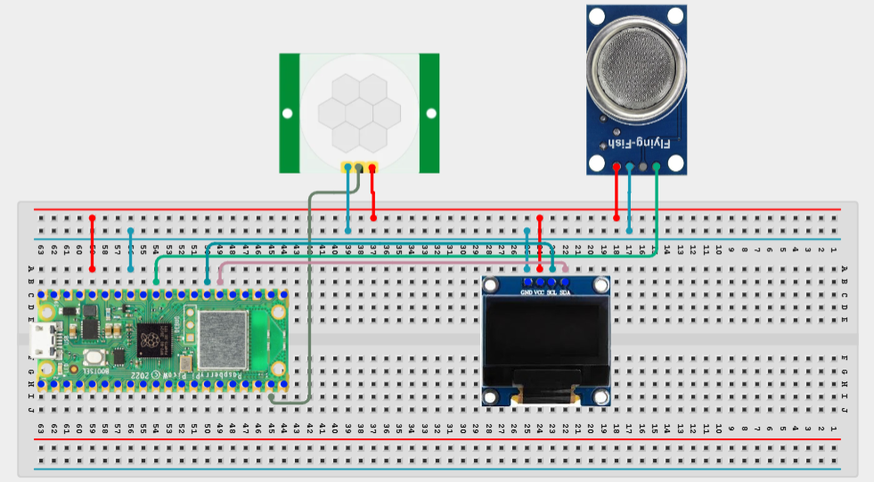

# Project 3.9.49: Smart Sanitation Impact Tracker

**Advanced Embedded Systems Project Using Raspberry Pi Pico 2 W and MicroPython**


## Overview

The Pico tracks visits and odor conditions, then summarizes their combined sanitation impact on an OLED.

Maintenance decisions are harder when teams do not summarize how repeated use and changing conditions add up over time.

A Pico 2 W prototype with a PIR sensor, MQ-135 gas sensor, and OLED impact tracker.

Impact scoring, usage tracking, and explainable sanitation summaries.


---

## Required Components


|  |  |  |  |
| --- | --- | --- | --- |
| <br>Raspberry Pi Pico 2 W | <br>Gas sensor | <br>Breadboard | <br>Jumper wires |
| <br>PIR Sensor | <br>OLED |  |  |
---

## Circuit Connections


| Component terminal | Connect to | Pico physical pin | Notes |
|---|---|---|---|
| PIR OUT | GPIO 14 | GPIO 14 / physical pin 19 | Usage event input |
| MQ-135 AO | GPIO 26 ADC0 | GPIO 26 / physical pin 31 | Odor proxy input |
| OLED SDA | GPIO 20 | GPIO 20 / physical pin 26 | I2C0 SDA |
| OLED SCL | GPIO 21 | GPIO 21 / physical pin 27 | I2C0 SCL |
---

## Wiring Diagram



```
PIR OUT -> GPIO 14
MQ-135 AO -> GPIO 26
GPIO 20 -> OLED SDA
GPIO 21 -> OLED SCL
Common GND -> PIR, MQ-135, and OLED
```

Diagram Placeholder
[Insert wiring diagram or breadboard image here]

---

## Step-by-Step Assembly

1. Connect the PIR output to GPIO 14 and allow warm-up before counting visits.
2. Connect the MQ-135 analog output to GPIO 26 through a safe ADC path.
3. Connect the OLED to Pico 3.3V, GND, GPIO 20, and GPIO 21.
4. Upload ssd1306.py and confirm it appears on the Pico before running the impact tracker.
5. Warm up the MQ-135 and establish a baseline before choosing the odor score thresholds.

---

## Testing Individual Components

Before running the full project, test each subsystem separately. This makes it easier to find wiring, library, or logic problems before full integration.

1. **Hardware setup**: Assemble the Pico, sensor, indicator, and load wiring exactly as shown in the connection table before applying power.
2. **Test the input sensor**: Test visit counting and odor reading separately so the impact score is built from trusted data.
3. **Test the output device**: Run an OLED hello-world test before adding the impact logic.
4. **Test the decision logic**: Increase visits or odor one factor at a time and confirm the impact changes for the right reason.
5. **Run the full system**: Run the full impact tracker and compare the displayed label with the printed visit and odor values.
6. **Validate the prototype**: Discuss whether the score is missing any important sanitation factors beyond usage and odor.
7. **Save the project**: Save the validated program on the Pico as main.py and keep a copy on the computer for future edits.

---

## Full Project Code

After completing and checking the circuit connections, open Thonny IDE, copy and paste this code into a new file or upload the project file to the Raspberry Pi Pico 2 W, then run it from Thonny.

Upload and run this code after the individual tests work correctly.

```python
from machine import ADC, I2C, Pin
import time

try:
    from ssd1306 import SSD1306_I2C
    HAS_OLED = True
except ImportError:
    HAS_OLED = False

PIR_PIN = 14
GAS_PIN = 26
I2C_SDA_PIN = 20
I2C_SCL_PIN = 21

pir = Pin(PIR_PIN, Pin.IN, Pin.PULL_DOWN)
gas = ADC(GAS_PIN)
i2c = I2C(0, sda=Pin(I2C_SDA_PIN), scl=Pin(I2C_SCL_PIN), freq=400000)
if HAS_OLED:
    oled = SSD1306_I2C(128, 64, i2c)

last_pir = 0
visit_count = 0

print('Smart sanitation impact tracker ready')

while True:
    occupancy = pir.value()
    if occupancy == 1 and last_pir == 0:
        visit_count += 1
    last_pir = occupancy

    odor = gas.read_u16()
    score = 0
    if visit_count >= 3:
        score += 1
    if visit_count >= 7:
        score += 1
    if odor >= 18000:
        score += 2
    if odor >= 26000:
        score += 2

    if score >= 5:
        impact = 'HIGH IMPACT'
    elif score >= 2:
        impact = 'MEDIUM'
    else:
        impact = 'LOW'

    print('Visits:{} Odor:{} Score:{} Impact:{}'.format(visit_count, odor, score, impact))

    if HAS_OLED:
        oled.fill(0)
        oled.text('San Impact', 0, 0)
        oled.text('V:{} O:{}'.format(visit_count, odor), 0, 18)
        oled.text('Score:{}'.format(score), 0, 34)
        oled.text(impact[:16], 0, 50)
        oled.show()

    time.sleep(2)
```

---

## How the Code Works

| Code Section | What It Does | Why It Matters | What to Modify During Testing |
|--------------|--------------|----------------|------------------------------|
| Visit contribution | Adds impact points as traffic increases. | Usage level is part of what drives sanitation maintenance need. | Compare the count with manual observation before trusting the traffic component. |
| Odor contribution | Adds more impact points when odor rises. | Odor trend often reflects condition changes that matter for maintenance. | Tune the odor thresholds only after warm-up and repeated baseline checks. |
| Impact summary | Combines the total score into LOW, MEDIUM, or HIGH IMPACT. | The summary helps turn raw data into a maintenance-planning discussion. | Adjust the summary thresholds after repeated real test conditions. |

---

## Expected Result

The serial monitor reports the current reading or state clearly.

The hardware output responds when the decision logic changes state.

Subsystem behavior matches the thresholds, timing, or rules described in the document.

### Validation Checks

- **Normal condition test**: confirm the system stays in its safe or idle state under baseline conditions.
- **Warning condition test**: move the input close to the chosen threshold and confirm the transition is sensible.
- **Critical condition test**: trigger the strongest alert or control state and confirm the output response is correct.
- **Calibration test**: compare the sensor or timing against a known reference or repeated trial.
- **Limitation test**: deliberately create an awkward or noisy condition and note how the prototype behaves.

### Deployment and Limitations

- This prototype works well for classroom demonstrations and local monitoring pilots.
- Before deployment, it needs calibration records, protective mounting, and regular validation checks.
- Display-only systems still depend on correct sensor placement and trained users.

---

## Troubleshooting

| Problem | Possible Cause | Solution |
|---------|----------------|----------|
| The impact is always high | The odor thresholds are too low or the gas sensor is still warming up | Allow more warm-up time and raise the odor thresholds after observing the baseline. |
| Visit count rises too fast | The PIR retriggers too often or placement is poor | Reposition the PIR and compare the count with manual observation. |
| Impact never changes | The thresholds are too strict or the conditions are too stable | Create clearer test conditions and adjust one threshold at a time. |
| OLED is blank | The display library or I2C wiring is wrong | Confirm ssd1306.py is present and verify GPIO 20 and GPIO 21. |

---
