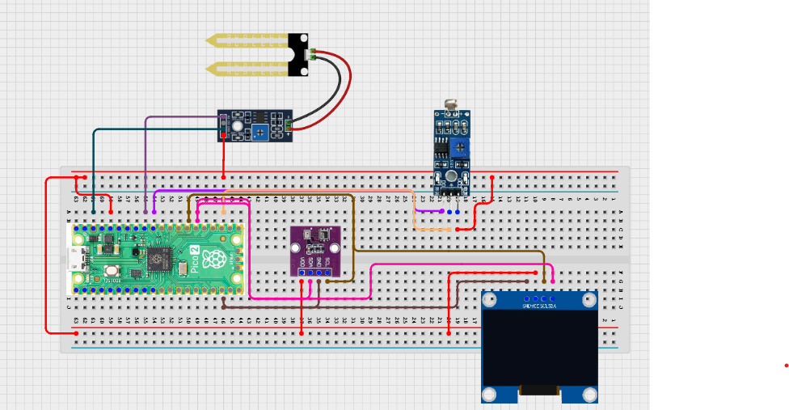

# Project 3.9.5: Smart Agriculture Digital Twin

**Advanced Embedded Systems Project Using Raspberry Pi Pico 2 W and MicroPython**


## Overview

The Pico builds a live digital-twin-style state model from soil, light, temperature, and humidity readings.

Field decisions are clearer when raw sensor values are translated into a live state model that represents crop stress and water need.

A Pico 2 W prototype with a soil moisture sensor, LDR, DHT22, and OLED used as a local agriculture digital-twin-style display.

Derived state variables, honest digital-twin language, and local model validation without overclaiming a full platform.


## Required Components


|  |  |  |  |
| --- | --- | --- | --- |
| <br>Raspberry Pi Pico 2 W | <br>Soil sensor | <br>Breadboard | <br>Jumper wires |
  | <br>BME280 | <br>LDR |
| <br>OLED display |  |  |  |
---

## Circuit Connections


| Component terminal | Connect to | Pico physical pin | Notes |
|---|---|---|---|
| Soil sensor AO | GPIO 26 ADC0 | GPIO 26 / physical pin 31 | Analog soil input |
| LDR divider midpoint | GPIO 27 ADC1 | GPIO 27 / physical pin 32 | Ambient light input |
| DHT22 DATA | GPIO 15 | GPIO 15 / physical pin 20 | Climate input |
| OLED SDA | GPIO 20 | GPIO 20 / physical pin 26 | I2C0 SDA |
| OLED SCL | GPIO 21 | GPIO 21 / physical pin 27 | I2C0 SCL |
---

## Wiring Diagram



```
  Soil sensor AO -> GPIO 26
  LDR divider midpoint -> GPIO 27
  DHT22 DATA -> GPIO 15
  GPIO 20 -> OLED SDA
  GPIO 21 -> OLED SCL
  Common GND -> all sensors and OLED
```

---

## Step-by-Step Assembly

1. Connect the capacitive soil sensor analog output to GPIO 26.
2. Build the LDR divider and connect its midpoint to GPIO 27.
3. Connect the DHT22 to Pico 3.3V, GND, and GPIO 15.
4. Connect the OLED to Pico 3.3V, GND, GPIO 20, and GPIO 21.
5. Upload ssd1306.py and confirm the library file before running the local twin display.

---

## Testing Individual Components

Before running the full project, test each subsystem separately. This makes it easier to find wiring, library, or logic problems before full integration.

1. **Hardware setup**: Assemble the Pico, sensor, indicator, and load wiring exactly as shown in the connection table before applying power.
2. **Test the input sensor**: Read all sensors separately so each raw input has a believable baseline before building the derived state.
3. **Test the output device**: Run an OLED test so the display works before you add the model state logic.
4. **Test the decision logic**: Change one environmental factor at a time and confirm the field-state label changes for the correct reason.
5. **Run the full system**: Run the full twin and compare the model summary with the real plot or test setup.
6. **Validate the prototype**: List the conditions where the digital twin looks believable and the conditions where it becomes too simplified.
7. **Save the project**: Save the validated program on the Pico as main.py and keep a copy on the computer for future edits.

---

## Full Project Code

After completing and checking the circuit connections, open Thonny IDE, copy and paste this code into a new file or upload the project file to the Raspberry Pi Pico 2 W, then run it from Thonny.

```python
from machine import ADC, I2C, Pin
import dht
import time

try:
    from ssd1306 import SSD1306_I2C
    HAS_OLED = True
except ImportError:
    HAS_OLED = False

SOIL_PIN = 26
LIGHT_PIN = 27
DHT_PIN = 15
I2C_SDA_PIN = 20
I2C_SCL_PIN = 21
SOIL_DRY_RAW = 48000
SOIL_WET_RAW = 18000
LIGHT_DARK_RAW = 4000
LIGHT_BRIGHT_RAW = 52000

soil = ADC(SOIL_PIN)
light = ADC(LIGHT_PIN)
climate = dht.DHT22(Pin(DHT_PIN))
i2c = I2C(0, sda=Pin(I2C_SDA_PIN), scl=Pin(I2C_SCL_PIN), freq=400000)
if HAS_OLED:
    oled = SSD1306_I2C(128, 64, i2c)


def clamp(value, low, high):
    return max(low, min(high, value))


def percent_from_range(raw, low_raw, high_raw):
    span = high_raw - low_raw
    if span == 0:
        return 0
    pct = int((raw - low_raw) * 100 / span)
    return clamp(pct, 0, 100)


print('Agriculture digital twin prototype ready')

while True:
    soil_raw = soil.read_u16()
    light_raw = light.read_u16()
    try:
        climate.measure()
        temperature = climate.temperature()
        humidity = climate.humidity()
    except OSError:
        temperature = 0
        humidity = 0

    dry_pct = percent_from_range(soil_raw, SOIL_WET_RAW, SOIL_DRY_RAW)
    light_pct = percent_from_range(light_raw, LIGHT_DARK_RAW, LIGHT_BRIGHT_RAW)

    if dry_pct >= 75:
        field_state = 'IRRIGATION'
    elif temperature >= 33 or humidity >= 85:
        field_state = 'HEAT STRESS'
    elif dry_pct >= 50:
        field_state = 'DRYING'
    else:
        field_state = 'STABLE'

    twin_state = {
        'dry_pct': dry_pct,
        'light_pct': light_pct,
        'temp_c': temperature,
        'humidity_pct': humidity,
        'field_state': field_state,
    }

    print('Twin:', twin_state)

    if HAS_OLED:
        oled.fill(0)
        oled.text('Field Twin', 0, 0)
        oled.text('Dry:{}%'.format(dry_pct), 0, 14)
        oled.text('Light:{}%'.format(light_pct), 0, 28)
        oled.text('T:{} H:{}%'.format(temperature, humidity), 0, 42)
        oled.text(field_state[:16], 0, 56)
        oled.show()

    time.sleep(2)
```

---

## How the Code Works

| Code Section | What It Does | Why It Matters | What to Modify During Testing |
|--------------|--------------|----------------|------------------------------|
| Sensor inputs | Reads soil, light, and climate data for the live model | A digital twin snapshot is only useful if its inputs are trustworthy | Test each sensor individually before changing the model logic |
| Percentage mapping | Converts raw soil and light values into easier-to-read percentages | Derived values help the model represent state instead of only raw electronics output | Calibrate the raw reference values against your real setup |
| Field-state logic | Maps the derived values into STABLE, DRYING, HEAT STRESS, or IRRIGATION | This is the core of the local digital-twin-style model | Adjust the state boundaries after collecting baseline measurements |
| Twin dashboard | Shows the current model summary on the OLED and in the Shell | A visible model makes it easier to compare the digital state with the real field condition | If the OLED fails, confirm the display path before changing the model |

---

## Expected Result

The serial monitor prints a dictionary-style twin state with derived field values.

The OLED shows dryness, light, climate, and the current field-state label.

Changing the real environment changes the model state in a way that can be checked and discussed.

### Validation Checks

- **Normal condition test**: use balanced soil moisture and room climate so the twin reports STABLE
- **Warning condition test**: let the soil dry slightly and confirm the state changes to DRYING
- **Critical condition test**: create a very dry condition and confirm the model reports IRRIGATION
- **Sensor reading validation**: compare raw and percentage values after brightening the light sensor and wetting the soil sensor
- **Calibration test**: record dry and wet soil values plus dark and bright light values before changing the reference constants
- **Limitation test**: explain what real farm factors are missing from this simplified local twin

### Deployment and Limitations

- This prototype is useful for classroom modeling and local farm-monitoring demonstrations
- Before deployment, the sensor set, model scope, enclosure, and logging strategy need expansion
- A fuller digital twin would also require networking, historical data, model tuning, and user workflows for interpreting the state

---

## Troubleshooting

| Problem | Possible Cause | Solution |
|---------|----------------|----------|
| The field state never changes | The thresholds are too wide or one sensor is stuck | Print each derived value and confirm that at least one changes during testing |
| Light percentage is backwards | The light calibration order is wrong | Swap the dark and bright reference points if needed |
| OLED is blank | The display library or I2C wiring is wrong | Verify ssd1306.py and the GPIO 20 and GPIO 21 connections |
| Twin values look unrealistic | The sensors are not calibrated for the current setup | Collect new dry, wet, dark, and bright baselines |

---
