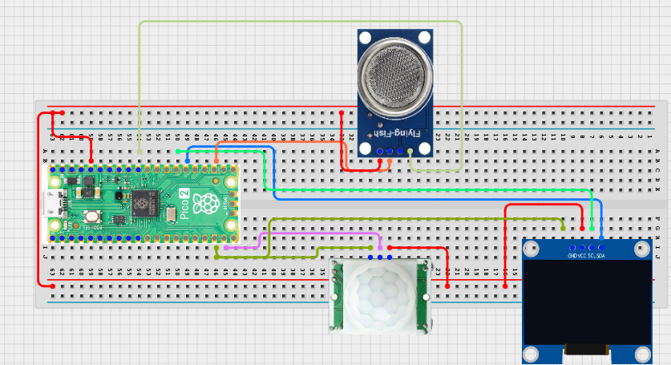

# Project 3.9.52: Smart Sanitation Monitoring Ai

**Advanced Embedded Systems Project Using Raspberry Pi Pico 2 W and MicroPython**


## Overview

The Pico uses rule-based AI-style decision scoring to rate sanitation conditions from occupancy and odor data.

Teams struggle to prioritize cleaning when a system only shows isolated readings instead of a combined risk score.

A Pico 2 W prototype with a PIR sensor, MQ-135 gas sensor, and OLED decision dashboard.

AI-style scoring, explainable status labels, and honest framing of threshold-based intelligence.


## Required Components


|  |  |  |  |
| --- | --- | --- | --- |
| <br>Raspberry Pi Pico 2 W | <br>Gas sensor | <br>Breadboard | <br>Jumper wires |
| <br>LDR | <br>OLED |  |  |
---

## Circuit Connections


| Component terminal | Connect to | Pico physical pin | Notes |
|---|---|---|---|
| PIR OUT | GPIO 14 | GPIO 14 / physical pin 19 | Occupancy input |
| MQ-135 AO | GPIO 26 ADC0 | GPIO 26 / physical pin 31 | Odor proxy input |
| OLED SDA | GPIO 20 | GPIO 20 / physical pin 26 | I2C0 SDA |
| OLED SCL | GPIO 21 | GPIO 21 / physical pin 27 | I2C0 SCL |
---

## Wiring Diagram



```
PIR OUT -> GPIO 14
MQ-135 AO -> GPIO 26
GPIO 20 -> OLED SDA
GPIO 21 -> OLED SCL
Common GND -> PIR, MQ-135, and OLED
```

Diagram Placeholder
[Insert wiring diagram or breadboard image here]

---

## Step-by-Step Assembly

1. Connect the PIR output to GPIO 14 and allow warm-up time before scoring occupancy.
2. Connect the MQ-135 analog output to GPIO 26 through a safe ADC path.
3. Connect the OLED to Pico 3.3V, GND, GPIO 20, and GPIO 21.
4. Upload ssd1306.py and confirm the file appears in os.listdir() before running the dashboard.
5. Warm up the MQ-135 and observe a room baseline before finalizing the score thresholds.

---

## Testing Individual Components

Before running the full project, test each subsystem separately. This makes it easier to find wiring, library, or logic problems before full integration.

1. **Hardware setup**: Assemble the Pico, sensor, indicator, and load wiring exactly as shown in the connection table before applying power.
2. **Test the input sensor**: Test occupancy and odor inputs separately so you know what score contributions each should make.
3. **Test the output device**: Run an OLED hello-world test before adding the AI-style scoring logic.
4. **Test the decision logic**: Change occupancy and odor one at a time and confirm the score changes for understandable reasons.
5. **Run the full system**: Run the full system and compare the OLED score with the printed raw values and final priority label.
6. **Validate the prototype**: Ask whether a human cleaner would agree with the score and adjust weightings only after repeated trials.
7. **Save the project**: Save the validated program on the Pico as main.py and keep a copy on the computer for future edits.

---

## Full Project Code

After completing and checking the circuit connections, open Thonny IDE, copy and paste this code into a new file or upload the project file to the Raspberry Pi Pico 2 W, then run it from Thonny.

Upload and run this code after the individual tests work correctly.

```python
from machine import ADC, I2C, Pin
import time

try:
    from ssd1306 import SSD1306_I2C
    HAS_OLED = True
except ImportError:
    HAS_OLED = False

PIR_PIN = 14
GAS_PIN = 26
I2C_SDA_PIN = 20
I2C_SCL_PIN = 21
ODOR_WATCH = 18000
ODOR_HIGH = 28000

pir = Pin(PIR_PIN, Pin.IN, Pin.PULL_DOWN)
gas = ADC(GAS_PIN)
i2c = I2C(0, sda=Pin(I2C_SDA_PIN), scl=Pin(I2C_SCL_PIN), freq=400000)
if HAS_OLED:
    oled = SSD1306_I2C(128, 64, i2c)

print('Smart sanitation monitoring AI ready')

while True:
    occupancy = pir.value()
    odor = gas.read_u16()

    score = 0
    if occupancy == 1:
        score += 2
    if odor >= ODOR_WATCH:
        score += 2
    if odor >= ODOR_HIGH:
        score += 2

    if score >= 5:
        label = 'HIGH PRIORITY'
    elif score >= 2:
        label = 'WATCH'
    else:
        label = 'LOW PRIORITY'

    print('Occ:{} Odor:{} Score:{} Label:{}'.format(occupancy, odor, score, label))

    if HAS_OLED:
        oled.fill(0)
        oled.text('Sanitation AI', 0, 0)
        oled.text('O:{} G:{}'.format(occupancy, odor), 0, 18)
        oled.text('Score:{}'.format(score), 0, 34)
        oled.text(label[:16], 0, 50)
        oled.show()

    time.sleep(2)
```

---

## How the Code Works

| Code Section | What It Does | Why It Matters | What to Modify During Testing |
|--------------|--------------|----------------|------------------------------|
| Score rules | Adds points for occupancy and odor conditions. | These points are the explainable AI-style logic behind the project. | Change score weights only after you compare them with real observations. |
| Label mapping | Converts the score into LOW PRIORITY, WATCH, or HIGH PRIORITY. | Simple labels help users act on the result instead of reading raw values only. | Adjust label boundaries if the score feels too aggressive or too weak. |
| OLED dashboard | Shows the raw inputs, score, and final label on one screen. | Keeping the score visible makes the decision easier to audit and explain. | Verify ssd1306.py and the I2C wiring if the display is blank. |

---

## Expected Result

The OLED and serial monitor show occupancy, odor, score, and a sanitation-priority label.

Occupancy or elevated odor raises the score, and a stronger odor level raises it again.

The project clearly behaves like rule-based AI-style scoring rather than trained machine learning.

### Validation Checks

- **Normal condition test**: leave the room calm and confirm the score stays low after warm-up.
- **Warning condition test**: create occupancy or a moderate odor reading and confirm the label changes to WATCH.
- **Critical condition test**: create occupancy with a high odor reading and confirm the label becomes HIGH PRIORITY.
- **Calibration test**: record odor baseline values before choosing the warning and high thresholds.
- **Interpretation test**: compare the score with a human judgment and note any mismatch.

### Deployment and Limitations

- This prototype works well for classroom demonstrations and local monitoring pilots.
- Before deployment, it needs calibration records, protective mounting, and regular validation checks.
- Display-only systems still depend on correct sensor placement and trained users.

---

## Troubleshooting

| Problem | Possible Cause | Solution |
|---------|----------------|----------|
| The score is always high | The odor thresholds are too low or the gas sensor is still warming up | Allow full warm-up and increase the score thresholds after observing a stable baseline. |
| Occupancy never affects the score | The PIR output is not reaching GPIO 14 | Print the PIR value directly in a simple test and recheck the wiring. |
| OLED is blank | The library or I2C wiring is wrong | Confirm ssd1306.py is present and verify GPIO 20 and GPIO 21. |
| The score feels unrealistic | The rule weights do not match the room behavior | Review each score contribution and adjust the weights after repeated tests. |

---

## Challenge Extensions

- Add local data logging for later comparison.
- Add calibration mode with saved reference values.
- Add Wi-Fi upload later for a dashboard extension.
- Design an enclosure or mounting bracket for field use.

---

## Reflection Questions

1. What could make the displayed reading misleading even if the circuit is correct?
2. How would you calibrate this system before field use?
3. What extra data would make the display more useful?
4. What would need to improve before using this outside the classroom?

---
