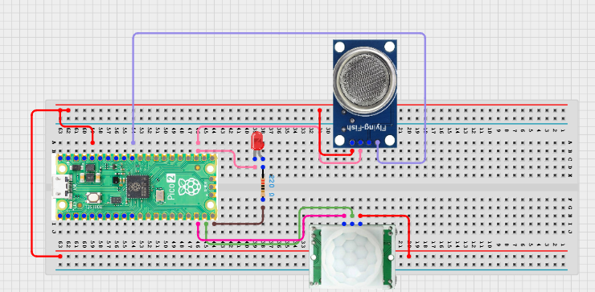

# Project 3.9.53: Smart Sanitation Monitoring Cloud

**Advanced Embedded Systems Project Using Raspberry Pi Pico 2 W and MicroPython**


## Overview

The Pico logs sanitation usage and odor-proxy readings locally, then optionally uploads the same records to a local network endpoint.

Sanitation monitoring is less useful when records are not stored, verified, or shared beyond one live serial screen.

A Pico 2 W prototype with a PIR sensor, MQ-135 gas sensor, status LED, local file logging, and optional Wi-Fi upload.

Structured records, network fallback, and honest cloud-ready wording for a local sanitation node.


## Required Components


|  |  |  |  |
| --- | --- | --- | --- |
| <br>Raspberry Pi Pico 2 W | <br>Gas sensor | <br>Breadboard | <br>Jumper wires |
| <br>Motion sensor | <br>LED | <br>Resistor |  |
---

## Circuit Connections


| Component terminal | Connect to | Pico physical pin | Notes |
|---|---|---|---|
| PIR OUT | GPIO 14 | GPIO 14 / physical pin 19 | Usage input |
| MQ-135 AO | GPIO 26 ADC0 | GPIO 26 / physical pin 31 | Odor proxy input |
| LED anode | 220 ohm resistor to GPIO 15 | GPIO 15 / physical pin 20 | Record/upload status LED |
---

## Wiring Diagram



```
  PIR OUT -> GPIO 14
  MQ-135 AO -> GPIO 26
  GPIO 15 -> 220 ohm resistor -> LED anode
  Wi-Fi uses the Pico 2 W radio and needs no extra wiring
```

---

## Step-by-Step Assembly

1. Connect the PIR output to GPIO 14 and allow the sensor to warm up before testing.
2. Connect the MQ-135 analog output to GPIO 26 through a safe 3.3V ADC path.
3. Connect the LED to GPIO 15 through a 220 ohm resistor and connect the LED cathode to GND.
4. Enter your 2.4 GHz Wi-Fi credentials and local server settings only after local logging works correctly.
5. Warm up the gas sensor fully before deciding on an odor alert threshold.

---

## Testing Individual Components

Before running the full project, test each subsystem separately. This makes it easier to find wiring, library, or logic problems before full integration.

1. **Hardware setup**: Assemble the Pico, sensor, indicator, and load wiring exactly as shown in the connection table before applying power.
2. **Test the input sensor**: Test the PIR state and gas reading separately so the local inputs are believable before you write records.
3. **Test the output device**: Blink the LED from a short test script so the local feedback path is confirmed.
4. **Test the decision logic**: Check that one loop produces one local record and that the uploaded copy matches the local record when the server is available.
5. **Run the full system**: Run the full monitor and compare local-only versus uploaded behavior under normal and failed-network conditions.
6. **Validate the prototype**: Review what information in the sanitation record would require privacy or training controls in real use.
7. **Save the project**: Save the validated program on the Pico as main.py and keep a copy on the computer for future edits.

---

## Full Project Code

After completing and checking the circuit connections, open Thonny IDE, copy and paste this code into a new file or upload the project file to the Raspberry Pi Pico 2 W, then run it from Thonny.

```python
import network
import socket
import time
import ujson as json
from machine import ADC, Pin

PIR_PIN = 14
GAS_PIN = 26
LED_PIN = 15
LOG_FILE = 'sanitation_294.jsonl'
UPLOAD_ENABLED = False
UPLOAD_INTERVAL_S = 60
WIFI_SSID = 'YOUR_WIFI'
WIFI_PASSWORD = 'YOUR_PASSWORD'
SERVER_HOST = '192.168.1.50'
SERVER_PORT = 8000
SERVER_PATH = '/sanitation'

pir = Pin(PIR_PIN, Pin.IN, Pin.PULL_DOWN)
gas = ADC(GAS_PIN)
led = Pin(LED_PIN, Pin.OUT)


def blink(times, duration_ms=120):
    for _ in range(times):
        led.on()
        time.sleep_ms(duration_ms)
        led.off()
        time.sleep_ms(duration_ms)


def connect_wifi(timeout_s=15):
    wlan = network.WLAN(network.STA_IF)
    if wlan.isconnected():
        return wlan
    wlan.active(True)
    wlan.connect(WIFI_SSID, WIFI_PASSWORD)
    for _ in range(timeout_s):
        if wlan.isconnected():
            return wlan
        time.sleep(1)
    return None


def append_local(record):
    try:
        with open(LOG_FILE, 'a') as handle:
            handle.write(json.dumps(record) + '\n')
    except OSError:
        print('Could not write local record')


def upload_record(record):
    if not UPLOAD_ENABLED:
        return False
    wlan = connect_wifi()
    if wlan is None:
        return False
    address = socket.getaddrinfo(SERVER_HOST, SERVER_PORT)[0][-1]
    body = json.dumps(record)
    request = (
        'POST {} HTTP/1.1\r\n'
        'Host: {}\r\n'
        'Content-Type: application/json\r\n'
        'Content-Length: {}\r\n'
        'Connection: close\r\n\r\n'
        '{}'
    ).format(SERVER_PATH, SERVER_HOST, len(body), body)
    sock = socket.socket()
    try:
        sock.connect(address)
        sock.send(request.encode())
        sock.recv(128)
        return True
    finally:
        sock.close()


print('Sanitation monitoring cloud prototype ready')

while True:
    gas_value = gas.read_u16()
    record = {
        'device': 'sanitation_294',
        'uptime_s': time.ticks_ms() // 1000,
        'usage_active': pir.value(),
        'odor_raw': gas_value,
        'odor_flag': gas_value >= 22000,
    }

    append_local(record)
    uploaded = upload_record(record)
    print(record, 'uploaded' if uploaded else 'local_only')
    blink(1 if uploaded else 3)
    time.sleep(UPLOAD_INTERVAL_S)
```

---

## How the Code Works

| Code Section | What It Does | Why It Matters | What to Modify During Testing |
|--------------|--------------|----------------|------------------------------|
| Record creation | Builds one structured sanitation record from the PIR and gas inputs | A cloud-ready system starts with a trustworthy local record structure | Add fields only when you know how they will be validated |
| append_local | Writes each record to a local JSON-lines file on the Pico | Local logging provides a fallback when networking fails | Check the file contents before assuming upload issues are the real problem |
| upload_record | Sends the same record to a local HTTP endpoint when upload is enabled | This demonstrates cloud-ready behavior without overclaiming a real platform | Change the host, port, and path to match your local test server |
| LED feedback | Shows whether the record uploaded or stayed local only | Visible feedback helps students validate the network subsystem quickly | Keep the blink pattern consistent if you extend the project later |

---

## Expected Result

The serial monitor prints one structured sanitation record per interval.

The Pico stores records locally even if Wi-Fi or the server is unavailable.

When upload is enabled and working, the record can be compared with the server copy for validation.

### Validation Checks

- **Normal condition test**: confirm that one record is created and stored locally during a stable test interval
- **Usage validation**: move through the PIR detection area and confirm the usage_active field changes appropriately
- **Odor validation**: warm up the MQ-135 and confirm the odor_raw value changes relative to the test condition
- **Communication validation**: enable upload to a local server and compare the uploaded record with the local file entry
- **Fallback test**: disable Wi-Fi or the server and confirm the record still remains available locally
- **Limitation test**: explain why this build is a cloud-ready prototype rather than a real cloud monitoring platform

### Deployment and Limitations

- This prototype is useful for classroom monitoring studies and local network pilots
- Before deployment, the privacy plan, calibration routine, and endpoint reliability need improvement
- A real cloud system would also need authentication, retention policy, maintenance workflows, and user training

---

## Troubleshooting

| Problem | Possible Cause | Solution |
|---------|----------------|----------|
| No local records appear | The file write failed or the loop is not running | Test a simple file write first and confirm the Pico file system is writable |
| Uploads never succeed | UPLOAD_ENABLED is false or the endpoint settings are wrong | Check the Wi-Fi credentials, server host, port, and path |
| The odor flag is always true | The threshold is too low for the room baseline | Record the warmed-up baseline and raise the odor threshold |
| The PIR state looks wrong | The sensor has not warmed up or the input wiring is incorrect | Wait for warm-up and print the PIR value directly during a simple test |

---
