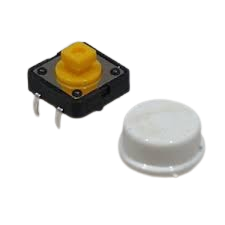
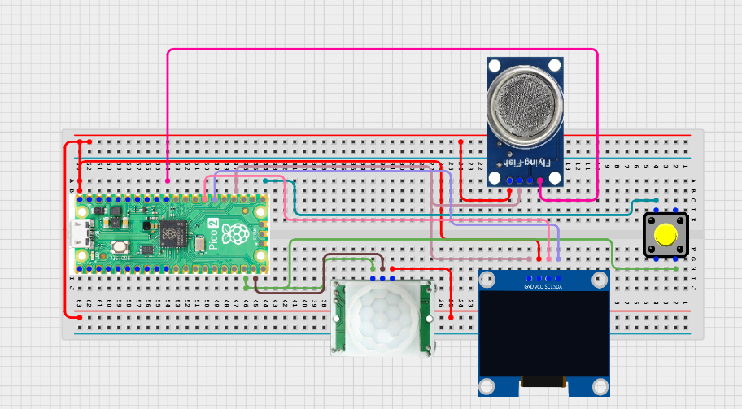

# Project 3.9.54: Smart Sanitation Operations System

**Advanced Embedded Systems Project Using Raspberry Pi Pico 2 W and MicroPython**


## Overview

The Pico combines occupancy, odor trend, and a service reset button to show whether a sanitation space is available, in use, or due for service.

Sanitation maintenance becomes reactive when teams only check a room occasionally instead of tracking both usage and condition together.

A Pico 2 W prototype with a PIR sensor, MQ-135 gas sensor, push button, and OLED operations dashboard.

Operational status tracking, service acknowledgement, and practical interpretation of sanitation conditions.

---

## Required Components


|  |  |  |  |
| --- | --- | --- | --- |
| <br>Raspberry Pi Pico 2 W | <br>Gas sensor | <br>Breadboard | <br>Jumper wires |
| <br>LDR | <br>OLED | <br>Push button |  |
---

## Circuit Connections


| Component terminal | Connect to | Pico physical pin | Notes |
|---|---|---|---|
| PIR OUT | GPIO 14 | GPIO 14 / physical pin 19 | Occupancy input |
| MQ-135 AO | GPIO 26 ADC0 | GPIO 26 / physical pin 31 | Odor proxy input |
| Button leg 1 | GPIO 16 | GPIO 16 / physical pin 21 | Service reset input |
| Button leg 2 | 3.3V output | Physical pin 36 | High when pressed |
| OLED SDA | GPIO 20 | GPIO 20 / physical pin 26 | I2C0 SDA |
| OLED SCL | GPIO 21 | GPIO 21 / physical pin 27 | I2C0 SCL |
---

## Wiring Diagram



```
PIR OUT -> GPIO 14
MQ-135 AO -> GPIO 26
Button -> GPIO 16 and 3.3V
GPIO 20 -> OLED SDA
GPIO 21 -> OLED SCL
Common GND -> PIR, MQ-135, and OLED
```

Diagram Placeholder
[Insert wiring diagram or breadboard image here]

---

## Step-by-Step Assembly

1. Connect the PIR output to GPIO 14 and allow the sensor to warm up before validation.
2. Connect the MQ-135 analog output to GPIO 26 through a safe ADC path.
3. Wire the push button between GPIO 16 and 3.3V so the input goes high when pressed.
4. Connect the OLED to Pico 3.3V, GND, GPIO 20, and GPIO 21.
5. Upload ssd1306.py and confirm it appears in os.listdir() before running the full dashboard.

---

## Testing Individual Components

Before running the full project, test each subsystem separately. This makes it easier to find wiring, library, or logic problems before full integration.

1. **Hardware setup**: Assemble the Pico, sensor, indicator, and load wiring exactly as shown in the connection table before applying power.
2. **Test the input sensor**: Test occupancy, odor, and button inputs separately so you understand each baseline before combining them.
3. **Test the output device**: Run an OLED hello-world test before adding the operations logic.
4. **Test the decision logic**: Confirm that elevated odor can latch the service state and that the button clears it only when pressed intentionally.
5. **Run the full system**: Run the full operations system and compare the OLED labels with the raw serial readings.
6. **Validate the prototype**: Discuss whether a latched service state would help or frustrate real maintenance staff in a busy location.
7. **Save the project**: Save the validated program on the Pico as main.py and keep a copy on the computer for future edits.

---

## Full Project Code

After completing and checking the circuit connections, open Thonny IDE, copy and paste this code into a new file or upload the project file to the Raspberry Pi Pico 2 W, then run it from Thonny.

Upload and run this code after the individual tests work correctly.

```python
from machine import ADC, I2C, Pin
import time

try:
    from ssd1306 import SSD1306_I2C
    HAS_OLED = True
except ImportError:
    HAS_OLED = False

PIR_PIN = 14
GAS_PIN = 26
BUTTON_PIN = 16
I2C_SDA_PIN = 20
I2C_SCL_PIN = 21
ODOR_WATCH = 18000
ODOR_SERVICE = 28000

pir = Pin(PIR_PIN, Pin.IN, Pin.PULL_DOWN)
gas = ADC(GAS_PIN)
button = Pin(BUTTON_PIN, Pin.IN, Pin.PULL_DOWN)
i2c = I2C(0, sda=Pin(I2C_SDA_PIN), scl=Pin(I2C_SCL_PIN), freq=400000)
if HAS_OLED:
    oled = SSD1306_I2C(128, 64, i2c)

service_latched = False
last_button = 0
print('Smart sanitation operations system ready')

while True:
    occupancy = pir.value()
    odor = gas.read_u16()
    button_now = button.value()

    if odor >= ODOR_SERVICE:
        service_latched = True

    if button_now == 1 and last_button == 0:
        service_latched = False
        print('Service acknowledged and state cleared')
    last_button = button_now

    if service_latched:
        status = 'SERVICE DUE'
    elif occupancy == 1:
        status = 'IN USE'
    elif odor >= ODOR_WATCH:
        status = 'WATCH'
    else:
        status = 'AVAILABLE'

    print('Occ:{} Odor:{} Service:{} Status:{}'.format(occupancy, odor, service_latched, status))

    if HAS_OLED:
        oled.fill(0)
        oled.text('Sanitation Ops', 0, 0)
        oled.text('Occ:{}'.format(occupancy), 0, 18)
        oled.text('Odor:{}'.format(odor), 0, 32)
        oled.text(status[:16], 0, 50)
        oled.show()

    time.sleep(1)
```

---

## How the Code Works

| Code Section | What It Does | Why It Matters | What to Modify During Testing |
|--------------|--------------|----------------|------------------------------|
| Latched service state | Keeps the room in SERVICE DUE until the user deliberately clears it. | Operations dashboards often need a remembered action state rather than a momentary reading only. | Test whether your chosen odor threshold makes the latch too sensitive or too weak. |
| Button edge detection | Clears the service latch only when the button changes from not pressed to pressed. | Edge logic prevents repeated clearing while the button is held. | If the reset feels unreliable, print the button state and check the wiring. |
| OLED dashboard | Shows occupancy, odor, and the current operations label on one local screen. | The display makes the maintenance workflow visible and easy to explain. | Verify ssd1306.py and the I2C pins first if the screen stays blank. |

---

## Expected Result

The OLED and serial monitor show AVAILABLE, IN USE, WATCH, or SERVICE DUE based on room condition.

A high odor reading latches the SERVICE DUE state until the push button is pressed.

The room can be occupied without triggering service when odor remains below the chosen service threshold.

### Validation Checks

- **Normal condition test**: leave the room still and confirm the dashboard reports AVAILABLE after warm-up.
- **Usage test**: walk through the PIR zone and confirm the dashboard changes to IN USE without latching service.
- **Service condition test**: create an elevated odor reading and confirm SERVICE DUE remains active until the button is pressed.
- **Button validation test**: press the reset button once and confirm the latched state clears cleanly.
- **False trigger test**: observe whether room drafts or warm objects create occupancy signals when no user is present.

### Deployment and Limitations

- This prototype works well for classroom demonstrations and local monitoring pilots.
- Before deployment, it needs calibration records, protective mounting, and regular validation checks.
- Display-only systems still depend on correct sensor placement and trained users.

---

## Troubleshooting

| Problem | Possible Cause | Solution |
|---------|----------------|----------|
| The dashboard never leaves service due | The service threshold is too low or the gas sensor is still warming up | Allow full warm-up and raise the service threshold after measuring the room baseline. |
| The button does not clear the state | The button wiring is wrong or the input never goes high | Print the button value in a simple test and verify it changes when pressed. |
| Occupancy is always detected | The PIR is facing a heat source or has not stabilized | Reposition the PIR and allow more warm-up time before validation. |
| OLED is blank | The display library or I2C wiring is wrong | Confirm ssd1306.py is on the Pico and recheck GPIO 20 and GPIO 21. |

---
