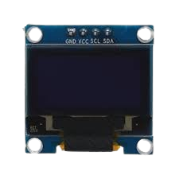
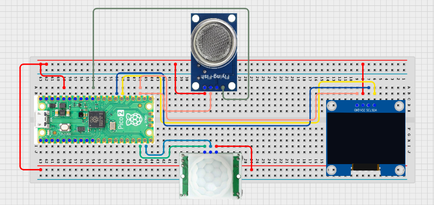

# Project 3.9.55: Smart Sanitation Performance Analytics

**Advanced Embedded Systems Project Using Raspberry Pi Pico 2 W and MicroPython**


## Overview

The Pico tracks sanitation visits, average odor level, and a service-performance score on a local analytics dashboard.

Maintenance performance is hard to judge when usage and odor are measured separately and not summarized into a simple service indicator.

A Pico 2 W prototype with a PIR sensor, MQ-135 gas sensor, and OLED analytics dashboard.

Edge-based visit counting, average odor tracking, and local performance scoring.


## Required Components


|  |  |  |  |
| --- | --- | --- | --- |
| <br>Raspberry Pi Pico 2 W | <br>Gas sensor | <br>Breadboard | <br>Jumper wires |
| <br>LDR | <br>OLED |  |  |
---

## Circuit Connections


| Component terminal | Connect to | Pico physical pin | Notes |
|---|---|---|---|
| PIR OUT | GPIO 14 | GPIO 14 / physical pin 19 | Visit input |
| MQ-135 AO | GPIO 26 ADC0 | GPIO 26 / physical pin 31 | Odor proxy input |
| OLED SDA | GPIO 20 | GPIO 20 / physical pin 26 | I2C0 SDA |
| OLED SCL | GPIO 21 | GPIO 21 / physical pin 27 | I2C0 SCL |
---

## Wiring Diagram



```
  PIR OUT -> GPIO 14
  MQ-135 AO -> GPIO 26
  GPIO 20 -> OLED SDA
  GPIO 21 -> OLED SCL
  Common GND -> PIR, MQ-135, and OLED
```

---

## Step-by-Step Assembly

1. Connect the PIR output to GPIO 14 and allow the sensor to warm up.
2. Connect the MQ-135 analog output to GPIO 26 through a safe ADC path.
3. Connect the OLED to Pico 3.3V, GND, GPIO 20, and GPIO 21.
4. Upload ssd1306.py and confirm the library is present before running the dashboard.
5. Warm up the gas sensor fully before comparing the odor average across tests.

---

## Testing Individual Components

Before running the full project, test each subsystem separately. This makes it easier to find wiring, library, or logic problems before full integration.

1. **Hardware setup**: Assemble the Pico, sensor, indicator, and load wiring exactly as shown in the connection table before applying power.
2. **Test the input sensor**: Test the PIR edge behavior and MQ-135 baseline separately before using the analytics score.
3. **Test the output device**: Run an OLED hello-world test before adding the dashboard logic.
4. **Test the decision logic**: Confirm that visits increase only on new motion edges and that odor average changes gradually over time.
5. **Run the full system**: Run the full dashboard and compare the local score with your manual observations.
6. **Validate the prototype**: Discuss whether the score responds too strongly or too weakly to odor changes.
7. **Save the project**: Save the validated program on the Pico as main.py and keep a copy on the computer for future edits.

---

## Full Project Code

After completing and checking the circuit connections, open Thonny IDE, copy and paste this code into a new file or upload the project file to the Raspberry Pi Pico 2 W, then run it from Thonny.

```python
from machine import ADC, I2C, Pin
import time

try:
    from ssd1306 import SSD1306_I2C
    HAS_OLED = True
except ImportError:
    HAS_OLED = False

PIR_PIN = 14
GAS_PIN = 26
I2C_SDA_PIN = 20
I2C_SCL_PIN = 21

pir = Pin(PIR_PIN, Pin.IN, Pin.PULL_DOWN)
gas = ADC(GAS_PIN)
i2c = I2C(0, sda=Pin(I2C_SDA_PIN), scl=Pin(I2C_SCL_PIN), freq=400000)
if HAS_OLED:
    oled = SSD1306_I2C(128, 64, i2c)

visits = 0
odor_total = 0
samples = 0
last_pir = 0


def performance_label(avg_odor, visit_count):
    if visit_count >= 20 and avg_odor >= 22000:
        return 'SERVICE'
    if avg_odor >= 18000 or visit_count >= 10:
        return 'WATCH'
    return 'GOOD'


print('Sanitation performance analytics ready')

while True:
    pir_value = pir.value()
    if pir_value == 1 and last_pir == 0:
        visits += 1
    last_pir = pir_value

    odor_value = gas.read_u16()
    odor_total += odor_value
    samples += 1
    avg_odor = odor_total // samples
    label = performance_label(avg_odor, visits)

    print('Visits:{} AvgOdor:{} Label:{}'.format(visits, avg_odor, label))

    if HAS_OLED:
        oled.fill(0)
        oled.text('Sanitation KPI', 0, 0)
        oled.text('Visits:{}'.format(visits), 0, 16)
        oled.text('Odor:{}'.format(avg_odor), 0, 32)
        oled.text(label, 0, 50)
        oled.show()

    time.sleep(1)
```

---

## How the Code Works

| Code Section | What It Does | Why It Matters | What to Modify During Testing |
|--------------|--------------|----------------|------------------------------|
| Visit edge counting | Increments the visit count only on a new PIR edge | This avoids runaway counts from one long stay in the detection area | Check PIR warm-up and edge behavior before trusting the KPI |
| Odor averaging | Builds a running average from the MQ-135 readings | An average is easier to use in analytics than a single noisy reading | Warm up the gas sensor before comparing averages across sessions |
| performance_label | Maps the local metrics into GOOD, WATCH, or SERVICE | A performance label helps students connect analytics to maintenance action | Tune the score rules after observing real test data |
| OLED KPI dashboard | Shows the local performance summary on one screen | A local dashboard helps students validate both the count and the score together | If the display is blank, verify ssd1306.py and the I2C wiring first |

---

## Expected Result

The serial monitor reports the current reading or state clearly.

The hardware output responds when the decision logic changes state.

Subsystem behavior matches the thresholds, timing, or rules described in the document.

### Validation Checks

- **Normal condition test**: confirm the system stays in its safe or idle state under baseline conditions
- **Warning condition test**: move the input close to the chosen threshold and confirm the transition is sensible
- **Critical condition test**: trigger the strongest alert or control state and confirm the output response is correct
- **Calibration test**: compare the sensor or timing against a known reference or repeated trial
- **Limitation test**: deliberately create an awkward or noisy condition and note how the prototype behaves

### Deployment and Limitations

- This prototype works well for classroom demonstrations and local monitoring pilots
- Before deployment, it needs calibration records, protective mounting, and regular validation checks
- Display-only systems still depend on correct sensor placement and trained users

---

## Troubleshooting

| Problem | Possible Cause | Solution |
|---------|----------------|----------|
| Visit count climbs too quickly | The PIR zone is too wide or the edge logic is not being tested correctly | Narrow the sensing area and print the PIR value during a simple test |
| Average odor keeps drifting | The MQ-135 is still warming up or the room baseline is changing | Allow more warm-up time and compare readings only after stabilization |
| Label is always SERVICE | The thresholds are too strict for the room baseline | Print the average odor value and adjust the service threshold |
| OLED is blank | The display library or I2C wiring is wrong | Confirm ssd1306.py is present and recheck GPIO 20 and GPIO 21 |

---
