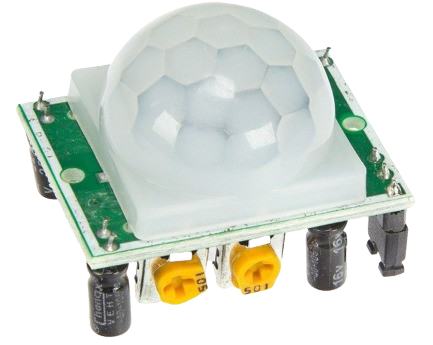
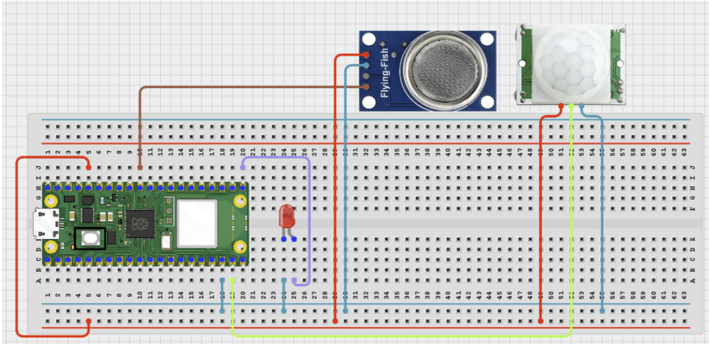

# Project 3.9.57: Smart Sanitation Smart City Module

**Advanced Embedded Systems Project Using Raspberry Pi Pico 2 W and MicroPython**


## Overview

The Pico acts as one local sanitation node that creates structured city-module records and can optionally upload them to a local endpoint.

Smart-city claims are weak when the prototype cannot even show what one local module measures or how it behaves without the network.

A Pico 2 W prototype with a PIR sensor, MQ-135 gas sensor, status LED, local record log, and optional Wi-Fi upload.

Local-module architecture, structured sanitation records, and honest smart-city prototype wording.


## Required Components


|  |  |  |  |
| --- | --- | --- | --- |
| <br>Raspberry Pi Pico 2 W | <br>Gas sensor | <br>Breadboard | <br>Jumper wires |
| <br>PIR Sensor | <br>LED | <br>Resistor |  |
---

## Circuit Connections


| Component terminal | Connect to | Pico physical pin | Notes |
|---|---|---|---|
| PIR OUT | GPIO 14 | GPIO 14 / physical pin 19 | Occupancy input |
| MQ-135 AO | GPIO 26 ADC0 | GPIO 26 / physical pin 31 | Odor proxy input |
| LED anode | 220 ohm resistor to GPIO 16 | GPIO 16 / physical pin 21 | Activity LED |
---

## Wiring Diagram



```
PIR OUT -> GPIO 14
MQ-135 AO -> GPIO 26
GPIO 16 -> 220 ohm resistor -> LED anode
Common GND -> PIR, MQ-135, and LED
```

Diagram Placeholder
[Insert wiring diagram or breadboard image here]

---

## Step-by-Step Assembly

1. Connect the PIR output to GPIO 14 and allow warm-up before trusting occupancy readings.
2. Connect the MQ-135 analog output to GPIO 26 through a safe ADC path.
3. Wire the LED to GPIO 16 through a 220 ohm resistor and connect the LED cathode to ground.
4. Enter Wi-Fi credentials and local endpoint settings only after the local record loop works correctly.
5. Warm up the MQ-135 and measure a baseline before choosing the sanitation status threshold.

---

## Testing Individual Components

Before running the full project, test each subsystem separately. This makes it easier to find wiring, library, or logic problems before full integration.

1. **Hardware setup**: Assemble the Pico, sensor, indicator, and load wiring exactly as shown in the connection table before applying power.
2. **Test the input sensor**: Test the PIR and MQ-135 separately so the local module record is built from trusted inputs.
3. **Test the output device**: Blink the LED and test local file writing before enabling upload.
4. **Test the decision logic**: Create occupancy and odor changes one at a time and confirm the sanitation status field behaves logically.
5. **Run the full system**: Run the full module and compare local-only behavior with optional upload behavior.
6. **Validate the prototype**: Discuss what else a real smart-city sanitation deployment would still require beyond this one node.
7. **Save the project**: Save the validated program on the Pico as main.py and keep a copy on the computer for future edits.

---

## Full Project Code

After completing and checking the circuit connections, open Thonny IDE, copy and paste this code into a new file or upload the project file to the Raspberry Pi Pico 2 W, then run it from Thonny.

Upload and run this code after the individual tests work correctly.

```python
import network
import socket
import time
import ujson as json
from machine import ADC, Pin

PIR_PIN = 14
GAS_PIN = 26
LED_PIN = 16
LOG_FILE = 'city_module_342.jsonl'
UPLOAD_ENABLED = False
WIFI_SSID = 'YOUR_WIFI'
WIFI_PASSWORD = 'YOUR_PASSWORD'
SERVER_HOST = '192.168.1.50'
SERVER_PORT = 8000
SERVER_PATH = '/city_sanitation'
ODOR_WARN = 22000

pir = Pin(PIR_PIN, Pin.IN, Pin.PULL_DOWN)
gas = ADC(GAS_PIN)
led = Pin(LED_PIN, Pin.OUT)


def connect_wifi(timeout_s=15):
    wlan = network.WLAN(network.STA_IF)
    if wlan.isconnected():
        return wlan
    wlan.active(True)
    wlan.connect(WIFI_SSID, WIFI_PASSWORD)
    for _ in range(timeout_s):
        if wlan.isconnected():
            return wlan
        time.sleep(1)
    return None


def append_record(record):
    try:
        with open(LOG_FILE, 'a') as handle:
            handle.write(json.dumps(record) + '\n')
    except OSError:
        print('Could not write local record')


def upload_record(record):
    if not UPLOAD_ENABLED:
        return False
    wlan = connect_wifi()
    if wlan is None:
        return False
    address = socket.getaddrinfo(SERVER_HOST, SERVER_PORT)[0][-1]
    body = json.dumps(record)
    request = 'POST {} HTTP/1.1\r\nHost: {}\r\nContent-Type: application/json\r\nContent-Length: {}\r\nConnection: close\r\n\r\n{}'.format(
        SERVER_PATH,
        SERVER_HOST,
        len(body),
        body,
    )
    sock = socket.socket()
    try:
        sock.connect(address)
        sock.send(request.encode())
        sock.recv(128)
        return True
    finally:
        sock.close()


print('Smart sanitation smart city module ready')

while True:
    occupancy = pir.value()
    odor_raw = gas.read_u16()
    if odor_raw >= ODOR_WARN:
        status = 'SERVICE'
    elif occupancy == 1:
        status = 'IN_USE'
    else:
        status = 'NORMAL'

    record = {
        'schema_version': 1,
        'module_id': 'sanitation_342',
        'uptime_s': time.ticks_ms() // 1000,
        'occupancy_active': occupancy,
        'odor_raw': odor_raw,
        'status': status,
    }

    append_record(record)
    uploaded = upload_record(record)
    led.value(1)
    time.sleep_ms(120)
    led.value(0)
    print(record, 'uploaded' if uploaded else 'local_only')
    time.sleep(15)
```

---

## How the Code Works

| Code Section | What It Does | Why It Matters | What to Modify During Testing |
|--------------|--------------|----------------|------------------------------|
| Module record schema | Creates one documented local module record with occupancy, odor, and status. | A smart-city module should first prove that one node can produce useful local records. | Add fields only when you can explain and validate them clearly. |
| Status mapping | Turns the local readings into NORMAL, IN_USE, or SERVICE. | A simple status field makes the node understandable before any city-scale aggregation exists. | Tune the odor threshold only after warm-up and baseline measurement. |
| Local-first upload path | Stores the record locally and only then attempts optional upload. | This keeps the module useful when the network path is unavailable. | Enable upload only after local records look correct. |

---

## Expected Result

The serial monitor reports the current reading or state clearly.

The hardware output responds when the decision logic changes state.

Subsystem behavior matches the thresholds, timing, or rules described in the document.

### Validation Checks

- **Normal condition test**: confirm the system stays in its safe or idle state under baseline conditions.
- **Warning condition test**: move the input close to the chosen threshold and confirm the transition is sensible.
- **Critical condition test**: trigger the strongest alert or control state and confirm the output response is correct.
- **Calibration test**: compare the sensor or timing against a known reference or repeated trial.
- **Limitation test**: deliberately create an awkward or noisy condition and note how the prototype behaves.

### Deployment and Limitations

- This prototype is suitable for local pilots where sensor data must be logged or transmitted over short periods.
- Before deployment, network reliability, power backup, and endpoint security need attention.
- The system should keep useful local behavior even when communication fails.

---

## Troubleshooting

| Problem | Possible Cause | Solution |
|---------|----------------|----------|
| The status is always service | The odor threshold is too low or the MQ-135 is still warming up | Allow more warm-up time and raise the threshold after observing the baseline. |
| The local file stays empty | File writing failed | Test a short text write and confirm the Pico file system is writable. |
| Uploads always fail | The Wi-Fi details or endpoint settings are wrong | Check UPLOAD_ENABLED, the credentials, and the server host, port, and path. |
| Occupancy never changes | The PIR is not warmed up or is wired incorrectly | Wait for warm-up and print the PIR value directly during a simple test. |

---
