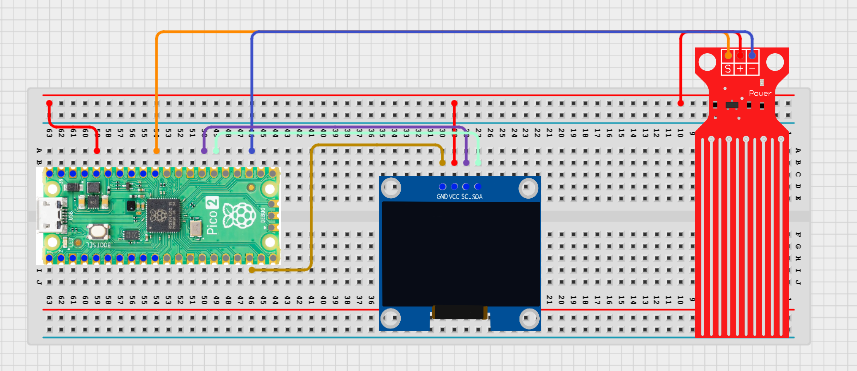

# Project 3.9.59: Smart Tank Dashboard

**Advanced Embedded Systems Project Using Raspberry Pi Pico 2 W and MicroPython**


## Overview

The Pico reads a tank water-level sensor and shows the current fill percentage and status on a local OLED dashboard.

Water storage is easier to manage when users can see low, medium, and high tank states before the tank runs dry or overfills.

A Pico 2 W prototype with an analog water-level sensor and an OLED used as a local tank dashboard.

Sensor calibration, local dashboard display, and honest interpretation of a classroom water-level proxy.


## Required Components


|  |  |  |  |
| --- | --- | --- | --- |
| <br>Raspberry Pi Pico 2 W | <br>Water level sensor | <br>Breadboard | <br>Jumper wires |
| <br>OLED |  |  |  |
---

## Circuit Connections


| Component terminal | Connect to | Pico physical pin | Notes |
|---|---|---|---|
| Water sensor AO | GPIO 26 ADC0 | GPIO 26 / physical pin 31 | Analog level input |
| Water sensor VCC | GPIO 17 | GPIO 17 / physical pin 22 | Optional switched sensor power |
| Water sensor GND | GND | Physical pin 38 | Common ground |
| OLED SDA | GPIO 20 | GPIO 20 / physical pin 26 | I2C0 SDA |
| OLED SCL | GPIO 21 | GPIO 21 / physical pin 27 | I2C0 SCL |
---

## Wiring Diagram



```
  Water sensor AO -> GPIO 26
  GPIO 17 -> water sensor VCC
  GND -> water sensor GND and OLED GND
  GPIO 20 -> OLED SDA
  GPIO 21 -> OLED SCL
```

---

## Step-by-Step Assembly

1. Connect the water sensor analog output to GPIO 26 and its ground to Pico GND.
2. Connect the sensor VCC to GPIO 17 if you want the code to power it only during sampling.
3. Connect the OLED to Pico 3.3V, GND, GPIO 20, and GPIO 21.
4. Upload ssd1306.py and confirm the library appears in the Pico file list.
5. Calibrate empty and full reference readings before trusting the percentage scale.

---

## Testing Individual Components

Before running the full project, test each subsystem separately. This makes it easier to find wiring, library, or logic problems before full integration.

1. **Hardware setup**: Assemble the Pico, sensor, indicator, and load wiring exactly as shown in the connection table before applying power.
2. **Test the input sensor**: Measure the raw sensor value in empty and full conditions so the percentage conversion is based on real tank readings.
3. **Test the output device**: Run an OLED hello-world test before combining it with the water-level logic.
4. **Test the decision logic**: Confirm that LOW, MID, and HIGH states match the chosen calibration points.
5. **Run the full system**: Run the full dashboard while changing the water level and compare the serial and OLED outputs.
6. **Validate the prototype**: Repeat the reading with the sensor at different depths or positions to see how placement affects calibration.
7. **Save the project**: Save the validated program on the Pico as main.py and keep a copy on the computer for future edits.

---

## Full Project Code

After completing and checking the circuit connections, open Thonny IDE, copy and paste this code into a new file or upload the project file to the Raspberry Pi Pico 2 W, then run it from Thonny.

```python
from machine import ADC, I2C, Pin
import time

try:
    from ssd1306 import SSD1306_I2C
    HAS_OLED = True
except ImportError:
    HAS_OLED = False

POWER_PIN = 17
WATER_PIN = 26
I2C_SDA_PIN = 20
I2C_SCL_PIN = 21
EMPTY_LEVEL = 5000
FULL_LEVEL = 50000

power = Pin(POWER_PIN, Pin.OUT)
water = ADC(WATER_PIN)
i2c = I2C(0, sda=Pin(I2C_SDA_PIN), scl=Pin(I2C_SCL_PIN), freq=400000)
if HAS_OLED:
    oled = SSD1306_I2C(128, 64, i2c)


def read_level(samples=6):
    power.on()
    time.sleep_ms(50)
    total = 0
    for _ in range(samples):
        total += water.read_u16()
        time.sleep_ms(10)
    power.off()
    return total // samples


def level_percent(raw):
    span = FULL_LEVEL - EMPTY_LEVEL
    if span <= 0:
        return 0
    pct = int((raw - EMPTY_LEVEL) * 100 / span)
    if pct < 0:
        return 0
    if pct > 100:
        return 100
    return pct


print("Smart tank dashboard ready")

while True:
    raw = read_level()
    percent = level_percent(raw)
    if percent < 25:
        status = "LOW"
    elif percent > 75:
        status = "HIGH"
    else:
        status = "MID"

    print("Raw: {} | Level: {} % | Status: {}".format(raw, percent, status))

    if HAS_OLED:
        oled.fill(0)
        oled.text("Smart Tank", 0, 0)
        oled.text("Level:{}%".format(percent), 0, 20)
        oled.text(status, 0, 40)
        oled.show()

    time.sleep(2)
```

---

## How the Code Works

| Code Section | What It Does | Why It Matters | What to Modify During Testing |
|--------------|--------------|----------------|------------------------------|
| Sensor power control | Powers the level sensor only during sampling | This can reduce corrosion on simple water probes and saves power | If your sensor requires continuous power, change the strategy only after validation |
| Calibration constants | Defines empty and full reference readings for the tank | A percentage is only meaningful when the sensor has real reference points | Measure your actual empty and full values before changing EMPTY_LEVEL and FULL_LEVEL |
| level_percent | Converts the raw sensor value into an estimated 0 to 100 percent fill level | This makes the dashboard more understandable to users | Adjust the conversion only after collecting real calibration points |
| OLED dashboard | Displays the tank label and percentage locally | This creates a practical local dashboard without overclaiming remote features | If the display is blank, verify ssd1306.py and the I2C wiring first |

---

## Expected Result

The serial monitor reports the current reading or state clearly.

The hardware output responds when the decision logic changes state.

Subsystem behavior matches the thresholds, timing, or rules described in the document.

### Validation Checks

- **Normal condition test**: confirm the system stays in its safe or idle state under baseline conditions
- **Warning condition test**: move the input close to the chosen threshold and confirm the transition is sensible
- **Critical condition test**: trigger the strongest alert or control state and confirm the output response is correct
- **Calibration test**: compare the sensor or timing against a known reference or repeated trial
- **Limitation test**: deliberately create an awkward or noisy condition and note how the prototype behaves

### Deployment and Limitations

- This prototype works well for classroom demonstrations and local monitoring pilots
- Before deployment, it needs calibration records, protective mounting, and regular validation checks
- Display-only systems still depend on correct sensor placement and trained users

---

## Troubleshooting

| Problem | Possible Cause | Solution |
|---------|----------------|----------|
| Percentage never changes | The analog output or calibration values are wrong | Print the raw reading and confirm the sensor AO line really reaches GPIO 26 |
| Tank is always LOW or HIGH | Calibration points do not match the actual sensor range | Re-measure empty and full values and update the constants |
| OLED is blank | I2C wiring or library file is missing | Use GPIO 20 and GPIO 21 and confirm that ssd1306.py is on the Pico |
| Readings drift over time | Probe residue or sensor position changed | Clean or reposition the sensor and recalibrate the tank references |

---
