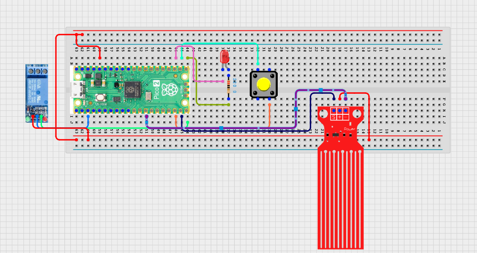

# Project 3.9.61: Smart Water Conservation Ai

**Advanced Embedded Systems Project Using Raspberry Pi Pico 2 W and MicroPython**

## Overview

The Pico monitors water-flow intensity and closes a relay-controlled valve or test load when sustained usage exceeds the conservation limit.

Water waste is harder to control when a system reacts only to one instant of flow instead of the sustained usage pattern.

A Pico 2 W prototype with a pulse flow sensor, relay-controlled valve or lamp load, reset button, and status LED.

Rule-based AI-style conservation logic, sustained-usage monitoring, and safe manual reset behavior.


## Required Components


|  |  |  |  |
| --- | --- | --- | --- |
| <br>Raspberry Pi Pico 2 W | <br>Water level sensor | <br>Breadboard | <br>Jumper wires |
| <br>Push button | <br>Relay | <br>LED | <br>Resistor |
---

## Circuit Connections


| Component terminal | Connect to | Pico physical pin | Notes |
|---|---|---|---|
| Flow sensor pulse output | GPIO 14 | GPIO 14 / physical pin 19 | 3.3V-safe pulse signal |
| Relay IN | GPIO 15 | GPIO 15 / physical pin 20 | Valve or load control |
| Reset button leg 1 | GPIO 16 | GPIO 16 / physical pin 21 | Manual reset input |
| Reset button leg 2 | 3.3V output | Physical pin 36 | High when pressed |
| LED anode | 220 ohm resistor to GPIO 17 | GPIO 17 / physical pin 22 | Conservation lockout LED |
---

## Wiring Diagram



```
  Flow pulse output -> GPIO 14
  GPIO 15 -> relay IN
  Button -> GPIO 16 and 3.3V
  GPIO 17 -> LED via 220 ohm
  Relay load path -> external valve or safe low-voltage test load
```

---

## Step-by-Step Assembly

1. Connect the flow sensor pulse output to GPIO 14 and verify the signal is 3.3V-safe.
2. Connect the relay control input to GPIO 15.
3. Wire the reset button between GPIO 16 and 3.3V so the input goes high when pressed.
4. Connect the LED to GPIO 17 through a 220 ohm resistor.
5. Attach a safe low-voltage load through the relay before attempting any real valve hardware.

---

## Testing Individual Components

Before running the full project, test each subsystem separately. This makes it easier to find wiring, library, or logic problems before full integration.

1. **Hardware setup**: Assemble the Pico, sensor, indicator, and load wiring exactly as shown in the connection table before applying power.
2. **Test the input sensor**: Test pulse counting from the flow sensor first so the window calculations are believable.
3. **Test the output device**: Test the relay, LED, and reset button separately before running the conservation logic.
4. **Test the decision logic**: Confirm that short normal flow does not trigger lockout but sustained high flow does.
5. **Run the full system**: Run the full controller and compare the moving average with the relay state.
6. **Validate the prototype**: Press the reset button after lockout and confirm the relay behavior matches the manual override rule.
7. **Save the project**: Save the validated program on the Pico as main.py and keep a copy on the computer for future edits.

---

## Full Project Code

After completing and checking the circuit connections, open Thonny IDE, copy and paste this code into a new file or upload the project file to the Raspberry Pi Pico 2 W, then run it from Thonny.

```python
from machine import Pin
import time

FLOW_PIN = 14
RELAY_PIN = 15
BUTTON_PIN = 16
LED_PIN = 17
SAMPLE_WINDOW_S = 5
HISTORY_LENGTH = 4
HIGH_USE_LPM = 3.5

pulse_count = 0
flow = Pin(FLOW_PIN, Pin.IN, Pin.PULL_UP)
relay = Pin(RELAY_PIN, Pin.OUT)
button = Pin(BUTTON_PIN, Pin.IN, Pin.PULL_DOWN)
led = Pin(LED_PIN, Pin.OUT)
relay.on()
lockout = False
history = []


def count_pulse(pin):
    global pulse_count
    pulse_count += 1


def flow_lpm_from_pulses(pulses, seconds):
    if seconds <= 0:
        return 0.0
    return (pulses / seconds) / 7.5


flow.irq(trigger=Pin.IRQ_FALLING, handler=count_pulse)
print('Water conservation AI ready')

while True:
    pulse_count = 0
    start = time.ticks_ms()
    while time.ticks_diff(time.ticks_ms(), start) < SAMPLE_WINDOW_S * 1000:
        if lockout and button.value() == 1:
            lockout = False
            history = []
            relay.on()
            led.off()
            print('Manual reset')
        time.sleep_ms(100)

    lpm = flow_lpm_from_pulses(pulse_count, SAMPLE_WINDOW_S)
    if not lockout:
        history.append(lpm)
        history = history[-HISTORY_LENGTH:]
        average_lpm = sum(history) / len(history)
        if len(history) == HISTORY_LENGTH and average_lpm >= HIGH_USE_LPM:
            lockout = True
            relay.off()
            led.on()
    else:
        average_lpm = sum(history) / len(history) if history else 0

    state = 'CONSERVE' if lockout else 'OPEN'
    print('Flow:{:.2f}L/min Avg:{:.2f} State:{}'.format(lpm, average_lpm, state))
```

---

## How the Code Works

| Code Section | What It Does | Why It Matters | What to Modify During Testing |
|--------------|--------------|----------------|------------------------------|
| Window flow measurement | Counts pulses over fixed windows and converts them into liters per minute | Conservation should react to usage rate, not to raw pulse counts alone | Verify the pulse-count calibration before changing the conservation threshold |
| Moving average history | Keeps several recent windows to decide whether high usage is sustained | This is the AI-style part of the logic without overclaiming machine learning | Change HISTORY_LENGTH if you want faster or slower conservation response |
| Lockout control | Closes the relay when sustained flow exceeds the conservation limit | Sustained lockout is more meaningful than reacting to one short spike | Always test with a safe low-voltage load before real hardware |
| Manual reset path | Lets a user reopen the relay intentionally after lockout | A conservation system should have a clear recovery path | Check the button wiring first if reset does not work |

---

## Expected Result

The serial monitor reports the current reading or state clearly.

The hardware output responds when the decision logic changes state.

Subsystem behavior matches the thresholds, timing, or rules described in the document.

### Validation Checks

- **Normal condition test**: confirm the system stays in its safe or idle state under baseline conditions
- **Warning condition test**: move the input close to the chosen threshold and confirm the transition is sensible
- **Critical condition test**: trigger the strongest alert or control state and confirm the output response is correct
- **Calibration test**: compare the sensor or timing against a known reference or repeated trial
- **Limitation test**: deliberately create an awkward or noisy condition and note how the prototype behaves

### Deployment and Limitations

- This prototype could be used in school, farm, or sanitation demonstrations with safe low-voltage loads
- Before deployment, the load wiring, enclosure, and power design need careful review
- Actuator systems need maintenance planning because relay wear and sensor drift affect reliability

---

## Troubleshooting

| Problem | Possible Cause | Solution |
|---------|----------------|----------|
| Lockout happens too quickly | The threshold is too low or the history is too short | Raise HIGH_USE_LPM or increase HISTORY_LENGTH |
| Relay never opens again | The reset button wiring is wrong or lockout never clears | Test the button state directly and confirm relay logic polarity |
| Flow is always zero | The pulse signal is not reaching GPIO 14 | Print the pulse count during a known flow test and verify the signal path |
| LED never lights | The lockout state is not being reached or the LED path is wrong | Test the LED separately and then lower the threshold temporarily |

---
