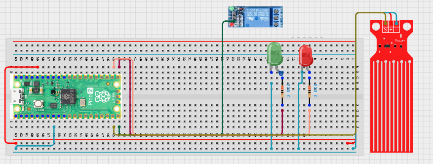

# Project 3.9.62: Smart Water Conservation System

**Advanced Embedded Systems Project Using Raspberry Pi Pico 2 W and MicroPython**


## Overview

The Pico measures water flow and closes a relay-driven valve when usage passes a chosen conservation threshold.

Water is often wasted because small bursts or leaks continue for too long before anyone notices.

A Pico 2 W prototype with a water flow sensor, relay output, and status LEDs.

Pulse-based flow measurement, automatic shutoff logic, and safe relay testing.


## Required Components


|  |  |  |  |
| --- | --- | --- | --- |
| <br>Raspberry Pi Pico 2 W | <br>Water level sensor | <br>Breadboard | <br>Jumper wires |
| <br>Relay module | <br>LED | <br>Resistor |  |
---

## Circuit Connections


| Component terminal | Connect to | Pico physical pin | Notes |
|---|---|---|---|
| Component Pin | Connects To | Pico GPIO / Physical Pin Number | Notes |
| Flow sensor signal | GPIO 14 | GPIO 14 / physical pin 19 | Pulse input with pull-up |
| Relay IN | GPIO 15 | GPIO 15 / physical pin 20 | Valve or demo load control |
| Green LED anode | 220 ohm resistor to GPIO 16 | GPIO 16 / physical pin 21 | Normal state |
| Red LED anode | 220 ohm resistor to GPIO 17 | GPIO 17 / physical pin 22 | Shutoff warning |
---

## Wiring Diagram



```
  Flow sensor signal          -> GPIO 14
  Relay IN                    -> GPIO 15
  GPIO 16 -> 220 ohm resistor -> green LED anode
  GPIO 17 -> 220 ohm resistor -> red LED anode
  Common GND                  -> flow sensor, relay, and LEDs
```

---

## Step-by-Step Assembly

1. Connect the flow sensor power pins according to its module rating and connect the signal wire to GPIO 14.
2. Connect the relay control input to GPIO 15 and keep the switched load disconnected for the first tests.
3. Wire the green LED to GPIO 16 and the red LED to GPIO 17 through 220 ohm resistors.
4. If the flow sensor or relay uses an external supply, connect the grounds together safely.
5. Keep all pipe or water test hardware physically separated from the Pico board.

---

## Testing Individual Components

Before running the full project, test each subsystem separately. This makes it easier to find wiring, library, or logic problems before full integration.

1. **Hardware setup**: Assemble the Pico, sensor, indicator, and load wiring exactly as shown in the connection table before applying power.
2. **Test the input sensor**: Blow through the flow sensor or run a small safe water test to confirm pulses are being counted.
3. **Test the output device**: Toggle the relay and LEDs with a short script before attaching any real load.
4. **Test the decision logic**: Raise the pulse count and confirm the system changes from ALLOW to SHUTOFF at the chosen threshold.
5. **Run the full system**: Run the full system and verify that the relay state matches the printed logic.
6. **Validate the prototype**: Repeat the test with different flow rates to see whether the reset threshold is sensible.
7. **Save the project**: Save the validated program on the Pico as main.py and keep a copy on the computer for future edits.

---

## Full Project Code

After completing and checking the circuit connections, open Thonny IDE, copy and paste this code into a new file or upload the project file to the Raspberry Pi Pico 2 W, then run it from Thonny.

```python
from machine import Pin
import time

FLOW_PIN = 14
RELAY_PIN = 15
GREEN_LED_PIN = 16
RED_LED_PIN = 17
PULSES_PER_LITER = 450
SHUTOFF_FLOW_LPM = 12.0
RESET_FLOW_LPM = 6.0
MEASURE_SECONDS = 5

flow_sensor = Pin(FLOW_PIN, Pin.IN, Pin.PULL_UP)
relay = Pin(RELAY_PIN, Pin.OUT, value=1)
green_led = Pin(GREEN_LED_PIN, Pin.OUT)
red_led = Pin(RED_LED_PIN, Pin.OUT)

pulse_count = 0
valve_closed = False

def count_pulse(pin):
    global pulse_count
    pulse_count += 1

flow_sensor.irq(trigger=Pin.IRQ_FALLING, handler=count_pulse)

print('Water conservation controller ready')

while True:
    pulse_count = 0
    time.sleep(MEASURE_SECONDS)
    pulses = pulse_count
    liters = pulses / PULSES_PER_LITER
    flow_lpm = liters * (60 / MEASURE_SECONDS)

    if valve_closed:
        if flow_lpm <= RESET_FLOW_LPM:
            valve_closed = False
    elif flow_lpm >= SHUTOFF_FLOW_LPM:
        valve_closed = True

    relay.value(0 if valve_closed else 1)
    green_led.value(0 if valve_closed else 1)
    red_led.value(1 if valve_closed else 0)
    state = 'SHUTOFF' if valve_closed else 'ALLOW'
    print('Pulses:{} Flow:{:.2f}L/min State:{}'.format(pulses, flow_lpm, state))
```

---

## How the Code Works

| Code Section | What It Does | Why It Matters | What to Modify During Testing |
|--------------|--------------|----------------|------------------------------|
| Pulse interrupt | Counts the pulses from the flow sensor | Pulse counting is the basis for any believable flow calculation | Confirm the count increases during each physical flow test |
| Flow-rate calculation | Converts pulse count into liters per minute | The relay decision is only useful if the rate calculation is believable | Adjust the calibration factor if your flow sensor model differs |
| Relay hysteresis | Uses separate shutoff and reset thresholds | Hysteresis prevents relay chatter near the cutoff point | Test both thresholds before connecting a real valve |

---

## Expected Result

The serial monitor reports the current reading or state clearly.

The hardware output responds when the decision logic changes state.

Subsystem behavior matches the thresholds, timing, or rules described in the document.

### Validation Checks

- **Normal condition test**: confirm the system stays in its safe or idle state under baseline conditions
- **Warning condition test**: move the input close to the chosen threshold and confirm the transition is sensible
- **Critical condition test**: trigger the strongest alert or control state and confirm the output response is correct
- **Calibration test**: compare the sensor or timing against a known reference or repeated trial
- **Limitation test**: deliberately create an awkward or noisy condition and note how the prototype behaves

### Deployment and Limitations

- This prototype could be used in school, farm, or sanitation demonstrations with safe low-voltage loads
- Before deployment, the load wiring, enclosure, and power design need careful review
- Actuator systems need maintenance planning because relay wear and sensor drift affect reliability

---

## Troubleshooting

| Problem | Possible Cause | Solution |
|---------|----------------|----------|
| The flow rate always reads zero | No pulses are reaching the Pico | Check the signal wire, pull-up input, and flow sensor output voltage level |
| The relay chatters on and off | The threshold is too close to the actual flow rate | Increase the gap between shutoff and reset thresholds |
| The relay logic seems reversed | The relay module uses opposite active logic | Swap the relay.value levels after confirming the module behavior safely |
| LEDs do not match the relay state | The status pins are wired incorrectly | Test each LED pin separately and recheck the resistor paths |

---

