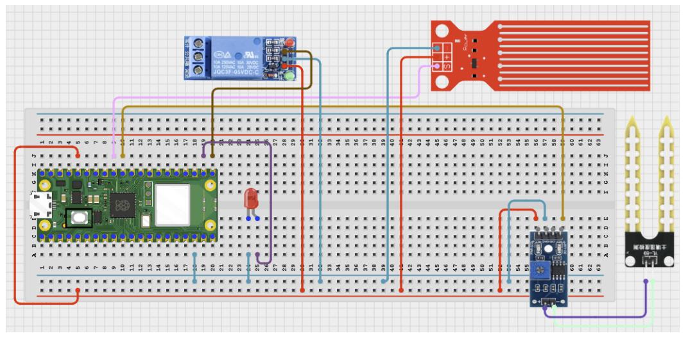

# Project 3.9.64: Smart Water Efficiency Ai

**Advanced Embedded Systems Project Using Raspberry Pi Pico 2 W and MicroPython**


## Overview

The Pico uses rule-based AI-style logic to decide when irrigation should be allowed based on soil dryness and available water.

Water efficiency decisions fail when irrigation is triggered by soil demand alone without checking whether enough water is available.

A Pico 2 W prototype with a soil moisture sensor, analog water-level sensor, relay output, and status LED.

Rule-based AI-style control, resource-aware irrigation, and safe actuator testing.


## Required Components


|  |  |  |  |
| --- | --- | --- | --- |
| <br>Raspberry Pi Pico 2 W | <br>Water level sensor | <br>Breadboard | <br>Jumper wires |
| <br>Soil sensor | <br>Relay | <br>LED | <br>Resistor |
---

## Circuit Connections


| Component terminal | Connect to | Pico physical pin | Notes |
|---|---|---|---|
| Soil sensor AO | GPIO 26 ADC0 | GPIO 26 / physical pin 31 | Soil input |
| Water level analog output | GPIO 27 ADC1 | GPIO 27 / physical pin 32 | Storage level input |
| Relay IN | GPIO 16 | GPIO 16 / physical pin 21 | Irrigation control output |
| LED anode | 220 ohm resistor to GPIO 17 | GPIO 17 / physical pin 22 | Irrigation status LED |
---

## Wiring Diagram



```
Soil sensor AO -> GPIO 26
Level analog output -> GPIO 27
GPIO 16 -> relay IN
GPIO 17 -> 220 ohm resistor -> LED anode
External supply -> relay-switched pump or valve
```

Diagram Placeholder
[Insert wiring diagram or breadboard image here]

---

## Step-by-Step Assembly

1. Connect the soil sensor analog output to GPIO 26.
2. Connect the water-level analog output to GPIO 27 through a safe ADC path.
3. Connect the relay input to GPIO 16 and power the relay module correctly.
4. Wire the LED to GPIO 17 through a 220 ohm resistor and connect the LED cathode to ground.
5. Attach the real irrigation load only after the relay logic has been validated safely.

---

## Testing Individual Components

Before running the full project, test each subsystem separately. This makes it easier to find wiring, library, or logic problems before full integration.

1. **Hardware setup**: Assemble the Pico, sensor, indicator, and load wiring exactly as shown in the connection table before applying power.
2. **Test the input sensor**: Test the soil and water-level sensors separately so the controller starts from trusted values.
3. **Test the output device**: Toggle the relay and LED from a short script before running the AI-style logic.
4. **Test the decision logic**: Create dry-soil and low-water scenarios and confirm the decision changes for the right reason.
5. **Run the full system**: Run the full controller and compare the decision with the printed dryness and storage values.
6. **Validate the prototype**: Discuss whether the blocking rule is strict enough to protect stored water in a real deployment.
7. **Save the project**: Save the validated program on the Pico as main.py and keep a copy on the computer for future edits.

---

## Full Project Code

After completing and checking the circuit connections, open Thonny IDE, copy and paste this code into a new file or upload the project file to the Raspberry Pi Pico 2 W, then run it from Thonny.

Upload and run this code after the individual tests work correctly.

```python
from machine import ADC, Pin
import time

SOIL_PIN = 26
LEVEL_PIN = 27
RELAY_PIN = 16
LED_PIN = 17
SOIL_DRY_RAW = 48000
SOIL_WET_RAW = 18000
LEVEL_EMPTY = 12000
LEVEL_FULL = 52000

soil = ADC(SOIL_PIN)
level = ADC(LEVEL_PIN)
relay = Pin(RELAY_PIN, Pin.OUT)
led = Pin(LED_PIN, Pin.OUT)


def clamp(value, low, high):
    return max(low, min(high, value))


def dryness_percent(raw):
    span = SOIL_DRY_RAW - SOIL_WET_RAW
    if span <= 0:
        return 0
    pct = int((raw - SOIL_WET_RAW) * 100 / span)
    return clamp(pct, 0, 100)


def level_percent(raw):
    span = LEVEL_FULL - LEVEL_EMPTY
    if span <= 0:
        return 0
    pct = int((raw - LEVEL_EMPTY) * 100 / span)
    return clamp(pct, 0, 100)


print('Smart water efficiency AI ready')

while True:
    dry_pct = dryness_percent(soil.read_u16())
    storage_pct = level_percent(level.read_u16())

    if storage_pct < 20:
        decision = 'BLOCKED'
        irrigation_on = False
    elif dry_pct >= 65:
        decision = 'ALLOW'
        irrigation_on = True
    elif dry_pct >= 40:
        decision = 'WAIT'
        irrigation_on = False
    else:
        decision = 'HOLD'
        irrigation_on = False

    relay.value(1 if irrigation_on else 0)
    led.value(1 if irrigation_on else 0)
    print('Dry:{}% Storage:{}% Decision:{}'.format(dry_pct, storage_pct, decision))
    time.sleep(2)
```

---

## How the Code Works

| Code Section | What It Does | Why It Matters | What to Modify During Testing |
|--------------|--------------|----------------|------------------------------|
| Dual-resource logic | Checks crop demand and water availability together. | This is what makes the controller resource-aware rather than one-dimensional. | Recalibrate both soil and level thresholds after measuring your own hardware. |
| Decision mapping | Produces BLOCKED, ALLOW, WAIT, or HOLD states from the thresholds. | The decision states make the AI-style logic easy to inspect and explain. | Change one threshold at a time so the effect remains clear. |
| Relay and LED output | Shows when irrigation is actually permitted. | Visible hardware feedback is important before connecting a real irrigation load. | Invert the relay logic if your module is active low. |

---

## Expected Result

The serial monitor reports the current reading or state clearly.

The hardware output responds when the decision logic changes state.

Subsystem behavior matches the thresholds, timing, or rules described in the document.

### Validation Checks

- **Normal condition test**: confirm the system stays in its safe or idle state under baseline conditions.
- **Warning condition test**: move the input close to the chosen threshold and confirm the transition is sensible.
- **Critical condition test**: trigger the strongest alert or control state and confirm the output response is correct.
- **Calibration test**: compare the sensor or timing against a known reference or repeated trial.
- **Limitation test**: deliberately create an awkward or noisy condition and note how the prototype behaves.

### Deployment and Limitations

- This prototype could be used in school, farm, or sanitation demonstrations with safe low-voltage loads.
- Before deployment, the load wiring, enclosure, and power design need careful review.
- Actuator systems need maintenance planning because relay wear and sensor drift affect reliability.

---

## Troubleshooting

| Problem | Possible Cause | Solution |
|---------|----------------|----------|
| Irrigation never turns on | The dryness threshold is too high or the relay wiring is wrong | Test the relay separately and temporarily lower the dryness threshold during debugging. |
| Irrigation stays blocked | The water-level calibration is wrong or storage always reads low | Print the raw level value and re-measure the empty and full references. |
| Dryness never changes | The soil sensor wiring or calibration is wrong | Print the raw soil value and test in clearly wet and dry soil. |
| The LED state does not match the relay state | The output wiring or logic is inconsistent | Verify both outputs are updated from the same irrigation_on value. |

---
