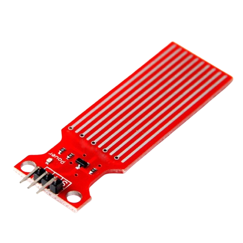
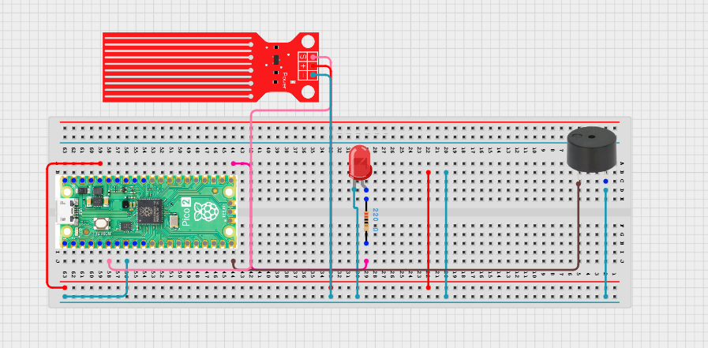

# Project 3.9.68: Smart Water Leakage Detector

**Advanced Embedded Systems Project Using Raspberry Pi Pico 2 W and MicroPython**


## Overview

The Pico detects a water leak and immediately activates local warning outputs.

Small leaks are easy to miss until they damage flooring, walls, or sanitation facilities.

A Pico 2 W prototype with a digital water leak sensor, LED, and buzzer.

Leak detection, false-trigger testing, and fast alert response.


## Required Components


|  |  |  |  |
| --- | --- | --- | --- |
| <br>Raspberry Pi Pico 2 W | <br>Digital water leak sensor module | <br>Breadboard | <br>Jumper wires |
| <br>Buzzer | <br>LED | <br>Resistor |  |
---

## Circuit Connections


| Component terminal | Connect to | Pico physical pin | Notes |
|---|---|---|---|
| Component Pin | Connects To | Pico GPIO / Physical Pin Number | Notes |
| Leak sensor OUT | GPIO 4 | GPIO 4 / physical pin 6 | Digital leak input |
| LED anode | 220 ohm resistor to GPIO 16 | GPIO 16 / physical pin 21 | Visual leak alert |
| Buzzer positive | GPIO 15 | GPIO 15 / physical pin 20 | Audible alert |
| Common GND | GND | Physical pin 38 | Common ground |
---

## Wiring Diagram




```text
Raspberry Pi Pico 2 W
┌─────────────────────────────────┐
│                                 │
│  GPIO 4  ───────────────────────┤──── Leak sensor OUT
│  GPIO 16 ───────────[220Ω]──────┤──── LED anode (+)
│  GPIO 15 ───────────────────────┤──── Buzzer positive (+)
│  GND     ────────────────────────┤──── Leak sensor GND, LED cathode (-), Buzzer negative (-)
│                                 │
└─────────────────────────────────┘

Leak Sensor Module
VCC ── 3.3V
GND ── GND
OUT ── GPIO 4

LED Circuit
LED anode (+) ──[220Ω]──── GPIO 16
LED cathode (-) ─────────── GND

Buzzer Circuit
Buzzer positive (+) ──────── GPIO 15
Buzzer negative (-) ─────── GND
```

---

## Step-by-Step Assembly

### Step 1: Place the Raspberry Pi Pico 2 W

Place the Raspberry Pi Pico 2 W on the breadboard so it sits across the center gap. Keep the USB port facing outward so you can easily connect it to your computer.

### Step 2: Connect the Leak Sensor

Connect the leak sensor VCC to the 3.3V pin on the Pico.

Connect the leak sensor GND to a ground rail on the breadboard.

Connect the leak sensor OUT pin to GPIO 4.

### Step 3: Place the LED

Place the LED on the breadboard. Identify the long leg as the anode (+) and the short leg as the cathode (-).

### Step 4: Connect the LED Anode

Connect the LED long leg to one end of a 220Ω resistor.

### Step 5: Connect the Resistor to GPIO 16

Connect the other end of the 220Ω resistor to GPIO 16.

### Step 6: Connect the LED Cathode

Connect the LED short leg to the ground rail.

### Step 7: Connect the Buzzer

Connect the buzzer positive lead to GPIO 15.

Connect the buzzer negative lead to the ground rail.

### Step 8: Check All Connections

Ensure no loose jumper wires and verify all connections match the circuit table.

---

## Testing Individual Components

Before running the full project, test each subsystem separately. This makes it easier to find wiring, library, or logic problems before full integration.

### Hardware setup

Assemble the Pico, sensor, indicator, and load wiring exactly as shown in the connection table before applying power.

### Test the input sensor

Touch only the sensor surface with a damp cloth and confirm the digital input changes state.

### Test the output device

Test the LED and buzzer separately with short output scripts before running the full alert.

### Test the decision logic

Dry and wet the sensor several times to confirm the alert changes reliably without random triggers.

### Run the full system

Run the full system and compare the serial status with the hardware response.

### Validate the prototype

Check how quickly the system clears after the sensor surface dries.

### Save the project

Save the validated program on the Pico as main.py and keep a copy on the computer for future edits.

### Quick testing checklist

- ☐ Leak sensor shows DRY when dry and LEAK when wet
- ☐ LED turns on when leak is detected
- ☐ Buzzer sounds when leak is detected
- ☐ Serial monitor shows correct status readings
- ☐ System resets to DRY when sensor dries

---

## Full Project Code

After completing and checking the circuit connections, open Thonny IDE. Copy and paste the code below into a new file, or upload the project file to the Raspberry Pi Pico 2 W, then run it from Thonny.

```python
from machine import Pin
import time

LEAK_PIN = 4
LED_PIN = 16
BUZZER_PIN = 15
WET_STATE = 0

leak_sensor = Pin(LEAK_PIN, Pin.IN, Pin.PULL_UP)
led = Pin(LED_PIN, Pin.OUT)
buzzer = Pin(BUZZER_PIN, Pin.OUT)

print('Water leakage detector ready')

while True:
    leak_detected = leak_sensor.value() == WET_STATE
    status = 'LEAK' if leak_detected else 'DRY'
    led.value(1 if leak_detected else 0)
    buzzer.value(1 if leak_detected else 0)
    print('Leak sensor:{} Status:{}'.format(leak_sensor.value(), status))
    time.sleep(0.2)
```

---

## How the Code Works

| Code Section | What It Does | Why It Matters |
|---|---|---|
| LEAK_PIN, LED_PIN, BUZZER_PIN | Assigns GPIO pins for each component | Makes pin assignments clear and easy to modify |
| WET_STATE = 0 | Defines the sensor value when water is present | Most leak sensors output LOW when wet due to pull-up configuration |
| leak_sensor = Pin(LEAK_PIN, Pin.IN, Pin.PULL_UP) | Configures GPIO 4 as input with internal pull-up | Ensures reliable reading when sensor is open or dry |
| led and buzzer Pin objects | Configures output pins for LED and buzzer | Controls the visual and audible alerts |
| leak_detected check | Compares sensor value to WET_STATE | Determines whether a leak is occurring |
| led.value(1/0) and buzzer.value(1/0) | Turns outputs on or off based on leak state | Provides immediate local warning |
| print statement | Reports sensor value and status to serial monitor | Helps validate the system during testing |

---

## Expected Result

The serial monitor reports the current reading or state clearly.

The hardware output responds when the decision logic changes state.

Subsystem behavior matches the thresholds, timing, or rules described in the document.

### Validation Checks

- ☐ Normal condition test: confirm the system stays in its safe or idle state under baseline conditions.
- ☐ Warning condition test: move the input close to the chosen threshold and confirm the transition is sensible.
- ☐ Critical condition test: trigger the strongest alert or control state and confirm the output response is correct.
- ☐ Calibration test: compare the sensor or timing against a known reference or repeated trial.
- ☐ Limitation test: deliberately create an awkward or noisy condition and note how the prototype behaves.

### Deployment and Limitations

- This prototype can be used for local warning demonstrations and early field trials.
- Before deployment, it needs enclosure protection, calibration records, and a clear response procedure.
- Alert systems should always be treated as decision-support tools unless they are certified for the application.

---

## Troubleshooting

| Problem | Possible Cause | Solution |
|---|---|---|
| The buzzer stays on all the time | The sensor logic is inverted or the surface is still wet | Dry the sensor and confirm whether the module uses active-low output. |
| No leak is detected | The sensing surface is not wired correctly or the sensor is not powered | Confirm the sensor VCC, GND, and output wiring. |
| The LED works but the buzzer does not | The buzzer pin or polarity is wrong | Run a simple buzzer-on test on GPIO 15. |
| False alerts happen often | The sensor surface is contaminated or splashed accidentally | Clean the sensor and place it in a more controlled test area. |

---
