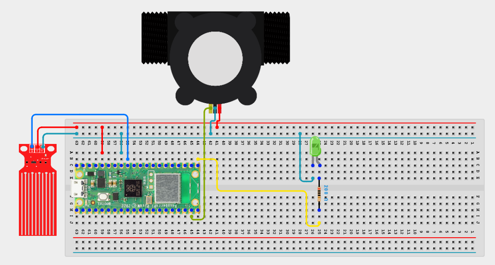

# Project 3.9.69: Smart Water Optimization Platform

**Advanced Embedded Systems Project Using Raspberry Pi Pico 2 W and MicroPython**


## Overview

The Pico measures water demand and stored supply, creates a local optimization record, and can optionally upload it to a local server.

Water optimization claims are weak when the device cannot preserve a trustworthy local record or explain how its recommendation was produced.

A Pico 2 W prototype with a pulse flow sensor, analog water-level sensor, status LED, local log file, and optional Wi-Fi upload.

Local-first optimization records, water-decision logic, and honest platform-ready communication.


## Required Components


|  |  |  |  |
| --- | --- | --- | --- |
| <br>Raspberry Pi Pico 2 W | <br>Water level sensor | <br>Breadboard | <br>Jumper wires |
| <br>Water flow sensor | <br>LED | <br>Resistor |  |
---

## Circuit Connections


| Component terminal | Connect to | Pico physical pin | Notes |
|---|---|---|---|
| Flow sensor pulse output | GPIO 14 | GPIO 14 / physical pin 19 | 3.3V-safe pulse input |
| Water level analog output | GPIO 27 ADC1 | GPIO 27 / physical pin 32 | Storage level input |
| LED anode | 220 ohm resistor to GPIO 16 | GPIO 16 / physical pin 21 | Activity LED |
---

## Wiring Diagram



```
Flow pulse output -> GPIO 14
Level analog output -> GPIO 27
GPIO 16 -> 220 ohm resistor -> LED anode
Common GND -> flow sensor, level sensor, and LED
```

Diagram Placeholder
[Insert wiring diagram or breadboard image here]

---

## Step-by-Step Assembly

1. Connect the flow sensor pulse output to GPIO 14 and confirm the signal is 3.3V-safe.
2. Connect the level sensor analog output to GPIO 27 through a safe ADC path.
3. Wire the LED to GPIO 16 through a 220 ohm resistor and connect the LED cathode to ground.
4. Enter Wi-Fi credentials and local endpoint settings only after the local record loop works correctly.
5. Measure low and high storage references before trusting the level percentage.

---

## Testing Individual Components

Before running the full project, test each subsystem separately. This makes it easier to find wiring, library, or logic problems before full integration.

1. **Hardware setup**: Assemble the Pico, sensor, indicator, and load wiring exactly as shown in the connection table before applying power.
2. **Test the input sensor**: Test the flow pulses and the level sensor separately so the optimization record is built from trusted values.
3. **Test the output device**: Blink the LED and test local file writing before enabling upload.
4. **Test the decision logic**: Create different demand and storage conditions and confirm the recommendation changes for the right reason.
5. **Run the full system**: Run the full platform prototype and compare local-only behavior with optional upload behavior.
6. **Validate the prototype**: Disable Wi-Fi and confirm the node still logs useful optimization records locally.
7. **Save the project**: Save the validated program on the Pico as main.py and keep a copy on the computer for future edits.

---

## Full Project Code

After completing and checking the circuit connections, open Thonny IDE, copy and paste this code into a new file or upload the project file to the Raspberry Pi Pico 2 W, then run it from Thonny.

Upload and run this code after the individual tests work correctly.

```python
import network
import socket
import time
import ujson as json
from machine import ADC, Pin

FLOW_PIN = 14
LEVEL_PIN = 27
LED_PIN = 16
LOG_FILE = 'water_332.jsonl'
UPLOAD_ENABLED = False
WIFI_SSID = 'YOUR_WIFI'
WIFI_PASSWORD = 'YOUR_PASSWORD'
SERVER_HOST = '192.168.1.50'
SERVER_PORT = 8000
SERVER_PATH = '/water'
LEVEL_EMPTY = 12000
LEVEL_FULL = 52000
SAMPLE_WINDOW_S = 5

pulse_count = 0
flow = Pin(FLOW_PIN, Pin.IN, Pin.PULL_UP)
level = ADC(LEVEL_PIN)
led = Pin(LED_PIN, Pin.OUT)


def count_pulse(pin):
    global pulse_count
    pulse_count += 1


def clamp(value, low, high):
    return max(low, min(high, value))


def level_percent(raw):
    span = LEVEL_FULL - LEVEL_EMPTY
    if span <= 0:
        return 0
    pct = int((raw - LEVEL_EMPTY) * 100 / span)
    return clamp(pct, 0, 100)


def flow_lpm_from_pulses(pulses, seconds):
    if seconds <= 0:
        return 0.0
    return (pulses / seconds) / 7.5


def connect_wifi(timeout_s=15):
    wlan = network.WLAN(network.STA_IF)
    if wlan.isconnected():
        return wlan
    wlan.active(True)
    wlan.connect(WIFI_SSID, WIFI_PASSWORD)
    for _ in range(timeout_s):
        if wlan.isconnected():
            return wlan
        time.sleep(1)
    return None


def append_record(record):
    try:
        with open(LOG_FILE, 'a') as handle:
            handle.write(json.dumps(record) + '\n')
    except OSError:
        print('Could not write local record')


def upload_record(record):
    if not UPLOAD_ENABLED:
        return False
    wlan = connect_wifi()
    if wlan is None:
        return False
    address = socket.getaddrinfo(SERVER_HOST, SERVER_PORT)[0][-1]
    body = json.dumps(record)
    request = 'POST {} HTTP/1.1\r\nHost: {}\r\nContent-Type: application/json\r\nContent-Length: {}\r\nConnection: close\r\n\r\n{}'.format(
        SERVER_PATH,
        SERVER_HOST,
        len(body),
        body,
    )
    sock = socket.socket()
    try:
        sock.connect(address)
        sock.send(request.encode())
        sock.recv(128)
        return True
    finally:
        sock.close()


flow.irq(trigger=Pin.IRQ_FALLING, handler=count_pulse)
print('Smart water optimization platform prototype ready')

while True:
    pulse_count = 0
    start = time.ticks_ms()
    while time.ticks_diff(time.ticks_ms(), start) < SAMPLE_WINDOW_S * 1000:
        time.sleep_ms(100)

    flow_lpm = flow_lpm_from_pulses(pulse_count, SAMPLE_WINDOW_S)
    storage_pct = level_percent(level.read_u16())

    if flow_lpm > 4.0 or storage_pct < 20:
        recommendation = 'RESTRICT'
    elif flow_lpm > 2.0 or storage_pct < 40:
        recommendation = 'MONITOR'
    else:
        recommendation = 'ALLOW'

    record = {
        'schema_version': 1,
        'device_id': 'water_332',
        'uptime_s': time.ticks_ms() // 1000,
        'flow_lpm': round(flow_lpm, 2),
        'storage_pct': storage_pct,
        'recommendation': recommendation,
    }

    append_record(record)
    uploaded = upload_record(record)
    led.value(1)
    time.sleep_ms(120)
    led.value(0)
    print(record, 'uploaded' if uploaded else 'local_only')
    time.sleep(55)
```

---

## How the Code Works

| Code Section | What It Does | Why It Matters | What to Modify During Testing |
|--------------|--------------|----------------|------------------------------|
| Measurement conversion | Turns pulse and ADC signals into flow and storage values. | Optimization advice needs meaningful inputs rather than raw counts. | Adjust the level calibration and pulse factor after measuring your own hardware. |
| Structured local record | Creates one documented record with the recommendation included. | A platform prototype should produce a clear local record before it claims any dashboard value. | Add fields only if you can validate and explain them clearly. |
| Local-first upload flow | Writes the record locally and only then attempts optional upload. | This keeps the node useful even when the network path fails. | Enable upload only after the local records look correct. |

---

## Expected Result

The serial monitor prints one optimization record per cycle with flow, storage, and recommendation fields.

The Pico stores records locally even when Wi-Fi or the endpoint is unavailable.

When upload is enabled and working, the same record can be compared with the server copy for validation.

### Validation Checks

- **Normal condition test**: keep demand moderate and storage healthy and confirm the recommendation stays ALLOW.
- **Warning condition test**: increase demand or reduce storage and confirm the recommendation changes to MONITOR.
- **Critical condition test**: combine high demand with very low storage and confirm the recommendation changes to RESTRICT.
- **Communication validation test**: enable upload and compare the uploaded payload with the local file record.
- **Fallback test**: disable Wi-Fi and confirm the node still creates local records without crashing.

### Deployment and Limitations

- This prototype is suitable for local pilots where sensor data must be logged or transmitted over short periods.
- Before deployment, network reliability, power backup, and endpoint security need attention.
- The system should keep useful local behavior even when communication fails.

---

## Troubleshooting

| Problem | Possible Cause | Solution |
|---------|----------------|----------|
| The flow value stays at zero | The pulse signal is not reaching GPIO 14 | Print the pulse count during a known flow event and verify the sensor signal path. |
| Storage is always 0 or 100 | The level calibration values are wrong | Print the raw ADC reading and re-measure the low and high references. |
| Uploads always fail | The Wi-Fi credentials or endpoint settings are wrong | Check UPLOAD_ENABLED, the credentials, and the server host, port, and path. |
| The recommendation seems unrealistic | The thresholds do not match your test conditions | Collect baseline values and adjust the decision thresholds after repeated trials. |

---
