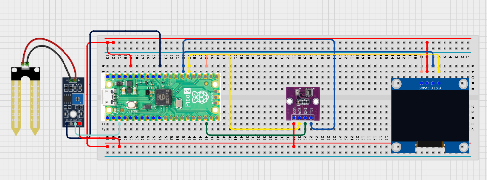

# Project 3.9.7: Smart Agriculture Iot Command Center

**Advanced Embedded Systems Project Using Raspberry Pi Pico 2 W and MicroPython**


## Overview

The Pico compares two crop zones and one shared climate reading, then shows which zone needs attention first on a local command-center dashboard.

Farm supervisors need prioritization, not just independent sensor readings from several crop areas.

A Pico 2 W prototype with two soil moisture sensors, one BME280, and an OLED command-center dashboard.

Multi-zone comparison, priority ranking, and local control-center thinking for agriculture.


## Required Components


|  |  |  |  |
| --- | --- | --- | --- |
| <br>Raspberry Pi Pico 2 W | <br>Soil sensor | <br>Breadboard | <br>Jumper wires |
| <br>LED | <br>Resistor | <br>BME280 | <br>OLED |
---

## Circuit Connections


| Component terminal | Connect to | Pico physical pin | Notes |
|---|---|---|---|
| Zone A soil sensor AO | GPIO 26 ADC0 | GPIO 26 / physical pin 31 | Zone A input |
| Zone B soil sensor AO | GPIO 27 ADC1 | GPIO 27 / physical pin 32 | Zone B input |
| BME280 VCC | 3.3V output | Physical pin 36 | Sensor power |
| BME280 GND | GND | Physical pin 38 | Common ground |
| BME280 SDA | GPIO 20 | GPIO 20 / physical pin 26 | I2C0 SDA shared with OLED |
| BME280 SCL | GPIO 21 | GPIO 21 / physical pin 27 | I2C0 SCL shared with OLED |
| OLED SDA | GPIO 20 | GPIO 20 / physical pin 26 | I2C0 SDA |
| OLED SCL | GPIO 21 | GPIO 21 / physical pin 27 | I2C0 SCL |
---

## Wiring Diagram



```
  Zone A soil AO -> GPIO 26
  Zone B soil AO -> GPIO 27
  BME280 SDA -> GPIO 20
  BME280 SCL -> GPIO 21
  OLED SDA -> GPIO 20
  OLED SCL -> GPIO 21
  Common GND -> both sensors, BME280, and OLED
  BME280 VCC -> 3.3V
  BME280 GND -> GND
```

---

## Step-by-Step Assembly

1. Connect the Zone A soil sensor analog output to GPIO 26.
2. Connect the Zone B soil sensor analog output to GPIO 27.
3. Connect the BME280 to Pico 3.3V, GND, GPIO 20 (SDA), and GPIO 21 (SCL).
4. Connect the OLED to Pico 3.3V, GND, GPIO 20, and GPIO 21.
5. Upload ssd1306.py and confirm it appears on the Pico before running the dashboard.

---

## Testing Individual Components

Before running the full project, test each subsystem separately. This makes it easier to find wiring, library, or logic problems before full integration.

1. **Hardware setup**: Assemble the Pico, sensor, indicator, and load wiring exactly as shown in the connection table before applying power.
2. **Test the input sensor**: Read each soil sensor separately so their dry and wet baselines are known.
3. **Test the output device**: Run an OLED hello-world test so the display path is verified.
4. **Test the decision logic**: Dry one zone more than the other and confirm the command center changes its priority output.
5. **Run the full system**: Run the full command center and compare the OLED summary with the serial values.
6. **Validate the prototype**: Swap the sensors or recalibrate them and check whether the priority remains physically sensible.
7. **Save the project**: Save the validated program on the Pico as main.py and keep a copy on the computer for future edits.

---

## Full Project Code

After completing and checking the circuit connections, open Thonny IDE, copy and paste this code into a new file or upload the project file to the Raspberry Pi Pico 2 W, then run it from Thonny.

```python
from machine import ADC, I2C, Pin
import bme280
import time

try:
    from ssd1306 import SSD1306_I2C
    HAS_OLED = True
except ImportError:
    HAS_OLED = False

ZONE_A_PIN = 26
ZONE_B_PIN = 27
BME_SDA_PIN = 20
BME_SCL_PIN = 21
I2C_SDA_PIN = 20
I2C_SCL_PIN = 21
SOIL_DRY_RAW = 48000
SOIL_WET_RAW = 18000

zone_a = ADC(ZONE_A_PIN)
zone_b = ADC(ZONE_B_PIN)
i2c = I2C(0, sda=Pin(BME_SDA_PIN), scl=Pin(BME_SCL_PIN), freq=400000)
climate = bme280.BME280(i2c=i2c)
if HAS_OLED:
    oled = SSD1306_I2C(128, 64, i2c)


def clamp(value, low, high):
    return max(low, min(high, value))


def dry_percent(raw):
    span = SOIL_DRY_RAW - SOIL_WET_RAW
    if span <= 0:
        return 0
    pct = int((raw - SOIL_WET_RAW) * 100 / span)
    return clamp(pct, 0, 100)


print('Agriculture command center ready')

while True:
    a_dry = dry_percent(zone_a.read_u16())
    b_dry = dry_percent(zone_b.read_u16())
    try:
        values = climate.values
        temperature = float(values[0].replace('C', ''))
        pressure = float(values[1].replace('hPa', ''))
        humidity = float(values[2].replace('%', ''))
    except Exception:
        temperature = 0
        pressure = 0
        humidity = 0

    if abs(a_dry - b_dry) < 10:
        priority = 'BALANCED'
    elif a_dry > b_dry:
        priority = 'ZONE A'
    else:
        priority = 'ZONE B'

    print('A:{}% B:{}% Temp:{}C Hum:{}% Priority:{}'.format(a_dry, b_dry, temperature, humidity, priority))

    if HAS_OLED:
        oled.fill(0)
        oled.text('Farm Command', 0, 0)
        oled.text('A:{}% B:{}%'.format(a_dry, b_dry), 0, 16)
        oled.text('T:{} H:{}%'.format(temperature, humidity), 0, 32)
        oled.text(priority[:16], 0, 50)
        oled.show()

    time.sleep(2)
```

---

## How the Code Works

| Code Section | What It Does | Why It Matters | What to Modify During Testing |
|--------------|--------------|----------------|------------------------------|
| Multi-zone sensor setup | Reads two crop zones plus one shared climate input | A command center needs comparison across zones, not one isolated value only | Calibrate each zone sensor separately before comparing them |
| dry_percent | Converts each soil reading into a dryness percentage | Zone prioritization is easier to discuss with percentages than raw ADC values | Update the dry and wet constants only after collecting baseline measurements |
| Priority logic | Chooses ZONE A, ZONE B, or BALANCED based on the dryness difference | This gives the user a decision-support summary instead of only raw data | Adjust the balanced difference threshold if your zones should be treated more strictly |
| OLED dashboard | Shows both zones and the top priority on one screen | Students can validate whether the summary matches the measured values | If the display fails, verify ssd1306.py and the I2C wiring before changing the logic |

---

## Expected Result

The serial monitor reports the current reading or state clearly.

The hardware output responds when the decision logic changes state.

Subsystem behavior matches the thresholds, timing, or rules described in the document.

### Validation Checks

- **Normal condition test**: confirm the system stays in its safe or idle state under baseline conditions
- **Warning condition test**: move the input close to the chosen threshold and confirm the transition is sensible
- **Critical condition test**: trigger the strongest alert or control state and confirm the output response is correct
- **Calibration test**: compare the sensor or timing against a known reference or repeated trial
- **Limitation test**: deliberately create an awkward or noisy condition and note how the prototype behaves

### Deployment and Limitations

- This prototype works well for classroom demonstrations and local monitoring pilots
- Before deployment, it needs calibration records, protective mounting, and regular validation checks
- Display-only systems still depend on correct sensor placement and trained users

---

## Troubleshooting

| Problem | Possible Cause | Solution |
|---------|----------------|----------|
| One zone always looks drier | The two sensors are calibrated differently | Calibrate both sensors separately and compare them again |
| Priority never changes | The two dry percentages are too similar or one sensor is stuck | Print the raw values for both zones and vary the test condition more clearly |
| Climate values read zero | The BME280 read failed | Test the BME280 separately and shorten the I2C wires if needed |
| OLED is blank | The display library or I2C wiring is wrong | Confirm ssd1306.py is on the Pico and recheck GPIO 20 and GPIO 21 |

---
