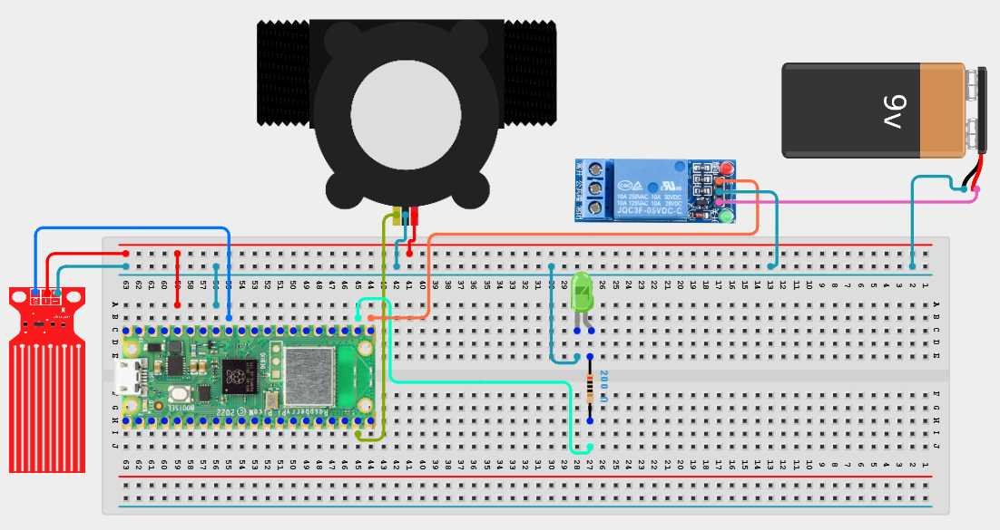

# Project 3.9.71: Smart Water Resilience System

**Advanced Embedded Systems Project Using Raspberry Pi Pico 2 W and MicroPython**


## Overview

The Pico protects stored water by switching a relay-controlled noncritical outlet off when supply becomes too low.

Water systems lose resilience when they keep serving noncritical demand even as stored supply becomes dangerously low.

A Pico 2 W prototype with a pulse flow sensor, analog water-level sensor, relay output, and status LED.

Reserve-mode protection, threshold-based resilience logic, and safe relay control.


## Required Components


|  |  |  |  |
| --- | --- | --- | --- |
| <br>Raspberry Pi Pico 2 W | <br>Gas sensor | <br>Breadboard | <br>Jumper wires |
| <br>LED | <br>Resistor |  |  |
---

## Circuit Connections


| Component terminal | Connect to | Pico physical pin | Notes |
|---|---|---|---|
| Flow sensor pulse output | GPIO 14 | GPIO 14 / physical pin 19 | 3.3V-safe pulse input |
| Water level analog output | GPIO 27 ADC1 | GPIO 27 / physical pin 32 | Storage level input |
| Relay IN | GPIO 16 | GPIO 16 / physical pin 21 | Outlet control output |
| LED anode | 220 ohm resistor to GPIO 17 | GPIO 17 / physical pin 22 | Reserve-mode LED |
---

## Wiring Diagram



```
Flow pulse output -> GPIO 14
Level analog output -> GPIO 27
GPIO 16 -> relay IN
GPIO 17 -> 220 ohm resistor -> LED anode
External supply -> relay-switched test load
```

Diagram Placeholder
[Insert wiring diagram or breadboard image here]

---

## Step-by-Step Assembly

1. Connect the flow sensor pulse output to GPIO 14 and confirm it is 3.3V-safe.
2. Connect the level sensor analog output to GPIO 27 through a safe ADC path.
3. Connect the relay input to GPIO 16 and power the relay module correctly.
4. Wire the LED to GPIO 17 through a 220 ohm resistor and connect the LED cathode to ground.
5. Attach only a safe test load until the reserve logic has been validated.

---

## Testing Individual Components

Before running the full project, test each subsystem separately. This makes it easier to find wiring, library, or logic problems before full integration.

1. **Hardware setup**: Assemble the Pico, sensor, indicator, and load wiring exactly as shown in the connection table before applying power.
2. **Test the input sensor**: Test the flow and level sensors separately before enabling reserve protection.
3. **Test the output device**: Test the relay and LED separately before running the resilience logic.
4. **Test the decision logic**: Lower the storage level and confirm the system enters reserve mode and blocks the relay.
5. **Run the full system**: Run the full controller and compare the reserve state with the live sensor values.
6. **Validate the prototype**: Discuss whether the recovery threshold is high enough to avoid repeated cycling.
7. **Save the project**: Save the validated program on the Pico as main.py and keep a copy on the computer for future edits.

---

## Full Project Code

After completing and checking the circuit connections, open Thonny IDE, copy and paste this code into a new file or upload the project file to the Raspberry Pi Pico 2 W, then run it from Thonny.

Upload and run this code after the individual tests work correctly.

```python
from machine import ADC, Pin
import time

FLOW_PIN = 14
LEVEL_PIN = 27
RELAY_PIN = 16
LED_PIN = 17
LEVEL_EMPTY = 12000
LEVEL_FULL = 52000
SAMPLE_WINDOW_S = 5
RESERVE_ENTER = 20
RESERVE_EXIT = 35

pulse_count = 0
flow = Pin(FLOW_PIN, Pin.IN, Pin.PULL_UP)
level = ADC(LEVEL_PIN)
relay = Pin(RELAY_PIN, Pin.OUT)
led = Pin(LED_PIN, Pin.OUT)
reserve_mode = False


def count_pulse(pin):
    global pulse_count
    pulse_count += 1


def clamp(value, low, high):
    return max(low, min(high, value))


def level_percent(raw):
    span = LEVEL_FULL - LEVEL_EMPTY
    if span <= 0:
        return 0
    pct = int((raw - LEVEL_EMPTY) * 100 / span)
    return clamp(pct, 0, 100)


def flow_lpm_from_pulses(pulses, seconds):
    if seconds <= 0:
        return 0.0
    return (pulses / seconds) / 7.5


flow.irq(trigger=Pin.IRQ_FALLING, handler=count_pulse)
print('Smart water resilience system ready')

while True:
    pulse_count = 0
    start = time.ticks_ms()
    while time.ticks_diff(time.ticks_ms(), start) < SAMPLE_WINDOW_S * 1000:
        time.sleep_ms(100)

    flow_lpm = flow_lpm_from_pulses(pulse_count, SAMPLE_WINDOW_S)
    storage_pct = level_percent(level.read_u16())

    if reserve_mode:
        if storage_pct >= RESERVE_EXIT:
            reserve_mode = False
    else:
        if storage_pct <= RESERVE_ENTER:
            reserve_mode = True

    relay.value(0 if reserve_mode else 1)
    led.value(1 if reserve_mode else 0)
    state = 'RESERVE' if reserve_mode else 'NORMAL'
    print('Flow:{:.2f}L/min Storage:{}% State:{}'.format(flow_lpm, storage_pct, state))
    time.sleep(2)
```

---

## How the Code Works

| Code Section | What It Does | Why It Matters | What to Modify During Testing |
|--------------|--------------|----------------|------------------------------|
| Reserve-mode hysteresis | Uses separate entry and exit thresholds for reserve protection. | Hysteresis helps the resilience controller avoid unstable switching. | Adjust RESERVE_ENTER and RESERVE_EXIT after repeated water-level tests. |
| Relay protection output | Blocks the noncritical outlet during reserve mode. | This is the protective action that gives the system resilience behavior. | Invert the relay logic if your module is active low. |
| Live reporting | Shows flow, storage, and reserve state in the Shell. | Users need to understand why service was blocked. | Compare the printed state with the LED during testing. |

---

## Expected Result

The serial monitor reports the current reading or state clearly.

The hardware output responds when the decision logic changes state.

Subsystem behavior matches the thresholds, timing, or rules described in the document.

### Validation Checks

- **Normal condition test**: confirm the system stays in its safe or idle state under baseline conditions.
- **Warning condition test**: move the input close to the chosen threshold and confirm the transition is sensible.
- **Critical condition test**: trigger the strongest alert or control state and confirm the output response is correct.
- **Calibration test**: compare the sensor or timing against a known reference or repeated trial.
- **Limitation test**: deliberately create an awkward or noisy condition and note how the prototype behaves.

### Deployment and Limitations

- This prototype could be used in school, farm, or sanitation demonstrations with safe low-voltage loads.
- Before deployment, the load wiring, enclosure, and power design need careful review.
- Actuator systems need maintenance planning because relay wear and sensor drift affect reliability.

---

## Troubleshooting

| Problem | Possible Cause | Solution |
|---------|----------------|----------|
| The system enters reserve mode too early | The storage calibration or threshold is wrong | Print the raw level value and re-measure the storage references. |
| The system never leaves reserve mode | The exit threshold is too high or storage never recovers | Verify the level reading and lower RESERVE_EXIT carefully if needed. |
| The relay does not block the load | The relay wiring or logic polarity is wrong | Test the relay separately and invert the logic if the module is active low. |
| Flow remains at zero | The pulse signal is not reaching GPIO 14 | Print the pulse count during a known flow event and verify the sensor signal path. |

---
