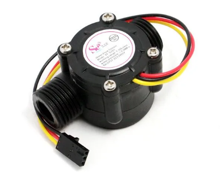
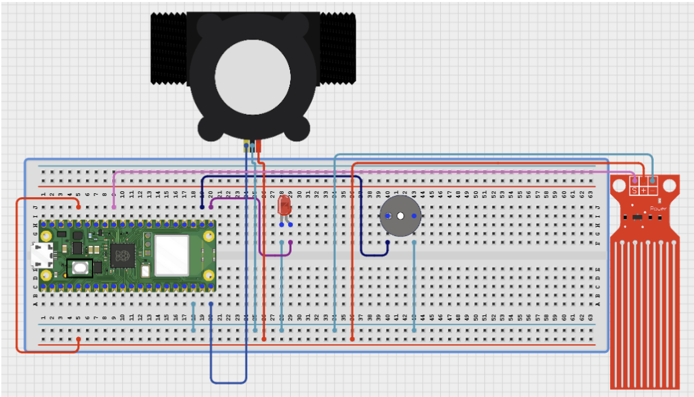

# Project 3.9.72: Smart Water Security System

**Advanced Embedded Systems Project Using Raspberry Pi Pico 2 W and MicroPython**


## Overview

The Pico watches for suspicious water loss patterns and raises a local alert when high flow appears while storage is already low.

Water loss from leaks, theft, or accidental open taps can go unnoticed when no system compares flow with available stored water.

A Pico 2 W prototype with a pulse flow sensor, analog water-level sensor, LED, and buzzer.

Water-security alert logic, leak-style pattern detection, and local warning behavior.


## Required Components


|  |  |  |  |
| --- | --- | --- | --- |
| <br>Raspberry Pi Pico 2 W | <br>Water flow sensor | <br>Breadboard | <br>Jumper wires |
| <br>Water level sensor | <br>Buzzer | <br>LED | <br>220 ohm resistor |
---

## Circuit Connections


| Component terminal | Connect to | Pico physical pin | Notes |
|---|---|---|---|
| Flow sensor pulse output | GPIO 15 | GPIO 15 / physical pin 20 | 3.3V-safe pulse input |
| Water level analog output | GPIO 27 ADC1 | GPIO 27 / physical pin 32 | Storage level input |
| LED anode | 220 ohm resistor to GPIO 16 | GPIO 16 / physical pin 21 | Visual alert output |
| Buzzer positive | GPIO 17 | GPIO 17 / physical pin 22 | Audible alert output |
---

## Wiring Diagram



```
Flow pulse output -> GPIO 15
Level analog output -> GPIO 27
GPIO 16 -> 220 ohm resistor -> LED anode
GPIO 17 -> buzzer positive
Common GND -> flow sensor, level sensor, LED, and buzzer
```

Diagram Placeholder
[Insert wiring diagram or breadboard image here]

---

## Step-by-Step Assembly

1. Connect the flow sensor pulse output to GPIO 15 and confirm it is 3.3V-safe.
2. Connect the level sensor analog output to GPIO 27 through a safe ADC path.
3. Wire the LED to GPIO 16 through a 220 ohm resistor and connect the LED cathode to ground.
4. Connect the buzzer positive pin to GPIO 17 and its negative pin to ground.
5. Record low and high storage references before trusting the storage percentage.

---

## Testing Individual Components

Before running the full project, test each subsystem separately. This makes it easier to find wiring, library, or logic problems before full integration.

1. **Hardware setup**: Assemble the Pico, sensor, indicator, and load wiring exactly as shown in the connection table before applying power.
2. **Test the input sensor**: Test the flow sensor and level sensor separately so the security state uses trusted values.
3. **Test the output device**: Test the LED and buzzer separately before running the alert logic.
4. **Test the decision logic**: Create high-flow, low-storage, and combined conditions to compare WATCH and ALERT behavior.
5. **Run the full system**: Run the full security system and compare the warning state with the printed sensor values.
6. **Validate the prototype**: Discuss what additional evidence would be needed before accusing a real leak or theft event.
7. **Save the project**: Save the validated program on the Pico as main.py and keep a copy on the computer for future edits.

---

## Full Project Code

After completing and checking the circuit connections, open Thonny IDE, copy and paste this code into a new file or upload the project file to the Raspberry Pi Pico 2 W, then run it from Thonny.

Upload and run this code after the individual tests work correctly.

```python
from machine import ADC, Pin
import time

FLOW_PIN = 15
LEVEL_PIN = 27
LED_PIN = 16
BUZZER_PIN = 17
LEVEL_EMPTY = 12000
LEVEL_FULL = 52000
SAMPLE_WINDOW_S = 5

pulse_count = 0
flow = Pin(FLOW_PIN, Pin.IN, Pin.PULL_UP)
level = ADC(LEVEL_PIN)
led = Pin(LED_PIN, Pin.OUT)
buzzer = Pin(BUZZER_PIN, Pin.OUT)


def count_pulse(pin):
    global pulse_count
    pulse_count += 1


def clamp(value, low, high):
    return max(low, min(high, value))


def level_percent(raw):
    span = LEVEL_FULL - LEVEL_EMPTY
    if span <= 0:
        return 0
    pct = int((raw - LEVEL_EMPTY) * 100 / span)
    return clamp(pct, 0, 100)


def flow_lpm_from_pulses(pulses, seconds):
    if seconds <= 0:
        return 0.0
    return (pulses / seconds) / 7.5


flow.irq(trigger=Pin.IRQ_FALLING, handler=count_pulse)
print('Smart water security system ready')

while True:
    pulse_count = 0
    start = time.ticks_ms()
    while time.ticks_diff(time.ticks_ms(), start) < SAMPLE_WINDOW_S * 1000:
        time.sleep_ms(100)

    flow_lpm = flow_lpm_from_pulses(pulse_count, SAMPLE_WINDOW_S)
    storage_pct = level_percent(level.read_u16())

    if flow_lpm > 3.5 and storage_pct < 25:
        state = 'ALERT'
    elif flow_lpm > 2.0 or storage_pct < 40:
        state = 'WATCH'
    else:
        state = 'NORMAL'

    led.value(1 if state != 'NORMAL' else 0)
    buzzer.value(1 if state == 'ALERT' else 0)
    print('Flow:{:.2f}L/min Storage:{}% State:{}'.format(flow_lpm, storage_pct, state))
    time.sleep(2)
```

---

## How the Code Works

| Code Section | What It Does | Why It Matters | What to Modify During Testing |
|--------------|--------------|----------------|------------------------------|
| Combined security rule | Checks whether demand and stored water together look suspicious. | Suspicious loss is easier to detect when two signals are considered together. | Tune the high-flow and low-storage thresholds after repeated test conditions. |
| Alert levels | Uses WATCH and ALERT states instead of one binary alarm. | Multiple levels help the system stay informative before it becomes critical. | Adjust the WATCH threshold so minor normal usage does not trigger too often. |
| LED and buzzer outputs | Uses the LED for any warning and the buzzer only for the strongest alert. | Different output intensity makes the warning easier to interpret. | If the buzzer is too disruptive, test with the LED first. |

---

## Expected Result

The serial monitor reports the current reading or state clearly.

The hardware output responds when the decision logic changes state.

Subsystem behavior matches the thresholds, timing, or rules described in the document.

### Validation Checks

- **Normal condition test**: confirm the system stays in its safe or idle state under baseline conditions.
- **Warning condition test**: move the input close to the chosen threshold and confirm the transition is sensible.
- **Critical condition test**: trigger the strongest alert or control state and confirm the output response is correct.
- **Calibration test**: compare the sensor or timing against a known reference or repeated trial.
- **Limitation test**: deliberately create an awkward or noisy condition and note how the prototype behaves.

### Deployment and Limitations

- This prototype can be used for local warning demonstrations and early field trials.
- Before deployment, it needs enclosure protection, calibration records, and a clear response procedure.
- Alert systems should always be treated as decision-support tools unless they are certified for the application.

---

## Troubleshooting

| Problem | Possible Cause | Solution |
|---------|----------------|----------|
| The system is always in alert | The thresholds are too strict or the level calibration is wrong | Print the live values and re-measure the storage references before changing thresholds. |
| The buzzer never sounds | The alert state never triggers or the buzzer wiring is wrong | Test the buzzer directly and create a stronger combined low-storage and high-flow condition. |
| Flow stays at zero | The pulse signal is not reaching GPIO 14 | Print the pulse count during a known flow event and verify the sensor path. |
| Storage never changes | The level sensor wiring or calibration is wrong | Print the raw ADC value and recheck the analog path and reference values. |

---


---
