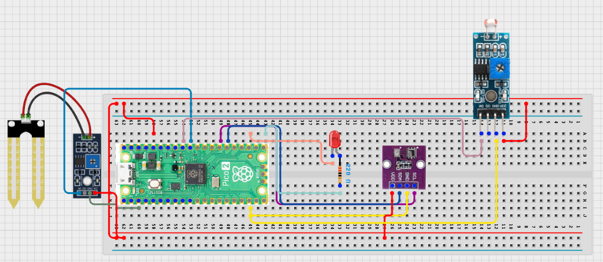

# Project 3.9.8: Smart Agriculture Iot Network

**Advanced Embedded Systems Project Using Raspberry Pi Pico 2 W and MicroPython**


## Overview

The Pico works as a farm sensor node that stores structured crop-condition records locally and can optionally upload them to a local network endpoint.

Networked agriculture systems are hard to trust when a field node cannot preserve local evidence of what it measured.

A Pico 2 W node with a soil moisture sensor, DHT22, light sensor, status LED, local data log, and optional Wi-Fi upload.

Field-node architecture, local-first logging, and honest network-ready design.


## Required Components


|  |  |  |  |
| --- | --- | --- | --- |
| <br>Raspberry Pi Pico 2 W | <br>Soil sensor | <br>Breadboard | <br>Jumper wires |
| <br>LED | <br>Resistor | <br>BME280 | <br>LDR |
---

## Circuit Connections


| Component terminal | Connect to | Pico physical pin | Notes |
|---|---|---|---|
| Soil sensor AO | GPIO 26 ADC0 | GPIO 26 / physical pin 31 | Soil input |
| Light sensor output | GPIO 27 ADC1 | GPIO 27 / physical pin 32 | Light input |
| DHT22 DATA | GPIO 15 | GPIO 15 / physical pin 20 | Climate input |
| LED anode | 220 ohm resistor to GPIO 16 | GPIO 16 / physical pin 21 | Activity LED |
---

## Wiring Diagram



```
Soil sensor AO -> GPIO 26
Light sensor output -> GPIO 27
DHT22 DATA -> GPIO 15
GPIO 16 -> 220 ohm resistor -> LED anode
Common GND -> sensors and LED
```

Diagram Placeholder
[Insert wiring diagram or breadboard image here]

---

## Step-by-Step Assembly

1. Connect the soil sensor analog output to GPIO 26 and plan to calibrate wet and dry references later.
2. Build the light sensor analog path and connect it to GPIO 27.
3. Connect the DHT22 to Pico 3.3V, GND, and GPIO 15.
4. Wire the LED to GPIO 16 through a 220 ohm resistor and connect the LED cathode to ground.
5. Enter Wi-Fi credentials and local endpoint details only after the local record loop works correctly.

---

## Testing Individual Components

Before running the full project, test each subsystem separately. This makes it easier to find wiring, library, or logic problems before full integration.

1. **Hardware setup**: Assemble the Pico, sensor, indicator, and load wiring exactly as shown in the connection table before applying power.
2. **Test the input sensor**: Test the soil sensor, light sensor, and DHT22 separately so every field in the node record has a believable baseline.
3. **Test the output device**: Blink the LED and test local file writing before enabling optional upload.
4. **Test the decision logic**: Change soil and light conditions and confirm the irrigation-priority field updates for understandable reasons.
5. **Run the full system**: Run the full node and compare local-only behavior with optional upload behavior to a local server.
6. **Validate the prototype**: Disable Wi-Fi and confirm the field node still stores useful local records for later review.
7. **Save the project**: Save the validated program on the Pico as main.py and keep a copy on the computer for future edits.

---

## Full Project Code

After completing and checking the circuit connections, open Thonny IDE, copy and paste this code into a new file or upload the project file to the Raspberry Pi Pico 2 W, then run it from Thonny.

Upload and run this code after the individual tests work correctly.

```python
import dht
import network
import socket
import time
import ujson as json
from machine import ADC, Pin

SOIL_PIN = 26
LIGHT_PIN = 27
DHT_PIN = 15
LED_PIN = 16
LOG_FILE = 'agri_333.jsonl'
UPLOAD_ENABLED = False
WIFI_SSID = 'YOUR_WIFI'
WIFI_PASSWORD = 'YOUR_PASSWORD'
SERVER_HOST = '192.168.1.50'
SERVER_PORT = 8000
SERVER_PATH = '/agriculture'
INTERVAL_S = 60
SOIL_DRY_RAW = 48000
SOIL_WET_RAW = 18000

soil = ADC(SOIL_PIN)
light = ADC(LIGHT_PIN)
climate = dht.DHT22(Pin(DHT_PIN))
led = Pin(LED_PIN, Pin.OUT)


def clamp(value, low, high):
    return max(low, min(high, value))


def dryness_percent(raw):
    span = SOIL_DRY_RAW - SOIL_WET_RAW
    if span <= 0:
        return 0
    pct = int((raw - SOIL_WET_RAW) * 100 / span)
    return clamp(pct, 0, 100)


def connect_wifi(timeout_s=15):
    wlan = network.WLAN(network.STA_IF)
    if wlan.isconnected():
        return wlan
    wlan.active(True)
    wlan.connect(WIFI_SSID, WIFI_PASSWORD)
    for _ in range(timeout_s):
        if wlan.isconnected():
            return wlan
        time.sleep(1)
    return None


def append_record(record):
    try:
        with open(LOG_FILE, 'a') as handle:
            handle.write(json.dumps(record) + '\n')
    except OSError:
        print('Could not write local record')


def upload_record(record):
    if not UPLOAD_ENABLED:
        return False
    wlan = connect_wifi()
    if wlan is None:
        return False
    address = socket.getaddrinfo(SERVER_HOST, SERVER_PORT)[0][-1]
    body = json.dumps(record)
    request = 'POST {} HTTP/1.1\r\nHost: {}\r\nContent-Type: application/json\r\nContent-Length: {}\r\nConnection: close\r\n\r\n{}'.format(
        SERVER_PATH,
        SERVER_HOST,
        len(body),
        body,
    )
    sock = socket.socket()
    try:
        sock.connect(address)
        sock.send(request.encode())
        sock.recv(128)
        return True
    finally:
        sock.close()


print('Smart agriculture IoT network node ready')

while True:
    dry_pct = dryness_percent(soil.read_u16())
    light_raw = light.read_u16()
    try:
        climate.measure()
        temperature = climate.temperature()
        humidity = climate.humidity()
    except OSError:
        temperature = 0
        humidity = 0

    if dry_pct >= 65:
        irrigation_priority = 'HIGH'
    elif dry_pct >= 40:
        irrigation_priority = 'MEDIUM'
    else:
        irrigation_priority = 'LOW'

    record = {
        'schema_version': 1,
        'node_id': 'field_node_333',
        'uptime_s': time.ticks_ms() // 1000,
        'dryness_pct': dry_pct,
        'light_raw': light_raw,
        'temperature_c': temperature,
        'humidity_pct': humidity,
        'irrigation_priority': irrigation_priority,
    }

    append_record(record)
    uploaded = upload_record(record)
    led.value(1)
    time.sleep_ms(120)
    led.value(0)
    print(record, 'uploaded' if uploaded else 'local_only')
    time.sleep(INTERVAL_S)
```

---

## How the Code Works

| Code Section | What It Does | Why It Matters | What to Modify During Testing |
|--------------|--------------|----------------|------------------------------|
| Structured node record | Combines soil, light, and climate data into one field-node record. | A network node becomes useful only when its record format is stable and well documented. | Add fields only if you also update the validation plan and explanation. |
| Local-first logging | Stores each record locally before any upload is attempted. | Local logging protects the node against network failure and missing dashboards. | Check the local file contents before debugging upload behavior. |
| Irrigation-priority field | Adds a simple action label to each record. | The record is more meaningful when it includes a practical interpretation as well as raw values. | Recalibrate the dryness thresholds after measuring your own sensor. |

---

## Expected Result

The serial monitor prints one field-node record per interval with soil, light, climate, and irrigation-priority fields.

The Pico stores records locally even when Wi-Fi is disabled.

When upload is enabled and working, the same record can be checked against the local server copy.

### Validation Checks

- **Normal condition test**: confirm that one structured record is written locally each interval.
- **Sensor validation test**: vary soil or light conditions and confirm the related fields respond in the record.
- **Decision logic test**: dry the soil and confirm irrigation_priority rises from LOW to MEDIUM or HIGH.
- **Communication validation test**: enable upload and compare the uploaded payload with the local file record.
- **Fallback test**: disable Wi-Fi and confirm the node still logs locally without crashing.

### Deployment and Limitations

- This prototype is suitable for local pilots where sensor data must be logged or transmitted over short periods.
- Before deployment, network reliability, power backup, and endpoint security need attention.
- The system should keep useful local behavior even when communication fails.

---

## Troubleshooting

| Problem | Possible Cause | Solution |
|---------|----------------|----------|
| The local file stays empty | File writing failed | Test a short text write and confirm the Pico file system is writable. |
| Uploads always fail | The credentials or endpoint settings are wrong | Check UPLOAD_ENABLED, the Wi-Fi details, and the server host, port, and path. |
| Dryness never changes | The soil wiring or calibration is wrong | Print the raw soil value and re-measure the wet and dry references. |
| Climate values stay at zero | The DHT22 read failed | Test the DHT22 separately and shorten the data wire if needed. |

---
