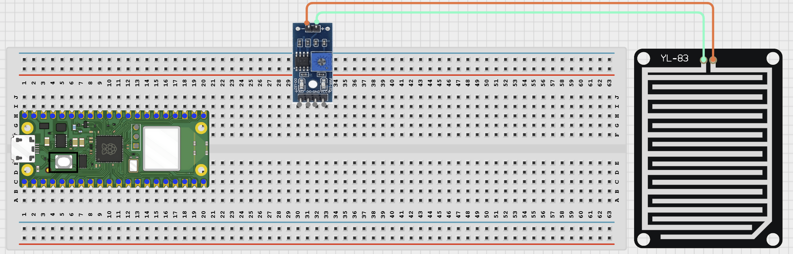
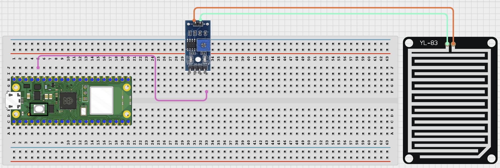
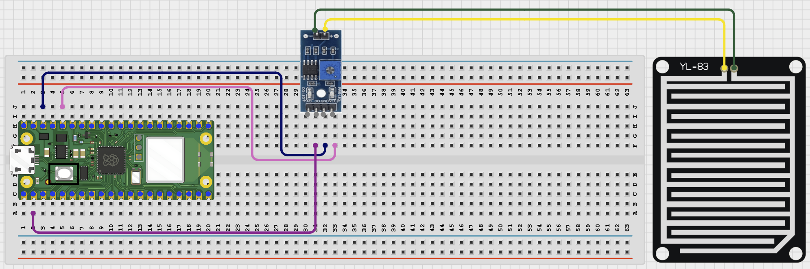

# STEMAIDE AFRICA

# Project 81: Bluetooth Rain Detector

**Beginner Embedded Systems Project Using Raspberry Pi Pico 2 W and MicroPython**


# Overview

Build a Bluetooth rain detector that sends a simple wet or dry message to your phone.

This project demonstrates how a digital weather sensor can trigger a wireless alert.

The final result should let a phone connect to the Pico, ask for the current rain status, and receive an alert when the sensor becomes wet.

# Required Components

|  |  |  |  |
| --- | --- | --- | --- |
| <br>Raspberry Pi Pico 2 W | <br>Rain sensor module | <br>Breadboard | <br>Jumper wires |
| <br>Phone with BLE app |  |  |  |


# Circuit Connections

| Component Pin        | Connects To | Pico GPIO / Physical Pin Number | Notes                                    |
| -------------------- | ----------- | ------------------------------- | ---------------------------------------- |
| Rain sensor VCC      | 3.3V        | Physical pin 36                 | Use 3.3V power for beginner-safe testing |
| Rain sensor GND      | GND         | Physical pin 38                 | Common ground                            |
| Rain sensor D0 / OUT | GPIO 1      | GPIO 1 / physical pin 2         | Digital rain signal                      |

# Step-by-Step Assembly

## Step 1: Place the Raspberry Pi Pico 2 W

Place the Raspberry Pi Pico 2 W on the breadboard so it sits across the center gap.

Keep the USB port facing outward so you can easily connect it to your computer.


---

## Step 2: Place the Rain Sensor Module

Place the rain sensor module on the breadboard, or place the sensing plate beside the breadboard.

Identify VCC, GND, and D0 / OUT before wiring.

Check the printed pin labels on your module.



---

## Step 3: Connect the Rain Sensor VCC

Connect rain sensor VCC to 3.3V.



---

## Step 4: Connect the Rain Sensor GND and Signal Pin

Connect rain sensor GND to GND.

Connect rain sensor D0 / OUT to GPIO 1.



---

# Wiring Check

- - Pico 2 W is placed correctly across the breadboard center gap
- - Rain sensor VCC connects to 3.3V
- - Rain sensor GND connects to GND
- - Rain sensor D0 / OUT connects to GPIO 1
- - No loose jumper wires

---

# Safety Note

Water should touch only the rain sensor plate. Keep the Pico, breadboard, USB cable, and jumper wires dry.

---

# Testing Individual Components

Before running the full project, test each part separately. This makes it easier to find wiring or code problems.

## Rain Sensor Digital Test

Check that the rain sensor changes state when the sensor plate gets wet.

```python
from machine import Pin
import time

rain = Pin(1, Pin.IN, Pin.PULL_DOWN)
while True:
    print('Rain sensor:', rain.value())
    time.sleep(0.5)
```

Expected test result: The Shell should print changing values when the sensor changes between dry and wet. If the logic looks reversed, you can swap the wet and dry meaning in the final code.

---

## BLE Advertising Test

Check that the Pico advertises as a BLE device your phone can see.

```python
import bluetooth
import time
from ble_uart import BLEUART

ble = bluetooth.BLE()
ble.active(True)
uart = BLEUART(ble, name='Pico-Rain')
print('Scan for Pico-Rain in your BLE app')
while True:
    time.sleep(1)
```

Expected test result: Your phone BLE app should find a device named Pico-Rain.

---

# Full Project Code

Upload and run this code after the individual tests work correctly.

```python
from machine import Pin
import bluetooth
import time
from ble_uart import BLEUART

rain = Pin(1, Pin.IN, Pin.PULL_DOWN)

ble = bluetooth.BLE()
ble.active(True)
uart = BLEUART(ble, name='Pico-Rain')


def rain_detected():
    return rain.value() == 1


def status_message():
    if rain_detected():
        return 'RAIN DETECTED!'
    return 'Surface is dry.'


def on_rx(data):
    command = data.decode('utf-8').strip().lower()
    print('Received command:', command)

    if command in ('status', 'read', 'rain'):
        uart.write((status_message() + '\n').encode())
    elif command == 'help':
        uart.write(b'Commands: status, read, rain, help\n')
    else:
        uart.write(b'Unknown command. Send help.\n')

uart.on_rx(on_rx)

last_state = rain_detected()
print('Bluetooth rain detector ready')
print('Connect with a BLE app and send: status, read, rain, or help')

while True:
    current_state = rain_detected()
    if current_state != last_state:
        if current_state:
            uart.write(b'RAIN DETECTED!\n')
            print('Rain detected')
        else:
            uart.write(b'Surface is dry again.\n')
            print('Surface dry again')
        last_state = current_state
    time.sleep(0.1)
```

---

# How the Code Works

| Code Section          | What It Does                                           | Why It Matters                                               |
| --------------------- | ------------------------------------------------------ | ------------------------------------------------------------ |
| `rain_detected()`     | Reads the digital rain input and returns True or False | This keeps the wet or dry decision easy to understand        |
| `status_message()`    | Builds a short message for the phone                   | Students get a clear result instead of only a raw 0 or 1     |
| `on_rx()` callback    | Replies when the phone sends a text command            | This lets the student request the current status at any time |
| Change detection loop | Sends an alert only when the sensor state changes      | This avoids sending the same message over and over           |

---

# Expected Result

After running the code, your phone BLE app should find Pico-Rain. When the sensor becomes wet, the phone should receive a RAIN DETECTED! message. Sending `status`, `read`, or `rain` should return the current wet or dry message.

---

# Troubleshooting

| Problem                           | Possible Cause                                          | Solution                                                                                               |
| --------------------------------- | ------------------------------------------------------- | ------------------------------------------------------------------------------------------------------ |
| Phone cannot find Pico-Rain       | BLE helper files are missing or Bluetooth is not active | Check that `ble_uart.py` and `ble_advertising.py` are saved on the Pico and rerun the advertising test |
| Rain state never changes          | Sensor wiring is wrong or the module is not powered     | Check VCC, GND, and the D0/OUT pin on GPIO 1                                                           |
| Wet and dry messages are reversed | Your sensor module uses opposite logic                  | Change `rain_detected()` so it returns `rain.value() == 0` instead                                     |

# Next Project

Project 082: Bluetooth Soil Dryness Monitor

[Open Bluetooth Soil Dryness Monitor](1.1.15%20Bluetooth%20Soil%20Dryness%20Monitor.md)
