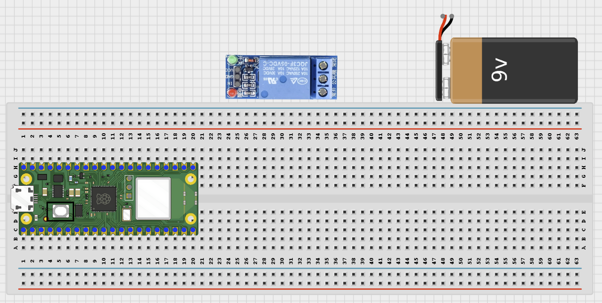
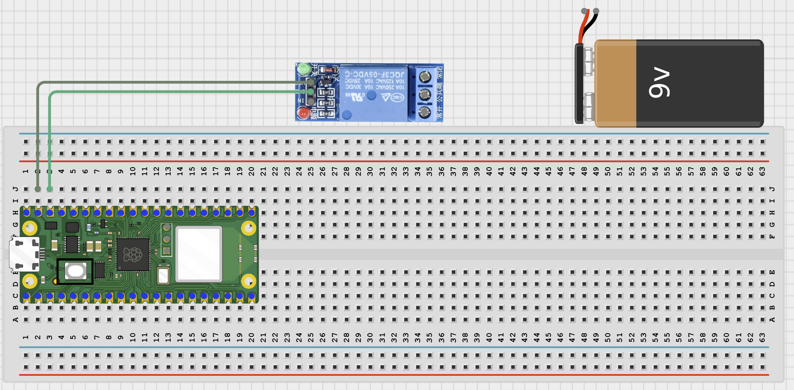
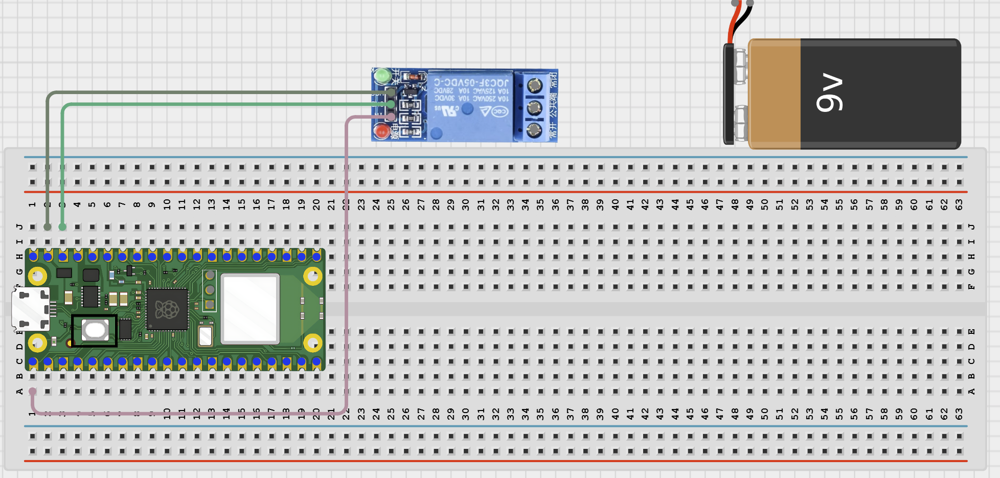
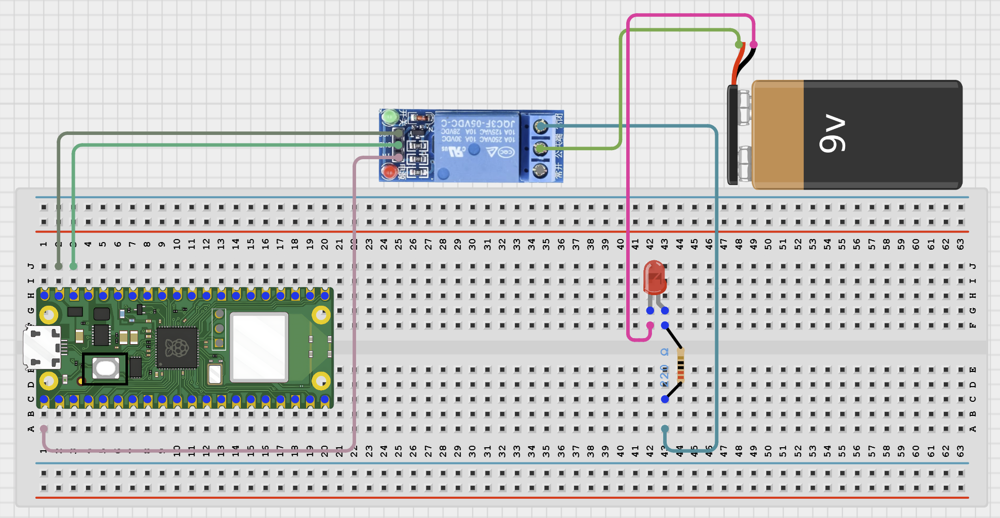

# STEMAIDE AFRICA

# Project 84: Bluetooth Timer Controller

**Beginner Embedded Systems Project Using Raspberry Pi Pico 2 W and MicroPython**


# Overview

Build a Bluetooth timer controller that turns a relay on for a chosen number of seconds.

This project demonstrates wireless control plus timed output switching.

The final result should let a phone send a time value, switch the relay on, and automatically switch it off when the timer finishes.

# Required Components

|  |  |  |  |
| --- | --- | --- | --- |
| <br>Raspberry Pi Pico 2 W | <br>1-channel relay module | <br>Jumper wires | <br>Phone with BLE app |
| <br>Optional low-voltage load |  |  |  |


# Circuit Connections

| Component Pin    | Connects To                    | Pico GPIO / Physical Pin Number        | Notes                                       |
| ---------------- | ------------------------------ | -------------------------------------- | ------------------------------------------- |
| Relay module VCC | VBUS 5V or module-rated supply | Physical pin 40 if powered by USB VBUS | Use only if your relay module requires 5V   |
| Relay module GND | GND                            | Physical pin 38                        | Common ground                               |
| Relay module IN  | GPIO 0                         | GPIO 0 / physical pin 1                | Control signal. Use a 3.3V-safe relay input |

# Step-by-Step Assembly

## Step 1: Place the Raspberry Pi Pico 2 W

Place the Raspberry Pi Pico 2 W on the breadboard so it sits across the center gap.

Keep the USB port facing outward so you can easily connect it to your computer.


---

## Step 2: Place the Relay Module

Place the 1-channel relay module on the breadboard or beside it where the pins are easy to reach.

Identify VCC, GND, IN, COM, NO, and NC before wiring.

Keep the relay load side separate from the Pico logic side.



---

## Step 3: Connect Relay Power

Connect relay VCC to VBUS 5V or module-rated supply.

Connect relay GND to GND.



---

## Step 4: Connect the Relay IN Pin

Connect relay IN to GPIO 0.

This is the Bluetooth-controlled relay signal.



---

## Step 5: Optional Low-Voltage Load

If you connect a test load, use only a safe low-voltage load.

Wire the load through the relay output side according to the load's power supply.

Do not connect mains AC power in this beginner project.



---

# Wiring Check

- - Pico 2 W is placed correctly across the breadboard center gap
- - Relay VCC connects to VBUS 5V or module-rated supply
- - Relay GND connects to GND
- - Relay IN connects to GPIO 0
- - Optional load uses only safe low-voltage relay wiring
- - No loose jumper wires

---

# Safety Note

Do not connect mains AC power. Use an external supply for loads that need more current than the Pico can provide.

---

# Testing Individual Components

Before running the full project, test each part separately. This makes it easier to find wiring or code problems.

## Relay Click Test

Check that the relay switches on and off before adding Bluetooth code.

```python
from machine import Pin
import time

relay = Pin(0, Pin.OUT)
relay.value(1)
time.sleep(1)
relay.value(0)
time.sleep(1)
relay.value(1)
```

Expected test result: You should hear the relay click on, then click off again. If the relay behaves the opposite way, your module may use different active logic.

## BLE Advertising Test

Check that the Pico advertises as a BLE device your phone can see.

```python
import bluetooth
import time
from ble_uart import BLEUART

ble = bluetooth.BLE()
ble.active(True)
uart = BLEUART(ble, name='Pico-Timer')
print('Scan for Pico-Timer in your BLE app')
while True:
    time.sleep(1)
```

Expected test result: Your phone BLE app should find a device named Pico-Timer.

---

# Full Project Code

Upload and run this code after the individual tests work correctly.

```python
from machine import Pin
import bluetooth
import time
from ble_uart import BLEUART

relay = Pin(0, Pin.OUT)
RELAY_ACTIVE_LEVEL = 0
RELAY_INACTIVE_LEVEL = 1

ble = bluetooth.BLE()
ble.active(True)
uart = BLEUART(ble, name='Pico-Timer')

timer_running = False
timer_duration = 0
timer_end_ms = 0


def relay_on():
    relay.value(RELAY_ACTIVE_LEVEL)


def relay_off():
    relay.value(RELAY_INACTIVE_LEVEL)


def start_timer(seconds):
    global timer_running, timer_duration, timer_end_ms
    timer_duration = seconds
    timer_end_ms = time.ticks_add(time.ticks_ms(), seconds * 1000)
    timer_running = True
    relay_on()
    uart.write(('Timer started for {} seconds\n'.format(seconds)).encode())
    print('Timer started for', seconds, 'seconds')


def stop_timer(message):
    global timer_running
    relay_off()
    timer_running = False
    uart.write((message + '\n').encode())
    print(message)


def status_text():
    if timer_running:
        remaining = time.ticks_diff(timer_end_ms, time.ticks_ms()) // 1000
        if remaining < 0:
            remaining = 0
        return 'RUNNING: {}s left'.format(remaining)
    return 'IDLE'


def on_rx(data):
    command = data.decode('utf-8').strip().lower()
    print('Received command:', command)

    if command == 'status':
        uart.write((status_text() + '\n').encode())
    elif command == 'cancel':
        stop_timer('Timer cancelled')
    elif command == 'help':
        uart.write(b'Send a number of seconds, or use status, cancel, help\n')
    else:
        try:
            seconds = int(command)
            if seconds <= 0:
                uart.write(b'Enter a positive number of seconds.\n')
            else:
                start_timer(seconds)
        except ValueError:
            uart.write(b'Unknown command. Send help.\n')

uart.on_rx(on_rx)
relay_off()

print('Bluetooth timer controller ready')
print('Send a number such as 5 to start a 5-second relay timer')
print('Other commands: status, cancel, help')

while True:
    if timer_running and time.ticks_diff(timer_end_ms, time.ticks_ms()) <= 0:
        stop_timer('Timer complete! Relay off.')
    time.sleep(0.1)
```

---

# How the Code Works

| Code Section                   | What It Does                                                     | Why It Matters                                     |
| ------------------------------ | ---------------------------------------------------------------- | -------------------------------------------------- |
| `relay_on()` and `relay_off()` | Hide the active-low relay logic behind simple function names     | This makes the code easier for beginners to follow |
| `start_timer()`                | Starts the timer, stores the finish time, and turns the relay on | The output stays active only for the chosen time   |
| `status_text()`                | Reports whether the timer is running and how many seconds remain | The phone can check progress at any time           |
| Main loop                      | Watches for the timer to finish and then turns the relay off     | This is what makes the timer automatic             |

---

# Expected Result

After running the code, your phone BLE app should find Pico-Timer. Sending a number such as 5 should turn the relay on for about 5 seconds and then turn it off automatically. Sending `status` should show whether the timer is running, and `cancel` should stop it early.

---

# Troubleshooting

| Problem                              | Possible Cause                                                       | Solution                                                                                               |
| ------------------------------------ | -------------------------------------------------------------------- | ------------------------------------------------------------------------------------------------------ |
| Relay never switches                 | Relay module is not powered correctly or the IN pin is not on GPIO 0 | Check module power, GND, and IN wiring                                                                 |
| Relay stays on when it should be off | Your relay module may use opposite active logic                      | Swap `RELAY_ACTIVE_LEVEL` and `RELAY_INACTIVE_LEVEL` in the code                                       |
| Phone cannot find Pico-Timer         | BLE helper files are missing or Bluetooth is not active              | Check that `ble_uart.py` and `ble_advertising.py` are saved on the Pico and rerun the advertising test |

# Next Project

Project 085: Bluetooth LED Dimmer

[Open Bluetooth LED Dimmer](1.1.2%20Bluetooth%20LED%20Dimmer.md)
