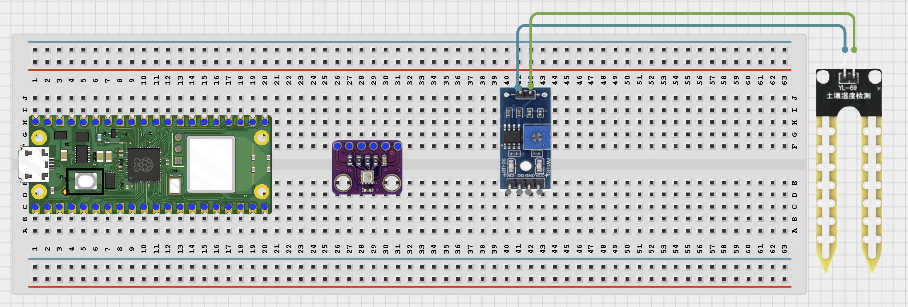
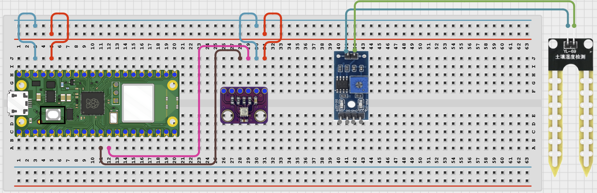
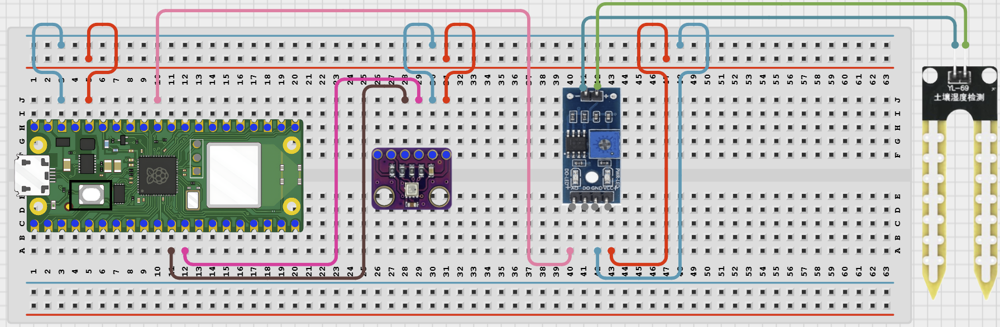

# STEMAIDE AFRICA

# Project 99: Bluetooth Plant Health Checker

**Beginner Embedded Systems Project Using Raspberry Pi Pico 2 W and MicroPython**


# Overview

Build a Bluetooth plant health checker that combines soil moisture and BME280 climate readings.

This project demonstrates using several sensor values to create one simple plant health message.

The final result should let a phone request the plant status along with the current moisture, temperature, and humidity readings.

# Required Components

|  |  |  |  |
| --- | --- | --- | --- |
| <br>Raspberry Pi Pico 2 W | <br>BME280 Sensor Module | <br>Soil Moisture Sensor | <br>Breadboard |
| <br>Jumper Wires | <br>Phone with BLE App |  |  |


# Circuit Connections

| Component Pin    | Connects To | Pico GPIO / Physical Pin Number | Notes         |
| ---------------- | ----------- | ------------------------------- | ------------- |
| BME280 VIN / VCC | 3.3V        | Physical Pin 36                 | Use 3.3V      |
| BME280 GND       | GND         | Physical Pin 38                 | Common ground |
| BME280 SDA       | GPIO 8      | GPIO 8 / Physical Pin 11        | I2C0 SDA      |
| BME280 SCL       | GPIO 9      | GPIO 9 / Physical Pin 12        | I2C0 SCL      |
| Soil Sensor VCC  | 3.3V        | Physical Pin 36                 | Use 3.3V      |
| Soil Sensor GND  | GND         | Physical Pin 38                 | Common ground |
| Soil Sensor AOUT | GPIO 26     | GPIO 26 / Physical Pin 31       | ADC input     |

# Step-by-Step Assembly

## Step 1: Place the Raspberry Pi Pico 2 W

Place the Raspberry Pi Pico 2 W on the breadboard so it sits across the center gap.

Keep the USB port facing outward so you can easily connect it to your computer.


---

## Step 2: Place the BME280 and Soil Moisture Sensor

Place the BME280 module on the breadboard.

Place the soil moisture sensor module on the breadboard or position it so the probe can be inserted into soil.

Identify the following pins before wiring:

### BME280

- VCC
- GND
- SDA
- SCL

### Soil Moisture Sensor

- VCC
- GND
- AOUT



---

## Step 3: Connect the BME280

Connect:

- BME280 VIN / VCC -> 3.3V
- BME280 GND -> GND
- BME280 SDA -> GPIO 8
- BME280 SCL -> GPIO 9



---

## Step 4: Connect the Soil Moisture Sensor

Connect:

- Soil Sensor VCC -> 3.3V
- Soil Sensor GND -> GND
- Soil Sensor AOUT -> GPIO 26



---

## Wiring Check

- - Pico 2 W is placed correctly across the breadboard center gap
- - BME280 VIN / VCC connects to 3.3V
- - BME280 GND connects to GND
- - BME280 SDA connects to GPIO 8
- - BME280 SCL connects to GPIO 9
- - Soil moisture sensor VCC connects to 3.3V
- - Soil moisture sensor GND connects to GND
- - Soil moisture sensor AOUT connects to GPIO 26
- - No loose jumper wires

### Beginner Note

The BME280 uses I2C communication while the soil moisture sensor uses an ADC pin. Check each wiring group separately.

### Safety Note

Do not pour water onto the Pico or breadboard. Keep the Pico away from wet soil and water during testing.

---

# Testing Individual Components

Before running the full project, test each part separately. This makes it easier to find wiring or code problems.

## I2C Scanner Test

Check that the Pico can detect the BME280 on the I2C bus.

```python
from machine import Pin, I2C

i2c = I2C(0, sda=Pin(8), scl=Pin(9), freq=100000)

print('I2C devices:', i2c.scan())
```

### Expected Test Result

The Shell should print at least one I2C address, commonly **118** or **119**.

---

## BME280 Sensor Test

Check that temperature and humidity can be read.

```python
from machine import Pin, I2C
import time
import BME280

i2c = I2C(0, sda=Pin(8), scl=Pin(9), freq=100000)
bme = BME280.BME280(i2c=i2c)

while True:
    print('Temp:', bme.temperature, 'Humidity:', bme.humidity)
    time.sleep(1)
```

### Expected Test Result

The Shell should display changing temperature and humidity readings.

---

## Soil Moisture ADC Test

Check that the sensor value changes between dry and wet conditions.

```python
from machine import ADC, Pin
import time

soil = ADC(Pin(26))

while True:
    print('Raw soil value:', soil.read_u16())
    time.sleep(0.5)
```

### Expected Test Result

The raw ADC value should change when the probe moves between dry and wet soil.

---

## BLE Advertising Test

Check that the Pico advertises as a BLE device your phone can see.

```python
import bluetooth
import time
from ble_uart import BLEUART

ble = bluetooth.BLE()
ble.active(True)

uart = BLEUART(ble, name='Pico-Plant')

print('Scan for Pico-Plant in your BLE app')

while True:
    time.sleep(1)
```

### Expected Test Result

Your phone BLE app should find a device named **Pico-Plant**.

---

# Full Project Code

```python
from machine import Pin, ADC, I2C
import bluetooth
import time
import BME280
from ble_uart import BLEUART

i2c = I2C(0, sda=Pin(8), scl=Pin(9), freq=100000)
bme = BME280.BME280(i2c=i2c)
soil = ADC(Pin(26))

ble = bluetooth.BLE()
ble.active(True)
uart = BLEUART(ble, name='Pico-Plant')


def get_moisture_percent():
    raw = soil.read_u16()
    return 100 - int((raw * 100) / 65535)


def parse_number(text):
    clean = text.replace(' degrees C', '').replace('%', '').replace('hPa', '').strip()
    number_text = clean.split()[0]
    return float(number_text)


def plant_status():
    moisture = get_moisture_percent()
    temp = parse_number(bme.temperature)
    humidity = parse_number(bme.humidity)

    if moisture < 30:
        status = 'NEEDS WATER'
    elif temp > 30:
        status = 'TOO HOT'
    elif humidity < 35:
        status = 'AIR TOO DRY'
    else:
        status = 'HEALTHY'

    return status, moisture, temp, humidity


def on_rx(data):
    command = data.decode('utf-8').strip().lower()

    if command in ('read', 'status', 'plant'):
        status, moisture, temp, humidity = plant_status()
        uart.write(('Status: {}\n'.format(status)).encode())
        uart.write(('Soil moisture: {}%\n'.format(moisture)).encode())
        uart.write(('Temperature: {}\n'.format(bme.temperature)).encode())
        uart.write(('Humidity: {}\n'.format(bme.humidity)).encode())

    elif command == 'help':
        uart.write(b'Commands: read, status, plant, help\n')

    else:
        uart.write(b'Unknown command. Send help.\n')


uart.on_rx(on_rx)

print('Bluetooth plant health checker ready')
print('Send read, status, plant, or help from the BLE app')

while True:
    time.sleep(1)
```

---

# How the Code Works

| Code Section           | What It Does                                              | Why It Matters                                           |
| ---------------------- | --------------------------------------------------------- | -------------------------------------------------------- |
| ADC moisture reading   | Reads the soil sensor and converts it into a percentage   | The plant decision needs a simple moisture value         |
| `parse_number()`       | Converts BME280 text readings into numbers for comparison | Allows safe temperature and humidity comparisons         |
| `plant_status()`       | Uses simple rules to choose a plant health label          | Demonstrates sensor-based decision making                |
| Bluetooth status reply | Sends both the health label and sensor readings           | The phone receives both summary and detailed information |

---

# Expected Result

After running the code, your BLE app should find **Pico-Plant**.

Sending:

- `read`
- `status`
- `plant`

should return a plant health label such as:

- HEALTHY
- NEEDS WATER
- TOO HOT
- AIR TOO DRY

along with the current:

- Soil moisture
- Temperature
- Humidity

readings.

---

# Troubleshooting

| Problem                      | Possible Cause                                              | Solution                                                                                       |
| ---------------------------- | ----------------------------------------------------------- | ---------------------------------------------------------------------------------------------- |
| Import error for BME280      | `BME280.py` is missing from the Pico                        | Save `BME280.py` to the Pico root folder and try again                                         |
| Status never changes         | Sensor readings are not changing enough to cross thresholds | Verify sensor values and adjust thresholds after testing                                       |
| Phone cannot find Pico-Plant | BLE helper files are missing or Bluetooth is inactive       | Verify `ble_uart.py` and `ble_advertising.py` are installed and rerun the BLE advertising test |

# Next Project

**Project 100: Bluetooth Smart Buzzer**
