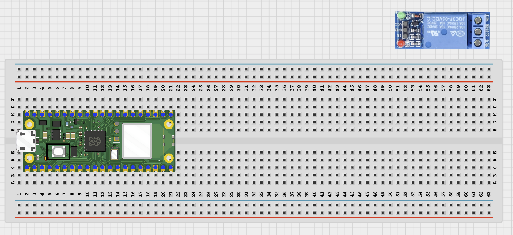
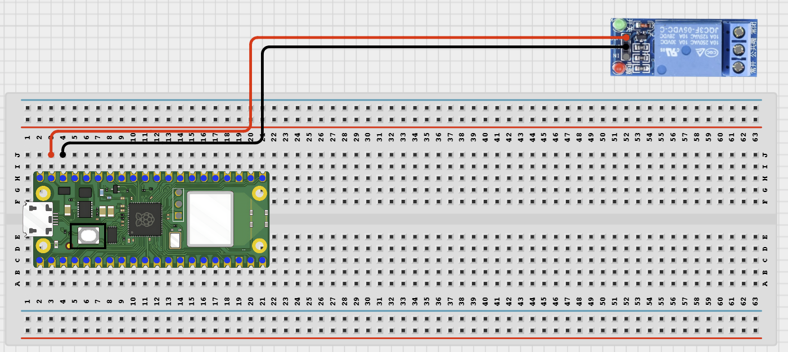
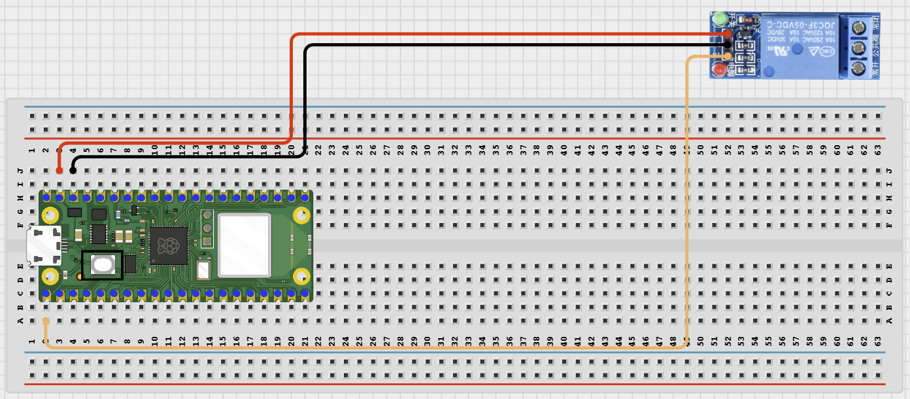
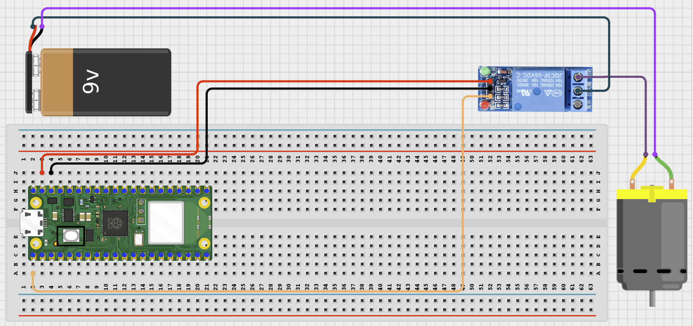

# STEMAIDE AFRICA

# Project 97: Bluetooth Relay Board

**Beginner Embedded Systems Project Using Raspberry Pi Pico 2 W and MicroPython**


# Overview

Build a Bluetooth relay board controller that can switch one of four relays from a phone.

This project demonstrates controlling multiple outputs with separate GPIO pins.

The final result should let a phone turn relay 1, 2, 3, or 4 on, turn all relays off, and request the current relay states.

# Required Components

|  |  |  |  |
| --- | --- | --- | --- |
| <br>Raspberry Pi Pico 2 W | <br>4-Channel Relay Module | <br>Jumper Wires | <br>Optional Low-Voltage Demo Loads |
| <br>Breadboard | <br>Phone with BLE App |  |  |


# Circuit Connections

| Component Pin   | Connects To                    | Pico GPIO / Physical Pin Number | Notes                                    |
| --------------- | ------------------------------ | ------------------------------- | ---------------------------------------- |
| Relay Board VCC | VBUS 5V or module-rated supply | Physical Pin 40                 | Use only if the relay module requires 5V |
| Relay Board GND | GND                            | Physical Pin 38                 | Common ground                            |
| Relay IN1       | GPIO 0                         | GPIO 0 / Physical Pin 1         | Relay channel 1 control                  |
| Relay IN2       | GPIO 1                         | GPIO 1 / Physical Pin 2         | Relay channel 2 control                  |
| Relay IN3       | GPIO 2                         | GPIO 2 / Physical Pin 4         | Relay channel 3 control                  |
| Relay IN4       | GPIO 3                         | GPIO 3 / Physical Pin 5         | Relay channel 4 control                  |

# Step-by-Step Assembly

## Step 1: Place the Raspberry Pi Pico 2 W

Place the Raspberry Pi Pico 2 W on the breadboard so it sits across the center gap.

Keep the USB port facing outward so you can easily connect it to your computer.


---

## Step 2: Place the 4-Channel Relay Board

Place the 4-channel relay board beside the breadboard where the pins are easy to reach.

Identify the following pins before wiring:

- VCC
- GND
- IN1
- IN2
- IN3
- IN4

Use only relay boards with 3.3V-safe trigger inputs.



---

## Step 3: Connect Relay Board Power

Connect:

- Relay Board VCC -> VBUS 5V or module-rated supply
- Relay Board GND -> GND



---

## Step 4: Connect Relay Channels

Connect:

- Relay IN1 -> GPIO 0
- Relay IN2 -> GPIO 1
- Relay IN3 -> GPIO 2
- Relay IN4 -> GPIO 3



---

## Step 5: Optional Low-Voltage Loads

If you connect demonstration loads:

- Use only safe low-voltage loads.
- Connect loads through the relay output contacts.
- Do not use mains AC in beginner lessons.



---

## Wiring Check

- - Pico 2 W is placed correctly across the breadboard center gap
- - Relay board VCC connects to VBUS 5V or module-rated supply
- - Relay board GND connects to GND
- - Relay IN1 connects to GPIO 0
- - Relay IN2 connects to GPIO 1
- - Relay IN3 connects to GPIO 2
- - Relay IN4 connects to GPIO 3
- - Optional loads use only safe low-voltage wiring
- - No loose jumper wires

### Safety Note

> Do not connect mains electricity in this beginner project. Use only relay click tests or safe low-voltage demonstration loads.

---

# Testing Individual Components

Before running the full project, test each part separately. This makes it easier to find wiring or code problems.

## Relay Board Click Test

Check that the relay board can switch before adding Bluetooth code.

```python
from machine import Pin
import time

relays = [Pin(i, Pin.OUT) for i in range(4)]

for relay in relays:
    relay.value(1)

for relay in relays:
    relay.value(0)
    time.sleep(0.5)

    relay.value(1)
    time.sleep(0.3)
```

### Expected Test Result

You should hear each relay click in sequence.

> If the board uses different active logic, the ON and OFF values may need to be reversed.

---

## BLE Advertising Test

Check that the Pico advertises as a BLE device your phone can see.

```python
import bluetooth
import time
from ble_uart import BLEUART

ble = bluetooth.BLE()
ble.active(True)

uart = BLEUART(ble, name='Pico-RelayBoard')

print('Scan for Pico-RelayBoard in your BLE app')

while True:
    time.sleep(1)
```

### Expected Test Result

Your phone BLE app should find a device named **Pico-RelayBoard**.

---

# Full Project Code

```python
from machine import Pin
import bluetooth
import time
from ble_uart import BLEUART

# =========================

# Relay Setup

# =========================

RELAY_PIN = 0

relay = Pin(RELAY_PIN, Pin.OUT)

# Active LOW relay

RELAY_ACTIVE_LEVEL = 0
RELAY_INACTIVE_LEVEL = 1

# =========================

# Bluetooth Setup

# =========================

ble = bluetooth.BLE()
ble.active(True)

uart = BLEUART(ble, name='Pico-Relay')

# =========================

# Relay Functions

# =========================

def relay_on():
    relay.value(RELAY_ACTIVE_LEVEL)

def relay_off():
    relay.value(RELAY_INACTIVE_LEVEL)

def relay_toggle():
    if relay.value() == RELAY_ACTIVE_LEVEL:
        relay_off()
    else:
        relay_on()

def relay_status_text():
    return 'Relay: ON' if relay.value() == RELAY_ACTIVE_LEVEL else 'Relay: OFF'

# =========================

# Bluetooth Command Handler

# =========================

def on_rx(data):

    command = data.decode('utf-8').strip().lower()

    print('Received command:', command)

    if command == 'on':

        relay_on()
        uart.write(b'Relay ON\n')

    elif command == 'off':

        relay_off()
        uart.write(b'Relay OFF\n')

    elif command == 'toggle':

        relay_toggle()
        uart.write((relay_status_text() + '\n').encode())

    elif command == 'status':

        uart.write((relay_status_text() + '\n').encode())

    elif command == 'help':

        uart.write(
            b'Commands: on, off, toggle, status, help\n'
        )

    else:

        uart.write(
            b'Unknown command. Send help.\n'
        )

# =========================

# Start Bluetooth Receiver

# =========================

uart.on_rx(on_rx)

# Start with relay OFF

relay_off()

# =========================

# Serial Monitor Messages

# =========================

print('Bluetooth Single Relay Controller Ready')
print('Bluetooth Name: Pico-Relay')
print('Commands:')
print('on')
print('off')
print('toggle')
print('status')
print('help')

# =========================

# Main Loop

# =========================

while True:
    time.sleep(0.1)
```

---

# How the Code Works

| Code Section          | What It Does                                             | Why It Matters                             |
| --------------------- | -------------------------------------------------------- | ------------------------------------------ |
| `relays` list         | Creates multiple relay output pins in a single list      | Makes the code shorter and easier to scale |
| `all_off()`           | Turns all relay channels off                             | Provides a safe startup and reset state    |
| `set_only()`          | Turns one selected relay on while turning the others off | Simplifies relay channel selection         |
| `relay_status_text()` | Creates a readable relay status message                  | Allows the phone to check relay states     |

---

# Expected Result

After running the code, your BLE app should find **Pico-RelayBoard**.

Commands:

- `1`
- `2`
- `3`
- `4`

should activate the selected relay channel while turning the others off.

Additional commands:

- `all off`
- `status`

allow you to turn all relays off and view current relay states.

---

# Troubleshooting

| Problem                           | Possible Cause                                 | Solution                                                             |
| --------------------------------- | ---------------------------------------------- | -------------------------------------------------------------------- |
| One or more relays do not switch  | Incorrect wiring or relay board power issue    | Verify power connections and GPIO wiring                             |
| Relays behave backwards           | Relay board uses opposite active logic         | Swap `RELAY_ACTIVE_LEVEL` and `RELAY_INACTIVE_LEVEL` values          |
| Phone cannot find Pico-RelayBoard | BLE helper files missing or Bluetooth inactive | Verify helper files are installed and rerun the BLE advertising test |

# Next Project

**Project 98: Bluetooth Sensor Data Logger**
