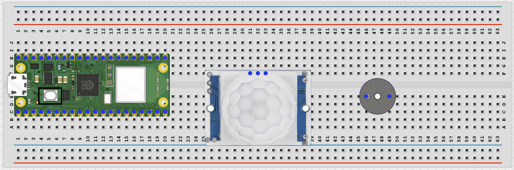
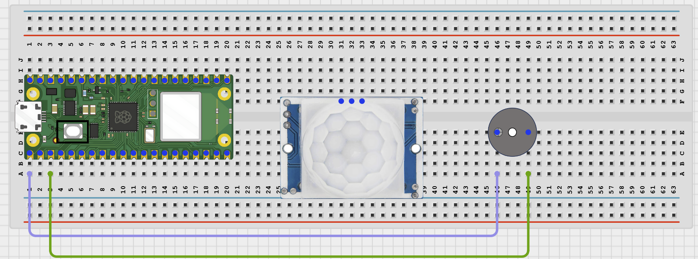
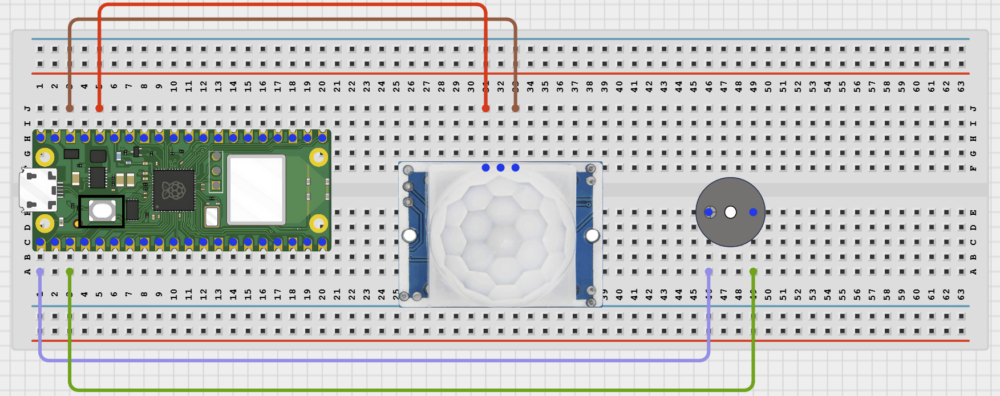
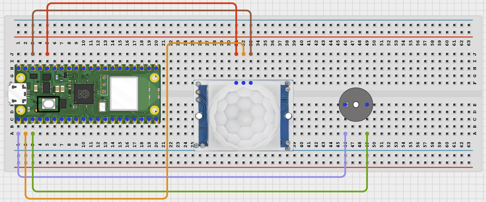

# STEMAIDE AFRICA

# Project 87: Bluetooth Security Alarm

**Beginner Embedded Systems Project Using Raspberry Pi Pico 2 W and MicroPython**


# Overview

Build a Bluetooth security alarm that can be armed and disarmed from a phone.

This project demonstrates combining a PIR motion sensor, a buzzer, and Bluetooth control.

The final result should let a phone arm the alarm, detect motion, sound the buzzer, and send a motion alert message.

# Required Components

|  |  |  |  |
| --- | --- | --- | --- |
| <br>Raspberry Pi Pico 2 W | <br>PIR motion sensor | <br>Active buzzer | <br>Breadboard |
| <br>Jumper wires | <br>Phone with BLE app |  |  |


# Circuit Connections

| Component Pin       | Connects To                 | Pico GPIO / Physical Pin Number | Notes                                    |
| ------------------- | --------------------------- | ------------------------------- | ---------------------------------------- |
| Buzzer positive (+) | GPIO 0                      | GPIO 0 / physical pin 1         | Use driver if buzzer current is too high |
| Buzzer negative (-) | GND                         | Physical pin 38                 | Common ground                            |
| PIR VCC             | 3.3V or module-rated supply | Physical pin 36 if 3.3V-safe    | Check your PIR module rating             |
| PIR GND             | GND                         | Physical pin 38                 | Common ground                            |
| PIR OUT             | GPIO 1                      | GPIO 1 / physical pin 2         | Motion signal                            |

# Step-by-Step Assembly

## Step 1: Place the Raspberry Pi Pico 2 W

Place the Raspberry Pi Pico 2 W on the breadboard so it sits across the center gap.

Keep the USB port facing outward so you can easily connect it to your computer.


---

## Step 2: Place the PIR Sensor and Buzzer

Place the PIR sensor so the white dome faces the area you want to test.

Place the active buzzer on the breadboard.

Identify PIR VCC, OUT, and GND before wiring.

Identify the buzzer positive (+) and negative (-) pins.



---

## Step 3: Connect the Buzzer

Connect the buzzer positive (+) pin to GPIO 0.

Connect the buzzer negative (-) pin to GND.



---

## Step 4: Connect PIR Power

Connect PIR VCC to 3.3V or to the module-rated supply if required.

Connect PIR GND to GND.



---

## Step 5: Connect the PIR OUT Pin

Connect PIR OUT to GPIO 1.

The OUT signal going into the Pico must be 3.3V safe.



---

# Wiring Check

- - Pico 2W is placed correctly across the breadboard center gap
- - Buzzer positive pin connects to GPIO 0
- - Buzzer negative pin connects to GND
- - PIR VCC connects to 3.3V or a module-rated supply
- - PIR GND connects to GND
- - PIR OUT connects to GPIO 1
- - No loose jumper wires

## Beginner Note

PIR sensors need a warm-up time after power-on. Wait briefly before testing motion alarms.

## Safety Note

The PIR OUT pin must be 3.3V safe before it connects to the Pico. Keep buzzer tests short in classrooms or shared spaces.

---

# Testing Individual Components

Before running the full project, test each part separately. This makes it easier to find wiring or code problems.

## Buzzer Test

Check that the buzzer can sound before adding sensor and Bluetooth code.

```python
from machine import Pin
import time

buzzer = Pin(0, Pin.OUT)

buzzer.on()
time.sleep(0.3)
buzzer.off()
```

Expected test result: The buzzer should sound briefly.

## PIR Motion Test

Check that the PIR sensor output changes when motion is detected.

```python
from machine import Pin
import time

pir = Pin(1, Pin.IN, Pin.PULL_DOWN)
print('Wait 15 seconds for PIR warm-up')
time.sleep(15)

while True:
    print('PIR:', pir.value())
    time.sleep(0.5)
```

Expected test result: After warm-up, the Shell should show a change when motion is detected in front of the sensor.

## BLE Advertising Test

Check that the Pico advertises as a BLE device your phone can see.

```python
import bluetooth
import time
from ble_uart import BLEUART

ble = bluetooth.BLE()
ble.active(True)
uart = BLEUART(ble, name='Pico-Alarm')
print('Scan for Pico-Alarm in your BLE app')
while True:
    time.sleep(1)
```

Expected test result: Your phone BLE app should find a device named Pico-Alarm.

---

# Full Project Code

Upload and run this code after the individual tests work correctly.

```python
from machine import Pin
import bluetooth
import time
from ble_uart import BLEUART

buzzer = Pin(0, Pin.OUT)
pir = Pin(1, Pin.IN, Pin.PULL_DOWN)

ble = bluetooth.BLE()
ble.active(True)
uart = BLEUART(ble, name='Pico-Alarm')

alarm_on = False
last_motion = 0


def beep_alarm():
    for _ in range(5):
        buzzer.on()
        time.sleep(0.2)
        buzzer.off()
        time.sleep(0.2)


def alarm_status():
    return 'ARMED' if alarm_on else 'DISARMED'


def on_rx(data):
    global alarm_on
    command = data.decode('utf-8').strip().lower()
    print('Received command:', command)

    if command == 'on' or command == 'arm':
        alarm_on = True
        uart.write(b'Alarm ARMED\n')
    elif command == 'off' or command == 'disarm':
        alarm_on = False
        buzzer.off()
        uart.write(b'Alarm DISARMED\n')
    elif command == 'status':
        uart.write(('Alarm: {}\n'.format(alarm_status())).encode())
    elif command == 'help':
        uart.write(b'Commands: arm, disarm, on, off, status, help\n')
    else:
        uart.write(b'Unknown command. Send help.\n')

uart.on_rx(on_rx)
buzzer.off()

print('Bluetooth security alarm ready')
print('Wait 15 seconds for PIR warm-up')
time.sleep(15)
print('Send arm or disarm from the BLE app')

while True:
    motion = pir.value()
    if alarm_on and motion == 1 and last_motion == 0:
        uart.write(b'MOTION DETECTED! Alarm sounding.\n')
        print('Motion detected while alarm is armed')
        beep_alarm()
    last_motion = motion
    time.sleep(0.1)
```

---

# How the Code Works

| Code Section        | What It Does                                         | Why It Matters                                    |
| ------------------- | ---------------------------------------------------- | ------------------------------------------------- |
| PIR input           | Reads the motion sensor on GPIO 1                    | The alarm needs a motion event to react to        |
| `alarm_on` variable | Stores whether the alarm is armed or disarmed        | The PIR should only trigger the buzzer when armed |
| `beep_alarm()`      | Plays a short buzzer pattern when motion is detected | This creates the audible alarm output             |
| Bluetooth commands  | Arm, disarm, and check the alarm status from a phone | This adds wireless control and feedback           |

---

# Expected Result

After running the code and waiting for PIR warm-up, your phone BLE app should find Pico-Alarm. Sending `arm` should enable the alarm. When motion is detected, the buzzer should beep and the phone should receive a motion alert message. Sending `disarm` should stop the alarm from reacting to motion.

---

# Troubleshooting

| Problem                      | Possible Cause                                          | Solution                                                                                               |
| ---------------------------- | ------------------------------------------------------- | ------------------------------------------------------------------------------------------------------ |
| No motion alarm happens      | PIR is still warming up or wiring is wrong              | Wait longer and recheck the PIR OUT connection on GPIO 1                                               |
| Buzzer never sounds          | Buzzer wiring is wrong or it needs a driver transistor  | Run the buzzer test first and add a driver if needed                                                   |
| Phone cannot find Pico-Alarm | BLE helper files are missing or Bluetooth is not active | Check that `ble_uart.py` and `ble_advertising.py` are saved on the Pico and rerun the advertising test |

# Next Project

Project 088: Bluetooth Direction Signal Controller

[Open Bluetooth Direction Signal Controller](1.1.21%20Bluetooth%20Direction%20Signal%20Controller.md)
