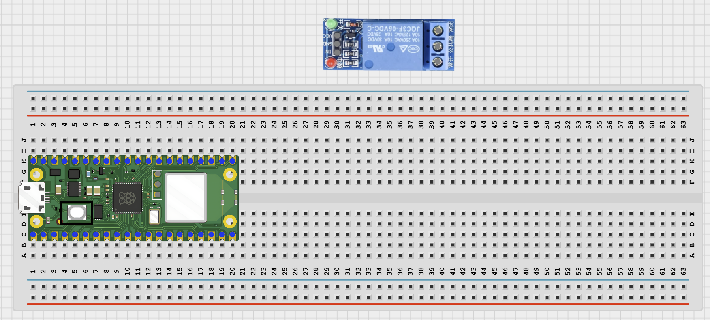
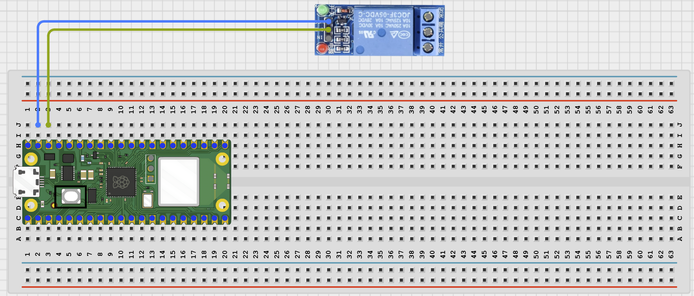
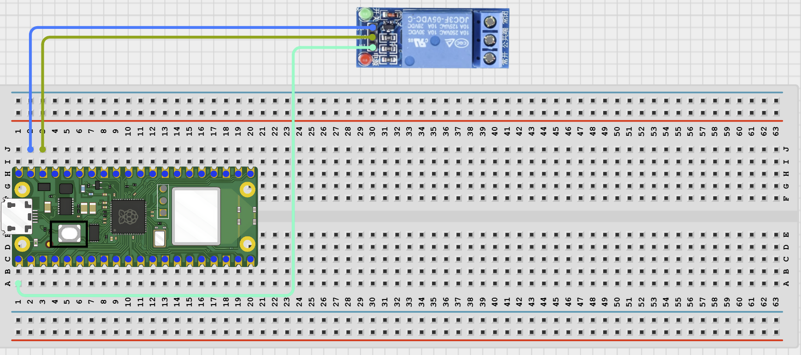

# STEMAIDE AFRICA

# Project 92: Bluetooth Irrigation Toggle

**Beginner Embedded Systems Project Using Raspberry Pi Pico 2 W and MicroPython**


# Overview

Build a Bluetooth irrigation toggle that can turn a relay-controlled watering device on or off.

This project demonstrates wireless control of an output that could later switch a low-voltage pump or valve.

The final result should let a phone turn irrigation on, turn it off, and check the current irrigation state.

# Required Components

|  |  |  |  |
| --- | --- | --- | --- |
| <br>Raspberry Pi Pico 2 W | <br>1-Channel Relay Module | <br>Low-Voltage Pump or Valve (Optional) | <br>Jumper Wires |
| <br>Phone with BLE App |  |  |  |


# Circuit Connections

| Component Pin    | Connects To                    | Pico GPIO / Physical Pin Number | Notes                             |
| ---------------- | ------------------------------ | ------------------------------- | --------------------------------- |
| Relay Module VCC | VBUS 5V or module-rated supply | Physical Pin 40                 | Use only if the relay requires 5V |
| Relay Module GND | GND                            | Physical Pin 38                 | Common ground                     |
| Relay Module IN  | GPIO 0                         | GPIO 0 / Physical Pin 1         | Control signal                    |

# Step-by-Step Assembly

## Step 1: Place the Raspberry Pi Pico 2 W

Place the Raspberry Pi Pico 2 W on the breadboard so it sits across the center gap.

Keep the USB port facing outward so you can easily connect it to your computer.


---

## Step 2: Place the Relay Module

Place the relay module beside the breadboard where its pins are easy to reach.

Identify the VCC, GND, and IN pins before wiring.

Use only a relay module with a 3.3V-safe trigger input.



---

## Step 3: Connect Relay Power

Connect:

- Relay VCC -> VBUS 5V (or module-rated supply)
- Relay GND -> GND



---

## Step 4: Connect the Relay Input

Connect:

- Relay IN -> GPIO 0



---

## Step 5: Connect an Optional Low-Voltage Load

If using a demonstration pump or valve:

- Connect the load through the relay switching terminals.
- Follow the load manufacturer's low-voltage wiring instructions.
- Use only teacher-approved loads.


---

## Wiring Check

- - Pico 2W is placed correctly across the breadboard center gap
- - Relay VCC connects to VBUS 5V or module-rated supply
- - Relay GND connects to GND
- - Relay IN connects to GPIO 0
- - Optional load uses safe low-voltage wiring
- - No loose jumper wires

### Safety Note

> Do not connect mains electricity. Use only low-voltage devices and keep water away from electronics.

---

# Testing Individual Components

Before running the full project, test each part separately.

## Relay Click Test

```python
from machine import Pin
import time

relay = Pin(0, Pin.OUT)

relay.value(1)
time.sleep(1)

relay.value(0)
time.sleep(1)

relay.value(1)
```

### Expected Test Result

You should hear the relay click on and off.

---

## BLE Advertising Test

```python
import bluetooth
import time
from ble_uart import BLEUART

ble = bluetooth.BLE()
ble.active(True)

uart = BLEUART(ble, name='Pico-Irrigation')

print('Scan for Pico-Irrigation in your BLE app')

while True:
    time.sleep(1)
```

### Expected Test Result

Your phone BLE app should find a device named **Pico-Irrigation**.

---

# Full Project Code

```python
from machine import Pin
import bluetooth
import time
from ble_uart import BLEUART

relay = Pin(0, Pin.OUT)

RELAY_ACTIVE_LEVEL = 0
RELAY_INACTIVE_LEVEL = 1

ble = bluetooth.BLE()
ble.active(True)

uart = BLEUART(ble, name='Pico-Irrigation')

def irrigation_on():
    relay.value(RELAY_ACTIVE_LEVEL)

def irrigation_off():
    relay.value(RELAY_INACTIVE_LEVEL)

def irrigation_state():
    if relay.value() == RELAY_ACTIVE_LEVEL:
        return 'ON'
    return 'OFF'

def on_rx(data):
    command = data.decode('utf-8').strip().lower()

    if command == 'on':
        irrigation_on()
        uart.write(b'Irrigation ON\n')

    elif command == 'off':
        irrigation_off()
        uart.write(b'Irrigation OFF\n')

    elif command == 'status':
        uart.write(('Irrigation: {}\n'.format(
            irrigation_state())).encode())

    elif command == 'help':
        uart.write(b'Commands: on, off, status, help\n')

    else:
        uart.write(b'Unknown command. Send help.\n')

uart.on_rx(on_rx)

irrigation_off()

while True:
    time.sleep(0.1)
```

---

# How the Code Works

| Code Section                             | What It Does                                         | Why It Matters                            |
| ---------------------------------------- | ---------------------------------------------------- | ----------------------------------------- |
| Relay setup                              | Creates the relay output and active-low logic values | Easier adaptation to common relay modules |
| `irrigation_on()` and `irrigation_off()` | Controls the relay                                   | Makes the code easier to understand       |
| `irrigation_state()`                     | Reports current state                                | Lets the phone check irrigation status    |
| Bluetooth command handler                | Processes commands                                   | Provides wireless control                 |

---

# Expected Result

After running the code, your phone BLE app should find **Pico-Irrigation**.

Sending commands should:

- Turn irrigation ON
- Turn irrigation OFF
- Report irrigation status
- Display available commands

---

# Troubleshooting

| Problem                           | Possible Cause        | Solution                           |
| --------------------------------- | --------------------- | ---------------------------------- |
| Relay never switches              | Incorrect wiring      | Check VCC, GND, and IN connections |
| Relay logic reversed              | Different relay logic | Swap active and inactive levels    |
| Phone cannot find Pico-Irrigation | BLE files missing     | Verify helper files and rerun test |

# Next Project

**Project 093: Bluetooth Color Detection**
