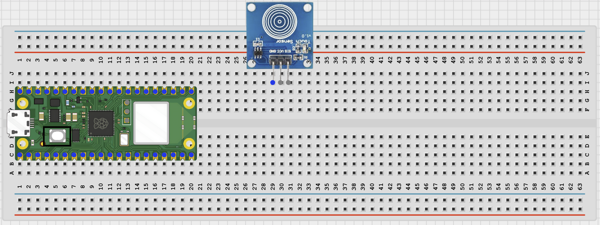
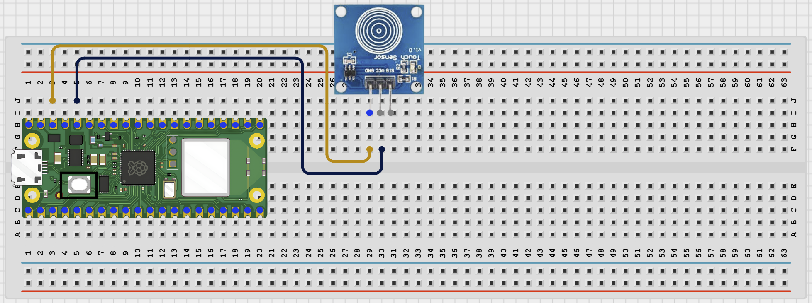
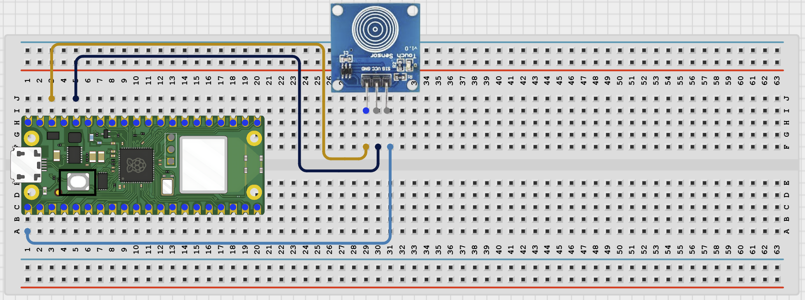

# STEMAIDE AFRICA

# Project 83: Bluetooth Touch Switch

**Beginner Embedded Systems Project Using Raspberry Pi Pico 2 W and MicroPython**


# Overview

Build a Bluetooth touch switch that toggles a virtual on/off state when you touch the sensor.

This project uses the TTP223 touch sensor as a digital input and sends updates to a phone over BLE.

The final result should let the touch sensor change the switch state, light the Pico onboard LED, and send the new state to the connected BLE app.

# Required Components

|  |  |  |  |
| --- | --- | --- | --- |
| <br>Raspberry Pi Pico 2 W | <br>TTP223 touch sensor | <br>Breadboard | <br>Jumper wires |
| <br>Phone with BLE app |  |  |  |


# Circuit Connections

| Component Pin    | Connects To      | Pico GPIO / Physical Pin Number | Notes                  |
| ---------------- | ---------------- | ------------------------------- | ---------------------- |
| Touch sensor VCC | 3.3V             | Physical pin 36                 | 3.3V power             |
| Touch sensor GND | GND              | Physical pin 38                 | Common ground          |
| Touch sensor OUT | GPIO 1           | GPIO 1 / physical pin 2         | Digital touch signal   |
| Pico onboard LED | Built into board | Pin('LED')                      | No extra wiring needed |

# Step-by-Step Assembly

## Step 1: Place the Raspberry Pi Pico 2 W

Place the Raspberry Pi Pico 2 W on the breadboard so it sits across the center gap.

Keep the USB port facing outward so you can easily connect it to your computer.


---

## Step 2: Place the Touch Sensor

Place the TTP223 touch sensor module on the breadboard.

Identify VCC, GND, and OUT before wiring.

This project uses the Pico onboard LED, so no external LED wiring is needed.



---

## Step 3: Connect the Touch Sensor Power

Connect touch sensor VCC to 3.3V.

Connect touch sensor GND to GND.



---

## Step 4: Connect the Touch Sensor OUT Pin

Connect touch sensor OUT to GPIO 1.

This is the digital touch signal used to toggle the switch state.



---

# Wiring Check

- - Pico 2 W is placed correctly across the breadboard center gap
- - Touch sensor VCC connects to 3.3V
- - Touch sensor GND connects to GND
- - Touch sensor OUT connects to GPIO 1
- - Pico onboard LED needs no external wiring
- - No loose jumper wires

---

# Beginner Note

Touch the sensor pad gently. You do not need to press hard.

---

# Testing Individual Components

Before running the full project, test each part separately. This makes it easier to find wiring or code problems.

## Touch Sensor Test

Check that the touch sensor output changes when you touch the pad.

```python
from machine import Pin
import time

touch = Pin(1, Pin.IN)
while True:
    print('Touch value:', touch.value())
    time.sleep(0.2)
```

Expected test result: The Shell should show a clear change when you touch and release the sensor pad.

---

## Onboard LED Test

Check that the Pico onboard LED can be controlled.

```python
from machine import Pin
import time

led = Pin('LED', Pin.OUT)
for _ in range(3):
    led.toggle()
    time.sleep(0.4)
```

Expected test result: The onboard LED should blink three times.

---

## BLE Advertising Test

Check that the Pico advertises as a BLE device your phone can see.

```python
import bluetooth
import time
from ble_uart import BLEUART

ble = bluetooth.BLE()
ble.active(True)
uart = BLEUART(ble, name='Pico-Touch')
print('Scan for Pico-Touch in your BLE app')
while True:
    time.sleep(1)
```

Expected test result: Your phone BLE app should find a device named Pico-Touch.

---

# Full Project Code

Upload and run this code after the individual tests work correctly.

```python
from machine import Pin
import bluetooth
import time
from ble_uart import BLEUART

touch = Pin(1, Pin.IN)
led = Pin('LED', Pin.OUT)

ble = bluetooth.BLE()
ble.active(True)
uart = BLEUART(ble, name='Pico-Touch')

switch_on = False
touch_count = 0
last_touch = 0


def send_state():
    state = 'ON' if switch_on else 'OFF'
    uart.write(('Switch: {}\n'.format(state)).encode())
    uart.write(('Touch count: {}\n'.format(touch_count)).encode())


def on_rx(data):
    command = data.decode('utf-8').strip().lower()
    print('Received command:', command)

    if command in ('status', 'read', 'switch'):
        send_state()
    elif command == 'help':
        uart.write(b'Commands: status, read, switch, help\n')
    else:
        uart.write(b'Unknown command. Send help.\n')

uart.on_rx(on_rx)

print('Bluetooth touch switch ready')
print('Touch the sensor to toggle the switch state')
print('Connect with a BLE app and send: status, read, switch, or help')

while True:
    current_touch = touch.value()

    if current_touch == 1 and last_touch == 0:
        switch_on = not switch_on
        touch_count += 1
        led.value(1 if switch_on else 0)
        state = 'ON' if switch_on else 'OFF'
        uart.write(('Touch detected. Switch {}\n'.format(state)).encode())
        print('Touch detected. Switch', state)
        time.sleep(0.2)

    last_touch = current_touch
    time.sleep(0.05)
```

---

# How the Code Works

| Code Section         | What It Does                                           | Why It Matters                                                 |
| -------------------- | ------------------------------------------------------ | -------------------------------------------------------------- |
| Touch input          | Reads the digital signal from the TTP223 sensor        | The project needs a clear touch event to react to              |
| `switch_on` variable | Stores whether the virtual switch is ON or OFF         | This lets each touch toggle the current state                  |
| Onboard LED control  | Turns the Pico LED on or off to match the switch state | Students get immediate local feedback                          |
| BLE status reply     | Lets the phone ask for the current switch state        | The phone can check the project even when no new touch happens |

---

# Expected Result

After running the code, your phone BLE app should find Pico-Touch. Each time you touch the sensor, the Pico onboard LED should toggle and the phone should receive a message showing whether the switch is now ON or OFF. Sending `status` or `read` should return the current state and touch count.

---

# Troubleshooting

| Problem                       | Possible Cause                                                        | Solution                                                                                               |
| ----------------------------- | --------------------------------------------------------------------- | ------------------------------------------------------------------------------------------------------ |
| Touching the pad does nothing | Sensor wiring is wrong or the sensor is not powered                   | Check VCC, GND, and OUT on GPIO 1                                                                      |
| Switch toggles too many times | The touch signal is bouncing or your finger stays on the pad too long | Keep the short delay in the code and tap briefly                                                       |
| Phone cannot find Pico-Touch  | BLE helper files are missing or Bluetooth is not active               | Check that `ble_uart.py` and `ble_advertising.py` are saved on the Pico and rerun the advertising test |

# Next Project

Project 084: Bluetooth Timer Controller

[Open Bluetooth Timer Controller](1.1.16%20Bluetooth%20Timer%20Controller.md)
