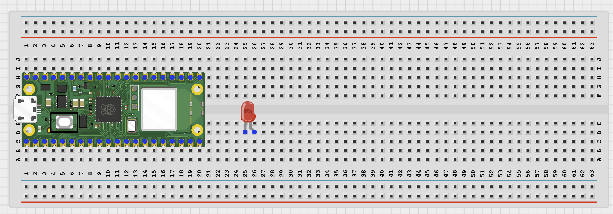
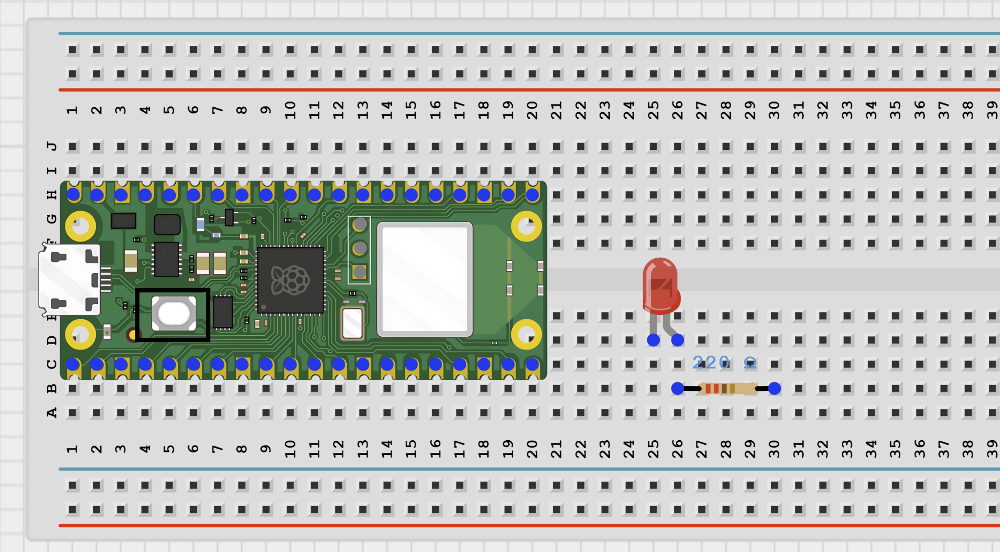
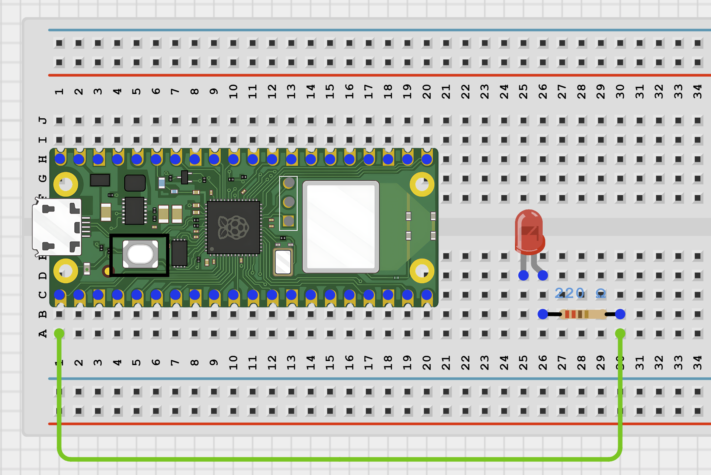
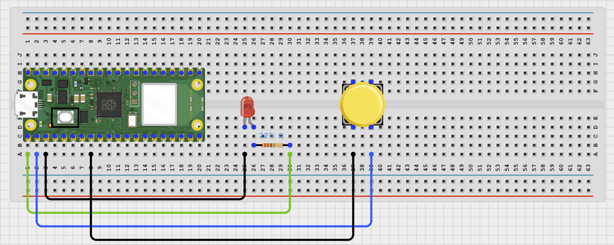
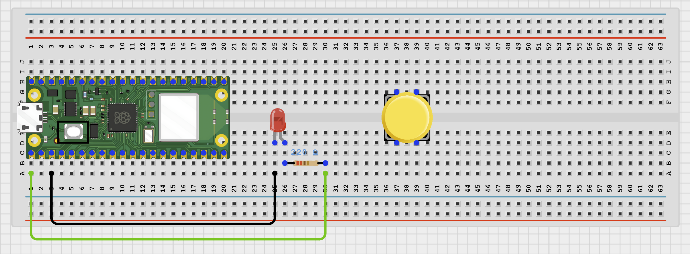
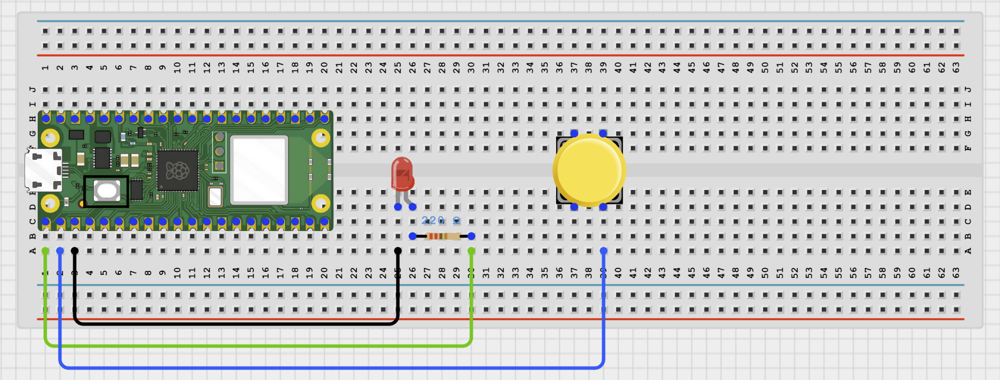

# Project 1.1.1: Push Button LED Toggle Controller

**Beginner Embedded Systems Project Using Raspberry Pi Pico 2 W and MicroPython**

## Pico 2 W Diagram


---

## Overview

Build a simple push-button LED toggle circuit.

This project demonstrates how the Pico reads an input and controls an output.

The final result is one LED that changes state each time the button is pressed.

## Required Components

|                                                                                            |                                                                                                      |                                                                            |                                                                                    |
| ------------------------------------------------------------------------------------------ | ---------------------------------------------------------------------------------------------------- | -------------------------------------------------------------------------- | ---------------------------------------------------------------------------------- |
| <br>Raspberry Pi Pico 2 W | <br>LED                                     | <br>Push button | <br>220 Ohm resistor |
| <br>Breadboard                     | <br>Jumper wires |                                                                            |                                                                                    |

## Circuit Connections

| Component Pin            | Connects To                  | Pico GPIO / Physical Pin Number | Notes                        |
| ------------------------ | ---------------------------- | ------------------------------- | ---------------------------- |
| LED anode (+)            | 220 Ohm resistor then GPIO 0 | GPIO 0 / physical pin 1         | LED long leg                 |
| LED cathode (-)          | GND                          | Physical pin 38                 | LED short leg                |
| Push button leg 1        | GPIO 1                       | GPIO 1 / physical pin 2         | Use internal pull-up in code |
| Push button opposite leg | GND                          | Physical pin 38                 |                              |

## Step-by-Step Assembly

### Step 1: Place the Raspberry Pi Pico 2 W

Insert the Raspberry Pi Pico 2 W onto the breadboard so that it straddles the center gap.


---

### Step 2: Place the LED

Insert the LED onto the breadboard with the long leg and short leg in different rows.



---

### Step 3: Connect the Resistor

Insert one end of the 220 Ohm resistor into the same row as the LED's long leg.



---

### Step 4: Connect the Resistor to GPIO 0

Use a jumper wire to connect the free end of the resistor to GPIO 0.



---

### Step 5: Connect the LED to Ground

Use a jumper wire to connect the LED short leg row to GND.



---

### Step 6: Place the Push Button

Insert the push button across the breadboard center gap.



---

### Step 7: Connect the Push Button to GPIO 1

Use a jumper wire to connect one side of the push button to GPIO 1.



---

### Step 8: Connect the Push Button to Ground

Connect the opposite side of the push button to GND.


---

## Wiring Check

- LED long leg connects to the resistor.
- Resistor connects to GPIO 0.
- LED short leg connects to GND.
- Push button crosses the breadboard center gap.
- One button side connects to GPIO 1.
- Other button side connects to GND.
- No loose jumper wires.

---

## Testing Individual Components

### LED Test

```python
from machine import Pin
import time

led = Pin(0, Pin.OUT)
led.on()
print('LED ON')
time.sleep(2)
led.off()
print('LED OFF')
```

Expected test result: The LED turns on for 2 seconds, then turns off.

### Button Test

```python
from machine import Pin
import time

button = Pin(1, Pin.IN, Pin.PULL_UP)

while True:
    print('Pressed' if button.value() == 0 else 'Released')
    time.sleep(0.2)
```

Expected test result: The Thonny Shell changes between Released and Pressed.

---

## Full Project Code

```python
from machine import Pin
import time

led = Pin(0, Pin.OUT)
button = Pin(1, Pin.IN, Pin.PULL_UP)
led_state = 0
last_button = 1

print('LED toggle ready')

while True:
    current_button = button.value()

    if current_button == 0 and last_button == 1:
        led_state = 0 if led_state else 1
        led.value(led_state)
        print('LED ON' if led_state else 'LED OFF')
        time.sleep(0.2)

    last_button = current_button
    time.sleep(0.02)
```

---

## How the Code Works

| Code Section   | What It Does                        | Why It Matters                          |
| -------------- | ----------------------------------- | --------------------------------------- |
| Pin setup      | Creates LED and button objects      | The Pico must know each pin role        |
| `led_state`    | Stores whether the LED is on or off | Lets the button toggle instead of hold  |
| Edge check     | Looks for a new button press        | Prevents repeated toggles while holding |
| Debounce delay | Waits briefly after a press         | Reduces false extra presses             |

---

## Expected Result

Each time you press the button, the LED changes state. The Shell prints `LED ON` or `LED OFF`.

---

## Troubleshooting

| Problem                          | Possible Cause                           | Solution                                       |
| -------------------------------- | ---------------------------------------- | ---------------------------------------------- |
| LED does not light               | LED reversed or resistor misplaced       | Reverse the LED and recheck the resistor path  |
| Button does nothing              | Button not connected across correct legs | Rotate the button and reconnect it             |
| LED changes many times per press | Noisy button signal                      | Keep the debounce delay and press once clearly |

## Source Text Preserved From DOCX

The following source text from the original Word document is preserved here because it was not already present verbatim in the cleaned MkDocs version.

- | Push button | 1 | User input switch | Place across breadboard gap |
- | 220Ω resistor | 1 | Limits LED current | Required for LED safety |
- | Component Pin | Connects To | Pico 2W GPIO / Physical Pin Number | Notes |
- | LED anode (+) | 220Ω resistor then GPIO 0 | GPIO 0 / physical pin 0 | LED long leg |
- ## Step-by-Step Wiring
- Make sure the USB port faces outward for easy connection to the computer.
- - Place the long leg (anode, +) on one row.
- - Place the short leg (cathode, -) on a different row.
- Do not place both LED legs in the same breadboard row, or the LED will short-circuit and not work.
- Insert one end of the 220Ω resistor into the same row as the LED’s long leg (anode).
- Insert the other end of the resistor into a new empty row.
- Use a jumper wire to connect the free end of the resistor to GPIO 0 on the Raspberry Pi Pico 2W.
- Recommended wire color:
- - Green or yellow for signal wires.
- Use a jumper wire to connect the LED short leg (cathode) row to a GND pin on the Raspberry Pi Pico 2W.
- - Black for GND connections.
- The button legs should sit on opposite sides of the center gap so the button can function correctly.
- Use a jumper wire to connect one side of the push button to GPIO 1 on the Raspberry Pi Pico 2W.
- Connect the opposite side of the push button to a GND pin on the Raspberry Pi Pico 2W.
- Before powering the circuit, confirm:
- Before running the full project, test each part separately. This makes it easier to find wiring or code problems.
- Check that the LED and resistor are wired correctly.
- Check that the Pico can detect the button press.
- After completing and checking the circuit connections, open Thonny IDE. Copy and paste the code below into a new file, or upload the project file to the Raspberry Pi Pico 2 W, then run it from Thonny.
- | Pin setup | Creates LED and button objects | The Pico must know which pins are inputs and outputs |
- | led_state | Stores whether the LED should be on or off | Lets the button toggle instead of only hold |
- | Edge check | Looks for a new button press | Prevents repeated toggles while holding the button |
- | Button does nothing | Button not connected across the correct legs | Rotate the button and reconnect one side to GPIO 1 and the other to GND |
