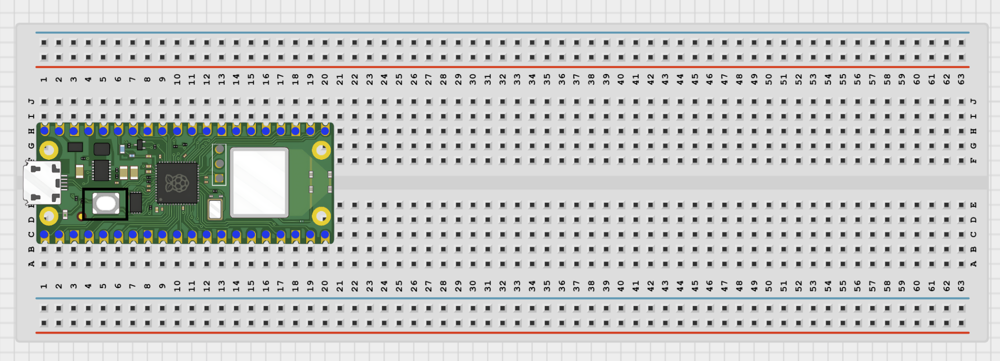
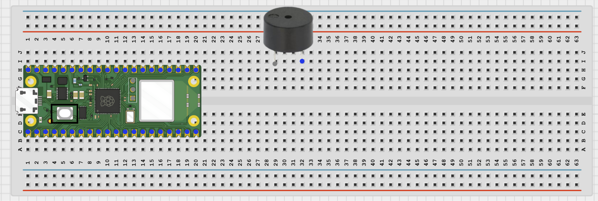
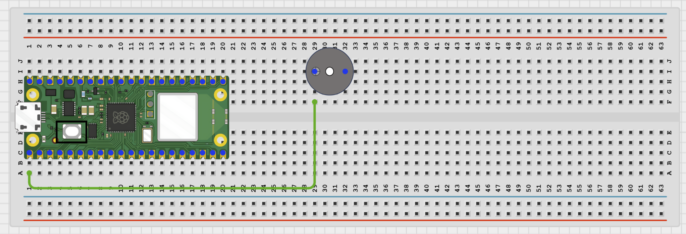
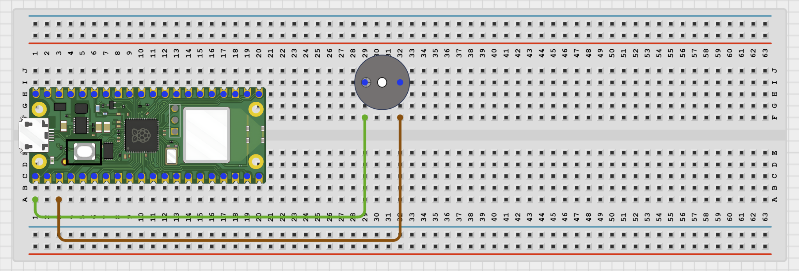
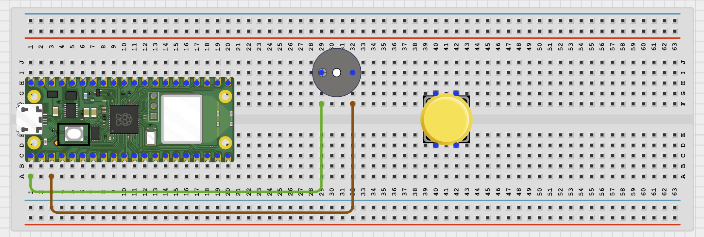
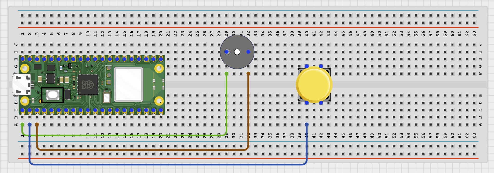
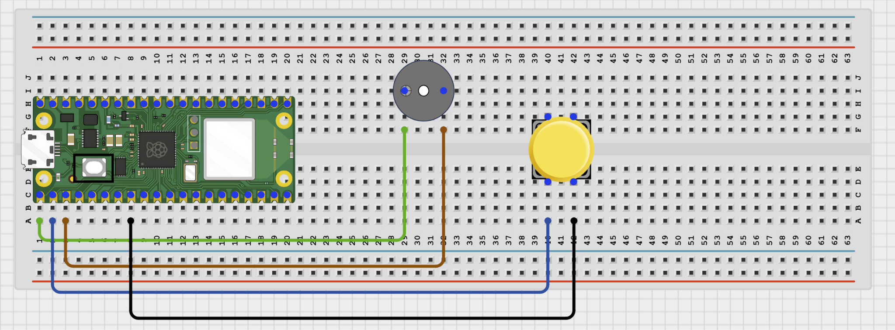

# Project 1.1.2: Push Button Buzzer Alarm

**Beginner Embedded Systems Project Using Raspberry Pi Pico 2 W and MicroPython**

## Pico 2 W Diagram


---

## Overview

Build a simple alarm circuit with a button and an active buzzer.

This project demonstrates event-driven control.

The final result is a buzzer that sounds when the button is pressed.

## Required Components

|                                                                                                      |                                                                   |                                                                            |                                                                        |
| ---------------------------------------------------------------------------------------------------- | ----------------------------------------------------------------- | -------------------------------------------------------------------------- | ---------------------------------------------------------------------- |
| <br>Raspberry Pi Pico 2 W           | <br>Active buzzer | <br>Push button | <br>Breadboard |
| <br>Jumper wires |                                                                   |                                                                            |                                                                        |

## Circuit Connections

| Component Pin       | Connects To | Pico GPIO / Physical Pin Number | Notes                |
| ------------------- | ----------- | ------------------------------- | -------------------- |
| Buzzer positive (+) | GPIO 0      | GPIO 0 / physical pin 1         |                      |
| Buzzer negative (-) | GND         | Physical pin 38                 |                      |
| Button leg 1        | GPIO 1      | GPIO 1 / physical pin 2         | Use internal pull-up |
| Button opposite leg | GND         | Physical pin 38                 |                      |

## Step-by-Step Assembly

### Step 1: Place the Raspberry Pi Pico 2 W

Insert the Raspberry Pi Pico 2 W onto the breadboard so that it straddles the center gap.



---

### Step 2: Place the Buzzer

Insert the buzzer onto the breadboard with its two pins in different rows.



---

### Step 3: Connect the Buzzer Positive Pin to GPIO 0

Use a jumper wire to connect the buzzer's positive pin (+) to GPIO 0.



---

### Step 4: Connect the Buzzer Negative Pin to GND

Use a jumper wire to connect the buzzer's negative pin (-) to GND.



---

### Step 5: Place the Push Button

Insert the push button across the breadboard center gap.



---

### Step 6: Connect the Push Button to GPIO 1

Use a jumper wire to connect one side of the push button to GPIO 1.



---

### Step 7: Connect the Push Button to GND

Use a jumper wire to connect the opposite side of the push button to GND.



---

## Wiring Check

- Pico 2 W is placed correctly across the breadboard center gap.
- Buzzer positive pin connects to GPIO 0.
- Buzzer negative pin connects to GND.
- Push button is placed across the breadboard center gap.
- One side of the button connects to GPIO 1.
- Opposite side of the button connects to GND.
- No loose jumper wires.

---

## Testing Individual Components

### Buzzer Test

```python
from machine import Pin
import time

buzzer = Pin(0, Pin.OUT)
buzzer.on()
print('Buzzer ON')
time.sleep(1)
buzzer.off()
print('Buzzer OFF')
```

Expected test result: The buzzer sounds for about 1 second.

### Button Test

```python
from machine import Pin
import time

button = Pin(1, Pin.IN, Pin.PULL_UP)

while True:
    print(button.value())
    time.sleep(0.2)
```

Expected test result: The printed value changes between 1 and 0 when pressed.

---

## Full Project Code

```python
from machine import Pin
import time

buzzer = Pin(0, Pin.OUT)
button = Pin(1, Pin.IN, Pin.PULL_UP)

print('Buzzer alarm ready')

while True:
    if button.value() == 0:
        buzzer.on()
        print('ALARM TRIGGERED')
        time.sleep(1)
        buzzer.off()
        print('Alarm ended')
        time.sleep(0.2)

    time.sleep(0.02)
```

---

## How the Code Works

| Code Section            | What It Does                     | Why It Matters                         |
| ----------------------- | -------------------------------- | -------------------------------------- |
| Pin setup               | Prepares buzzer and button pins  | The Pico must know how each part works |
| Button check            | Looks for a button press         | Decides when the alarm should start    |
| `buzzer.on()` / `off()` | Turns the buzzer on and off      | Creates the sound output               |
| Delay                   | Keeps the buzzer on for 1 second | Makes the alarm easy to hear           |

---

## Expected Result

Pressing the button makes the buzzer sound for about 1 second. The Shell prints status messages.

---

## Troubleshooting

| Problem             | Possible Cause                                 | Solution                                               |
| ------------------- | ---------------------------------------------- | ------------------------------------------------------ |
| No sound            | Buzzer polarity wrong or buzzer type incorrect | Reverse the buzzer if needed and confirm active buzzer |
| Buzzer never stops  | Button held down continuously                  | Release the button and check that it is not stuck      |
| Button does nothing | Wrong button legs used                         | Reconnect the button across opposite sides             |
