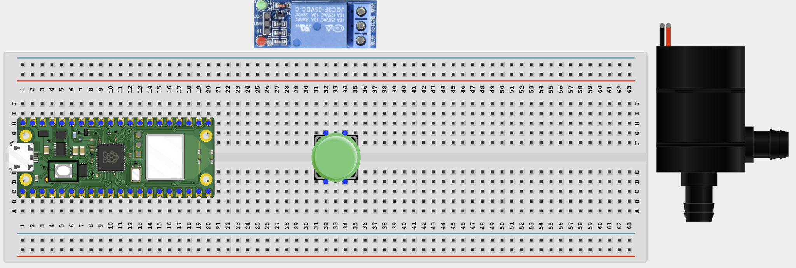
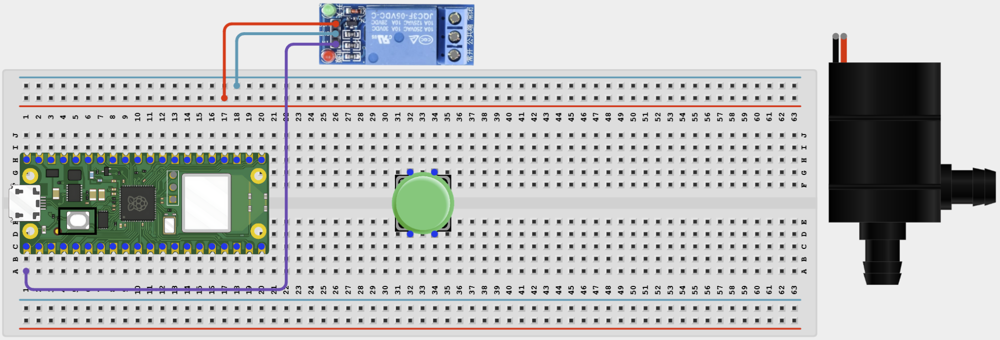
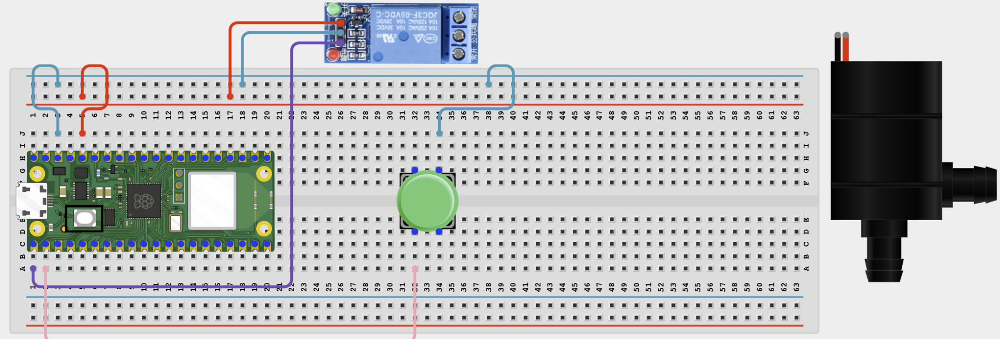
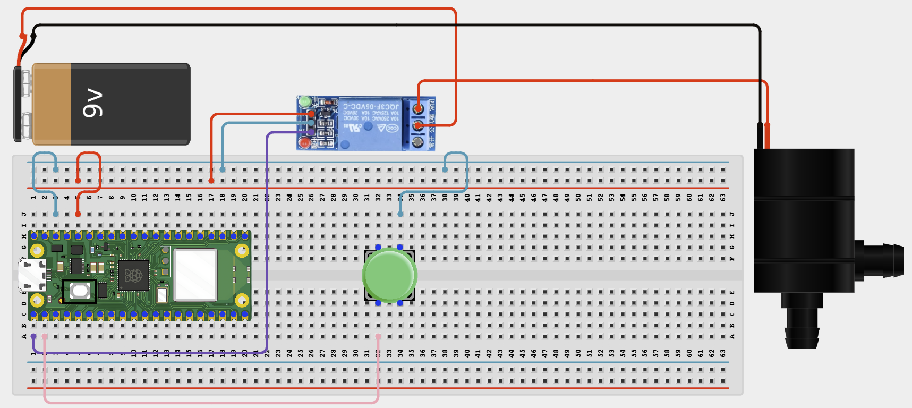

# Project 1.1.3: Push Button Water Pump Controller

**Beginner Embedded Systems Project Using Raspberry Pi Pico 2 W and MicroPython**

## Pico 2 W Diagram


---

## Overview

Build a button-controlled water pump system using a relay module.

This project demonstrates safe control of a higher-current device with a timed auto-off feature.

The final result should run the pump for a few seconds when the button is pressed and then turn it off automatically.

## Required Components

|  |  |  |  |
| --- | --- | --- | --- |
| <br>Raspberry Pi Pico 2 W | <br>DC water pump | <br>1-channel relay module | <br>Push button |
| <br>Breadboard | <br>Jumper wires |   |   |


## Circuit Connections

| Component Pin                 | Connects To                   | Pico GPIO / Physical Pin Number | Notes                        |
| ----------------------------- | ----------------------------- | ------------------------------- | ---------------------------- |
| Relay VCC                     | 5V / VSYS                     | Physical pin 40                 | Module power                 |
| Relay GND                     | GND                           | Physical pin 38                 |                              |
| Relay IN                      | GPIO 0                        | GPIO 0 / physical pin 1         | Usually active-low           |
| Button leg 1                  | GPIO 1                        | GPIO 1 / physical pin 2         | Use internal pull-up         |
| Button opposite leg           | GND                           | Physical pin 38                 |                              |
| External pump supply positive | Relay COM                     | Not a GPIO pin                  | Pump power input             |
| Relay NO                      | Pump positive terminal        | Not a GPIO pin                  | Power flows when relay is on |
| Pump negative terminal        | External pump supply negative | Not a GPIO pin                  |                              |

## Step-by-Step Assembly

### Step 1: Place the Raspberry Pi Pico 2 W

Place the Raspberry Pi Pico 2 W on the breadboard so it sits across the center gap.


---

### Step 2: Place the Relay Module, Button, and Pump

Place the relay module where its pins are easy to reach. Place the push button across the breadboard center gap. Keep the water pump and external supply separate from the Pico wiring.



---

### Step 3: Connect Relay Power

Connect relay VCC to 5V / VSYS and relay GND to Pico GND.


---

### Step 4: Connect the Relay Control Pin

Connect relay IN to GPIO 0. This GPIO controls when the relay switches the pump circuit.



---

### Step 5: Connect the Push Button

Connect one button leg to GPIO 1. Connect the opposite button leg to GND.



---

### Step 6: Wire the Pump Power Through the Relay

Connect the external pump supply positive wire to relay COM. Connect relay NO to the pump positive terminal. Connect the pump negative terminal to the external pump supply negative wire.



---

### Step 7: Check the Pump Before Powering

Make sure the pump can spin freely and is connected to the correct external supply voltage.

Do not let the pump run dry for long periods.

---

## Wiring Check

- Relay VCC connects to 5V / VSYS.
- Relay GND connects to Pico GND.
- Relay IN connects to GPIO 0.
- Push button sits across the breadboard center gap.
- Button signal leg connects to GPIO 1.
- Button opposite leg connects to GND.
- External pump supply positive connects to relay COM.
- Relay NO connects to pump positive terminal.
- Pump negative terminal connects to external pump supply negative.
- No loose jumper wires.

---

## Testing Individual Components

### Button Test

```python
from machine import Pin
import time

button = Pin(1, Pin.IN, Pin.PULL_UP)

while True:
    print('Pressed' if button.value() == 0 else 'Released')
    time.sleep(0.2)
```

Expected test result: The Shell should change between Pressed and Released.

### Relay Click Test

```python
from machine import Pin
import time

relay = Pin(0, Pin.OUT)
relay.value(1)
time.sleep(1)
relay.value(0)
print('Relay ON if active-low')
time.sleep(1)
relay.value(1)
print('Relay OFF')
```

Expected test result: You should hear the relay click on and off.

### Pump Power Test

No code is needed for this test. Briefly connect the pump directly to the correct external supply voltage to confirm it runs.

Expected test result: The pump should run briefly when connected directly to the correct external supply.

---

## Full Project Code

```python
from machine import Pin
import time

relay = Pin(0, Pin.OUT)
button = Pin(1, Pin.IN, Pin.PULL_UP)
PUMP_DURATION = 5

relay.value(1)  # OFF for most active-low relay modules

print('Water pump control ready')
print('Press the button to run the pump for', PUMP_DURATION, 'seconds')

while True:
    if button.value() == 0:
        print('Pump ON')
        relay.value(0)

        for remaining in range(PUMP_DURATION, 0, -1):
            print('Time remaining:', remaining, 's')
            time.sleep(1)

        relay.value(1)
        print('Pump OFF')
        time.sleep(0.3)

    time.sleep(0.02)
```

---

## How the Code Works

| Code Section    | What It Does                                | Why It Matters                    |
| --------------- | ------------------------------------------- | --------------------------------- |
| Relay setup     | Prepares the relay control pin              | Safely switches pump power        |
| Button input    | Reads the start button                      | Lets the student trigger the pump |
| `PUMP_DURATION` | Stores the run time in seconds              | Makes pump time easy to change    |
| Countdown loop  | Keeps the pump on and prints remaining time | Adds a simple safety timer        |

---

## Expected Result

When you press the button, the relay turns on and the pump runs for about 5 seconds. Then the relay turns off and the pump stops automatically.

---

## Troubleshooting

| Problem                | Possible Cause                                   | Solution                                               |
| ---------------------- | ------------------------------------------------ | ------------------------------------------------------ |
| Pump does not run      | External supply missing or pump wiring incorrect | Check pump supply, relay COM, relay NO, and pump wires |
| Pump runs all the time | Relay logic is reversed or load wiring is wrong  | Check active-low logic and COM / NO wiring             |
| Pico resets            | Power wiring problem or electrical noise         | Keep the pump on its own external supply               |
| Button does nothing    | Wrong button legs used                           | Reconnect the button across opposite sides             |
