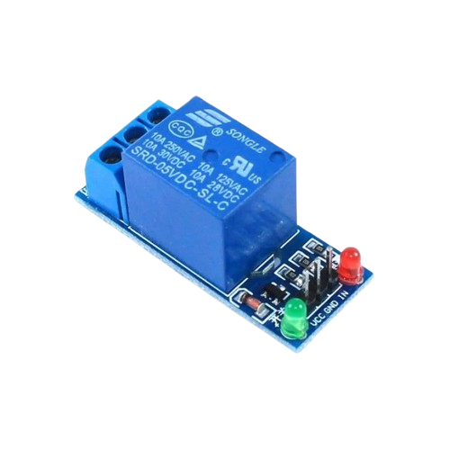
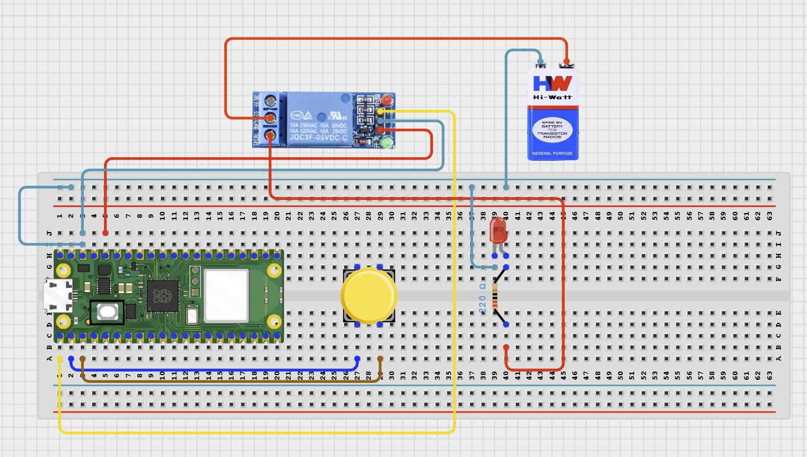
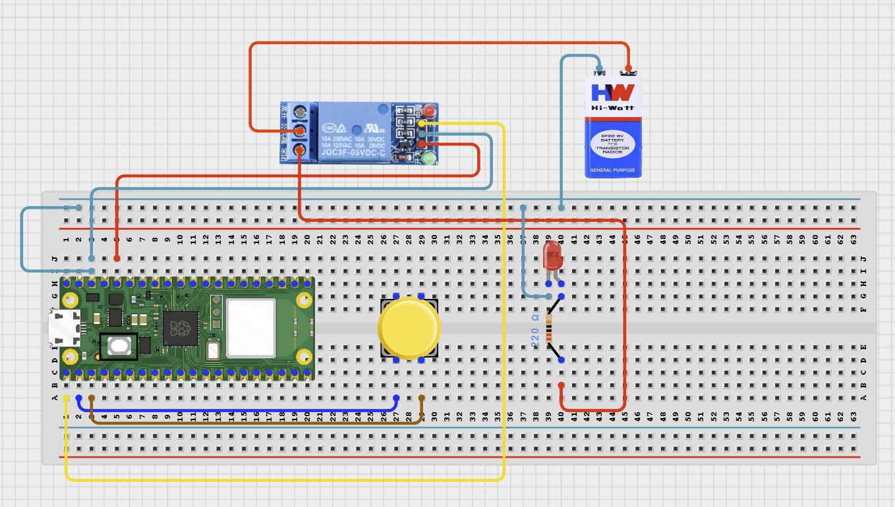
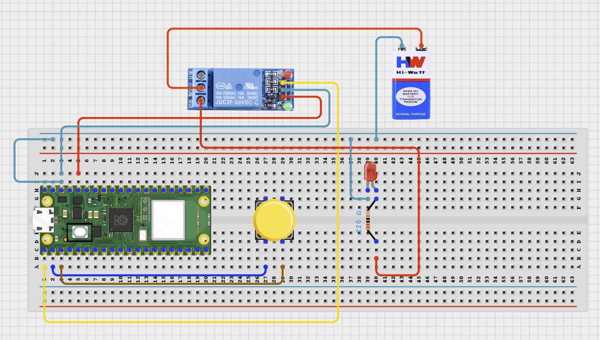
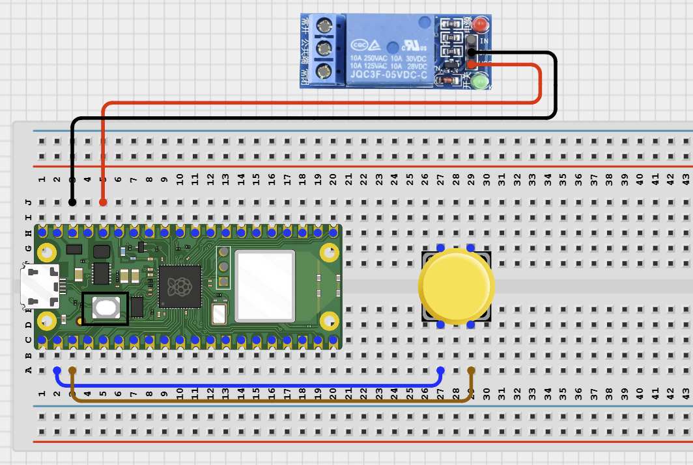
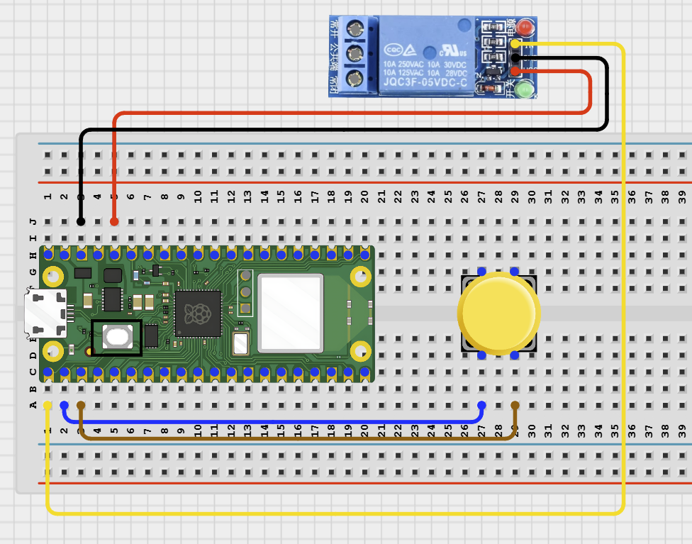
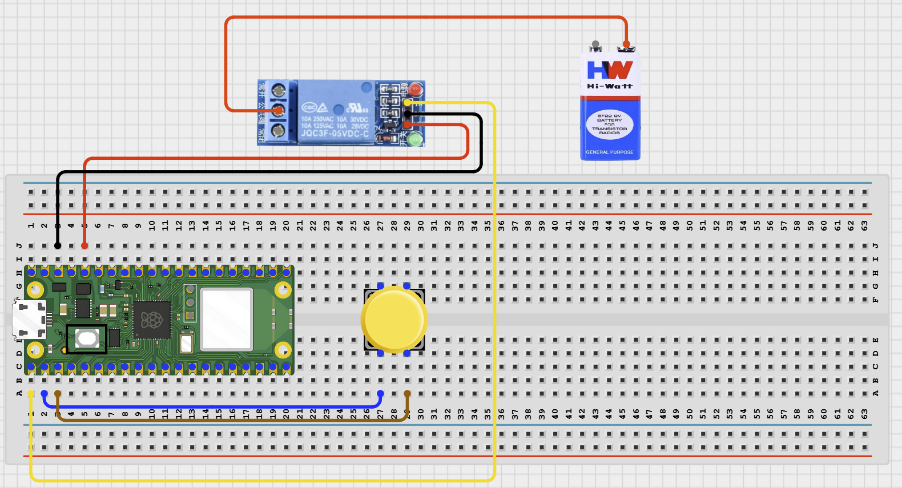
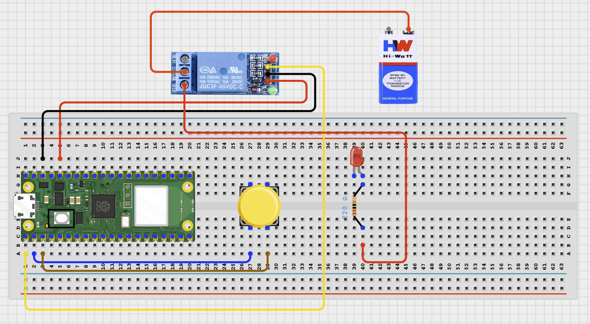
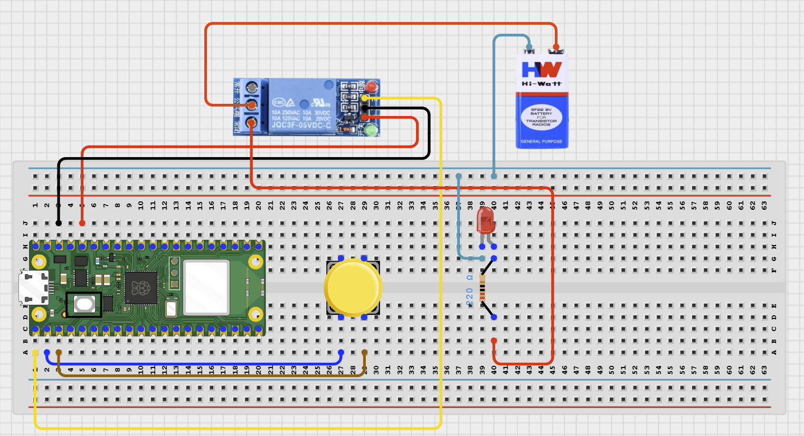
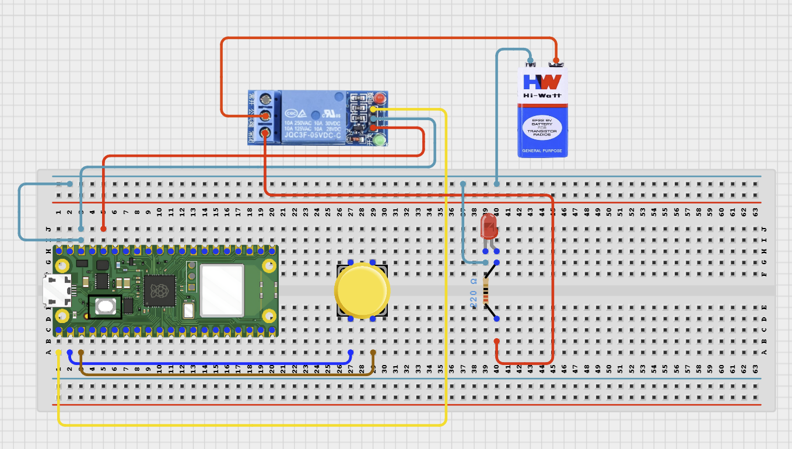

# Project 6: Relay Controlled LED Switch

**Beginner Embedded Systems Project Using Raspberry Pi Pico 2 W and MicroPython**

## Pico 2 W Diagram


---

## Overview

Build a relay-controlled load circuit using an LED as the external load.

This project demonstrates how a small control signal can switch a separate powered circuit.

The final result is a relay module that turns an external LED load on and off.

## Required Components

|  |  |  |  |
| --- | --- | --- | --- |
| <br>Raspberry Pi Pico 2 W | <br>1-channel relay module | <br>LED | <br>220 Ohm resistor |
| <br>Push button | External 5V supply | <br>Breadboard | <br>Jumper wires |


## Circuit Connections

| Component Pin          | Connects To          | Pico GPIO / Physical Pin Number | Notes                         |
| ---------------------- | -------------------- | ------------------------------- | ----------------------------- |
| Relay VCC              | 5V / VSYS            | Physical pin 40                 | Module power                  |
| Relay GND              | GND                  | Physical pin 38                 | Common ground with Pico       |
| Relay IN               | GPIO 0               | GPIO 0 / physical pin 1         | Usually active-low            |
| Button leg 1           | GPIO 1               | GPIO 1 / physical pin 2         | Use internal pull-up          |
| Button opposite leg    | GND                  | Physical pin 38                 |                               |
| External 5V positive   | Relay COM            | Not a GPIO pin                  | Load supply                   |
| Relay NO               | LED resistor         | Not a GPIO pin                  | Load path closes when active  |
| LED cathode (-)        | External supply GND  | Not a GPIO pin                  | Completes load circuit        |

## Step-by-Step Assembly

### Step 1: Place the Raspberry Pi Pico 2 W

Place the Raspberry Pi Pico 2 W on the breadboard so it sits across the center gap.



---

### Step 2: Place the Push Button

Insert the push button across the breadboard center gap.



---

### Step 3: Connect the Push Button to GPIO 1

Connect one side of the push button to GPIO 1.



---

### Step 4: Connect the Push Button to GND

Connect the opposite side of the push button to GND.



---

### Step 5: Connect the Relay Module Power

Connect relay VCC to 5V and relay GND to GND.


---

### Step 6: Connect the Relay Signal Pin

Connect relay IN to GPIO 0.



---

### Step 7: Connect External 5V Positive to Relay COM

Connect the positive wire from the external 5V supply to relay COM.



---

### Step 8: Connect Relay NO to the Resistor

Connect relay NO to one end of the 220 Ohm resistor.



---

### Step 9: Connect the Resistor to the LED Anode

Connect the other end of the resistor to the LED long leg.


---

### Step 10: Connect the LED Cathode to External Ground

Connect the LED short leg to the external power supply GND.



---

### Step 11: Connect the Grounds Together

Connect Pico GND, relay GND, and external 5V supply GND together.



---

## Wiring Check

- Relay VCC connects to 5V.
- Relay GND connects to GND.
- Relay IN connects to GPIO 0.
- External 5V positive connects to relay COM.
- Relay NO connects to the 220 Ohm resistor.
- Resistor connects to LED long leg.
- LED short leg connects to external supply GND.
- Pico GND, relay GND, and external supply GND are connected together.

---

## Testing Individual Components

### Relay Click Test

```python
from machine import Pin
import time

relay = Pin(0, Pin.OUT)
relay.value(1)
time.sleep(1)
relay.value(0)
print('If your relay is active-low, you should hear a click here')
time.sleep(1)
relay.value(1)
```

### Button Test

```python
from machine import Pin
import time

button = Pin(1, Pin.IN, Pin.PULL_UP)

while True:
    print('Pressed' if button.value() == 0 else 'Released')
    time.sleep(0.2)
```

---

## Full Project Code

```python
from machine import Pin
import time

relay = Pin(0, Pin.OUT)
button = Pin(1, Pin.IN, Pin.PULL_UP)
relay.value(1)  # start OFF for most active-low modules
last_button = 1

print('Relay control ready')

while True:
    current_button = button.value()

    if current_button == 0 and last_button == 1:
        relay.value(0 if relay.value() else 1)
        print('Relay ON' if relay.value() == 0 else 'Relay OFF')
        time.sleep(0.2)

    last_button = current_button
    time.sleep(0.02)
```

---

## How the Code Works

| Code Section       | What It Does                         | Why It Matters                          |
| ------------------ | ------------------------------------ | --------------------------------------- |
| `relay.value(1)`   | Starts most relay modules OFF        | Many common relays are active-low       |
| Button edge check  | Looks for one new press              | Prevents repeated toggles per press     |
| Relay toggle       | Changes the relay state              | Turns the external load on or off       |
| Status print       | Shows whether relay is on            | Helps debug active-low behavior         |

---

## Expected Result

Pressing the button toggles the relay. When the relay is on, the external LED load turns on. The Shell prints `Relay ON` or `Relay OFF`.

---

## Troubleshooting

| Problem                   | Possible Cause                         | Solution                                  |
| ------------------------- | -------------------------------------- | ----------------------------------------- |
| Relay does not click      | Wrong module power or input logic      | Check VCC, GND, and active-low logic      |
| Relay clicks but LED stays off | Load wiring on COM / NO incorrect | Reconnect the load through COM and NO     |
| Pico resets               | Power wiring issue                     | Keep load on a separate low-voltage supply |

## Next Project

Project 7: Relay-Controlled DC Motor

---

## Source Text Preserved From DOCX

The following source text from the original Word document is preserved here because it was not already present verbatim in the cleaned MkDocs version.

- | 1-channel relay module | 1 | Switching module | Common beginner modules are active-low |
- | 220Ω resistor | 1 | LED current limiter | Required |
- | External 5V supply | 1 | Powers the relay load side | Use low voltage only |
- | Relay NO | LED resistor | Not a GPIO pin | Load path closes when relay turns on |
- | LED cathode (-) | External supply ground | Not a GPIO pin | Complete the external load circuit |
- Keep the USB port facing outward so you can easily connect it to your computer.
- - two legs are on one side of the gap,
- - the other two legs are on the opposite side,
- - the button is not fully on one side of the breadboard.
- Connect one side of the push button to GPIO 1 on the Raspberry Pi Pico 2W.
- Connect the opposite side of the push button to a GND pin on the Raspberry Pi Pico 2W.
- Connect the relay module power pins:
- The relay module needs 5V power, but the Pico GPIO pins use 3.3V logic. Use a relay module that can be triggered reliably by a 3.3V signal, or use a proper driver circuit if needed.
- Connect the relay module IN pin to GPIO 0 on the Raspberry Pi Pico 2W.
- This pin will allow the Pico to switch the relay ON and OFF.
- ### Step 7: Connect the External 5V Positive Wire to Relay COM
- Connect the positive wire (+) from the external 5V supply to the relay COM terminal.
- COM means “common.” It is the moving contact inside the relay.
- Connect the relay NO terminal to one end of the 220Ω resistor.
- NO means “Normally Open.”
- This means the circuit stays OFF until the relay is activated.
- Connect the other end of the 220Ω resistor to the LED’s long leg (anode, +).
- Connect the LED’s short leg (cathode, -) to the external power supply GND.
- Make sure the following grounds are connected together:
- Relay module GND
- This common ground allows the Pico control signal and relay circuit to share the same reference voltage.
- Before powering the circuit, confirm:
- ✓ Push button is placed across the breadboard center gap
- ✓ One side of the button connects to GPIO 1
- ✓ Opposite side of the button connects to GND
- ✓ External 5V positive wire connects to relay COM
- ✓ Relay NO connects to the 220Ω resistor
- ✓ Resistor connects to LED long leg/anode
- ✓ LED short leg/cathode connects to external supply GND
- ✓ No loose jumper wires
- Do not power the relay coil or external LED circuit directly from a Pico GPIO pin. The Pico GPIO pin should only send the control signal to the relay module. The external LED circuit should be powered from the external 5V supply through the relay contacts.
- Before running the full project, test each part separately. This makes it easier to find wiring or code problems.
- Check that the relay module changes state.
- Expected test result: The relay clicks when it changes state.
- Check the push button separately.
- Expected test result: The Shell changes between Pressed and Released.
- After completing and checking the circuit connections, open Thonny IDE. Copy and paste the code below into a new file, or upload the project file to the Raspberry Pi Pico 2 W, then run it from Thonny.
- | relay.value(1) | Starts most relay modules in the OFF state | Many common relay modules are active-low |
- | Button edge check | Looks for one new press | Prevents multiple toggles from one press |
- | Status print | Shows whether the relay is on | Helps with debugging active-low behavior |
- | Relay does not click | Wrong module power or input logic | Check VCC, GND, and try active-low logic as shown |
- | Pico resets | Power wiring issue | Keep the load on a separate low-voltage supply and recheck grounds |
