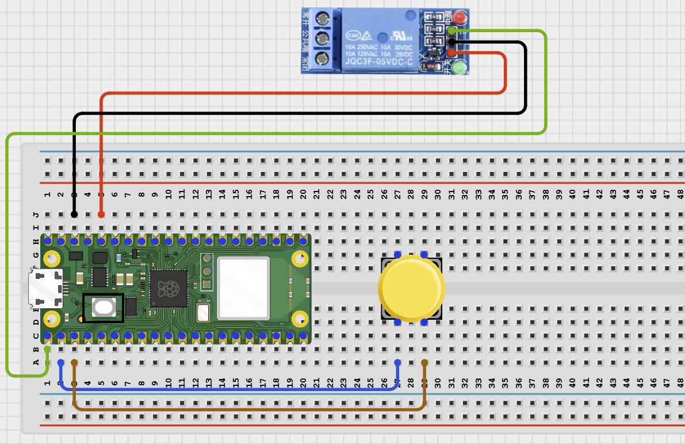
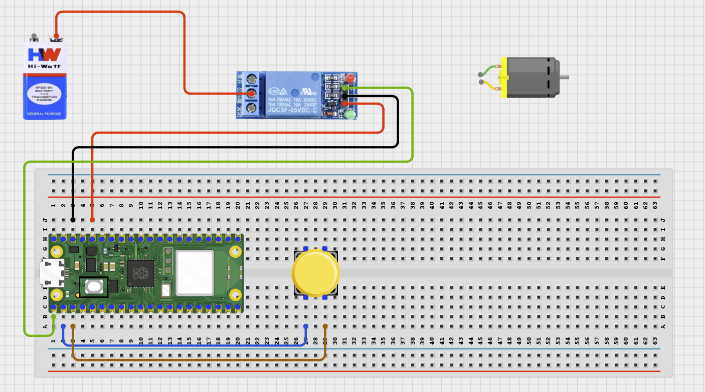
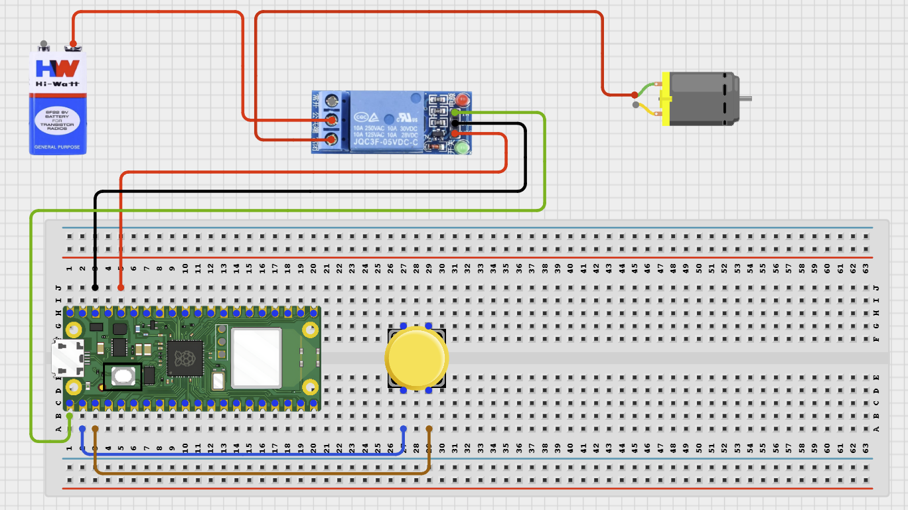
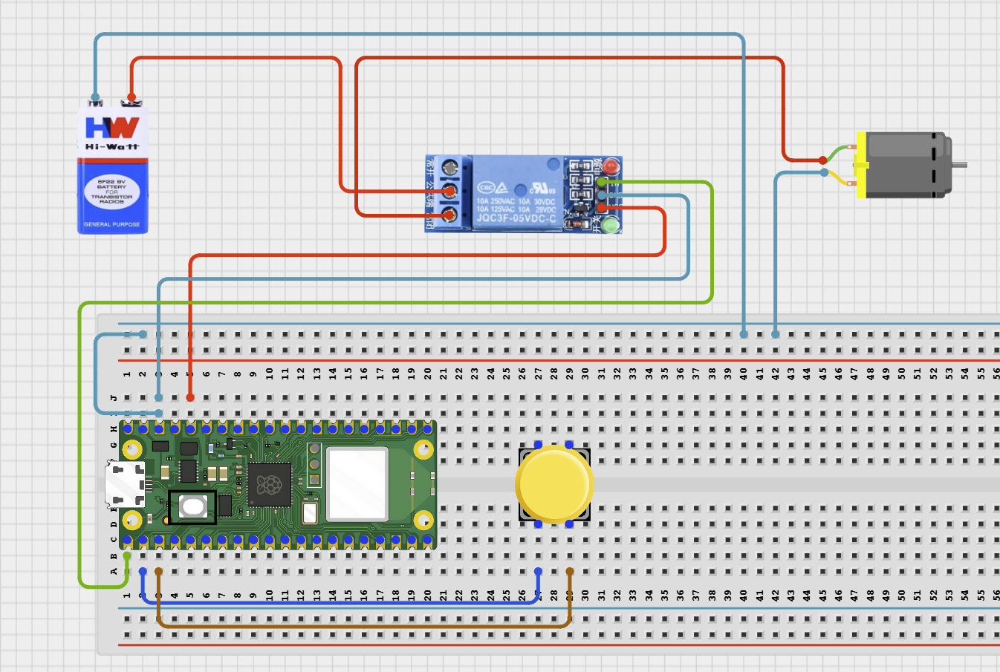

# Project 7: Relay Controlled DC Motor Driver

**Beginner Embedded Systems Project Using Raspberry Pi Pico 2 W and MicroPython**

## Pico 2 W Diagram


---

## Overview

Build a relay-switched DC motor project with a flyback diode.

This project demonstrates safe switching of an inductive load.

The final result is a motor that turns on and off when the relay changes state.

## Required Components

|  |  |  |  |
| --- | --- | --- | --- |
| <br>Raspberry Pi Pico 2 W | <br>1-channel relay module | <br>DC motor | <br>Push button |
| <br>External motor supply | <br>Breadboard | <br>Jumper wires |  |


## Circuit Connections

| Component Pin                   | Connects To                    | Pico GPIO / Physical Pin Number | Notes                |
| ------------------------------- | ------------------------------ | ------------------------------- | -------------------- |
| Relay VCC                       | 5V / VSYS                      | Physical pin 40                 | Module power         |
| Relay GND                       | GND                            | Physical pin 38                 |                      |
| Relay IN                        | GPIO 0                         | GPIO 0 / physical pin 1         | Usually active-low   |
| Button leg 1                    | GPIO 1                         | GPIO 1 / physical pin 2         | Use internal pull-up |
| Button opposite leg             | GND                            | Physical pin 38                 |                      |
| External motor supply positive  | Relay COM                      | Not a GPIO pin                  | Motor power input    |
| Relay NO                        | Motor positive terminal        | Not a GPIO pin                  | Motor receives power |
| Motor negative terminal         | External motor supply negative | Not a GPIO pin                  |                      |

## Step-by-Step Assembly

### Step 1: Place the Raspberry Pi Pico 2 W

Place the Raspberry Pi Pico 2 W on the breadboard so it sits across the center gap.


---

### Step 2: Place the Push Button

Insert the push button across the breadboard center gap.


---

### Step 3: Connect the Push Button to GPIO 1

Connect one side of the push button to GPIO 1.


---

### Step 4: Connect the Push Button to GND

Connect the opposite side of the push button to GND.


---

### Step 5: Connect the Relay Module Power Pins

Connect relay VCC to the correct relay supply and relay GND to ground.


---

### Step 6: Connect Relay IN to GPIO 0

Connect the relay module IN pin to GPIO 0.



---

### Step 7: Connect Motor Supply Positive to Relay COM

Connect the positive wire from the external motor supply to relay COM.



---

### Step 8: Connect Relay NO to Motor Positive

Connect relay NO to the motor positive terminal.



---

### Step 9: Connect Motor Negative to External Supply Negative

Connect the motor negative terminal to the external motor supply negative.



---

### Step 10: Connect the Grounds Together

Connect Pico GND, relay GND, and external motor supply negative / GND together.


---

## Wiring Check

- Relay VCC connects to the correct relay supply voltage.
- Relay GND connects to ground.
- Relay IN connects to GPIO 0.
- Button connects between GPIO 1 and GND.
- External motor supply positive connects to relay COM.
- Relay NO connects to motor positive terminal.
- Motor negative terminal connects to external supply negative.
- Motor can spin freely before power is applied.

---

## Testing Individual Components

### Relay Test

```python
from machine import Pin
import time

relay = Pin(0, Pin.OUT)
relay.value(1)
time.sleep(1)
relay.value(0)
time.sleep(1)
relay.value(1)
```

### Motor Power Test

Briefly connect the motor directly to the correct external supply voltage to make sure it spins.

---

## Full Project Code

```python
from machine import Pin
import time

relay = Pin(0, Pin.OUT)
button = Pin(1, Pin.IN, Pin.PULL_UP)
relay.value(1)
last_button = 1

print('Motor relay control ready')

while True:
    current_button = button.value()

    if current_button == 0 and last_button == 1:
        relay.value(0 if relay.value() else 1)
        print('Motor ON' if relay.value() == 0 else 'Motor OFF')
        time.sleep(0.2)

    last_button = current_button
    time.sleep(0.02)
```

---

## How the Code Works

| Code Section  | What It Does                         | Why It Matters                    |
| ------------- | ------------------------------------ | --------------------------------- |
| Relay setup   | Prepares the relay control pin       | The relay switches motor power    |
| Button input  | Reads the control button             | Lets the user toggle the motor    |
| Toggle logic  | Changes relay state on each press    | Turns the motor on and off        |
| Printed status | Reports motor state                 | Makes troubleshooting easier      |

---

## Expected Result

Each button press toggles the relay. The motor starts spinning when the relay turns on and stops when the relay turns off.

---

## Troubleshooting

| Problem                     | Possible Cause                     | Solution                                      |
| --------------------------- | ---------------------------------- | --------------------------------------------- |
| Motor does not spin         | External supply missing or wrong voltage | Check motor supply and relay load path  |
| Pico resets or acts strangely | Motor noise or wiring mistake    | Recheck supply wiring and separate motor power |
| Relay works but motor is weak | Supply current too low            | Use a supply that matches motor requirements  |

## Next Project

Project 8: IR Remote LED Control

---

## Source Text Preserved From DOCX

The following source text from the original Word document is preserved here because it was not already present verbatim in the cleaned MkDocs version.

- | Project-Specific Safety Note Motors must not be powered directly from a Pico GPIO pin. Always use the flyback diode across the motor terminals. Disconnect motor power before changing any wires. Keep fingers, hair, and loose objects away from the spinning motor. |
- | Relay NO | Motor positive terminal | Not a GPIO pin | Motor receives power when relay turns on |
- Keep the USB port facing outward so you can easily connect it to your computer.
- - two legs are on one side of the gap,
- - the other two legs are on the opposite side,
- - the button is not fully on one side of the breadboard.
- Connect one side of the push button to GPIO 1 on the Raspberry Pi Pico 2W.
- Connect the opposite side of the push button to a GND pin on the Raspberry Pi Pico 2W.
- Relay VCC → relay power supply positive
- Relay GND → relay power supply ground
- Use the correct supply voltage for your relay module. For example, a 5V relay module should use 5V on VCC, while a 12V relay module should use 12V on VCC. Do not power a relay coil from a Pico GPIO pin. Relay modules often require more current than a GPIO pin can safely provide.
- Connect the relay module IN pin to GPIO 0 on the Raspberry Pi Pico 2W.
- Note: Some relay modules are active LOW, meaning the relay turns ON when the GPIO output is LOW. If your relay behaves opposite to what you expect, check whether your module is active LOW or active HIGH.
- ### Step 7: Connect the Motor Supply Positive Wire to Relay COM
- Connect the positive wire (+) from the external motor power supply to the relay COM terminal.
- COM means “common.” It is the moving contact inside the relay.
- ### Step 8: Connect Relay NO to the Motor Positive Terminal
- Connect the relay NO terminal to the motor’s positive terminal (+).
- NO means “Normally Open.”
- This means the motor stays OFF until the relay is activated.
- ### Step 9: Connect the Motor Negative Terminal to External Supply Negative
- Connect the motor’s negative terminal (-) to the negative wire (-) of the external motor power supply.
- Do not power the motor directly from the Raspberry Pi Pico 2W.
- Make sure these grounds are connected together:
- Relay module GND
- A shared ground gives the Pico and relay input the same voltage reference. Many relay module guides require tying the controller ground and relay/power-supply ground together unless the module is wired for full isolation.
- ### Step 12: Check That the Motor Can Spin Freely
- Before powering the circuit, confirm that:
- The motor shaft can rotate freely
- No wire is touching the motor shaft
- The motor is not blocked
- The relay terminals are tight
- ✓ Pico 2W is placed correctly across the breadboard center gap
- ✓ Push button is placed across the breadboard center gap
- ✓ One button side connects to GPIO 1
- ✓ Opposite button side connects to GND
- ✓ Pico GND, relay GND, and motor supply negative/GND are connected together
- Disconnect the external motor supply before changing any relay or motor wiring. Motors can draw much more current than the Pico can provide, so the motor must use an external supply. The Pico should only control the relay input signal.
- Before running the full project, test each part separately. This makes it easier to find wiring or code problems.
- Check the relay before connecting the motor.
- Expected test result: The relay clicks when it changes state.
- Check the motor and external supply separately.
- No code is needed for this test. Briefly connect the motor directly to the correct external supply voltage to make sure it spins.
- Expected test result: The motor spins smoothly when powered directly for a short test.
- After completing and checking the circuit connections, open Thonny IDE. Copy and paste the code below into a new file, or upload the project file to the Raspberry Pi Pico 2 W, then run it from Thonny.
- | Relay setup | Prepares the relay control pin | The relay switches motor power safely |
- | Button input | Reads the student control button | Lets the user toggle the motor |
- | Motor does not spin | External supply missing or wrong voltage | Check the motor supply and the relay load path |
- | Pico resets or acts strangely | Motor noise or wiring mistake | Recheck the diode, supply wiring, and separation of motor power |
- | Relay works but motor is weak | Supply current too low | Use a supply that matches the motor requirements |
- 1. Why is the flyback diode important?
